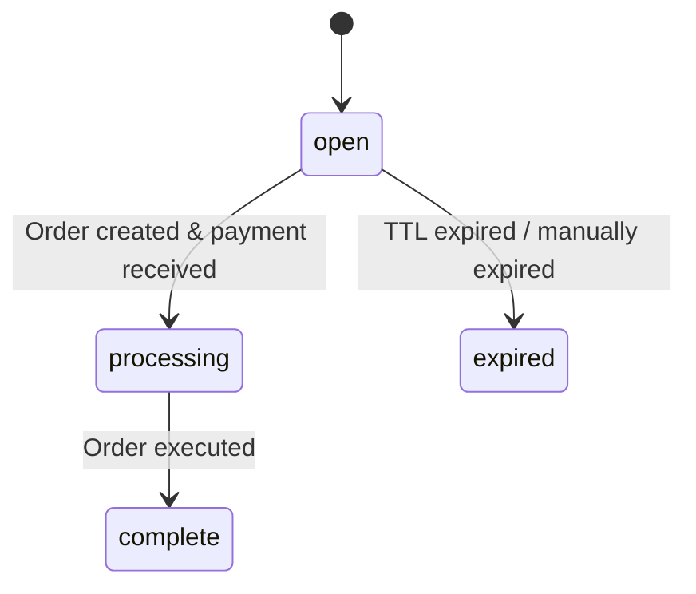

Checkout sessions let you create a tracking object on your server before the user picks a payment method. The session is a lightweight database record -- no external API calls, no order creation. The order comes later, when the user commits to paying.

<Info>
  Looking for the React checkout component? See [Checkout](/anyspend/checkout). This page covers the **REST API** for server-driven flows.
</Info>

## Base URL

All checkout session endpoints live on the AnySpend service:

```
https://api.anyspend.com
```

## Flow

<Steps>
  <Step title="Create a session on your server">
    `POST https://api.anyspend.com/checkout-sessions` returns `{ id, status: "open" }`
  </Step>
  <Step title="User picks a payment method">
    `POST https://api.anyspend.com/orders` with `checkoutSessionId` returns `{ id, globalAddress, oneClickBuyUrl }`
  </Step>
  <Step title="User pays">
    **Crypto:** send to `globalAddress` | **Fiat onramp:** redirect to `oneClickBuyUrl`
  </Step>
  <Step title="Poll for completion">
    `GET https://api.anyspend.com/checkout-sessions/:id` returns `{ status: "complete", order_id }`
  </Step>
</Steps>

### Why decouple sessions from orders?

- The payment method doesn't need to be known at session creation.
- A hosted checkout page can let users choose how to pay.
- Session creation is a local DB write, so it never fails due to third-party API errors.

## Session status lifecycle



| Status | Meaning |
|--------|---------|
| `open` | Created, waiting for order/payment |
| `processing` | Payment received, order executing |
| `complete` | Order executed successfully |
| `expired` | TTL expired, payment failed, or manually expired |

## API reference

### Create session

```
POST https://api.anyspend.com/checkout-sessions
```

Creates a lightweight session. No order, no external API calls.

```json
{
  "success_url": "https://merchant.com/success?session_id={SESSION_ID}",
  "cancel_url": "https://merchant.com/cancel",
  "metadata": { "sku": "widget-1" },
  "client_reference_id": "merchant-order-456",
  "expires_in": 1800
}
```

All fields are optional. Payment config (amount, tokens, chains) lives on the order, not the session.

### Create order linked to a session

```
POST https://api.anyspend.com/orders
```

Pass `checkoutSessionId` in the standard order body to link the order to a session.

```json
{
  "recipientAddress": "0x...",
  "srcChain": 8453,
  "dstChain": 8453,
  "srcTokenAddress": "0x...",
  "dstTokenAddress": "0x...",
  "srcAmount": "1000000",
  "type": "swap",
  "payload": { "expectedDstAmount": "1000000" },
  "checkoutSessionId": "550e8400-..."
}
```

**Validation rules:**
- Session must exist (`400` if not found)
- Session must be `open` (`400` if expired/processing/complete)
- Session must not already have an order (`409 Conflict`)

### Retrieve session

```
GET https://api.anyspend.com/checkout-sessions/:id
```

Returns current session state. Status is synced from the underlying order on each retrieval.

| Query param | Description |
|-------------|-------------|
| `include=order` | Embed the full order object with transactions |

### Expire a session

```
POST https://api.anyspend.com/checkout-sessions/:id/expire
```

Only works on sessions with status `open`.

## Redirect URL templates

Use template variables in `success_url` and `cancel_url`:

| Variable | Replaced with |
|----------|--------------|
| `{SESSION_ID}` | The checkout session UUID |
| `{ORDER_ID}` | Same value (alias) |

If no template variable is present, `?sessionId=<uuid>` is appended automatically.

## SDK integration

### Service methods

```typescript
import { anyspend } from "@b3dotfun/sdk/anyspend";

// Create a checkout session
const session = await anyspend.createCheckoutSession({
  success_url: "https://mysite.com/success/{SESSION_ID}",
  metadata: { sku: "widget-1" },
});

// Retrieve session status
const session = await anyspend.getCheckoutSession(sessionId);
```

### React hooks

#### `useCreateCheckoutSession`

Mutation hook for creating sessions.

```tsx
import { useCreateCheckoutSession } from "@b3dotfun/sdk/anyspend";

const { mutate: createSession, data, isPending } = useCreateCheckoutSession();
```

#### `useCheckoutSession`

Query hook with auto-polling. Stops polling when status reaches `complete` or `expired`.

```tsx
import { useCheckoutSession } from "@b3dotfun/sdk/anyspend";

const { data: session, isLoading } = useCheckoutSession(sessionId);
```

### Component prop

The `<AnySpend>`, `<AnySpendCustom>`, and `<AnySpendCustomExactIn>` components accept an optional `checkoutSession` prop:

```tsx
<AnySpend
  defaultActiveTab="fiat"
  destinationTokenAddress="0x833589fCD6eDb6E08f4c7C32D4f71b54bdA02913"
  destinationTokenChainId={8453}
  recipientAddress="0x..."
  checkoutSession={{
    success_url: "https://myshop.com/success?session={SESSION_ID}",
    cancel_url: "https://myshop.com/cancel",
    metadata: { sku: "widget-1" },
  }}
/>
```

When `checkoutSession` is set, the component creates a session before the order, and uses the session's `success_url` for redirects. Without the prop, existing flows work the same as before.

## Examples

### Crypto payment

```typescript
const BASE_URL = "https://api.anyspend.com";

// 1. Create session
const session = await fetch(`${BASE_URL}/checkout-sessions`, {
  method: "POST",
  headers: { "Content-Type": "application/json" },
  body: JSON.stringify({
    success_url: "https://mysite.com/success/{SESSION_ID}",
    metadata: { sku: "widget-1" },
  }),
}).then(r => r.json());

// 2. Create order linked to session
const order = await fetch(`${BASE_URL}/orders`, {
  method: "POST",
  headers: { "Content-Type": "application/json" },
  body: JSON.stringify({
    recipientAddress: "0x...",
    srcChain: 8453,
    dstChain: 8453,
    srcTokenAddress: "0x833589fcd6edb6e08f4c7c32d4f71b54bda02913",
    dstTokenAddress: "0x833589fcd6edb6e08f4c7c32d4f71b54bda02913",
    srcAmount: "1000000",
    type: "swap",
    payload: { expectedDstAmount: "1000000" },
    checkoutSessionId: session.data.id,
  }),
}).then(r => r.json());

// 3. User sends crypto to order.data.globalAddress

// 4. Poll session until complete
const poll = setInterval(async () => {
  const s = await fetch(`${BASE_URL}/checkout-sessions/${session.data.id}`).then(r => r.json());
  if (s.data.status === "complete") {
    clearInterval(poll);
    // redirect to success_url or show confirmation
  }
}, 3000);
```

### Fiat onramp (Coinbase/Stripe)

```typescript
const BASE_URL = "https://api.anyspend.com";

// Steps 1-2 same as above, but include onramp config in order creation:
const order = await fetch(`${BASE_URL}/orders`, {
  method: "POST",
  headers: { "Content-Type": "application/json" },
  body: JSON.stringify({
    // ... same order fields ...
    checkoutSessionId: session.data.id,
    onramp: {
      vendor: "coinbase",
      payment_method: "card",
      country: "US",
    },
  }),
}).then(r => r.json());

// Redirect user to vendor checkout page
window.location.href = order.data.oneClickBuyUrl;

// After vendor redirects back, poll GET /checkout-sessions/:id for completion
```
