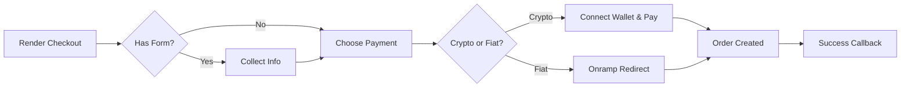

The checkout components render a two-panel layout: order summary on one side, payment on the other. They support crypto and fiat, custom form fields, shipping options, discount codes, and optional B3 workflow triggers. [See it live](https://sdk-demo.anyspend.com/).

<Info>
  For the checkout **sessions REST API** (backend-driven, session-based flows), see [Checkout Sessions](/anyspend/checkout-sessions). This page covers the **React checkout components**.
</Info>

## How it works



## Quick start

<Steps>
  <Step title="Install the SDK">
    ```bash
    npm install @b3dotfun/sdk
    ```
  </Step>
  <Step title="Import the component">
    ```tsx
    import { AnySpendCheckout } from "@b3dotfun/sdk/anyspend/react";
    ```
  </Step>
  <Step title="Render the checkout">
    ```tsx title="Basic Checkout" icon="cart-shopping"
    <AnySpendCheckout
      recipientAddress="0xMerchantAddress..."
      destinationTokenAddress="0x833589fCD6eDb6E08f4c7C32D4f71b54bdA02913"
      destinationTokenChainId={8453}
      items={[
        {
          name: "Pro Plan - Monthly",
          description: "Unlimited access to all features",
          amount: "10000000", // 10 USDC (6 decimals)
          quantity: 1,
        },
      ]}
      organizationName="Acme Inc"
      organizationLogo="/acme-logo.svg"
      themeColor="#4f46e5"
      onSuccess={(result) => {
        console.log("Payment complete:", result.orderId);
      }}
    />;
    ```
  </Step>
</Steps>

---

## Components

### `<AnySpendCheckout>`

The main checkout component renders a two-panel layout with an order summary/cart panel and a payment panel supporting crypto and fiat options. Optionally includes a form panel for collecting customer information, shipping selection, and discount codes.

#### Core props

<ParamField path="recipientAddress" type="string" required>
  Merchant wallet address to receive payment
</ParamField>

<ParamField path="destinationTokenAddress" type="string" required>
  Token contract address for settlement (e.g., USDC)
</ParamField>

<ParamField path="destinationTokenChainId" type="number" required>
  Chain ID for settlement (e.g., `8453` for Base)
</ParamField>

<ParamField path="items" type="CheckoutItem[]" required>
  Line items displayed in the cart panel
</ParamField>

#### Branding

<ParamField path="organizationName" type="string">
  Merchant name shown in the checkout header
</ParamField>

<ParamField path="organizationLogo" type="string">
  URL for the merchant logo
</ParamField>

<ParamField path="themeColor" type="string">
  Hex color for theming (e.g., `"#4f46e5"`)
</ParamField>

<ParamField path="buttonText" type="string">
  Custom text for the payment button
</ParamField>

#### Order summary

<ParamField path="totalAmount" type="string">
  Override the computed total in wei. Use when the total differs from the sum of item amounts (e.g., after discounts or fees).
</ParamField>

<ParamField path="shipping" type="string | { amount: string; label?: string }">
  Shipping cost. Pass a string for amount in wei, or an object with a custom label.
</ParamField>

<ParamField path="tax" type="string | { amount: string; label?: string; rate?: string }">
  Tax amount. Pass a string for amount in wei, or an object with label and optional rate display (e.g., `"8.5%"`).
</ParamField>

<ParamField path="discount" type="string | { amount: string; label?: string; code?: string }">
  Discount amount (displayed as a deduction). Pass a string for amount in wei, or an object with label and optional code.
</ParamField>

<ParamField path="summaryLines" type="CheckoutSummaryLine[]">
  Additional summary line items like platform fees, tips, or service charges
</ParamField>

#### Payment

<ParamField path="defaultPaymentMethod" type="PaymentMethod">
  Which payment method to expand initially. Options: `"crypto"`, `"coinbase"`, `"stripe"`.
</ParamField>

<ParamField path="senderAddress" type="string">
  Pre-fill the sender address to show token balances before wallet connection
</ParamField>

<ParamField path="checkoutSessionId" type="string">
  Link this checkout to a backend checkout session for tracking
</ParamField>

#### Callbacks

<ParamField path="onSuccess" type="(result: { txHash?: string; orderId?: string }) => void">
  Called on successful payment
</ParamField>

<ParamField path="onError" type="(error: Error) => void">
  Called on payment error
</ParamField>

<ParamField path="returnUrl" type="string">
  URL to redirect to after payment completion
</ParamField>

<ParamField path="returnLabel" type="string">
  Label for the return/redirect button
</ParamField>

#### Display options

<ParamField path="mode" type="'page' | 'embedded'" default="'page'">
  `page` for standalone, `embedded` for inline within your layout
</ParamField>

<ParamField path="showPoints" type="boolean" default="false">
  Show points earned in the order status summary
</ParamField>

<ParamField path="showOrderId" type="boolean" default="false">
  Show the order ID in the order status summary
</ParamField>

<ParamField path="footer" type="ReactNode | null">
  Custom footer for the order summary. Pass `null` to hide the default "Powered by" footer.
</ParamField>

#### Customization

<ParamField path="slots" type="AnySpendSlots">
  Replace UI sections. See [Customization](/anyspend/customization#slots).
</ParamField>

<ParamField path="content" type="AnySpendContent">
  Override text/messages. See [Customization](/anyspend/customization#content).
</ParamField>

<ParamField path="theme" type="AnySpendTheme">
  Configure colors. See [Customization](/anyspend/customization#theme).
</ParamField>

<ParamField path="classes" type="AnySpendCheckoutClasses">
  CSS class overrides. See [Customization](/anyspend/customization#css-class-overrides).
</ParamField>

#### Custom forms

Collect customer information during checkout using a JSON schema or a custom React component.

<ParamField path="formSchema" type="CheckoutFormSchema">
  JSON schema defining fields to collect from the customer (email, name, address, etc.). See [CheckoutFormSchema](#checkoutformschema) below.
</ParamField>

<ParamField path="formComponent" type="React.ComponentType<CheckoutFormComponentProps>">
  Custom React component to render as the checkout form. Use this when `formSchema` isn't flexible enough.
</ParamField>

<ParamField path="onFormSubmit" type="(data: Record<string, unknown>) => void">
  Called when form data changes. Form data is also automatically included in the order's `callbackMetadata`.
</ParamField>

#### Shipping options

<ParamField path="shippingOptions" type="ShippingOption[]">
  Array of shipping options to display as a radio-button selector. The selected option's amount is automatically added to the order total.
</ParamField>

<ParamField path="collectShippingAddress" type="boolean">
  When `true`, renders a shipping address form (street, city, state, zip, country). The address is included in the order's `callbackMetadata`.
</ParamField>

<ParamField path="onShippingChange" type="(option: ShippingOption) => void">
  Called when the user selects a shipping option
</ParamField>

#### Discount codes

<ParamField path="enableDiscountCode" type="boolean">
  Show a discount code input field. Requires `validateDiscount` to be set.
</ParamField>

<ParamField path="validateDiscount" type="(code: string) => Promise<DiscountResult>">
  Async function to validate a discount code against your backend. Returns a `DiscountResult` with the discount amount. The validated discount is automatically applied to the order total.
</ParamField>

<ParamField path="onDiscountApplied" type="(result: DiscountResult) => void">
  Called when a valid discount code is applied
</ParamField>

---

### `<AnySpendCheckoutTrigger>`

Extends `AnySpendCheckout` with B3 workflow integration. When a user completes payment, a B3 workflow is automatically triggered with the payment data and any custom metadata.

```tsx title="Checkout with Workflow" icon="bolt"
import { AnySpendCheckoutTrigger } from "@b3dotfun/sdk/anyspend/react";

<AnySpendCheckoutTrigger
  recipientAddress="0xMerchantAddress..."
  destinationTokenAddress="0x833589fCD6eDb6E08f4c7C32D4f71b54bdA02913"
  destinationTokenChainId={8453}
  items={[
    { name: "Pro Plan", amount: "10000000", quantity: 1 },
  ]}
  workflowId="wf_provision_subscription"
  orgId="org_acme"
  callbackMetadata={{
    inputs: {
      plan: "pro",
      userId: "user_123",
      email: "user@example.com",
    },
  }}
  onSuccess={(result) => console.log("Workflow triggered:", result)}
/>;
```

#### Workflow props

All `<AnySpendCheckout>` props are supported, plus:

<ParamField path="workflowId" type="string">
  B3 workflow ID to trigger on successful payment
</ParamField>

<ParamField path="orgId" type="string">
  Organization ID that owns the workflow
</ParamField>

<ParamField path="callbackMetadata" type="object">
  Metadata merged into the order. The `inputs` field is accessible in workflows via `{{root.result.inputs.*}}`.
</ParamField>

<ParamField path="items" type="CheckoutItem[]">
  Optional for `AnySpendCheckoutTrigger` — if omitted, only the payment panel is shown (no cart).
</ParamField>

<ParamField path="totalAmount" type="string">
  Required when `items` is not provided (since there's nothing to compute a total from).
</ParamField>

---

## Types

### CheckoutItem

Each item in the checkout cart:

```typescript title="CheckoutItem" icon="code"
interface CheckoutItem {
  /** Unique identifier for the item */
  id?: string;
  /** Item name */
  name: string;
  /** Short description */
  description?: string;
  /** Item image URL */
  imageUrl?: string;
  /** Price in wei (smallest unit of destination token) */
  amount: string;
  /** Quantity */
  quantity: number;
  /** Custom metadata displayed as label: value pairs (e.g., { "Size": "Large" }) */
  metadata?: Record<string, string>;
}
```

### CheckoutSummaryLine

Additional line items in the order summary:

```typescript title="CheckoutSummaryLine" icon="code"
interface CheckoutSummaryLine {
  /** Display label (e.g., "Platform Fee", "Tip") */
  label: string;
  /** Amount in wei. Negative values are shown as deductions. */
  amount: string;
  /** Optional description or note */
  description?: string;
}
```

### CheckoutFormSchema

Define custom form fields using a JSON schema:

```typescript title="CheckoutFormSchema" icon="code"
interface CheckoutFormSchema {
  fields: CheckoutFormField[];
}

interface CheckoutFormField {
  /** Unique field identifier */
  id: string;
  /** Field type */
  type: "text" | "email" | "phone" | "textarea" | "select" | "number" | "checkbox" | "address";
  /** Display label */
  label: string;
  /** Placeholder text */
  placeholder?: string;
  /** Whether the field is required */
  required?: boolean;
  /** Default value */
  defaultValue?: string;
  /** Options for "select" type fields */
  options?: { label: string; value: string }[];
  /** Validation rules */
  validation?: {
    pattern?: string;
    minLength?: number;
    maxLength?: number;
    min?: number;
    max?: number;
  };
}
```

<Tip>
  The `"address"` field type renders a full address form (street, city, state, zip, country) automatically — no need to define each sub-field.
</Tip>

### ShippingOption

```typescript title="ShippingOption" icon="code"
interface ShippingOption {
  /** Unique option identifier */
  id: string;
  /** Display name (e.g., "Standard Shipping") */
  name: string;
  /** Optional description */
  description?: string;
  /** Cost in wei */
  amount: string;
  /** Estimated delivery time (e.g., "5-7 business days") */
  estimated_days?: string;
}
```

### DiscountResult

Returned by your `validateDiscount` function:

```typescript title="DiscountResult" icon="code"
interface DiscountResult {
  /** Whether the code is valid */
  valid: boolean;
  /** Discount type */
  discount_type?: "percentage" | "fixed";
  /** The discount value (e.g., "10" for 10%) */
  discount_value?: string;
  /** Computed discount amount in wei */
  discount_amount?: string;
  /** Final amount after discount in wei */
  final_amount?: string;
  /** Error message if invalid */
  error?: string;
}
```

### AddressData

Structure for collected shipping addresses:

```typescript title="AddressData" icon="code"
interface AddressData {
  street: string;
  city: string;
  state: string;
  zip: string;
  country: string;
}
```

### CheckoutFormComponentProps

Props passed to custom form components (via `formComponent` or the `checkoutForm` slot):

```typescript title="CheckoutFormComponentProps" icon="code"
interface CheckoutFormComponentProps {
  /** Call when form values change */
  onSubmit: (data: Record<string, unknown>) => void;
  /** Signal whether the form is valid */
  onValidationChange: (isValid: boolean) => void;
  /** Current form data */
  formData: Record<string, unknown>;
  /** Update form data */
  setFormData: (data: Record<string, unknown>) => void;
}
```

---

## Examples

### E-commerce store

```tsx title="Full E-Commerce Checkout" icon="store"
function CheckoutPage({ cart, shippingAddress }) {
  const subtotal = cart.reduce(
    (sum, item) => sum + BigInt(item.amount) * BigInt(item.quantity),
    0n
  );

  return (
    <AnySpendCheckout
      mode="page"
      recipientAddress="0xMerchantWallet..."
      destinationTokenAddress="0x833589fCD6eDb6E08f4c7C32D4f71b54bdA02913"
      destinationTokenChainId={8453}

      // Cart items
      items={cart.map((item) => ({
        name: item.name,
        description: item.variant,
        imageUrl: item.imageUrl,
        amount: item.amount,
        quantity: item.quantity,
        metadata: {
          "Size": item.size,
          "Color": item.color,
        },
      }))}

      // Order summary
      shipping={{ amount: "2000000", label: "Standard Shipping" }}
      tax={{ amount: "850000", label: "Sales Tax", rate: "8.5%" }}
      discount={{ amount: "5000000", label: "Welcome Discount", code: "WELCOME10" }}
      summaryLines={[
        { label: "Platform Fee", amount: "100000" },
      ]}

      // Branding
      organizationName="Acme Store"
      organizationLogo="/acme-logo.svg"
      themeColor="#4f46e5"
      buttonText="Complete Purchase"

      // Callbacks
      onSuccess={(result) => {
        createOrder({
          orderId: result.orderId,
          txHash: result.txHash,
          items: cart,
          shippingAddress,
        });
        router.push("/order-confirmation");
      }}
      onError={(error) => {
        toast.error("Payment failed: " + error.message);
      }}
      returnUrl="/shop"
      returnLabel="Continue Shopping"

      // Customization
      content={{
        successTitle: "Order Placed!",
        successDescription: "Check your email for order confirmation and tracking.",
      }}
    />
  );
}
```

### SaaS subscription

```tsx title="Subscription Checkout" icon="credit-card"
function SubscriptionCheckout({ plan }) {
  return (
    <AnySpendCheckoutTrigger
      recipientAddress="0xTreasuryAddress..."
      destinationTokenAddress="0x833589fCD6eDb6E08f4c7C32D4f71b54bdA02913"
      destinationTokenChainId={8453}
      items={[
        {
          name: `${plan.name} Plan`,
          description: `${plan.billingCycle} billing`,
          amount: plan.amountWei,
          quantity: 1,
          metadata: {
            "Billing": plan.billingCycle,
            "Users": `${plan.maxUsers} seats`,
          },
        },
      ]}
      organizationName="SaaS Co"
      themeColor="#059669"

      // Workflow integration
      workflowId="wf_activate_subscription"
      orgId="org_saas"
      callbackMetadata={{
        inputs: {
          planId: plan.id,
          billingCycle: plan.billingCycle,
          maxUsers: plan.maxUsers,
        },
      }}

      onSuccess={() => {
        toast.success("Subscription activated!");
        router.push("/dashboard");
      }}

      content={{
        successTitle: "Welcome to " + plan.name + "!",
        successDescription: "Your subscription is now active. Head to your dashboard to get started.",
        returnButtonLabel: "Go to Dashboard",
      }}
    />
  );
}
```

### Simple payment (no cart)

```tsx title="Payment-Only Checkout" icon="money-bill"
// Use AnySpendCheckoutTrigger without items for a simple payment flow
<AnySpendCheckoutTrigger
  recipientAddress="0x..."
  destinationTokenAddress="0x833589fCD6eDb6E08f4c7C32D4f71b54bdA02913"
  destinationTokenChainId={8453}
  totalAmount="25000000" // 25 USDC
  organizationName="Service Provider"
  buttonText="Pay $25"
  workflowId="wf_process_payment"
  orgId="org_provider"
  onSuccess={(result) => console.log("Paid:", result)}
/>
```

### Checkout with custom forms

Collect customer info, offer shipping options, and validate discount codes — all integrated into the checkout flow:

```tsx title="Full-Featured Checkout" icon="file-lines"
function FullCheckout({ cart }) {
  return (
    <AnySpendCheckout
      mode="page"
      recipientAddress="0xMerchantWallet..."
      destinationTokenAddress="0x833589fCD6eDb6E08f4c7C32D4f71b54bdA02913"
      destinationTokenChainId={8453}
      items={cart}
      organizationName="Acme Store"

      // Collect customer information
      formSchema={{
        fields: [
          { id: "email", type: "email", label: "Email", placeholder: "you@example.com", required: true },
          { id: "name", type: "text", label: "Full Name", placeholder: "Jane Doe", required: true },
          { id: "phone", type: "phone", label: "Phone", placeholder: "+1 555-1234" },
          {
            id: "size", type: "select", label: "T-Shirt Size",
            options: [
              { label: "Small", value: "S" },
              { label: "Medium", value: "M" },
              { label: "Large", value: "L" },
              { label: "X-Large", value: "XL" },
            ],
          },
          { id: "notes", type: "textarea", label: "Order Notes", placeholder: "Any special instructions?" },
        ],
      }}

      // Shipping address collection
      collectShippingAddress

      // Shipping method selection
      shippingOptions={[
        { id: "standard", name: "Standard Shipping", amount: "2000000", estimated_days: "5-7 business days" },
        { id: "express", name: "Express Shipping", amount: "5000000", estimated_days: "2-3 business days" },
        { id: "overnight", name: "Overnight", amount: "10000000", estimated_days: "Next business day" },
      ]}

      // Discount codes
      enableDiscountCode
      validateDiscount={async (code) => {
        const res = await fetch(`/api/discounts/validate?code=${code}`);
        return res.json();
      }}

      // Callbacks
      onFormSubmit={(data) => console.log("Form data:", data)}
      onShippingChange={(option) => console.log("Shipping:", option.name)}
      onDiscountApplied={(result) => console.log("Discount:", result)}
      onSuccess={(result) => router.push("/order-confirmation")}
    />
  );
}
```

### Checkout with custom form component

Use a fully custom form component when the JSON schema isn't flexible enough:

```tsx title="Custom Form Component" icon="puzzle-piece"
function MyCustomForm({ formData, setFormData, onValidationChange }) {
  const [errors, setErrors] = useState({});

  useEffect(() => {
    onValidationChange(!!formData.email && !!formData.agree);
  }, [formData]);

  return (
    <div className="space-y-4">
      <input
        type="email"
        value={formData.email || ""}
        onChange={(e) => setFormData({ ...formData, email: e.target.value })}
        placeholder="Email address"
        className="w-full border rounded-lg p-2"
      />
      <label className="flex items-center gap-2">
        <input
          type="checkbox"
          checked={!!formData.agree}
          onChange={(e) => setFormData({ ...formData, agree: e.target.checked })}
        />
        I agree to the terms of service
      </label>
    </div>
  );
}

// Usage
<AnySpendCheckout
  {...checkoutProps}
  formComponent={MyCustomForm}
  onFormSubmit={(data) => console.log("Custom form data:", data)}
/>
```

### Donation / tip jar

```tsx title="Donation Checkout" icon="heart"
function DonationPage({ creator }) {
  const [amount, setAmount] = useState("5000000"); // 5 USDC default

  return (
    <AnySpendCheckout
      mode="embedded"
      recipientAddress={creator.walletAddress}
      destinationTokenAddress="0x833589fCD6eDb6E08f4c7C32D4f71b54bdA02913"
      destinationTokenChainId={8453}
      items={[
        {
          name: `Support ${creator.name}`,
          description: "Thank you for your support!",
          imageUrl: creator.avatarUrl,
          amount,
          quantity: 1,
        },
      ]}
      footer={null} // Hide default footer
      content={{
        successTitle: "Thank you!",
        successDescription: `${creator.name} appreciates your support.`,
      }}
      theme={{ brandColor: "#ec4899" }}
    />
  );
}
```

---

## Next steps

<CardGroup cols={3}>
<Card title="Checkout Sessions API" icon="server" href="/anyspend/checkout-sessions">
  Backend-driven checkout sessions with REST API
</Card>

<Card title="Customization" icon="palette" href="/anyspend/customization">
  Customize checkout with slots, content, themes, and CSS
</Card>

<Card title="Error Handling" icon="shield-exclamation" href="/anyspend/error-handling">
  Handle payment errors gracefully
</Card>
</CardGroup>
