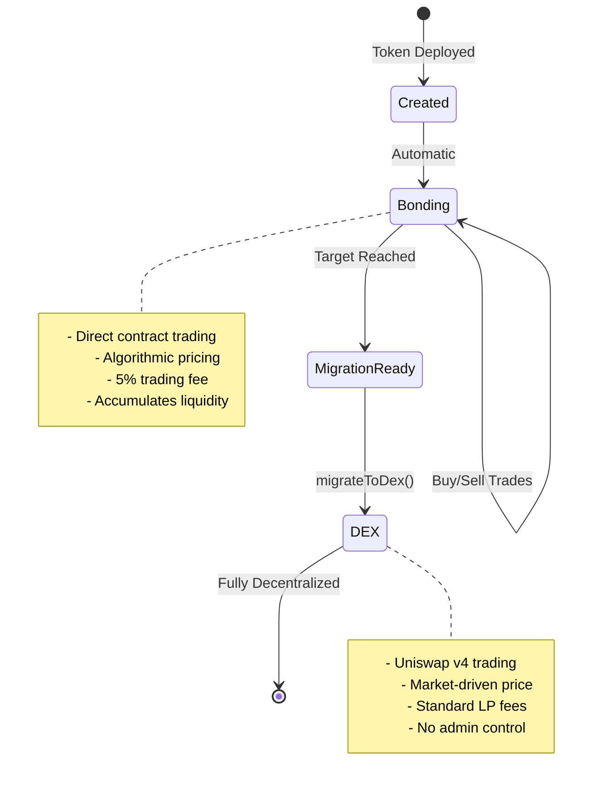
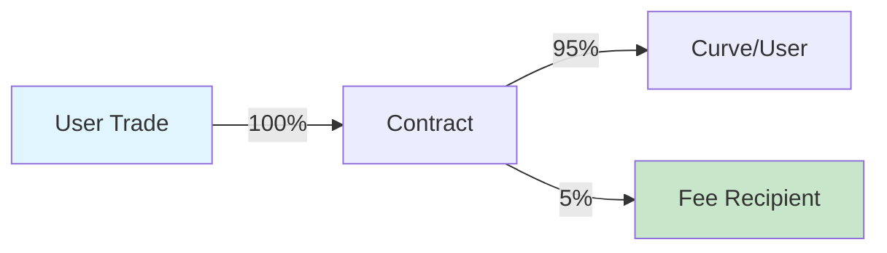

## What is the Bonding Phase?

The bonding phase is the initial trading period where tokens are bought and sold directly from a smart contract using an algorithmic pricing curve. Think of it as a decentralized pre-sale with automatic market making.



## How Bonding Works

### The Bonding Curve Mechanism

During bonding, the contract acts as the sole market maker:

1. **No Order Book**: Prices determined algorithmically
2. **Instant Liquidity**: Always able to buy or sell
3. **Path Independence**: Price depends only on supply, not history
4. **Automatic Pricing**: No manual price setting needed

## Trading Operations

### Buying Tokens

<Tabs>
  <Tab title="How It Works">
    **Process Flow:**
    1. User sends ETH/B3 to contract
    2. Contract calculates tokens based on curve
    3. 5% fee deducted and sent to recipient
    4. Tokens minted and sent to buyer
    5. Curve state updated
    
    **Code Example:**
    ```typescript
    // Get a quote first
    const quote = await token.getAmountOfTokensToBuy(
      parseEther("1") // 1 ETH
    );
    console.log(`Will receive: ${formatEther(quote)} tokens`);
    
    // Execute purchase with slippage protection
    const minTokens = quote * 0.95n; // 5% slippage
    await token.buy(minTokens, "1");
    ```
  </Tab>
  
  <Tab title="Parameters">
    | Parameter | Type | Description |
    |-----------|------|-------------|
    | `minTokensOut` | uint256 | Minimum tokens to receive (slippage protection) |
    | `ethAmount` | string/uint256 | Amount of ETH to spend |
    
    **Important Notes:**
    - Set `minTokensOut` to protect against front-running
    - Use 0 for `minTokensOut` only in low-activity periods
    - Transaction reverts if slippage exceeds tolerance
  </Tab>
  
  <Tab title="Edge Cases">
    **Target Overflow:**
    - If purchase would exceed target, excess is refunded
    - Example: Target is 10 ETH, raised is 9.5 ETH
    - User sends 1 ETH → 0.5 ETH used, 0.5 ETH refunded
    
    **Insufficient Gas:**
    - Recommended gas limit: 200,000
    - Complex calculations may require more
    
    **Zero Amount:**
    - Transactions with 0 ETH will revert
  </Tab>
</Tabs>

### Selling Tokens

<Tabs>
  <Tab title="How It Works">
    **Process Flow:**
    1. User approves token spending
    2. User calls sell with token amount
    3. Contract calculates ETH based on curve
    4. 5% fee deducted from proceeds
    5. ETH sent to seller, tokens burned
    6. Curve state updated (price decreases)
    
    **Code Example:**
    ```typescript
    // Check balance and get quote
    const balance = await token.balanceOf(userAddress);
    const sellAmount = balance / 2n; // Sell half
    
    const quote = await token.getAmountOfEthToReceive(
      sellAmount
    );
    console.log(`Will receive: ${formatEther(quote)} ETH`);
    
    // Execute sale with slippage protection
    const minEth = quote * 0.95n; // 5% slippage
    await token.sell(sellAmount, minEth);
    ```
  </Tab>
  
  <Tab title="Parameters">
    | Parameter | Type | Description |
    |-----------|------|-------------|
    | `tokenAmount` | uint256 | Amount of tokens to sell |
    | `minEthOut` | uint256 | Minimum ETH to receive (slippage protection) |
    
    **Important Notes:**
    - Requires token approval before selling
    - Price impact can be significant for large sells
    - Cannot sell more than circulating supply
  </Tab>
  
  <Tab title="Price Impact">
    **Understanding Sell Impact:**
    
    Selling reduces the curve's raised amount, causing price to drop:
    
    | Sell Size | Price Impact | Recovery Needed |
    |-----------|--------------|-----------------|
    | 1% of supply | ~1-2% | Small |
    | 5% of supply | ~5-10% | Moderate |
    | 10% of supply | ~15-25% | Significant |
    | 20% of supply | ~30-50% | Major |
    
    *Actual impact depends on aggressiveness factor*
  </Tab>
</Tabs>

## Fee Structure

### How Fees Work



<AccordionGroup>
  <Accordion title="Buy Fees">
    **On a 1 ETH purchase:**
    - 0.95 ETH goes to bonding curve
    - 0.05 ETH goes to fee recipient
    - Tokens calculated on 0.95 ETH value
    
    **Example:**
    ```typescript
    // User sends 1 ETH
    // Fee: 0.05 ETH
    // Curve receives: 0.95 ETH
    // Tokens minted based on 0.95 ETH
    ```
  </Accordion>
  
  <Accordion title="Sell Fees">
    **On selling for 1 ETH value:**
    - User receives 0.95 ETH
    - 0.05 ETH goes to fee recipient
    - Curve reduced by full 1 ETH
    
    **Example:**
    ```typescript
    // Tokens worth 1 ETH on curve
    // Fee: 0.05 ETH
    // User receives: 0.95 ETH
    // Curve drops by 1 ETH
    ```
  </Accordion>
  
  <Accordion title="Fee Distribution">
    **Where fees go:**
    - 100% to designated `feeRecipient` address
    - Can be project treasury, developer, or DAO
    - Set at token creation, cannot be changed
    
    **Claiming fees:**
    - Automatic - no claiming needed
    - Sent directly on each trade
    - No accumulation in contract
  </Accordion>
</AccordionGroup>

### Fee Economics

| Daily Volume | Fee Income | Monthly Income |
|-------------|------------|----------------|
| 10 ETH | 0.5 ETH | ~15 ETH |
| 50 ETH | 2.5 ETH | ~75 ETH |
| 100 ETH | 5 ETH | ~150 ETH |
| 500 ETH | 25 ETH | ~750 ETH |

## Target Mechanics

### Understanding the Target

The target is the amount of ETH/B3 that must be accumulated before migration:

<Info>
  **Target Purpose:**
  - Ensures sufficient liquidity for Uniswap v4
  - Creates a clear goal for the community
  - Prevents premature migration
  - Builds momentum during bonding
</Info>

### Approaching the Target

```typescript
// Monitor progress toward target
async function trackProgress(token: BondkitToken) {
  const progress = await token.getBondingProgress();
  
  if (progress.progress < 0.5) {
    console.log("🌱 Early stage - best prices available");
  } else if (progress.progress < 0.8) {
    console.log("🚀 Momentum building - consider buying");
  } else if (progress.progress < 1.0) {
    console.log("🔥 Almost there - migration imminent");
  } else {
    console.log("✅ Target reached - ready to migrate!");
  }
  
  const remaining = progress.threshold - progress.raised;
  console.log(`Need ${formatEther(remaining)} more ETH`);
}
```

### Overflow Handling

When a purchase would exceed the target:

1. **Partial Fill**: Only the amount needed is accepted
2. **Automatic Refund**: Excess returned in same transaction
3. **Fair Completion**: No one can overpay at the end

**Example Scenario:**
```
Target: 100 ETH
Current: 99.5 ETH
User sends: 2 ETH

Result:
- 0.5 ETH accepted (reaches exactly 100 ETH)
- 1.5 ETH refunded
- User gets tokens for 0.5 ETH
- Migration now available
```

## Events & Monitoring

### Contract Events

<Tabs>
  <Tab title="Buy Event">
    ```solidity
    event BondingCurveBuy(
        address indexed payer,
        address indexed recipient,
        uint256 tradingTokenIn,
        uint256 tokensOut,
        uint256 fee,
        uint256 totalRaisedBonding
    );
    ```
    
    **Listening in SDK:**
    ```typescript
    token.onBuy((event) => {
      console.log({
        buyer: event.payer,
        ethSpent: formatEther(event.tradingTokenIn),
        tokensReceived: formatEther(event.tokensOut),
        feePaid: formatEther(event.fee),
        totalRaised: formatEther(event.totalRaisedBonding)
      });
    });
    ```
  </Tab>
  
  <Tab title="Sell Event">
    ```solidity
    event BondingCurveSell(
        address indexed seller,
        uint256 tokensIn,
        uint256 tradingTokenOut,
        uint256 fee,
        uint256 totalRaisedBonding
    );
    ```
    
    **Listening in SDK:**
    ```typescript
    token.onSell((event) => {
      console.log({
        seller: event.seller,
        tokensSold: formatEther(event.tokensIn),
        ethReceived: formatEther(event.tradingTokenOut),
        feePaid: formatEther(event.fee),
        totalRaised: formatEther(event.totalRaisedBonding)
      });
    });
    ```
  </Tab>
</Tabs>

### Real-Time Monitoring

```typescript
// Complete monitoring setup
class BondingMonitor {
  constructor(private token: BondkitToken) {}
  
  async start() {
    // Initial state
    const progress = await this.token.getBondingProgress();
    console.log(`Starting at ${(progress.progress * 100).toFixed(2)}%`);
    
    // Monitor buys
    this.token.onBuy(async (event) => {
      const newProgress = await this.token.getBondingProgress();
      console.log(`BUY: ${formatEther(event.tokensOut)} tokens`);
      console.log(`Progress: ${(newProgress.progress * 100).toFixed(2)}%`);
      
      if (newProgress.progress >= 1.0) {
        console.log("🎆 TARGET REACHED! Migration available.");
      }
    });
    
    // Monitor sells
    this.token.onSell(async (event) => {
      const newProgress = await this.token.getBondingProgress();
      console.log(`SELL: ${formatEther(event.tokensIn)} tokens`);
      console.log(`Progress: ${(newProgress.progress * 100).toFixed(2)}%`);
    });
  }
}

// Usage
const monitor = new BondingMonitor(token);
await monitor.start();
```

## Bonding Phase Strategies

### For Token Creators

<CardGroup cols={2}>
  <Card title="Build Momentum" icon="chart-line">
    - Start with lower aggressiveness (30-50)
    - Set achievable targets
    - Engage community early
    - Provide clear roadmap
  </Card>
  
  <Card title="Maximize Success" icon="trophy">
    - Seed initial liquidity yourself
    - Create buying incentives
    - Time announcements well
    - Plan for post-migration
  </Card>
</CardGroup>

### For Traders

<CardGroup cols={2}>
  <Card title="Entry Strategy" icon="door-open">
    - Buy early for best prices
    - Use DCA for large amounts
    - Monitor aggressiveness factor
    - Check target progress
  </Card>
  
  <Card title="Risk Management" icon="shield">
    - Always use slippage protection
    - Understand price impact
    - Don't FOMO near target
    - Plan exit strategy
  </Card>
</CardGroup>

## Post-Bonding Transition

<Warning>
  **Critical: After Migration**
  
  Once `migrateToDex()` is called:
  - ❌ Bonding curve trading permanently disabled
  - ❌ No more buy() or sell() functions
  - ✅ All trading moves to Uniswap v4
  - ✅ Standard AMM mechanics apply
  - ✅ Anyone can provide liquidity
  - ✅ Fully decentralized trading
</Warning>

## Next Steps

<CardGroup cols={3}>
  <Card title="Pricing Guide" icon="tags" href="/bondkit/concepts/pricing">
    Understand price mechanics
  </Card>
  <Card title="Target Setting" icon="bullseye" href="/bondkit/concepts/targets">
    Choose the right target
  </Card>
  <Card title="Migration Process" icon="rocket" href="/bondkit/guides/migration">
    Learn about DEX transition
  </Card>
</CardGroup>