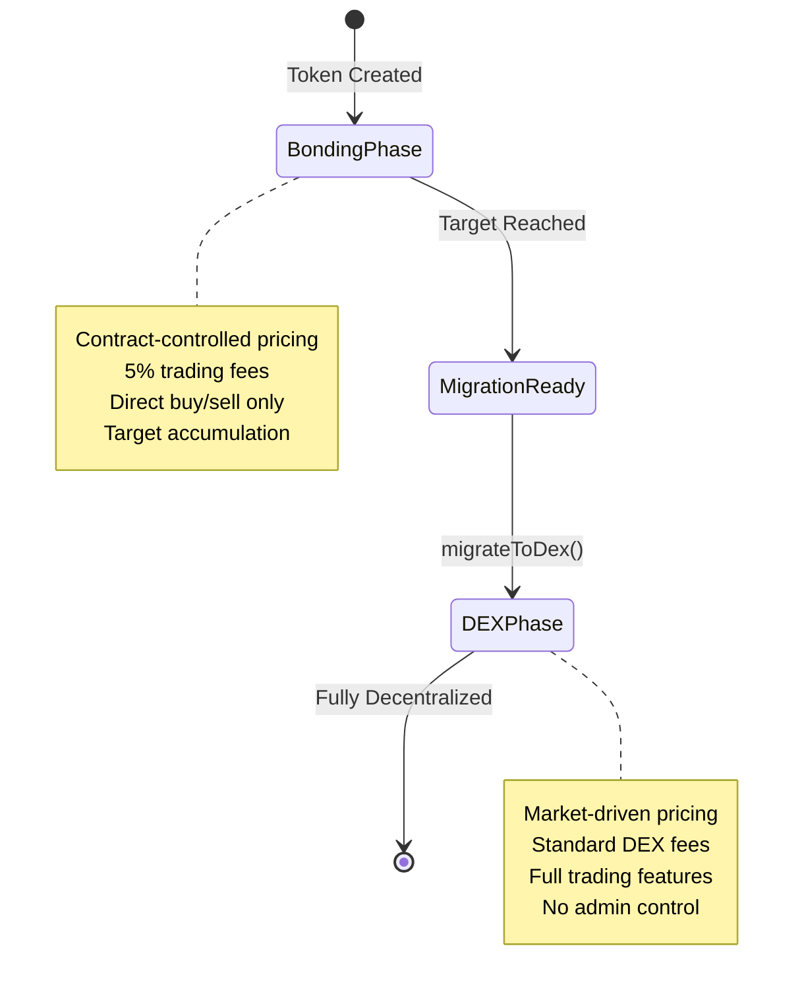

## What is the DEX Phase?

The DEX phase is the final stage of a Bondkit token's lifecycle, where trading transitions from the automated bonding curve to a fully decentralized Uniswap v4 pool. This phase begins immediately after migration and represents complete decentralization.



## How Migration Works

### The Transition Process

When `migrateToDex()` is called after reaching the target:

1. **Contract Status**: Token status changes to `TokenStatus.DexPhase`
2. **Uniswap v4 Pool**: New pool created with accumulated liquidity
3. **Price Initialization**: Initial pool price calculated from bonding curve exit price
4. **Ownership Renouncement**: Contract ownership transferred to zero address
5. **Trading Enabled**: Full DEX trading begins immediately

### Pool Configuration

**Automatic Pool Setup:**
```typescript
// Pool is created with these parameters (from migration)
const poolConfig = {
  currency0: tradingToken < bondkitToken ? tradingToken : bondkitToken,
  currency1: tradingToken < bondkitToken ? bondkitToken : tradingToken,
  fee: 3000,        // 0.3% standard fee
  tickSpacing: 60,  // Standard tick spacing
  hooks: customHook // Bondkit-specific hooks
};
```

**Initial Liquidity:**
- **Trading Token**: All accumulated funds from bonding phase
- **Bondkit Tokens**: Calculated amount to match exit price
- **LP Tokens**: Split between fee recipient and burned/distributed

## Trading in DEX Phase

### Trading Options

**Standard DEX Trading:**
Bondkit tokens in DEX phase can be traded using any Uniswap v4 compatible interface, DEX aggregator, or trading platform.

**SDK Helper (Optional):**
The SDK provides `BondkitSwapService` for simplified integration if needed.

### Price Discovery & Liquidity

**Market-Driven Pricing:**
- No more algorithmic bonding curve
- Price determined by supply/demand
- Real-time order book dynamics
- Subject to market volatility

**Liquidity Sources:**
```typescript
// Initial liquidity from migration
const migrationData = {
  tradingTokenLiquidity: "10.0",    // ETH/B3 from bonding
  bondkitTokenLiquidity: "500000",  // Calculated token amount
  initialPrice: "0.00002",          // Price per token
  totalValueLocked: "20.0"          // Combined TVL
};

// Additional liquidity from:
// - Community LPs
// - Incentive programs  
// - Trading fees accumulation
```

## Key Differences from Bonding Phase

### Trading Mechanics

| Aspect | Bonding Phase | DEX Phase |
|--------|--------------|-----------|
| **Pricing** | Algorithmic curve | Market supply/demand |
| **Liquidity** | Unlimited (contract mints) | Limited pool liquidity |
| **Fees** | 5% to fee recipient | 0.3% to LPs + protocol |
| **Order Types** | Buy/sell only | Full DEX features |
| **Price Impact** | Predictable curve | Depends on liquidity depth |
| **MEV** | Not applicable | Subject to MEV |

### Smart Contract Changes

**Status Transition:**
```typescript
// Check current phase
const status = await token.getStatus();

if (status === TokenStatus.DexPhase) {
  // Use DEX trading methods
  const swapService = new BondkitSwapService(tokenAddress);
  // ... DEX trading code
} else if (status === TokenStatus.BondingPhase) {
  // Use bonding curve methods
  await token.buy(amount, minTokensOut);
}
```

**Method Availability:**
- ✅ `token.buy()` / `token.sell()` - **Disabled** (will revert)
- ✅ DEX trading via `BondkitSwapService`
- ✅ Standard ERC20 functionality continues
- ✅ Event monitoring for DEX trades

## Advanced DEX Features

### Custom Hooks Integration

Bondkit tokens on Uniswap v4 include custom hooks for enhanced functionality:

```typescript
// Hook features (automatically applied)
const hookFeatures = {
  beforeSwap: "Custom fee calculations",
  afterSwap: "Analytics tracking", 
  beforeAddLiquidity: "LP rewards",
  afterRemoveLiquidity: "Exit fee handling"
};
```

### Analytics & Monitoring

**Real-Time Data:**
```typescript
import TradingView from "@b3dotfun/sdk/bondkit/components/TradingView";

// Professional charts with DEX data
function DEXTradingInterface({ tokenAddress, tokenSymbol }) {
  return (
    <div className="space-y-6">
      {/* Price chart with DEX data */}
      <TradingView 
        tokenAddress={tokenAddress}
        tokenSymbol={tokenSymbol}
        className="h-96 w-full"
      />
      
      {/* Trading interface */}
      <SwapInterface tokenAddress={tokenAddress} />
    </div>
  );
}
```

**Available Metrics:**
- Real-time price feeds
- 24h volume and change  
- Liquidity depth
- Historical OHLCV data
- Transaction history
- Holder analytics

### Liquidity Provision

**Becoming an LP:**
```typescript
// Add liquidity to Bondkit token pool
import { Pool, Position } from "@uniswap/v3-sdk";

const position = new Position({
  pool: bondkitPool,
  liquidity: targetLiquidity,
  tickLower: lowerTick,
  tickUpper: upperTick
});

// Earn trading fees + potential incentives
```

**LP Benefits:**
- **Trading Fees**: Earn 0.3% of all swap volume
- **Incentive Programs**: Potential additional rewards
- **Price Appreciation**: Benefit from token growth
- **Impermanent Loss**: Standard AMM risks apply

## Migration Impact Analysis

### For Token Holders

**Immediate Effects:**
- ✅ Tokens remain fully transferable
- ✅ Can trade on open market
- ✅ No lock-up periods
- ⚠️ Price now subject to market volatility
- ⚠️ No guaranteed liquidity (depends on pool depth)

**Long-term Benefits:**
- 🚀 Access to larger trading ecosystem
- 🚀 Integration with DeFi protocols
- 🚀 Composability with other tokens
- 🚀 True decentralization achieved

### For Projects

**Operational Changes:**
```typescript
// Pre-migration: Direct control
await token.buy(amount, minOut);    // ✅ Works
await token.migrateToDex();         // One-time action

// Post-migration: Market-based
await token.buy(amount, minOut);    // ❌ Reverts
await swapService.executeSwap(...); // ✅ Use this instead
```

**New Responsibilities:**
- **Community Building**: Drive organic trading volume
- **Liquidity Incentives**: Encourage LP participation  
- **Marketing**: Promote token utility and adoption
- **Integration**: List on DEX aggregators and platforms

## Best Practices for DEX Phase

### For Traders

<AccordionGroup>
  <Accordion title="Optimal Trading Strategies">
    **Slippage Management:**
    - Use 0.5-2% slippage for small trades
    - Higher slippage for larger amounts
    - Check price impact before execution
    
    **Timing Considerations:**
    - Higher liquidity during active hours
    - Monitor for large LP movements
    - Use limit orders when available
    
    **Example:**
    ```typescript
    const quote = await swapService.getSwapQuote({
      // ... parameters
      slippageTolerance: parseFloat(quote.priceImpact) > 5 ? 0.02 : 0.005
    });
    ```
  </Accordion>
  
  <Accordion title="Risk Management">
    **Liquidity Analysis:**
    - Check pool TVL before large trades
    - Monitor liquidity provider activity
    - Understand impermanent loss if LP
    
    **Price Monitoring:**
    - Set up price alerts
    - Use stop-loss strategies
    - Diversify across multiple tokens
  </Accordion>
</AccordionGroup>

### For Developers

<AccordionGroup>
  <Accordion title="Integration Patterns">
    **Status Checking:**
    ```typescript
    async function getOptimalTradingMethod(token: BondkitToken) {
      const status = await token.getStatus();
      
      if (status === TokenStatus.BondingPhase) {
        return {
          method: "bonding",
          interface: token
        };
      } else if (status === TokenStatus.DexPhase) {
        return {
          method: "dex", 
          interface: new BondkitSwapService(token.contractAddress)
        };
      }
    }
    ```
    
    **Error Handling:**
    ```typescript
    try {
      // Always check phase first
      const tradingMethod = await getOptimalTradingMethod(token);
      
      if (tradingMethod.method === "dex") {
        await tradingMethod.interface.executeSwap(params, wallet);
      }
    } catch (error) {
      if (error.message.includes("BondingPhaseEnded")) {
        // Switch to DEX trading
        const swapService = new BondkitSwapService(tokenAddress);
        await swapService.executeSwap(params, wallet);
      }
    }
    ```
  </Accordion>
</AccordionGroup>

## Common Questions

<AccordionGroup>
  <Accordion title="Can tokens go back to bonding phase?">
    **No** - Migration is permanent and irreversible. Once in DEX phase, the token will always trade on Uniswap v4.
  </Accordion>
  
  <Accordion title="What happens to unused bonding curve liquidity?">
    All accumulated trading tokens from the bonding phase become the initial liquidity in the Uniswap v4 pool, paired with calculated bondkit tokens at the exit price.
  </Accordion>
  
  <Accordion title="Are there any restrictions in DEX phase?">
    No restrictions - tokens become standard ERC20s trading on Uniswap v4. Full DeFi composability is enabled.
  </Accordion>
  
  <Accordion title="How are trading fees different?">
    DEX phase uses standard Uniswap v4 fees (0.3%) which go to liquidity providers instead of the 5% bonding phase fee to the fee recipient.
  </Accordion>
</AccordionGroup>

## Next Steps

<CardGroup cols={2}>
  <Card title="Start DEX Trading" icon="arrow-right" href="/bondkit/sdk/reference#bondkitswapservice">
    Learn to use BondkitSwapService for DEX trading
  </Card>
  <Card title="Add Trading Charts" icon="chart-line" href="/bondkit/sdk/reference#tradingview-component">  
    Integrate TradingView charts for your DEX tokens
  </Card>
  <Card title="Become an LP" icon="coins" href="https://app.uniswap.org">
    Provide liquidity and earn trading fees
  </Card>
  <Card title="Monitor Analytics" icon="analytics" href="https://info.uniswap.org">
    Track your token's DEX performance  
  </Card>
</CardGroup>
