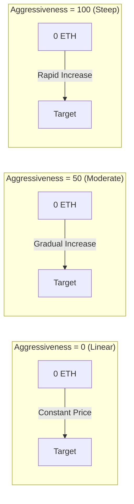

## Visual Price Curves



## Bonding Curve Model

### Mathematical Formula

<Note>
  **Core Formula**
  ```
  S = S_final × (R / R_target)^exponent
  ```
  Where:
  - `S` = Current token supply
  - `S_final` = Final token supply
  - `R` = Amount raised so far
  - `R_target` = Target amount
  - `exponent = 1 / (1 + aggressivenessFactor/100)`
</Note>

### Understanding the Exponent

The aggressiveness factor controls how the exponent affects price progression:

| Aggressiveness | Exponent | Formula Becomes | Price Behavior |
|---------------|----------|-----------------|----------------|
| 0 | 1.00 | S = S_final × (R/R_target) | Linear - constant tokens per ETH |
| 25 | 0.80 | S = S_final × (R/R_target)^0.80 | Slightly curved |
| 50 | 0.67 | S = S_final × (R/R_target)^0.67 | Moderate curve |
| 75 | 0.57 | S = S_final × (R/R_target)^0.57 | Steep curve |
| 100 | 0.50 | S = S_final × √(R/R_target) | Very steep (square root) |

### Price Impact Examples

Let's see how many tokens 1 ETH buys at different stages with a 10 ETH target:

<Tabs>
  <Tab title="Aggressiveness = 0">
    **Linear Pricing (Fair for all)**
    
    | ETH Raised | Tokens per ETH | Price Change |
    |------------|---------------|---------------|
    | 0 → 1 ETH | 100,000 | Baseline |
    | 4 → 5 ETH | 100,000 | 0% |
    | 9 → 10 ETH | 100,000 | 0% |
    
    *Everyone gets the same deal*
  </Tab>
  
  <Tab title="Aggressiveness = 50">
    **Moderate Curve (Balanced)**
    
    | ETH Raised | Tokens per ETH | Price Change |
    |------------|---------------|---------------|
    | 0 → 1 ETH | 146,000 | Baseline |
    | 4 → 5 ETH | 87,000 | -40% |
    | 9 → 10 ETH | 51,000 | -65% |
    
    *Early buyers get 3x more than late buyers*
  </Tab>
  
  <Tab title="Aggressiveness = 100">
    **Steep Curve (Rewards early)**
    
    | ETH Raised | Tokens per ETH | Price Change |
    |------------|---------------|---------------|
    | 0 → 1 ETH | 316,000 | Baseline |
    | 4 → 5 ETH | 89,000 | -72% |
    | 9 → 10 ETH | 31,000 | -90% |
    
    *Early buyers get 10x more than late buyers*
  </Tab>
</Tabs>

## Interactive Price Calculator

```typescript
// Calculate tokens received for a given ETH amount
function calculateTokensReceived(
  ethAmount: number,
  currentRaised: number,
  targetEth: number,
  totalSupply: number,
  aggressiveness: number
): number {
  const exponent = 1 / (1 + aggressiveness / 100);
  
  // Calculate supply at current raised
  const currentSupply = totalSupply * 
    Math.pow(currentRaised / targetEth, exponent);
  
  // Calculate supply after purchase
  const newRaised = currentRaised + ethAmount;
  const newSupply = totalSupply * 
    Math.pow(newRaised / targetEth, exponent);
  
  // Tokens received = difference in supply
  return newSupply - currentSupply;
}

// Example usage
const tokens = calculateTokensReceived(
  1,        // 1 ETH purchase
  5,        // 5 ETH already raised
  10,       // 10 ETH target
  1000000,  // 1M total supply
  50        // 50% aggressiveness
);
console.log(`You'll receive ${tokens.toFixed(0)} tokens`);
```

## Choosing Your Aggressiveness Factor

### Decision Framework

<CardGroup cols={3}>
  <Card title="Low (0-30)" icon="equals">
    **Best for:**
    - Fair launches
    - Community tokens
    - Stable pricing
    
    **Pros:**
    - Equal opportunity
    - Predictable costs
    - Less FOMO
    
    **Cons:**
    - No early incentive
    - Slower momentum
  </Card>
  
  <Card title="Medium (30-70)" icon="chart-line">
    **Best for:**
    - Most projects
    - Balanced approach
    - Moderate rewards
    
    **Pros:**
    - Some early advantage
    - Still accessible
    - Good momentum
    
    **Cons:**
    - Moderate complexity
    - Some price variance
  </Card>
  
  <Card title="High (70-100)" icon="rocket">
    **Best for:**
    - Hype launches
    - Reward early adopters
    - Fast fundraising
    
    **Pros:**
    - Strong early incentive
    - Creates urgency
    - Rewards believers
    
    **Cons:**
    - Can seem unfair
    - High price variance
    - FOMO-driven
  </Card>
</CardGroup>

## Selling Mechanics

When users sell tokens back to the curve:

1. **Price Calculation**: Uses inverse of buying formula
2. **Fee Deduction**: 5% fee applied to proceeds
3. **Curve Update**: Reduces total raised amount
4. **Price Impact**: Large sells significantly impact price

### Sell Price Formula

```typescript
// Calculate ETH received for selling tokens
function calculateEthReceived(
  tokenAmount: number,
  currentSupply: number,
  currentRaised: number,
  targetEth: number,
  totalSupply: number,
  aggressiveness: number
): number {
  const exponent = 1 / (1 + aggressiveness / 100);
  
  // Calculate new supply after sell
  const newSupply = currentSupply - tokenAmount;
  
  // Calculate corresponding raised amount
  const supplyRatio = newSupply / totalSupply;
  const newRaised = targetEth * 
    Math.pow(supplyRatio, 1 / exponent);
  
  // ETH received (before fees)
  const ethBeforeFees = currentRaised - newRaised;
  
  // Apply 5% fee
  return ethBeforeFees * 0.95;
}
```

## Edge Cases & Limits

<Warning>
  **Important Considerations:**
  
  1. **Refunds**: If a buy would exceed target, excess ETH is refunded
  2. **Minimum Amounts**: Very small trades may revert due to rounding
  3. **Maximum Supply**: Cannot exceed `finalTokenSupply`
  4. **Price Limits**: Extreme aggressiveness can cause price spikes
  5. **Slippage**: Always use `minTokensOut` for protection
</Warning>

## Real-World Examples

### Case Study: Fair Launch Token
- **Aggressiveness**: 10
- **Target**: 50 ETH
- **Result**: Nearly linear pricing, community appreciated fairness

### Case Study: Hype Token
- **Aggressiveness**: 85
- **Target**: 100 ETH
- **Result**: Reached target in 2 hours, early buyers gained 8x

### Case Study: Balanced Project
- **Aggressiveness**: 45
- **Target**: 25 ETH
- **Result**: Steady growth over 3 days, 2.5x advantage for early buyers

## Next Steps

<CardGroup cols={2}>
  <Card title="Set Aggressiveness" icon="sliders" href="/bondkit/guides/set-aggressiveness">
    Learn to choose the right factor
  </Card>
  <Card title="Price Estimation" icon="calculator" href="/bondkit/guides/est-migration-price">
    Estimate your migration price
  </Card>
</CardGroup>


