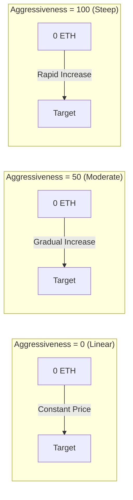

## Visual Price Curves



## Bonding Curve Model

### Mathematical Formula

<Note>
  **Core Formula**
  ```
  S = S_final × (R / R_target)^exponent
  ```
  Where:
  - `S` = Current token supply
  - `S_final` = Final token supply
  - `R` = Amount raised so far
  - `R_target` = Target amount
  - `exponent = 1 / (1 + aggressivenessFactor/100)`
</Note>

### Understanding the Exponent

The aggressiveness factor controls how the exponent affects price progression:

| Aggressiveness | Exponent | Formula Becomes | Price Behavior |
|---------------|----------|-----------------|----------------|
| 0 | 1.00 | S = S_final × (R/R_target) | Linear - constant tokens per ETH |
| 25 | 0.80 | S = S_final × (R/R_target)^0.80 | Slightly curved |
| 50 | 0.67 | S = S_final × (R/R_target)^0.67 | Moderate curve |
| 75 | 0.57 | S = S_final × (R/R_target)^0.57 | Steep curve |
| 100 | 0.50 | S = S_final × √(R/R_target) | Very steep (square root) |

### Aggressiveness Factor Impact

#### Cumulative Token Distribution

See how tokens are distributed throughout the bonding process with different aggressiveness factors.

**Example:** 10M B3 target, 1.25M total token supply (1M available for bonding, 250K reserved for LP)

| Progress | Aggressiveness = 0 | 25 | 50 | 75 | 100 |
|----------|-------------------|----------------------|----------------------|----------------------|----------------------|
| 10% | 100,000 | 158,489 | 215,443 | 268,270 | 316,228 |
| 20% | 200,000 | 275,946 | 341,995 | 398,647 | 447,214 |
| 30% | 300,000 | 381,678 | 448,140 | 502,588 | 547,723 |
| 40% | 400,000 | 480,450 | 542,884 | 592,387 | 632,456 |
| 50% | 500,000 | 574,349 | 629,961 | 672,950 | 707,107 |
| 60% | 600,000 | 664,540 | 711,379 | 746,843 | 774,597 |
| 70% | 700,000 | 751,759 | 788,374 | 815,614 | 836,660 |
| 80% | 800,000 | 836,512 | 861,774 | 880,284 | 894,427 |
| 90% | 900,000 | 919,166 | 932,170 | 941,571 | 948,683 |
| 100% | 1,000,000 | 1,000,000 | 1,000,000 | 1,000,000 | 1,000,000 |

<Note>
**Key Insight:** Higher aggressiveness front-loads token distribution to early buyers. At 10% progress:
- **Aggressiveness 0**: 100,000 (linear)
- **Aggressiveness 100**: 316,228 (3.16x advantage!)

Early buyers with aggressive curves get significantly more tokens for their B3, while late buyers face much higher prices.
</Note>

#### Real-World Example: Alice's Purchase

Let's follow Alice, who wants to buy tokens from a new project at launch:

**Project Setup:**
- **Total Supply**: 1.25M tokens (1M for bonding + 250K for LP)
- **Target**: 10M B3 to reach migration  
- **Aggressiveness**: 100 (maximum reward for early buyers)
- **Current Progress**: 0% (project just launched)

**Alice's Purchase:**
Alice decides to buy 1M B3 worth of tokens right at launch (0% progress).

1. **Alice sends**: 1M B3 tokens
2. **Trading fee (3%)**: 30K B3 goes to fee recipients  
3. **Amount for curve**: 970K B3 advances the project to ~9.7% progress
4. **Tokens received**: ~306,000 tokens (calculated from bonding curve)

**Comparing Different Entry Points:**
If Alice waited and bought the same 1M B3 worth at different project stages:

| Project Progress | Alice's 1M B3 Gets Her | Price per Token |
|-----------------|------------------------|-----------------|
| 0% (launch) | ~306,000 tokens | ~3.3 B3/token |
| 50% progress | ~114,000 tokens | ~8.8 B3/token |  
| 90% progress | ~49,000 tokens | ~20.4 B3/token |

**Early Buyer Advantage:** Alice gets 6.2x more tokens by buying at launch versus waiting until 90% progress!

<Note>
**Key Takeaway**: With maximum aggressiveness (100), buying 1M B3 at launch gets Alice 6.2x more tokens than waiting until 90% progress. The bonding curve heavily rewards early participation!
</Note>

## Interactive Price Calculator

```typescript
// Calculate tokens received for a given trading token amount
function calculateTokensReceived(
  tradingTokenAmount: number,
  currentRaised: number,
  targetAmount: number,
  totalSupply: number,
  aggressiveness: number
): number {
  const exponent = 1 / (1 + aggressiveness / 100);
  
  // Calculate supply at current raised
  const currentSupply = totalSupply * 
    Math.pow(currentRaised / targetAmount, exponent);
  
  // Calculate supply after purchase
  const newRaised = currentRaised + tradingTokenAmount;
  const newSupply = totalSupply * 
    Math.pow(newRaised / targetAmount, exponent);
  
  // Tokens received = difference in supply
  return newSupply - currentSupply;
}

// Example usage
const tokens = calculateTokensReceived(
  1,        // 1 ETH purchase
  5,        // 5 ETH already raised
  10,       // 10 ETH target
  1000000,  // 1M total supply
  50        // 50% aggressiveness
);
console.log(`You'll receive ${tokens.toFixed(0)} tokens`);
```

## Choosing Your Aggressiveness Factor

### Decision Framework

<CardGroup cols={3}>
  <Card title="Low (0-30)" icon="equals">
    **Best for:**
    - Fair launches
    - Community tokens
    - Stable pricing
    
    **Pros:**
    - Equal opportunity
    - Predictable costs
    - Less FOMO
    
    **Cons:**
    - No early incentive
    - Slower momentum
  </Card>
  
  <Card title="Medium (30-70)" icon="chart-line">
    **Best for:**
    - Most projects
    - Balanced approach
    - Moderate rewards
    
    **Pros:**
    - Some early advantage
    - Still accessible
    - Good momentum
    
    **Cons:**
    - Moderate complexity
    - Some price variance
  </Card>
  
  <Card title="High (70-100)" icon="rocket">
    **Best for:**
    - Hype launches
    - Reward early adopters
    - Fast fundraising
    
    **Pros:**
    - Strong early incentive
    - Creates urgency
    - Rewards believers
    
    **Cons:**
    - Can seem unfair
    - High price variance
    - FOMO-driven
  </Card>
</CardGroup>

## Selling Mechanics

When users sell tokens back to the curve:

1. **Price Calculation**: Uses inverse of buying formula
2. **Fee Deduction**: 5% fee applied to proceeds
3. **Curve Update**: Reduces total raised amount
4. **Price Impact**: Large sells significantly impact price

### Sell Price Formula

```typescript
// Calculate trading token received for selling tokens
function calculateTradingTokenReceived(
  tokenAmount: number,
  currentSupply: number,
  currentRaised: number,
  targetAmount: number,
  totalSupply: number,
  aggressiveness: number
): number {
  const exponent = 1 / (1 + aggressiveness / 100);
  
  // Calculate new supply after sell
  const newSupply = currentSupply - tokenAmount;
  
  // Calculate corresponding raised amount
  const supplyRatio = newSupply / totalSupply;
  const newRaised = targetEth * 
    Math.pow(supplyRatio, 1 / exponent);
  
  // ETH received (before fees)
  const ethBeforeFees = currentRaised - newRaised;
  
  // Apply 5% fee
  return ethBeforeFees * 0.95;
}
```

## Edge Cases & Limits

<Warning>
  **Important Considerations:**
  
  1. **Refunds**: If a buy would exceed target, excess ETH is refunded
  2. **Minimum Amounts**: Very small trades may revert due to rounding
  3. **Maximum Supply**: Cannot exceed `finalTokenSupply`
  4. **Price Limits**: Extreme aggressiveness can cause price spikes
  5. **Slippage**: Always use `minTokensOut` for protection
</Warning>

## Real-World Examples

### Case Study: Fair Launch Token
- **Aggressiveness**: 10
- **Target**: 50 ETH
- **Result**: Nearly linear pricing, community appreciated fairness

### Case Study: Hype Token
- **Aggressiveness**: 85
- **Target**: 100 ETH
- **Result**: Reached target in 2 hours, early buyers gained 8x

### Case Study: Balanced Project
- **Aggressiveness**: 45
- **Target**: 25 ETH
- **Result**: Steady growth over 3 days, 2.5x advantage for early buyers

## Next Steps

<CardGroup cols={2}>
  <Card title="Set Aggressiveness" icon="sliders" href="/bondkit/guides/set-aggressiveness">
    Learn to choose the right factor
  </Card>
  <Card title="Price Estimation" icon="calculator" href="/bondkit/guides/est-migration-price">
    Estimate your migration price
  </Card>
</CardGroup>


