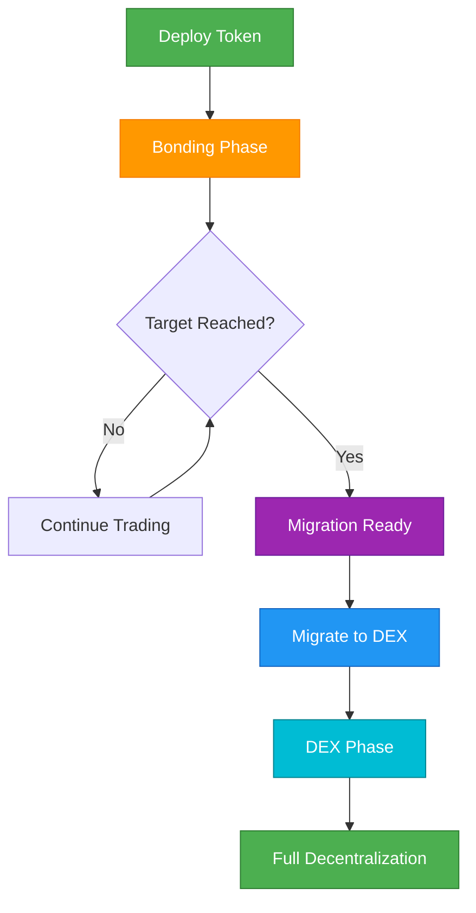

## Overview

This guide walks you through the complete lifecycle of a Bondkit token, from initial creation to full decentralization. Understanding this flow is essential for successful token launches and management.



## Phase 1: Token Creation

### Pre-Deployment Planning

<AccordionGroup>
  <Accordion title="Choose Your Parameters">
    **Critical Decisions:**
    
    | Parameter | Impact | Recommendation |
    |-----------|---------|----------------|
    | **finalTokenSupply** | Total tokens ever created | 1M-100M tokens typical |
    | **aggressivenessFactor** | Price curve steepness | 30-60 for balanced launches |
    | **targetAmount** | Migration threshold | 5-50 trading tokens |
    | **tradingToken** | What users pay with | Use B3 for Base mainnet |
    
    **Example Configuration:**
    ```typescript
    const tokenConfig = {
      name: "MyToken",
      symbol: "MTK",
      finalTokenSupply: parseEther("10000000"), // 10M tokens
      aggressivenessFactor: 45, // Moderate curve
      targetAmount: parseEther("20"), // 20 B3 tokens
      tradingToken: "0xB3B32F9f8827D4634fE7d973Fa1034Ec9fdDB3B3"
    };
    ```
  </Accordion>
  
  <Accordion title="Set Fee Structure">
    **Fee Distribution Strategy:**
    
    ```typescript
    const feeConfig = {
      feeRecipient: "0x...", // Your treasury/team address
      lpSplitRatioFeeRecipientBps: 2000n, // 20% to fee recipient
      // Remaining 80% becomes LP tokens after migration
    };
    ```
    
    **Fee Flow:**
    - **Bonding Phase**: 5% of all trades → `feeRecipient`
    - **Post-Migration**: 0.3% trading fees → LP providers
  </Accordion>
</AccordionGroup>

### Deployment Execution

```typescript
import { BondkitTokenFactory } from "@b3dotfun/sdk/bondkit";
import { base } from "viem/chains";

// 1. Initialize factory
const factory = new BondkitTokenFactory(
  base.id,
  process.env.WALLET_PRIVATE_KEY
);

// 2. Deploy with full configuration
const tokenAddress = await factory.deployBondkitToken({
  // Token metadata
  name: "MyToken",
  symbol: "MTK",
  
  // Economics
  finalTokenSupply: parseEther("10000000"),
  aggressivenessFactor: 45,
  targetAmount: parseEther("20"),
  
  // Fee structure  
  feeRecipient: process.env.TREASURY_ADDRESS,
  lpSplitRatioFeeRecipientBps: 2000n,
  
  // Admin & migration
  migrationAdminAddress: process.env.ADMIN_ADDRESS,
  
  // Uniswap V4 config
  bondingPhaseSplitter: "0x2AB69e0d9D20D3700466153D84a6574128154Fd2",
  v4PoolManager: "0x498581fF718922c3f8e6A244956aF099B2652b2b",
  v4Hook: "0xB36f4A2FB18b745ef8eD31452781a463d2B3f0cC",
  v4PoolFee: 3000,
  v4TickSpacing: 60,
  tradingToken: "0xB3B32F9f8827D4634fE7d973Fa1034Ec9fdDB3B3"
});

console.log(`✅ Token deployed: ${tokenAddress}`);
```

## Phase 2: Bonding Phase Management

### Launch Strategy

<Tabs>
  <Tab title="Community Building">
    **Pre-Launch Checklist:**
    - [ ] Token contract verified on Basescan
    - [ ] Community channels established (Discord/Telegram)  
    - [ ] Marketing materials prepared
    - [ ] Initial buying strategy planned
    - [ ] Price tracking dashboard ready
    
    **Launch Day:**
    ```typescript
    // Connect to your token
    const token = new BondkitToken(tokenAddress, privateKey);
    
    // Initial purchase to establish price
    await token.buy(parseEther("1"), 0n); // 1 B3 token
    
    // Announce launch with real data
    const price = await token.getCurrentPrice();
    const progress = await token.getBondingProgress();
    
    console.log(`🚀 Live at ${formatEther(price)} B3 per token`);
    console.log(`🎯 ${(progress.progress * 100).toFixed(1)}% to migration`);
    ```
  </Tab>
  
  <Tab title="Progress Monitoring">
    **Key Metrics Dashboard:**
    ```typescript
    async function getDashboardData(token) {
      const [
        tokenDetails,
        currentPrice, 
        progress,
        totalSupply,
        status
      ] = await Promise.all([
        token.getTokenDetails(),
        token.getCurrentPrice(),
        token.getBondingProgress(), 
        token.getTotalSupply(),
        token.currentStatus()
      ]);
      
      return {
        // Token Info
        name: tokenDetails.name,
        symbol: tokenDetails.symbol,
        
        // Economics
        currentPrice: formatEther(currentPrice),
        progress: (progress.progress * 100).toFixed(2) + '%',
        raised: formatEther(progress.raised),
        target: formatEther(progress.threshold),
        remaining: formatEther(progress.threshold - progress.raised),
        
        // Supply
        circulatingSupply: formatEther(totalSupply),
        
        // Status
        phase: status === 1 ? 'Bonding' : status === 2 ? 'DEX' : 'Other'
      };
    }
    
    // Use in your dashboard
    const data = await getDashboardData(token);
    ```
  </Tab>
  
  <Tab title="Community Engagement">
    **Real-Time Updates:**
    ```typescript
    // Set up event monitoring for community updates
    token.onBuy((event) => {
      const announcement = `
        🟢 NEW BUY: ${formatEther(event.tokensOut)} ${symbol}
        💰 Spent: ${formatEther(event.ethIn)} B3
        👤 Buyer: ${event.buyer}
      `;
      
      // Post to Discord/Telegram bot
      postToDiscord(announcement);
    });
    
    token.onSell((event) => {
      const announcement = `
        🔴 SELL: ${formatEther(event.tokensIn)} ${symbol}
        💰 Received: ${formatEther(event.ethOut)} B3  
        👤 Seller: ${event.seller}
      `;
      
      postToDiscord(announcement);
    });
    
    // Progress milestones
    const progress = await token.getBondingProgress();
    if (progress.progress >= 0.5 && progress.progress < 0.6) {
      postToDiscord("🎯 50% funded! Halfway to migration!");
    } else if (progress.progress >= 0.9) {
      postToDiscord("🔥 90% funded! Migration imminent!");
    }
    ```
  </Tab>
</Tabs>

### Managing the Bonding Curve

**Healthy Bonding Phase Indicators:**
- Steady trading volume
- Growing holder base  
- Active community engagement
- Progress toward target (but not too fast)
- Minimal large sell-offs

**Warning Signs:**
- No trading activity for 24+ hours
- Single whale controlling large percentage
- Rapid target achievement without community
- Excessive volatility from bots

## Phase 3: Migration Readiness

### Pre-Migration Checklist

```typescript
async function checkMigrationReadiness(token) {
  const [canMigrate, progress, status] = await Promise.all([
    token.canMigrate(),
    token.getBondingProgress(),
    token.currentStatus()
  ]);
  
  const checks = {
    targetReached: canMigrate,
    progressComplete: progress.progress >= 1.0,
    stillBondingPhase: status === 1,
    communityReady: await checkCommunityConsensus(), // Your logic
    liquidityPlan: await checkPostMigrationPlan()     // Your logic
  };
  
  const allReady = Object.values(checks).every(Boolean);
  
  return {
    ready: allReady,
    checks,
    recommendation: allReady ? 
      "✅ Ready to migrate!" : 
      "⏳ Address issues before migration"
  };
}
```

### Migration Timing Strategy

<AccordionGroup>
  <Accordion title="Optimal Timing">
    **Best Practices:**
    - Announce migration 24-48 hours in advance
    - Choose high-activity time for your community
    - Ensure sufficient community consensus
    - Have post-migration marketing ready
    
    **Pre-Migration Announcement:**
    ```typescript
    const migrationData = await token.getMigrationData();
    
    const announcement = `
      🚀 MIGRATION SCHEDULED
      
      📊 Final Bonding Stats:
      • Raised: ${formatEther(progress.raised)} B3
      • Tokens Distributed: ${formatEther(totalSupply)}
      
      🔄 Migration Will Create:
      • Initial LP: ${formatEther(migrationData.ethForLp)} B3 + tokens
      • Opening Price: ~${calculateOpeningPrice(migrationData)} B3/token
      
      ⏰ Migration in 24 hours!
    `;
    ```
  </Accordion>
  
  <Accordion title="Migration Execution">
    **The Migration Process:**
    ```typescript
    // Final checks
    const readiness = await checkMigrationReadiness(token);
    if (!readiness.ready) {
      throw new Error(`Not ready: ${JSON.stringify(readiness.checks)}`);
    }
    
    // Execute migration
    console.log("🔄 Starting migration to Uniswap V4...");
    const migrationTx = await token.migrateToDex();
    
    // Wait for confirmation
    const receipt = await token.waitForTransaction(migrationTx);
    
    if (receipt.status === 'success') {
      console.log("✅ Migration successful!");
      
      // Verify new status
      const newStatus = await token.currentStatus();
      console.log(`Status: ${newStatus === 2 ? 'DEX Phase' : 'Unknown'}`);
      
      // Announce to community
      const announcement = `
        🎉 MIGRATION COMPLETE!
        
        📍 Now trading on Uniswap V4
        🔗 Transaction: ${migrationTx}
        💫 Token is now fully decentralized!
      `;
      
      postToDiscord(announcement);
    }
    ```
  </Accordion>
</Tabs>

## Phase 4: DEX Phase Operations

### Immediate Post-Migration (First 24 Hours)

```typescript
// Initialize DEX trading tools
import { BondkitSwapService } from "@b3dotfun/sdk/bondkit";

const swapService = new BondkitSwapService(tokenAddress);

// Verify DEX functionality
const isSwapAvailable = await token.isSwapAvailable();
if (isSwapAvailable) {
  console.log("✅ DEX trading active");
  
  // Test swap quote
  const quote = await swapService.getSwapQuote({
    tokenIn: "0xB3B32F9f8827D4634fE7d973Fa1034Ec9fdDB3B3",
    tokenOut: tokenAddress,
    amountIn: "1",
    tokenInDecimals: 18,
    tokenOutDecimals: 18,
    slippageTolerance: 0.005,
    recipient: testAddress
  });
  
  console.log(`DEX Price: ${quote.executionPrice} B3 per token`);
}
```

### Long-Term DEX Strategy

<Tabs>
  <Tab title="Liquidity Management">
    **Initial Liquidity Analysis:**
    ```typescript
    async function analyzeLiquidity() {
      // Get pool info (implementation depends on your setup)
      const poolData = await getUniswapV4PoolData(tokenAddress);
      
      return {
        totalValueLocked: poolData.tvl,
        tradingVolume24h: poolData.volume24h,
        priceImpactFor1k: await calculatePriceImpact(1000),
        liquidityUtilization: poolData.utilization,
        
        recommendations: {
          needsMoreLiquidity: poolData.tvl < minimumTVL,
          shouldIncentivize: poolData.utilization > 0.8,
          healthyTrading: poolData.volume24h > minimumVolume
        }
      };
    }
    ```
    
    **Liquidity Incentive Program:**
    ```typescript
    // Example LP reward structure
    const lpIncentives = {
      rewardToken: tokenAddress,
      dailyRewards: parseEther("1000"), // 1000 tokens per day
      minimumLPTime: 7 * 24 * 3600, // 7 days minimum
      bonusMultipliers: {
        week1: 2.0,  // 2x rewards first week
        month1: 1.5, // 1.5x rewards first month
        longTerm: 1.0 // Standard rewards after
      }
    };
    ```
  </Tab>
  
  <Tab title="Community Transition">
    **Educational Content:**
    ```typescript
    const migrationGuideForUsers = {
      trading: {
        before: "Use token.buy() and token.sell()",
        after: "Use DEX interfaces or swapService.executeSwap()",
        walletSetup: "Add token to MetaMask, use Uniswap interface"
      },
      
      benefits: {
        moreFeatures: "Limit orders, advanced trading tools",
        composability: "Use with other DeFi protocols", 
        decentralization: "No admin controls remaining"
      },
      
      risks: {
        priceVolatility: "Market-driven pricing, can be volatile",
        liquidityRisk: "Large trades may have price impact",
        smartContractRisk: "Standard DeFi risks apply"
      }
    };
    ```
    
    **Community Resources:**
    - Updated documentation
    - Trading tutorial videos  
    - DEX interface integration guides
    - Liquidity provision tutorials
  </Tab>
  
  <Tab title="Monitoring & Analytics">
    **DEX Phase Dashboard:**
    ```typescript
    async function getDEXPhaseMetrics(tokenAddress) {
      return {
        // Price & Volume
        currentPrice: await getCurrentDEXPrice(tokenAddress),
        volume24h: await get24hVolume(tokenAddress),
        priceChange24h: await getPriceChange24h(tokenAddress),
        
        // Liquidity
        totalLiquidity: await getTotalLiquidity(tokenAddress),
        lpTokenHolders: await getLPHolderCount(tokenAddress),
        
        // Trading
        transactions24h: await getTransactionCount24h(tokenAddress),
        uniqueTraders24h: await getUniqueTraders24h(tokenAddress),
        avgTradeSize: await getAvgTradeSize(tokenAddress),
        
        // Health Metrics
        liquidityUtilization: await getLiquidityUtilization(tokenAddress),
        priceImpact1k: await getPriceImpact(tokenAddress, 1000),
        holderDistribution: await getHolderDistribution(tokenAddress)
      };
    }
    ```
    
    **Automated Monitoring:**
    ```typescript
    // Set up alerts for important events
    const monitoringConfig = {
      priceAlerts: {
        change24h: 20, // Alert if >20% price change
        volume: 10000, // Alert if volume exceeds threshold
        liquidity: 5000 // Alert if TVL drops below threshold
      },
      
      actions: {
        onLowLiquidity: () => announceIncentiveProgram(),
        onHighVolatility: () => checkForManipulation(),
        onTradingHalt: () => investigateIssues()
      }
    };
    ```
  </Tab>
</Tabs>

## Phase 5: Full Decentralization

### Ownership Renunciation

```typescript
// Final step: Complete decentralization
async function finalizeDecentralization(token) {
  // Verify everything is working properly
  const healthChecks = await performFinalHealthChecks(token);
  
  if (!healthChecks.allPassed) {
    throw new Error("Health checks failed - do not renounce ownership yet");
  }
  
  // Point of no return warning
  console.log("⚠️  WARNING: This will permanently renounce all admin control");
  console.log("⚠️  No further contract modifications will be possible");
  console.log("⚠️  Ensure community governance is established if needed");
  
  // Final renunciation
  const tx = await token.renounceTokenOwnership();
  const receipt = await token.waitForTransaction(tx);
  
  if (receipt.status === 'success') {
    console.log("🎊 TOKEN FULLY DECENTRALIZED!");
    console.log("🎊 Community now has complete control");
    
    // Final community announcement
    const announcement = `
      🎊 DECENTRALIZATION COMPLETE!
      
      ✅ All admin keys renounced
      ✅ Community in full control  
      ✅ Permissionless and unstoppable
      
      Thank you for this journey! 🚀
    `;
    
    await postFinalAnnouncement(announcement);
  }
}
```

### Post-Renunciation Operations

<AccordionGroup>
  <Accordion title="Community Governance">
    **Governance Structure Options:**
    
    | Model | Pros | Cons | Best For |
    |-------|------|------|----------|
    | **No Governance** | Simple, truly decentralized | Cannot upgrade/change | Simple tokens |
    | **Token Voting** | Holder-driven decisions | Can be gamed by whales | Active communities |
    | **Multisig** | Trusted group decisions | Semi-centralized | Technical projects |
    | **DAO** | Full on-chain governance | Complex, slow | Large projects |
    
    **Implementation Examples:**
    ```typescript
    // Option 1: Simple token voting
    const governanceConfig = {
      votingToken: tokenAddress,
      minimumQuorum: parseEther("1000000"), // 1M tokens
      votingPeriod: 7 * 24 * 3600, // 7 days
      executionDelay: 2 * 24 * 3600 // 2 days
    };
    
    // Option 2: Community multisig
    const multisigConfig = {
      signers: [
        "0x...", // Community member 1
        "0x...", // Community member 2  
        "0x...", // Community member 3
        "0x...", // Community member 4
        "0x..."  // Community member 5
      ],
      threshold: 3, // 3 out of 5 required
      timelock: 24 * 3600 // 24 hour delay
    };
    ```
  </Accordion>
  
  <Accordion title="Community Resources">
    **Handover Documentation:**
    - Complete technical documentation
    - Community management guides
    - Emergency response procedures
    - Contact information for technical help
    
    **Community Tools:**
    ```typescript
    const communityResources = {
      // Analytics
      dashboards: [
        "https://dexscreener.com/base/{tokenAddress}",
        "https://basescan.org/token/{tokenAddress}"
      ],
      
      // Trading
      dexInterfaces: [
        "https://app.uniswap.org/swap",
        "https://pancakeswap.finance/swap" 
      ],
      
      // Community
      channels: {
        discord: "https://discord.gg/...",
        telegram: "https://t.me/...",
        twitter: "https://twitter.com/...",
        website: "https://..."
      }
    };
    ```
  </Accordion>
</AccordionGroup>

## Lifecycle Success Metrics

### Key Performance Indicators

<Tabs>
  <Tab title="Bonding Phase KPIs">
    ```typescript
    const bondingPhaseKPIs = {
      // Growth Metrics
      timeToTarget: "< 30 days ideal",
      uniqueHolders: "> 100 minimum", 
      averageHolding: "1-5% of supply per holder",
      
      // Trading Health
      dailyVolume: "> 1% of raised amount",
      priceStability: "< 50% daily volatility",
      communityEngagement: "> 50 active members",
      
      // Distribution
      topHolderConcentration: "< 20% by largest holder",
      whaleRisk: "< 50% by top 10 holders",
      
      // Success Signals
      organicGrowth: "Community-driven, not bot-heavy",
      sustainedInterest: "Consistent activity over time",
      realUtility: "Clear value proposition"
    };
    ```
  </Tab>
  
  <Tab title="Migration KPIs">
    ```typescript
    const migrationKPIs = {
      // Technical Success
      migrationExecution: "Single transaction, no failures",
      poolInitialization: "Uniswap V4 pool created successfully", 
      priceDiscovery: "Fair opening price established",
      
      // Community Response  
      tradingResumption: "< 1 hour to first DEX trades",
      volumeTransition: "> 50% of bonding volume in first week",
      liquidityHealth: "Stable LP base established",
      
      // Long-term Health
      priceStability: "< 30% deviation from migration price",
      liquidityGrowth: "Increasing TVL over time",
      communityRetention: "> 80% of holders remain active"
    };
    ```
  </Tab>
  
  <Tab title="DEX Phase KPIs">
    ```typescript
    const dexPhaseKPIs = {
      // Trading Health
      dailyVolume: "> $10k minimum",
      liquidityDepth: "> $50k TVL",
      priceImpact: "< 5% for $1k trades",
      
      // Community Growth
      holderGrowth: "+10% holders monthly",
      tradingActivity: "> 100 daily transactions",
      socialEngagement: "Active community discussion",
      
      // Decentralization Success
      distributionImprovement: "More equal holder distribution",
      governanceParticipation: "Active community decisions",
      permissionlessGrowth: "Community-driven development"
    };
    ```
  </Tab>
</Tabs>

## Common Pitfalls & Solutions

<Warning>
  **Critical Mistakes to Avoid:**
  
  1. **Rushing Migration**: Don't migrate immediately upon target - ensure community readiness
  2. **Poor Communication**: Keep community informed at every phase
  3. **Whale Concentration**: Monitor for unhealthy token concentration
  4. **Technical Issues**: Thoroughly test all integrations before launch
  5. **Legal Compliance**: Ensure regulatory compliance in your jurisdiction
</Warning>

### Troubleshooting Guide

<AccordionGroup>
  <Accordion title="Bonding Phase Issues">
    **Problem: No trading activity**
    
    *Solutions:*
    - Increase marketing and community outreach
    - Lower aggressiveness factor if price rises too quickly
    - Ensure trading token (B3) is easily accessible
    - Add trading charts and analytics tools
    
    **Problem: Whale manipulation**
    
    *Solutions:*
    - Implement community watch programs
    - Use social pressure for responsible trading
    - Consider maximum purchase limits in future versions
    - Build strong community consensus
  </Accordion>
  
  <Accordion title="Migration Problems">
    **Problem: Migration fails**
    
    *Solutions:*
    - Check all parameters are correct
    - Ensure sufficient gas and proper wallet setup
    - Verify target is actually reached
    - Contact technical support if needed
    
    **Problem: Poor opening price**
    
    *Solutions:*
    - Migration price is algorithmically determined
    - Market will find true value over time
    - Focus on utility and community building
    - Avoid artificial price manipulation
  </Accordion>
  
  <Accordion title="DEX Phase Challenges">
    **Problem: Low liquidity**
    
    *Solutions:*
    - Implement LP reward programs
    - Partner with market makers
    - Educate community about LP provision
    - Consider liquidity mining campaigns
    
    **Problem: Community confusion**
    
    *Solutions:*
    - Create clear migration guides
    - Host community AMAs and tutorials
    - Provide multiple trading interface options
    - Maintain active community support
  </Accordion>
</AccordionGroup>

## Next Steps

<CardGroup cols={2}>
  <Card title="Plan Your Launch" icon="rocket" href="/bondkit/quickstart">
    Use the quickstart guide to begin your token deployment
  </Card>
  <Card title="Choose Parameters" icon="sliders" href="/bondkit/guides/set-aggressiveness">
    Learn how to configure your bonding curve parameters
  </Card>
  <Card title="Technical Reference" icon="code" href="/bondkit/sdk/reference">
    Detailed SDK documentation for developers
  </Card>
  <Card title="Get Support" icon="discord" href="https://discord.gg/b3dotfun">
    Join the community for help and guidance
  </Card>
</CardGroup>

---

<Note>
  **Success Tips:**
  - Start with smaller, test launches to gain experience
  - Build genuine community before, during, and after bonding
  - Focus on real utility and value creation
  - Be transparent about tokenomics and plans
  - Plan for long-term sustainability, not just initial hype
</Note>
