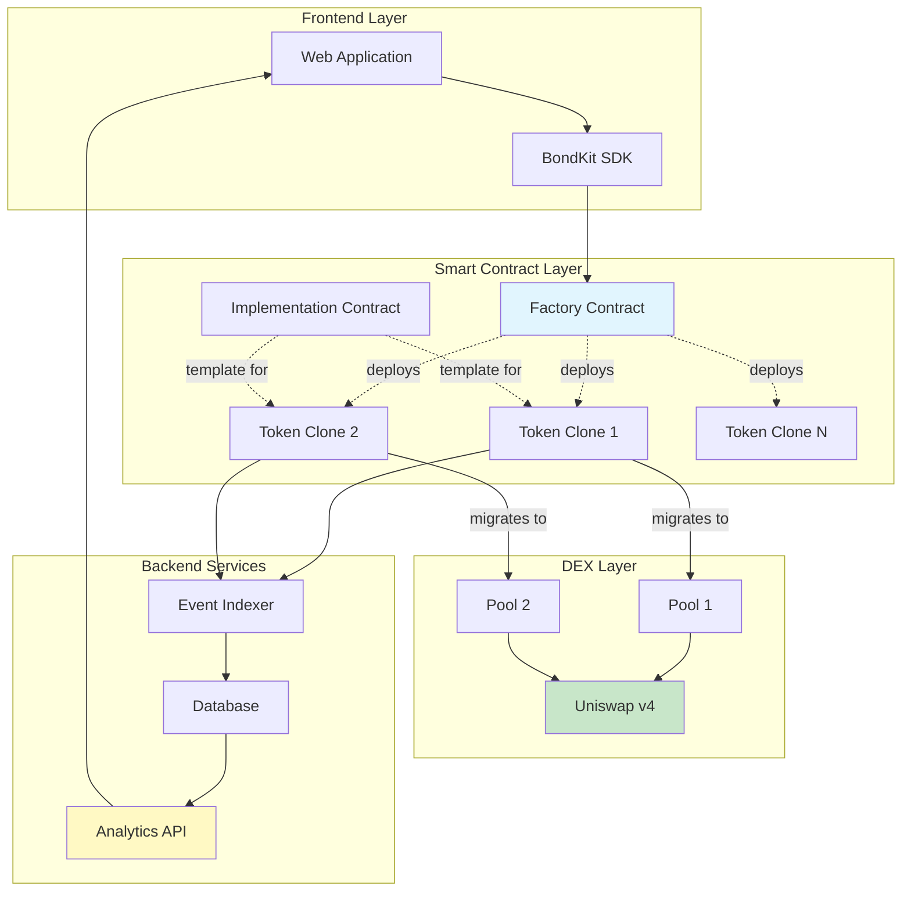

## Architecture Overview



## Product Flow in Detail

<Steps>
  <Step title="Phase 1: Token Creation">
    **What happens:**
    - User calls `deployBondkitToken()` on the Factory contract
    - Factory clones the Implementation contract using minimal proxy pattern
    - New token is initialized with custom parameters
    - Token enters bonding phase automatically
    
    **Gas cost:** ~200,000 gas (90% cheaper than full deployment)
    **Time:** ~15 seconds
  </Step>
  
  <Step title="Phase 2: Bonding Curve Trading">
    **What happens:**
    - Users buy/sell tokens directly from the contract
    - Price follows algorithmic bonding curve: `S = S_final × (R/R_target)^exponent`
    - 5% fee on all trades goes to fee recipient
    - Contract accumulates quote assets (ETH/B3) toward target
    - Backend indexes all transactions for analytics
    
    **Trading mechanics:**
    - Buy: Send ETH/B3, receive tokens at current curve price
    - Sell: Send tokens, receive ETH/B3 minus fees
    - Automatic refunds if purchase would exceed target
    
    **Duration:** Until target is reached (hours to weeks)
  </Step>
  
  <Step title="Phase 3: DEX Migration">
    **What happens:**
    - Admin calls `migrateToDex()` when target is reached
    - Contract calculates fair market price as `sqrtPriceX96`
    - Creates and initializes Uniswap v4 pool
    - Transfers accumulated liquidity to pool
    - Renounces ownership to zero address
    - Token becomes standard ERC20 with DEX trading
    
    **Post-migration:**
    - Bonding curve permanently disabled
    - All trading via Uniswap v4
    - No admin controls remain
    - Full decentralization achieved
    
    **Gas cost:** ~500,000 gas
    **Time:** ~30 seconds
  </Step>
</Steps>

## System Components

### Smart Contracts

<AccordionGroup>
  <Accordion title="🏭 Factory Contract">
    **Purpose:** Deploys new bond tokens efficiently
    
    **Key Functions:**
    - `deployBondkitToken()` - Creates new token clone
    - `getImplementationAddress()` - Returns template address
    - `setAllowedQuoteAsset()` - Admin function to whitelist assets
    
    **Gas Optimization:**
    - Uses EIP-1167 minimal proxy pattern
    - Shares logic across all tokens
    - ~90% gas savings vs individual deployments
  </Accordion>
  
  <Accordion title="📜 Implementation Contract">
    **Purpose:** Template for all bond tokens
    
    **Core Features:**
    - ERC20 standard compliance
    - Bonding curve mathematics
    - Migration logic to Uniswap v4
    - Fee distribution system
    
    **State Transitions:**
    1. Uninitialized → Bonding Phase
    2. Bonding Phase → Migration Ready
    3. Migration Ready → DEX Phase
  </Accordion>
  
  <Accordion title="🪙 Token Clones">
    **Purpose:** Individual token instances
    
    **Lifecycle:**
    - Created via factory
    - Initialized with unique parameters
    - Manages its own bonding curve
    - Self-migrates to Uniswap v4
    
    **Storage:**
    - Token metadata (name, symbol)
    - Supply and distribution
    - Bonding curve state
    - Migration parameters
  </Accordion>
</AccordionGroup>

### Backend Services

<AccordionGroup>
  <Accordion title="🔍 Event Indexer">
    **Purpose:** Captures all on-chain activity
    
    **Monitors:**
    - Token creations
    - Buy/sell transactions
    - Migration events
    - Transfer activities
    
    **Technology:**
    - Real-time blockchain scanning
    - Event log processing
    - Database synchronization
  </Accordion>
  
  <Accordion title="📊 Analytics Engine">
    **Purpose:** Processes raw data into insights
    
    **Generates:**
    - OHLCV candlestick data
    - Volume metrics
    - Liquidity tracking
    - Price history
    - User statistics
    
    **Updates:** Every block (~2 seconds)
  </Accordion>
  
  <Accordion title="🌐 REST API">
    **Purpose:** Serves data to frontends
    
    **Endpoints:**
    - `/tokens` - List all tokens
    - `/tokens/{address}` - Token details
    - `/tokens/{address}/transactions` - Trade history
    - `/tokens/{address}/ohlcv` - Chart data
    - `/users/{address}/portfolio` - User holdings
    
    **Format:** JSON with pagination
  </Accordion>
</AccordionGroup>

### User Roles

| Role | Responsibilities | Permissions |
|------|-----------------|-------------|
| **Creator** | Deploy token, set parameters, initiate migration | Full control until migration |
| **Traders** | Buy/sell during bonding, trade on DEX | Standard trading rights |
| **Fee Recipient** | Receive trading fees | Passive income only |
| **Migration Admin** | Execute migration when ready | One-time migration right |
| **LP Providers** | (Post-migration) Add liquidity to Uniswap | Standard LP rights |

## Technical Deep Dive

### Bonding Curve Mathematics

The bonding curve determines token price based on supply:

```
Price Formula:
S = S_final × (R / R_target)^exponent

Where:
- S = Current token supply
- S_final = Final token supply
- R = Raised amount (ETH/B3)
- R_target = Target amount
- exponent = 1 / (1 + aggressivenessFactor/100)
```

**Example Calculations:**

| Aggressiveness | Exponent | Price Behavior |
|---------------|----------|----------------|
| 0 | 1.00 | Linear (constant price) |
| 25 | 0.80 | Gentle curve |
| 50 | 0.67 | Moderate curve |
| 75 | 0.57 | Steep curve |
| 100 | 0.50 | Very steep (square root) |

### Migration Price Calculation

When migrating to Uniswap v4, the contract:

1. **Calculates exit price** from bonding curve
2. **Converts to sqrtPriceX96** format:
   ```
   sqrtPriceX96 = sqrt(price) × 2^96
   ```
3. **Initializes pool** with this price
4. **Adds liquidity** using accumulated funds

### Gas Optimization Techniques

<Info>
  **Minimal Proxy Pattern (EIP-1167)**
  
  Instead of deploying full contract code for each token:
  - Deploy one implementation contract (600KB)
  - Deploy tiny proxy contracts (45 bytes each)
  - Proxies delegate all calls to implementation
  - Result: 90% gas savings per deployment
</Info>

## Configuration Parameters

### Token Creation Parameters

| Parameter | Type | Range/Format | Impact |
|-----------|------|--------------|--------|
| `name` | string | 1-50 chars | Token display name |
| `symbol` | string | 2-10 chars | Trading symbol |
| `finalTokenSupply` | uint256 | > 0 | Total mintable tokens |
| `aggressivenessFactor` | uint8 | 0-100 | Curve steepness |
| `targetEth` | uint256 | > 0 | Migration threshold |
| `feeRecipient` | address | Valid address | Receives fees |
| `lpSplitRatioFeeRecipientBps` | uint256 | 0-10000 | LP fee share (basis points) |
| `migrationAdminAddress` | address | Valid address | Can trigger migration |

### Runtime Parameters

| Action | Parameters | Validation |
|--------|------------|------------|
| Buy | `minTokensOut`, `ethAmount` | Slippage protection |
| Sell | `tokenAmount`, `minEthOut` | Balance check, slippage |
| Migrate | None | Target reached, admin only |

### System Constants

| Constant | Value | Description |
|----------|-------|-------------|
| Trading Fee | 5% | Applied to all trades |
| Decimals | 18 | Standard ERC20 decimals |
| Min Target | 0.1 ETH | Minimum viable target |
| Max Aggressiveness | 100 | Maximum curve factor |

## Security Considerations

<Warning>
  **Important Security Features:**
  
  1. **Ownership Renouncement**: Automatic after migration
  2. **No Mint Function**: Supply fixed at creation
  3. **Immutable Parameters**: Cannot be changed post-deployment
  4. **Audited Contracts**: Professionally reviewed code
  5. **No Admin Backdoors**: True decentralization
  6. **Slippage Protection**: Built into buy/sell functions
  7. **Overflow Protection**: Safe math throughout
</Warning>

## Failure Scenarios & Handling

| Scenario | System Response |
|----------|----------------|
| Buy exceeds target | Partial fill, refund excess |
| Insufficient liquidity for sell | Transaction reverts |
| Migration before target | Transaction reverts |
| Non-admin attempts migration | Transaction reverts |
| Double migration attempt | Transaction reverts |
| Zero address operations | Transaction reverts |

## Next Steps

<CardGroup cols={2}>
  <Card title="Pricing Mechanics" icon="chart-line" href="/bondkit/concepts/pricing">
    Understand bonding curve mathematics
  </Card>
  <Card title="Token Lifecycle" icon="rocket" href="/bondkit/guides/token-lifecycle">
    Learn the migration process
  </Card>
</CardGroup>


