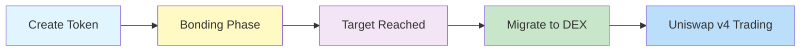

## What is BondKit?

BondKit is a complete token launch platform for creating ERC20 "bond tokens" on Base mainnet. It provides an end‑to‑end solution that handles everything from initial token creation through bonding curve trading and finally migration to Uniswap v4 for full decentralized trading.

### Key Components

<Tabs>
  <Tab title="Smart Contracts">
    **Audited On-Chain Infrastructure**
    - Factory contract for deploying new tokens
    - ERC20 implementation with bonding curve logic
    - Automatic Uniswap v4 pool initialization
    - Gas-optimized minimal proxy pattern
  </Tab>
  <Tab title="TypeScript SDK">
    **Developer-Friendly Tools**
    - Simple API for all contract interactions
    - Type-safe interfaces with full TypeScript support
    - Built-in transaction management
    - Event subscriptions and monitoring
  </Tab>
  <Tab title="Analytics Backend">
    **Real-Time Data Services**
    - Transaction history tracking
    - OHLCV chart data generation
    - Token metadata storage
    - REST API for frontend integration
  </Tab>
</Tabs>

## How BondKit Works



### The Three-Phase Lifecycle

1. **Creation Phase**: Deploy your token with custom parameters
2. **Bonding Phase**: Automated market making via bonding curve
3. **DEX Phase**: Full decentralized trading on Uniswap v4

## Core Features

<AccordionGroup>
  <Accordion title="🏭 Factory Pattern Deployment">
    - **Gas-Efficient Clones**: Uses minimal proxy pattern to reduce deployment costs by ~90%
    - **Standardized Implementation**: All tokens share the same battle-tested logic
    - **One-Click Deployment**: Simple function call to create a new token
  </Accordion>
  
  <Accordion title="📈 Dynamic Bonding Curve">
    - **Configurable Aggressiveness**: Factor from 0-100 controls price progression
    - **Automatic Price Discovery**: Market-driven pricing during bonding phase
    - **Buy & Sell Support**: Full two-way trading during bonding
    - **5% Trading Fee**: Applied to both buys and sells, distributed to fee recipient
  </Accordion>
  
  <Accordion title="🎯 Target-Based Migration">
    - **Customizable Targets**: Set your funding goal in ETH or allowed ERC20
    - **Automatic Threshold Detection**: Contract tracks progress to target
    - **One-Click Migration**: Simple call to `migrateToDex()` when ready
    - **Price Calculation**: `sqrtPriceX96` computed on-chain for fair initial pricing
  </Accordion>
  
  <Accordion title="🔄 Uniswap v4 Integration">
    - **Automatic Pool Creation**: Pool initialized with bonding curve exit price
    - **Liquidity Provision**: Accumulated funds become initial liquidity
    - **Ownership Renouncement**: Contract becomes fully decentralized post-migration
    - **Seamless Transition**: No manual intervention required
  </Accordion>
  
  <Accordion title="📊 Analytics & Monitoring">
    - **Real-Time Indexing**: All transactions recorded and processed
    - **OHLCV Data**: Professional trading charts available via API
    - **Transaction History**: Complete audit trail for every token
    - **Portfolio Tracking**: Monitor multiple tokens and positions
  </Accordion>
</AccordionGroup>

## Use Cases

<CardGroup cols={3}>
  <Card title="🚀 Token Launches" icon="rocket">
    **For Projects & Creators**
    - Fair launch mechanisms
    - Community-driven price discovery
    - No upfront liquidity required
    - Built-in anti-bot protection
  </Card>
  
  <Card title="🎮 Gaming & NFTs" icon="gamepad">
    **For GameFi Projects**
    - In-game currency launches
    - NFT project tokens
    - Reward token distribution
    - Player-owned economies
  </Card>
  
  <Card title="🏢 DApp Integration" icon="building">
    **For Developers**
    - Programmatic token creation
    - White-label solutions
    - Custom frontend integration
    - API-driven automation
  </Card>
</CardGroup>

## Technical Capabilities

### Smart Contract Features
- ✅ ERC20-compliant bond tokens with extended functionality
- ✅ Factory pattern for gas-efficient deployments
- ✅ Configurable parameters (supply, target, aggressiveness)
- ✅ Built-in fee distribution mechanism
- ✅ Automatic Uniswap v4 migration

### SDK Features
- ✅ Full TypeScript support with type definitions
- ✅ Promise-based async operations
- ✅ Event listeners and subscriptions
- ✅ Transaction receipt handling
- ✅ Error handling and retry logic

### Analytics Features
- ✅ Real-time price tracking
- ✅ Volume and liquidity metrics
- ✅ Historical transaction data
- ✅ OHLCV candlestick data
- ✅ User portfolio tracking

## Get started

<CardGroup cols={2}>
  <Card title="Request Access" icon="rocket" href="https://b3builders.typeform.com/bsmntdevelopers">
    Launch with BondKit on Base
  </Card>
  <Card title="Chat with the Team" icon="discord" href="https://discord.gg/b3dotfun">
    Questions or feedback? Talk to us on Discord
  </Card>
  
</CardGroup>

## Key Terminology

<Tabs>
  <Tab title="Core Concepts">
    | Term | Definition |
    |------|------------|
    | **Bonding Phase** | Initial trading period with algorithmic pricing via bonding curve |
    | **Bond Token** | ERC20 token with built-in bonding curve mechanics |
    | **Target Amount** | Funding goal that triggers migration eligibility |
    | **Migration** | Transition from bonding curve to Uniswap v4 |
    | **Quote Asset** | The currency used to buy tokens (ETH or allowed ERC20) |
  </Tab>
  
  <Tab title="Technical Terms">
    | Term | Definition |
    |------|------------|
    | **Minimal Proxy** | Gas-efficient contract cloning pattern |
    | **Aggressiveness Factor** | Parameter (0-100) controlling price curve steepness |
    | **sqrtPriceX96** | Uniswap v4 price format for pool initialization |
    | **Fee Recipient** | Address receiving trading fees during bonding |
    | **LP Split Ratio** | Liquidity provider fee percentage in basis points |
  </Tab>
  
  <Tab title="SDK Terms">
    | Term | Definition |
    |------|------------|
    | **Factory Contract** | Main contract for deploying new bond tokens |
    | **Implementation** | Template contract cloned for each token |
    | **Public Client** | Read-only blockchain connection |
    | **Wallet Client** | Write-enabled blockchain connection |
    | **Provider** | Web3 connection interface (e.g., MetaMask) |
  </Tab>
</Tabs>

## Important Parameters

<Note>
  **Current Network**: Base Mainnet only
  
  **Allowed Quote Assets**: 
  - B3 Token (currently active)
  - ETH (coming soon)
  - Additional tokens can be whitelisted
  
  **Fee Structure**:
  - 5% on all bonding phase trades
  - Customizable LP split ratio for migration
  
  **Security**:
  - Audited smart contracts
  - Automatic ownership renouncement post-migration
  - No admin keys after DEX phase begins
</Note>

## Next Steps

<Steps>
  <Step title="Install SDK">
    Set up the BondKit SDK in your project
    ```bash
    pnpm add @b3dotfun/sdk
    ```
  </Step>
  <Step title="Read Quickstart">
    Learn the basics with our step-by-step guide
  </Step>
  <Step title="Explore Examples">
    Check out working implementations and demos
  </Step>
  <Step title="Join Community">
    Get help and share feedback on Discord
  </Step>
</Steps>
