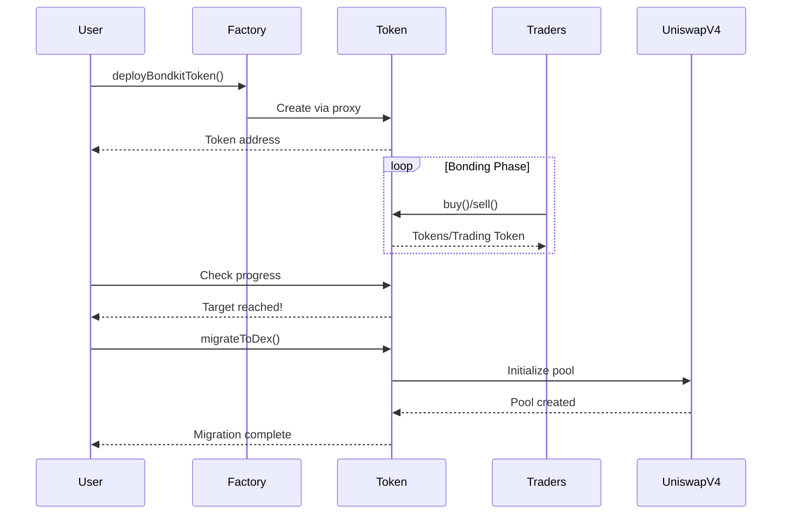

## Overview

This quickstart guide will walk you through the complete lifecycle of a BondKit token in under 5 minutes. You'll learn how to:

1. **Deploy** a new bond token
2. **Trade** during the bonding phase
3. **Monitor** progress toward the target
4. **Migrate** to Uniswap v4

<Info>
  **Prerequisites**: Make sure you've completed the [installation](/bondkit/installation) and have a funded wallet on Base.
</Info>

## Complete Flow Diagram



## Step 1: Deploy Your Token

### Basic Deployment

```typescript
import { BondkitTokenFactory } from "@b3dotfun/sdk/bondkit";
import { base } from "viem/chains";
import { parseEther } from "viem";

// Initialize the factory
const factory = new BondkitTokenFactory(
  base.id, 
  process.env.WALLET_PRIVATE_KEY
);

// Deploy your token
const tokenAddress = await factory.deployBondkitToken({
  // Token metadata
  name: "My Awesome Token",
  symbol: "MAT",
  
  // Supply configuration (1 million tokens)
  finalTokenSupply: parseEther("1000000"),
  
  // Bonding curve settings
  aggressivenessFactor: 35,  // 0-100, higher = steeper curve
  targetAmount: parseEther("10"), // 10 units of trading token target for migration
  
  // Fee configuration
  feeRecipient: "0x742d35Cc6634C0532925a3b844Bc9e7595f0bEb1", // Your address
  lpSplitRatioFeeRecipientBps: 1000n, // 10% to fee recipient
  
  // Migration settings  
  migrationAdminAddress: "0x742d35Cc6634C0532925a3b844Bc9e7595f0bEb1",
  
  // Uniswap V4 configuration
  bondingPhaseSplitter: "0x2AB69e0d9D20D3700466153D84a6574128154Fd2",
  v4PoolManager: "0x498581fF718922c3f8e6A244956aF099B2652b2b",
  v4Hook: "0xB36f4A2FB18b745ef8eD31452781a463d2B3f0cC",
  v4PoolFee: 3000, // 0.3% fee tier
  v4TickSpacing: 60,
  
  // Trading token (B3 token address for Base mainnet)  
  tradingToken: "0xB3B32F9f8827D4634fE7d973Fa1034Ec9fdDB3B3"
});

console.log("✅ Token deployed at:", tokenAddress);
```

### Understanding Parameters

<ParamField path="finalTokenSupply" type="bigint" required>
  Total supply of tokens (with 18 decimals). Example: `parseEther("1000000")` for 1M tokens.
</ParamField>

<ParamField path="aggressivenessFactor" type="number" required>
  Controls bonding curve steepness (0-100):
  - **0-30**: Linear pricing, fair for all buyers
  - **30-60**: Moderate curve, balanced approach
  - **60-100**: Aggressive, rewards early buyers
</ParamField>

<ParamField path="targetAmount" type="bigint" required>
  Amount of trading token needed to enable migration. Use `parseEther("10")` for 10 tokens (18 decimals).
</ParamField>

<ParamField path="feeRecipient" type="address" required>
  Address that receives trading fees (5% of all trades).
</ParamField>

<ParamField path="lpSplitRatioFeeRecipientBps" type="bigint" required>
  Basis points (1/100th of 1%) for LP fee split. 1000 = 10%.
</ParamField>

## Step 2: Trading During Bonding Phase

### Initialize Token Instance

```typescript
import { BondkitToken } from "@b3dotfun/sdk/bondkit";
import { parseEther, formatEther } from "viem";

// Connect to your deployed token
const token = new BondkitToken(
  tokenAddress, 
  process.env.WALLET_PRIVATE_KEY
);
```

### Understanding Trading Tokens

BondKit tokens use a **configurable trading token** system. Check what token is used for trading:

```typescript
// Get the trading token details
const tradingTokenAddress = await token.getTradingTokenAddress();
const tradingTokenSymbol = await token.getTradingTokenSymbol();

console.log(`Trading with: ${tradingTokenSymbol} (${tradingTokenAddress})`);
// For Base mainnet, this is typically B3 token

// Check if it's ETH (zero address) or an ERC20 token
const isETH = tradingTokenAddress === "0x0000000000000000000000000000000000000000";
```

### Buying Tokens

```typescript
// Get a price quote first
const tradingTokenAmount = parseEther("100"); // 100 units of trading token
const expectedTokens = await token.getAmountOfTokensToBuy(tradingTokenAmount);

console.log(`${formatEther(tradingTokenAmount)} ${tradingTokenSymbol} will buy: ${formatEther(expectedTokens)} tokens`);

// Execute the purchase (parameters: minTokensOut, amount)
const buyTx = await token.buy(
  tradingTokenAmount, // Amount of trading token to spend  
  0n                  // minTokensOut (0 = accept any amount, use for slippage protection)
);

console.log("Purchase complete! Tx:", buyTx);
```

### Selling Tokens

```typescript
// Check your token balance
const balance = await token.getBalance(userAddress);
console.log(`Your balance: ${formatEther(balance)} tokens`);

// Get sell quote
const tokensToSell = parseEther("1000");
const expectedTradingToken = await token.getAmountOfTradingTokensToSell(tokensToSell);

console.log(`Selling 1000 tokens will return: ${formatEther(expectedTradingToken)} ${tradingTokenSymbol}`);

// Execute the sale
const sellTx = await token.sell(
  tokensToSell,         // Amount of tokens to sell
  0n                    // Min trading token out (for slippage protection)
);

console.log("Sale complete! Tx:", sellTx);
```

### Monitoring Progress

```typescript
// Check bonding progress
const progress = await token.getBondingProgress();

console.log(`
  Progress: ${(progress.progress * 100).toFixed(2)}%
  Raised: ${formatEther(progress.raised)} ${tradingTokenSymbol}
  Target: ${formatEther(progress.threshold)} ${tradingTokenSymbol}
  Remaining: ${formatEther(progress.threshold - progress.raised)} ${tradingTokenSymbol}
`);

// Get current token price
const currentPrice = await token.getCurrentPrice();
console.log(`Current price: ${formatEther(currentPrice)} ${tradingTokenSymbol} per token`);

// Check if migration is available
const canMigrate = await token.canMigrate();
console.log(`Ready to migrate: ${canMigrate}`);
```

### Event Monitoring

```typescript
// Listen for buy events
token.onBuy((event) => {
  console.log("New purchase:", {
    buyer: event.buyer,
    tradingTokenIn: formatEther(event.ethIn), // Note: field name is 'ethIn' but represents trading token
    tokensOut: formatEther(event.tokensOut)
  });
});

// Listen for sell events
token.onSell((event) => {
  console.log("New sale:", {
    seller: event.seller,
    tokensIn: formatEther(event.tokensIn),
    tradingTokenOut: formatEther(event.ethOut) // Note: field name is 'ethOut' but represents trading token
  });
});
```

## Step 3: Migration to Uniswap v4

### Check Migration Readiness

```typescript
// Verify target is reached
const progress = await token.getBondingProgress();

if (progress.progress >= 1.0) {
  console.log("✅ Target reached! Ready to migrate.");
  
  // Get migration details
  const migrationData = await token.getMigrationData();
  console.log("Migration will create pool with:", {
    tradingTokenLiquidity: formatEther(migrationData.ethForLp), // Note: 'ethForLp' field name
    tokenLiquidity: formatEther(migrationData.tokensForLp),
    initialPrice: formatEther(migrationData.sqrtPriceX96)
  });
} else {
  console.log(`⏳ Need ${formatEther(progress.threshold - progress.raised)} more ${tradingTokenSymbol}`);
}
```

### Execute Migration

```typescript
// Only the migration admin can call this
if (await token.isMigrationAdmin(userAddress)) {
  console.log("🚀 Initiating migration to Uniswap v4...");
  
  const migrationTx = await token.migrateToDex();
  console.log("Migration transaction:", migrationTx);
  
  // Wait for confirmation
  const receipt = await token.waitForTransaction(migrationTx);
  
  if (receipt.status === "success") {
    console.log("✅ Migration complete!");
    console.log("Uniswap v4 pool address:", await token.getPoolAddress());
  }
} else {
  console.log("❌ Only migration admin can execute migration");
}
```

<Warning>
  **Important**: After migration:
  - Contract ownership is automatically renounced
  - Bonding curve trading is permanently disabled
  - All trading moves to Uniswap v4
  - No further admin actions are possible
</Warning>

## Complete Example

Here's a full working example that demonstrates the entire lifecycle:

```typescript
import { 
  BondkitTokenFactory, 
  BondkitToken 
} from "@b3dotfun/sdk/bondkit";
import { base } from "viem/chains";
import { parseEther, formatEther } from "viem";

async function launchToken() {
  // 1. Deploy token
  const factory = new BondkitTokenFactory(
    base.id,
    process.env.WALLET_PRIVATE_KEY
  );
  
  const tokenAddress = await factory.deployBondkitToken({
    name: "Demo Token",
    symbol: "DEMO",
    finalTokenSupply: parseEther("1000000"),
    aggressivenessFactor: 50,
    targetAmount: parseEther("5"),
    feeRecipient: process.env.WALLET_ADDRESS,
    lpSplitRatioFeeRecipientBps: 1000n,
    migrationAdminAddress: process.env.WALLET_ADDRESS,
    
    // Uniswap V4 configuration
    bondingPhaseSplitter: "0x2AB69e0d9D20D3700466153D84a6574128154Fd2",
    v4PoolManager: "0x498581fF718922c3f8e6A244956aF099B2652b2b", 
    v4Hook: "0xB36f4A2FB18b745ef8eD31452781a463d2B3f0cC",
    v4PoolFee: 3000,
    v4TickSpacing: 60,
    tradingToken: "0xB3B32F9f8827D4634fE7d973Fa1034Ec9fdDB3B3"
  });
  
  console.log("Token deployed:", tokenAddress);
  
  // 2. Trade during bonding
  const token = new BondkitToken(
    tokenAddress,
    process.env.WALLET_PRIVATE_KEY
  );
  
  // Buy some tokens
  await token.buy(parseEther("50"), 0n); // 50 trading tokens, 0 min out
  console.log("Bought tokens with 50 trading tokens");
  
  // Check progress
  const progress = await token.getBondingProgress();
  console.log(`Progress: ${(progress.progress * 100).toFixed(2)}%`);
  
  // 3. Continue trading until target is reached...
  // (In production, other users would be trading)
  
  // 4. Migrate when ready
  if (progress.progress >= 1.0) {
    await token.migrateToDex();
    console.log("Migration complete! Token is now on Uniswap v4");
  }
}

launchToken().catch(console.error);
```

## Next Steps

<CardGroup cols={2}>
  <Card title="Concepts" icon="book" href="/bondkit/concepts/bonding-phase">
    Deep dive into bonding curves and pricing
  </Card>
  <Card title="SDK Reference" icon="code" href="/bondkit/sdk/reference">
    Explore all available methods
  </Card>
  <Card title="Complete Lifecycle" icon="compass" href="/bondkit/guides/token-lifecycle">
    End-to-end token management guide
  </Card>
  <Card title="Demo App" icon="desktop" href="https://github.com/b3dotfun/b3-monorepo/tree/main/apps/bondkit-demo">
    See a complete implementation
  </Card>
</CardGroup>


