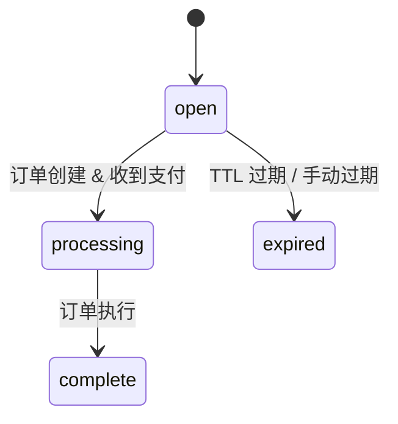

结账会话让您在用户选择支付方式之前，在您的服务器上创建一个跟踪对象。会话是一个轻量级的数据库记录 -- 无需外部 API 调用，无需创建订单。订单稍后在用户承诺支付时产生。

<Info>
  寻找 React 结账组件？请见 [Checkout](/anyspend/checkout)。本页面覆盖了 **REST API** 用于服务器驱动的流程。
</Info>

## 基本 URL

所有结账会话端点都位于 AnySpend 服务上：

```
https://api.anyspend.com
```

## 流程

<Steps>
  <Step title="在您的服务器上创建一个会话">
    `POST https://api.anyspend.com/checkout-sessions` 返回 `{ id, status: "open" }`
  </Step>
  <Step title="用户选择一个支付方式">
    `POST https://api.anyspend.com/orders` 带有 `checkoutSessionId` 返回 `{ id, globalAddress, oneClickBuyUrl }`
  </Step>
  <Step title="用户支付">
    **加密货币：** 发送至 `globalAddress` | **法币通道：** 重定向至 `oneClickBuyUrl`
  </Step>
  <Step title="轮询完成情况">
    `GET https://api.anyspend.com/checkout-sessions/:id` 返回 `{ status: "complete", order_id }`
  </Step>
</Steps>

### 为什么要将会话与订单解耦？

- 在会话创建时不需要知道支付方式。
- 托管的结账页面可以让用户选择如何支付。
- 会话创建是本地数据库写入，因此永远不会因第三方 API 错误而失败。

## 会话状态生命周期



| 状态 | 含义 |
|--------|---------|
| `open` | 已创建，等待订单/支付 |
| `processing` | 收到支付，订单执行中 |
| `complete` | 订单成功执行 |
| `expired` | TTL 过期，支付失败，或手动过期 |

## API 参考

### 创建会话

```
POST https://api.anyspend.com/checkout-sessions
```

创建一个轻量级会话。无订单，无外部 API 调用。

```json
{
  "success_url": "https://merchant.com/success?session_id={SESSION_ID}",
  "cancel_url": "https://merchant.com/cancel",
  "metadata": { "sku": "widget-1" },
  "client_reference_id": "merchant-order-456",
  "expires_in": 1800
}
```

所有字段都是可选的。支付配置（金额，代币，链）存在于订单上，而不是会话上。

### 创建链接到会话的订单

```
POST https://api.anyspend.com/orders
```

在标准订单体中传递 `checkoutSessionId` 以将订单链接到会话。

```json
{
  "recipientAddress": "0x...",
  "srcChain": 8453,
  "dstChain": 8453,
  "srcTokenAddress": "0x...",
  "dstTokenAddress": "0x...",
  "srcAmount": "1000000",
  "type": "swap",
  "payload": { "expectedDstAmount": "1000000" },
  "checkoutSessionId": "550e8400-..."
}
```

**验证规则：**
- 会话必须存在（如果未找到则返回 `400`）
- 会话必须是 `open`（如果过期/处理中/完成则返回 `400`）
- 会话不能已经有订单（`409 Conflict`）

### 检索会话

```
GET https://api.anyspend.com/checkout-sessions/:id
```

返回当前会话状态。每次检索时，状态都会从底层订单同步。

| 查询参数 | 描述 |
|-------------|-------------|
| `include=order` | 嵌入完整的订单对象及其交易 |

### 使会话过期

```
POST https://api.anyspend.com/checkout-sessions/:id/expire
```

仅对状态为 `open` 的会话有效。

## 重定向 URL 模板

在 `success_url` 和 `cancel_url` 中使用模板变量：

| 变量 | 替换为 |
|----------|--------------|
| `{SESSION_ID}` | 结账会话的 UUID |
| `{ORDER_ID}` | 同一值（别名） |

如果没有模板变量，自动附加 `?sessionId=<uuid>`。

## SDK 集成

### 服务方法

```typescript
import { anyspend } from "@b3dotfun/sdk/anyspend";

// 创建一个结账会话
const session = await anyspend.createCheckoutSession({
  success_url: "https://mysite.com/success/{SESSION_ID}",
  metadata: { sku: "widget-1" },
});

// 检索会话状态
const session = await anyspend.getCheckoutSession(sessionId);
```

### React 钩子

#### `useCreateCheckoutSession`

用于创建会话的 Mutation 钩子。

```tsx
import { useCreateCheckoutSession } from "@b3dotfun/sdk/anyspend";

const { mutate: createSession, data, isPending } = useCreateCheckoutSession();
```

#### `useCheckoutSession`

带有自动轮询的查询钩子。当状态达到 `complete` 或 `expired` 时停止轮询。

```tsx
import { useCheckoutSession } from "@b3dotfun/sdk/anyspend";

const { data: session, isLoading } = useCheckoutSession(sessionId);
```

### 组件属性

`<AnySpend>`、`<AnySpendCustom>` 和 `<AnySpendCustomExactIn>` 组件接受一个可选的 `checkoutSession` 属性：

```tsx
<AnySpend
  defaultActiveTab="fiat"
  destinationTokenAddress="0x833589fCD6eDb6E08f4c7C32D4f71b54bdA02913"
  destinationTokenChainId={8453}
  recipientAddress="0x..."
  checkoutSession={{
    success_url: "https://myshop.com/success?session={SESSION_ID}",
    cancel_url: "https://myshop.com/cancel",
    metadata: { sku: "widget-1" },
  }}
/>
```

设置 `checkoutSession` 时，组件在订单之前创建一个会话，并使用会话的 `success_url` 进行重定向。没有该属性时，现有流程与之前相同。

## 示例

### 加密货币支付

```typescript
const BASE_URL = "https://api.anyspend.com";

// 1. 创建会话
const session = await fetch(`${BASE_URL}/checkout-sessions`, {
  method: "POST",
  headers: { "Content-Type": "application/json" },
  body: JSON.stringify({
    success_url: "https://mysite.com/success/{SESSION_ID}",
    metadata: { sku: "widget-1" },
  }),
}).then(r => r.json());

// 2. 创建链接到会话的订单
const order = await fetch(`${BASE_URL}/orders`, {
  method: "POST",
  headers: { "Content-Type": "application/json" },
  body: JSON.stringify({
    recipientAddress: "0x...",
    srcChain: 8453,
    dstChain: 8453,
    srcTokenAddress: "0x833589fcd6edb6e08f4c7c32d4f71b54bda02913",
    dstTokenAddress: "0x833589fcd6edb6e08f4c7c32d4f71b54bda02913",
    srcAmount: "1000000",
    type: "swap",
    payload: { expectedDstAmount: "1000000" },
    checkoutSessionId: session.data.id,
  }),
}).then(r => r.json());

// 3. 用户向 order.data.globalAddress 发送加密货币

// 4. 轮询会话直到完成
const poll = setInterval(async () => {
  const s = await fetch(`${BASE_URL}/checkout-sessions/${session.data.id}`).then(r => r.json());
  if (s.data.status === "complete") {
    clearInterval(poll);
    // 重定向至 success_url 或显示确认信息
  }
}, 3000);
```

### 法币通道（Coinbase/Stripe）

```typescript
const BASE_URL = "https://api.anyspend.com";

// 步骤 1-2 与上述相同，但在创建订单时包含通道配置：
const order = await fetch(`${BASE_URL}/orders`, {
  method: "POST",
  headers: { "Content-Type": "application/json" },
  body: JSON.stringify({
    // ... 相同的订单字段 ...
    checkoutSessionId: session.data.id,
    onramp: {
      vendor: "coinbase",
      payment_method: "card",
      country: "US",
    },
  }),
}).then(r => r.json());

// 将用户重定向至供应商结账页面
window.location.href = order.data.oneClickBuyUrl;

// 供应商重定向回来后，轮询 GET /checkout-sessions/:id 以检查完成情况
```
