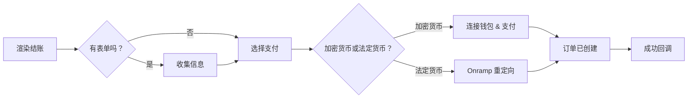

结账组件渲染一个双面板布局：一边是订单摘要，另一边是支付。它们支持加密货币和法定货币、自定义表单字段、运输选项、折扣代码以及可选的 B3 工作流触发器。[在线查看](https://sdk-demo.anyspend.com/)。

<Info>
  有关结账 **sessions REST API**（后端驱动的基于会话的流程），请参见[结账会话](/anyspend/checkout-sessions)。本页面涵盖 **React 结账组件**。
</Info>

## 工作原理



## 快速开始

<Steps>
  <Step title="安装 SDK">
    ```bash
    npm install @b3dotfun/sdk
    ```
  </Step>
  <Step title="导入组件">
    ```tsx
    import { AnySpendCheckout } from "@b3dotfun/sdk/anyspend/react";
    ```
  </Step>
  <Step title="渲染结账">
    ```tsx title="基础结账" icon="cart-shopping"
    <AnySpendCheckout
      recipientAddress="0xMerchantAddress..."
      destinationTokenAddress="0x833589fCD6eDb6E08f4c7C32D4f71b54bdA02913"
      destinationTokenChainId={8453}
      items={[
        {
          name: "专业计划 - 每月",
          description: "无限制访问所有功能",
          amount: "10000000", // 10 USDC (6 小数位)
          quantity: 1,
        },
      ]}
      organizationName="Acme Inc"
      organizationLogo="/acme-logo.svg"
      themeColor="#4f46e5"
      onSuccess={(result) => {
        console.log("支付完成：", result.orderId);
      }}
    />;
    ```
  </Step>
</Steps>

---

## 组件

### `<AnySpendCheckout>`

主结账组件渲染一个双面板布局，包括订单摘要/购物车面板和支持加密货币和法定货币选项的支付面板。可选地包括用于收集客户信息、选择运输、折扣代码的表单面板。

#### 核心属性

<ParamField path="recipientAddress" type="string" required>
  商户钱包地址以接收支付
</ParamField>

<ParamField path="destinationTokenAddress" type="string" required>
  结算的代币合约地址（例如，USDC）
</ParamField>

<ParamField path="destinationTokenChainId" type="number" required>
  结算的链 ID（例如，`8453` 代表 Base）
</ParamField>

<ParamField path="items" type="CheckoutItem[]" required>
  在购物车面板中显示的行项目
</ParamField>

#### 品牌

<ParamField path="organizationName" type="string">
  结账头部显示的商户名称
</ParamField>

<ParamField path="organizationLogo" type="string">
  商户标志的 URL
</ParamField>

<ParamField path="themeColor" type="string">
  主题颜色的十六进制颜色（例如，`"#4f46e5"`）
</ParamField>

<ParamField path="buttonText" type="string">
  支付按钮的自定义文本
</ParamField>

#### 订单摘要

<ParamField path="totalAmount" type="string">
  覆盖计算出的总额（以 wei 为单位）。当总额与项目金额之和不同时使用（例如，折扣或费用后）。
</ParamField>

<ParamField path="shipping" type="string | { amount: string; label?: string }">
  运费。传递一个字符串表示金额（以 wei 为单位），或带有自定义标签的对象。
</ParamField>

<ParamField path="tax" type="string | { amount: string; label?: string; rate?: string }">
  税额。传递一个字符串表示金额（以 wei 为单位），或带有标签和可选显示率的对象（例如，`"8.5%"`）。
</ParamField>

<ParamField path="discount" type="string | { amount: string; label?: string; code?: string }">
  折扣金额（显示为扣除）。传递一个字符串表示金额（以 wei 为单位），或带有标签和可选代码的对象。
</ParamField>

<ParamField path="summaryLines" type="CheckoutSummaryLine[]">
  额外的摘要行项目，如平台费用、小费或服务费
</ParamField>

#### 支付

<ParamField path="defaultPaymentMethod" type="PaymentMethod">
  初始展开的支付方式。选项：`"crypto"`, `"coinbase"`, `"stripe"`。
</ParamField>

<ParamField path="senderAddress" type="string">
  在连接钱包前预填充发送者地址以显示代币余额
</ParamField>

<ParamField path="checkoutSessionId" type="string">
  将此结账链接到后端结账会话以进行跟踪
</ParamField>

#### 回调

<ParamField path="onSuccess" type="(result: { txHash?: string; orderId?: string }) => void">
  支付成功时调用
</ParamField>

<ParamField path="onError" type="(error: Error) => void">
  支付错误时调用
</ParamField>

<ParamField path="returnUrl" type="string">
  支付完成后重定向的 URL
</ParamField>

<ParamField path="returnLabel" type="string">
  返回/重定向按钮的标签
</ParamField>

#### 显示选项

<ParamField path="mode" type="'page' | 'embedded'" default="'page'">
  `page` 表示独立页面，`embedded` 表示内嵌于您的布局中
</ParamField>

<ParamField path="showPoints" type="boolean" default="false">
  在订单状态摘要中显示获得的积分
</ParamField>

<ParamField path="showOrderId" type="boolean" default="false">
  在订单状态摘要中显示订单 ID
</ParamField>

<ParamField path="footer" type="ReactNode | null">
  订单摘要的自定义页脚。传递 `null` 以隐藏默认的“由...提供支持”页脚。
</ParamField>

#### 定制

<ParamField path="slots" type="AnySpendSlots">
  替换 UI 部分。参见[定制](/anyspend/customization#slots)。
</ParamField>

<ParamField path="content" type="AnySpendContent">
  覆盖文本/消息。参见[定制](/anyspend/customization#content)。
</ParamField>

<ParamField path="theme" type="AnySpendTheme">
  配置颜色。参见[定制](/anyspend/customization#theme)。
</ParamField>

<ParamField path="classes" type="AnySpendCheckoutClasses">
  CSS 类覆盖。参见[定制](/anyspend/customization#css-class-overrides)。
</ParamField>

#### 自定义表单

使用 JSON 架构或自定义 React 组件在结账过程中收集客户信息。

<ParamField path="formSchema" type="CheckoutFormSchema">
  使用 JSON 架构定义要从客户那里收集的字段（电子邮件、姓名、地址等）。参见下方的 [CheckoutFormSchema](#checkoutformschema)。
</ParamField>

<ParamField path="formComponent" type="React.ComponentType<CheckoutFormComponentProps>">
  自定义 React 组件，作为结账表单渲染。当 `formSchema` 不够灵活时使用此方法。
</ParamField>

<ParamField path="onFormSubmit" type="(data: Record<string, unknown>) => void">
  表单数据变化时调用。表单数据也会自动包含在订单的 `callbackMetadata` 中。
</ParamField>

#### 运输选项

<ParamField path="shippingOptions" type="ShippingOption[]">
  显示为单选按钮选择器的运输选项数组。选中选项的金额会自动添加到订单总额中。
</ParamField>

<ParamField path="collectShippingAddress" type="boolean">
  当为 `true` 时，渲染一个运输地址表单（街道、城市、州、邮编、国家）。地址包含在订单的 `callbackMetadata` 中。
</ParamField>

<ParamField path="onShippingChange" type="(option: ShippingOption) => void">
  用户选择运输选项时调用
</ParamField>

#### 折扣代码

<ParamField path="enableDiscountCode" type="boolean">
  显示折扣代码输入字段。需要设置 `validateDiscount`。
</ParamField>

<ParamField path="validateDiscount" type="(code: string) => Promise<DiscountResult>">
  异步函数，用于根据您的后端验证折扣代码。返回一个带有折扣金额的 `DiscountResult`。验证后的折扣会自动应用于订单总额。
</ParamField>

<ParamField path="onDiscountApplied" type="(result: DiscountResult) => void">
  应用有效折扣代码时调用
</ParamField>

---

### `<AnySpendCheckoutTrigger>`

通过 B3 工作流集成扩展 `AnySpendCheckout`。当用户完成支付时，会自动触发带有支付数据和任何自定义元数据的 B3 工作流。

```tsx title="带工作流的结账" icon="bolt"
import { AnySpendCheckoutTrigger } from "@b3dotfun/sdk/anyspend/react";

<AnySpendCheckoutTrigger
  recipientAddress="0xMerchantAddress..."
  destinationTokenAddress="0x833589fCD6eDb6E08f4c7C32D4f71b54bdA02913"
  destinationTokenChainId={8453}
  items={[
    { name: "专业计划", amount: "10000000", quantity: 1 },
  ]}
  workflowId="wf_provision_subscription"
  orgId="org_acme"
  callbackMetadata={{
    inputs: {
      plan: "pro",
      userId: "user_123",
      email: "user@example.com",
    },
  }}
  onSuccess={(result) => console.log("触发了工作流：", result)}
/>;
```

#### 工作流属性

支持所有 `<AnySpendCheckout>` 属性，外加：

<ParamField path="workflowId" type="string">
  成功支付时要触发的 B3 工作流 ID
</ParamField>

<ParamField path="orgId" type="string">
  拥有工作流的组织 ID
</ParamField>

<ParamField path="callbackMetadata" type="object">
  合并到订单中的元数据。`inputs` 字段通过 `{{root.result.inputs.*}}` 在工作流中可访问。
</ParamField>

<ParamField path="items" type="CheckoutItem[]">
  对于 `AnySpendCheckoutTrigger` 是可选的 — 如果省略，只显示支付面板（无购物车）。
</ParamField>

<ParamField path="totalAmount" type="string">
  当未提供 `items` 时必填（因为没有东西可以计算总额）。
</ParamField>

---

## 类型

### CheckoutItem

结账购物车中的每个项目：

```typescript title="CheckoutItem" icon="code"
interface CheckoutItem {
  /** 项目的唯一标识符 */
  id?: string;
  /** 项目名称 */
  name: string;
  /** 简短描述 */
  description?: string;
  /** 项目图片 URL */
  imageUrl?: string;
  /** 价格（以目标代币的最小单位 wei 计） */
  amount: string;
  /** 数量 */
  quantity: number;
  /** 自定义元数据，显示为标签：值对（例如，{ "尺寸": "大" }） */
  metadata?: Record<string, string>;
}
```

### CheckoutSummaryLine

订单摘要中的额外行项目：

```typescript title="CheckoutSummaryLine" icon="code"
interface CheckoutSummaryLine {
  /** 显示标签（例如，"平台费"，"小费"） */
  label: string;
  /** 金额（以 wei 计）。负值显示为扣除。 */
  amount: string;
  /** 可选描述或备注 */
  description?: string;
}
```

### CheckoutFormSchema

使用 JSON 架构定义自定义表单字段：

```typescript title="CheckoutFormSchema" icon="code"
interface CheckoutFormSchema {
  fields: CheckoutFormField[];
}

interface CheckoutFormField {
  /** 唯一字段标识符 */
  id: string;
  /** 字段类型 */
  type: "text" | "email" | "phone" | "textarea" | "select" | "number" | "checkbox" | "address";
  /** 显示标签 */
  label: string;
  /** 占位符文本 */
  placeholder?: string;
  /** 字段是否必填 */
  required?: boolean;
  /** 默认值 */
  defaultValue?: string;
  /** “select” 类型字段的选项 */
  options?: { label: string; value: string }[];
  /** 验证规则 */
  validation?: {
    pattern?: string;
    minLength?: number;
    maxLength?: number;
    min?: number;
    max?: number;
  };
}
```

<Tip>
  `"address"` 字段类型自动渲染完整的地址表单（街道、城市、州、邮编、国家）— 无需定义每个子字段。
</Tip>

### ShippingOption

```typescript title="ShippingOption" icon="code"
interface ShippingOption {
  /** 唯一选项标识符 */
  id: string;
  /** 显示名称（例如，"标准运输"） */
  name: string;
  /** 可选描述 */
  description?: string;
  /** 费用（以 wei 计） */
  amount: string;
  /** 估计交货时间（例如，"5-7 个工作日"） */
  estimated_days?: string;
}
```

### DiscountResult

由您的 `validateDiscount` 函数返回：

```typescript title="DiscountResult" icon="code"
interface DiscountResult {
  /** 代码是否有效 */
  valid: boolean;
  /** 折扣类型 */
  discount_type?: "percentage" | "fixed";
  /** 折扣值（例如，"10" 表示 10%） */
  discount_value?: string;
  /** 计算出的折扣金额（以 wei 计） */
  discount_amount?: string;
  /** 折扣后的最终金额（以 wei 计） */
  final_amount?: string;
  /** 如果无效，则为错误消息 */
  error?: string;
}
```

### AddressData

收集的运输地址结构：

```typescript title="AddressData" icon="code"
interface AddressData {
  street: string;
  city: string;
  state: string;
  zip: string;
  country: string;
}
```

### CheckoutFormComponentProps

传递给自定义表单组件的属性（通过 `formComponent` 或 `checkoutForm` 插槽）：

```typescript title="CheckoutFormComponentProps" icon="code"
interface CheckoutFormComponentProps {
  /** 当表单值变化时调用 */
  onSubmit: (data: Record<string, unknown>) => void;
  /** 信号表单是否有效 */
  onValidationChange: (isValid: boolean) => void;
  /** 当前表单数据 */
  formData: Record<string, unknown>;
  /** 更新表单数据 */
  setFormData: (data: Record<string, unknown>) => void;
}
```

---

## 示例

### 电子商务商店

```tsx title="完整电子商务结账" icon="store"
function CheckoutPage({ cart, shippingAddress }) {
  const subtotal = cart.reduce(
    (sum, item) => sum + BigInt(item.amount) * BigInt(item.quantity),
    0n
  );

  return (
    <AnySpendCheckout
      mode="page"
      recipientAddress="0xMerchantWallet..."
      destinationTokenAddress="0x833589fCD6eDb6E08f4c7C32D4f71b54bdA02913"
      destinationTokenChainId={8453}

      // 购物车项目
      items={cart.map((item) => ({
        name: item.name,
        description: item.variant,
        imageUrl: item.imageUrl,
        amount: item.amount,
        quantity: item.quantity,
        metadata: {
         
