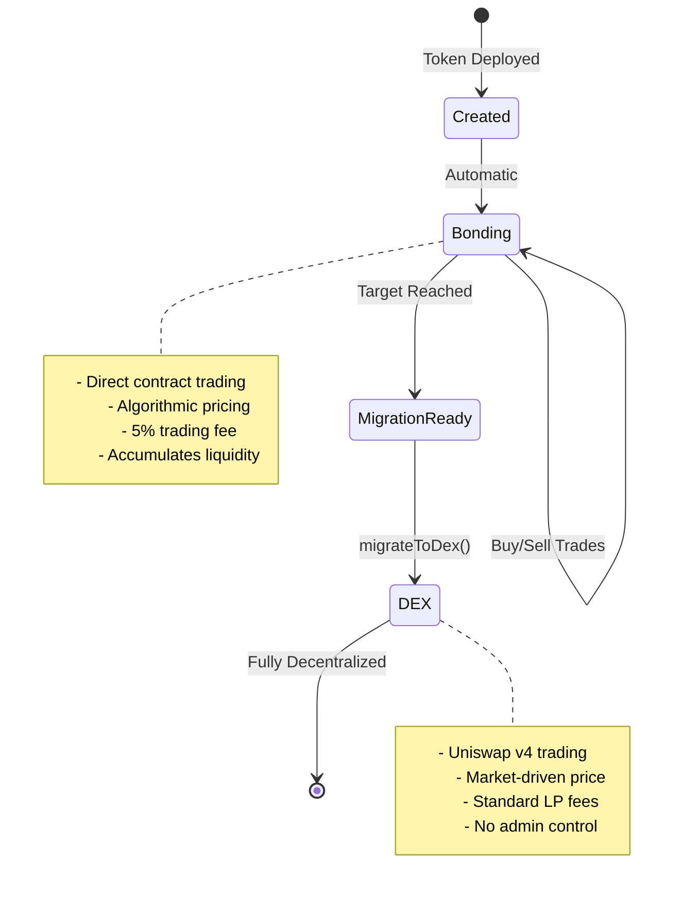
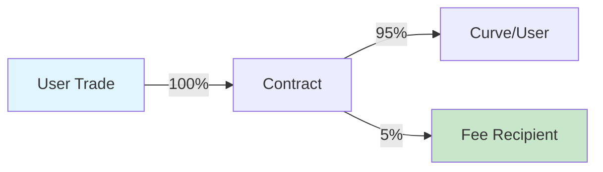

## 什么是绑定阶段？

绑定阶段是初始交易期间，代币直接通过智能合约买卖，使用算法定价曲线。可以将其视为具有自动市场制作功能的去中心化预售。



## 绑定如何工作

### 绑定曲线机制

在绑定期间，合约作为唯一的市场制造商：

1. **无订单簿**：价格通过算法确定
2. **即时流动性**：始终可以买卖
3. **路径独立性**：价格仅取决于供应量，而非历史
4. **自动定价**：无需手动设置价格

## 交易操作

### 购买代币

<Tabs>
  <Tab title="如何操作">
    **流程：**
    1. 用户向合约发送 ETH/B3
    2. 合约根据曲线计算代币数量
    3. 扣除 5% 费用并发送给接收者
    4. 铸造代币并发送给买家
    5. 更新曲线状态
    
    **代码示例：**
    ```typescript
    // 先获取报价
    const quote = await token.getAmountOfTokensToBuy(
      parseEther("1") // 1 ETH
    );
    console.log(`将收到：${formatEther(quote)} 代币`);
    
    // 执行购买并保护滑点
    const minTokens = quote * 0.95n; // 5% 滑点
    await token.buy(minTokens, "1");
    ```
  </Tab>
  
  <Tab title="参数">
    | 参数 | 类型 | 描述 |
    |-----------|------|-------------|
    | `minTokensOut` | uint256 | 接收的最少代币数量（滑点保护） |
    | `ethAmount` | string/uint256 | 花费的 ETH 数量 |
    
    **重要说明：**
    - 设置 `minTokensOut` 以防止前运行
    - 在低活动期间，`minTokensOut` 可以设为 0
    - 如果滑点超出容忍度，交易将回滚
  </Tab>
  
  <Tab title="边缘情况">
    **目标溢出：**
    - 如果购买将超出目标，超出部分将被退款
    - 示例：目标是 10 ETH，已筹集 9.5 ETH
    - 用户发送 1 ETH → 使用 0.5 ETH，退还 0.5 ETH
    
    **燃气不足：**
    - 推荐的 gas 限制：200,000
    - 复杂计算可能需要更多
    
    **零金额：**
    - 0 ETH 的交易将回滚
  </Tab>
</Tabs>

### 出售代币

<Tabs>
  <Tab title="如何操作">
    **流程：**
    1. 用户批准代币支出
    2. 用户调用 sell 并输入代币数量
    3. 合约根据曲线计算 ETH
    4. 从收益中扣除 5% 费用
    5. 将 ETH 发送给卖家，代币被销毁
    6. 更新曲线状态（价格下降）
    
    **代码示例：**
    ```typescript
    // 检查余额并获取报价
    const balance = await token.balanceOf(userAddress);
    const sellAmount = balance / 2n; // 卖出一半
    
    const quote = await token.getAmountOfEthToReceive(
      sellAmount
    );
    console.log(`将收到：${formatEther(quote)} ETH`);
    
    // 执行销售并保护滑点
    const minEth = quote * 0.95n; // 5% 滑点
    await token.sell(sellAmount, minEth);
    ```
  </Tab>
  
  <Tab title="参数">
    | 参数 | 类型 | 描述 |
    |-----------|------|-------------|
    | `tokenAmount` | uint256 | 要出售的代币数量 |
    | `minEthOut` | uint256 | 接收的最少 ETH 数量（滑点保护） |
    
    **重要说明：**
    - 出售前需要代币批准
    - 大额出售可能对价格影响显著
    - 不能出售超过流通供应量的代币
  </Tab>
  
  <Tab title="价格影响">
    **理解出售影响：**
    
    出售会减少曲线的筹集金额，导致价格下降：
    
    | 出售规模 | 价格影响 | 需要恢复 |
    |-----------|--------------|-----------------|
    | 供应量的 1% | 约 1-2% | 小 |
    | 供应量的 5% | 约 5-10% | 中等 |
    | 供应量的 10% | 约 15-25% | 显著 |
    | 供应量的 20% | 约 30-50% | 重大 |
    
    *实际影响取决于攻击性因子*
  </Tab>
</Tabs>

## 费用结构

### 费用如何工作



<AccordionGroup>
  <Accordion title="购买费用">
    **1 ETH 购买时：**
    - 0.95 ETH 去向绑定曲线
    - 0.05 ETH 去向费用接收者
    - 基于 0.95 ETH 价值计算代币
    
    **示例：**
    ```typescript
    // 用户发送 1 ETH
    // 费用：0.05 ETH
    // 曲线接收：0.95 ETH
    // 基于 0.95 ETH 铸造代币
    ```
  </Accordion>
  
  <Accordion title="出售费用">
    **出售价值 1 ETH 时：**
    - 用户收到 0.95 ETH
    - 0.05 ETH 去向费用接收者
    - 曲线减少完整的 1 ETH
    
    **示例：**
    ```typescript
    // 曲线上代币价值 1 ETH
    // 费用：0.05 ETH
    // 用户收到：0.95 ETH
    // 曲线下降 1 ETH
    ```
  </Accordion>
  
  <Accordion title="费用分配">
    **费用去向：**
    - 100% 到指定的 `feeRecipient` 地址
    - 可以是项目库、开发者或 DAO
    - 在代币创建时设置，不能更改
    
    **领取费用：**
    - 自动 - 无需领取
    - 每次交易直接发送
    - 合约中无积累
  </Accordion>
</AccordionGroup>

### 费用经济学

| 每日交易量 | 费用收入 | 每月收入 |
|-------------|------------|----------------|
| 10 ETH | 0.5 ETH | 约 15 ETH |
| 50 ETH | 2.5 ETH | 约 75 ETH |
| 100 ETH | 5 ETH | 约 150 ETH |
| 500 ETH | 25 ETH | 约 750 ETH |

## 目标机制

### 理解目标

目标是在迁移前必须累积的 ETH/B3 金额：

<Info>
  **目标的目的：**
  - 为 Uniswap v4 确保足够的流动性
  - 为社区创建明确的目标
  - 防止过早迁移
  - 在绑定期间构建动力
</Info>

### 接近目标

```typescript
// 监控目标进度
async function trackProgress(token: BondkitToken) {
  const progress = await token.getBondingProgress();
  
  if (progress.progress < 0.5) {
    console.log("🌱 早期阶段 - 最佳价格可用");
  } else if (progress.progress < 0.8) {
    console.log("🚀 动力构建中 - 考虑购买");
  } else if (progress.progress < 1.0) {
    console.log("🔥 几乎完成 - 迁移即将到来");
  } else {
    console.log("✅ 达到目标 - 准备迁移！");
  }
  
  const remaining = progress.threshold - progress.raised;
  console.log(`还需要 ${formatEther(remaining)} ETH`);
}
```

### 溢出处理

当购买将超出目标时：

1. **部分填充**：只接受所需金额
2. **自动退款**：多余的在同一交易中返回
3. **公平完成**：最后没有人可以多付

**示例情景：**
```
目标：100 ETH
当前：99.5 ETH
用户发送：2 ETH

结果：
- 接受 0.5 ETH（准确达到 100 ETH）
- 退还 1.5 ETH
- 用户获得 0.5 ETH 的代币
- 现在可进行迁移
```

## 事件与监控

### 合约事件

<Tabs>
  <Tab title="购买事件">
    ```solidity
    event BondingCurveBuy(
        address indexed payer,
        address indexed recipient,
        uint256 tradingTokenIn,
        uint256 tokensOut,
        uint256 fee,
        uint256 totalRaisedBonding
    );
    ```
    
    **在 SDK 中监听：**
    ```typescript
    token.onBuy((event) => {
      console.log({
        买家: event.payer,
        花费的 ETH: formatEther(event.tradingTokenIn),
        收到的代币: formatEther(event.tokensOut),
        支付的费用: formatEther(event.fee),
        总筹集: formatEther(event.totalRaisedBonding)
      });
    });
    ```
  </Tab>
  
  <Tab title="出售事件">
    ```solidity
    event BondingCurveSell(
        address indexed seller,
        uint256 tokensIn,
        uint256 tradingTokenOut,
        uint256 fee,
        uint256 totalRaisedBonding
    );
    ```
    
    **在 SDK 中监听：**
    ```typescript
    token.onSell((event) => {
      console.log({
        卖家: event.seller,
        出售的代币: formatEther(event.tokensIn),
        收到的 ETH: formatEther(event.tradingTokenOut),
        支付的费用: formatEther(event.fee),
        总筹集: formatEther(event.totalRaisedBonding)
      });
    });
    ```
  </Tab>
</Tabs>

### 实时监控

```typescript
// 完整的监控设置
class BondingMonitor {
  constructor(private token: BondkitToken) {}
  
  async start() {
    // 初始状态
    const progress = await this.token.getBondingProgress();
    console.log(`开始于 ${(progress.progress * 100).toFixed(2)}%`);
    
    // 监控购买
    this.token.onBuy(async (event) => {
      const newProgress = await this.token.getBondingProgress();
      console.log(`购买：${formatEther(event.tokensOut)} 代币`);
      console.log(`进度：${(newProgress.progress * 100).toFixed(2)}%`);
      
      if (newProgress.progress >= 1.0) {
        console.log("🎆 达到目标！可进行迁移。");
      }
    });
    
    // 监控出售
    this.token.onSell(async (event) => {
      const newProgress = await this.token.getBondingProgress();
      console.log(`出售：${formatEther(event.tokensIn)} 代币`);
      console.log(`进度：${(newProgress.progress * 100).toFixed(2)}%`);
    });
  }
}

// 使用
const monitor = new BondingMonitor(token);
await monitor.start();
```

## 绑定阶段策略

### 对于代币创建者

<CardGroup cols={2}>
  <Card title="构建动力" icon="chart-line">
    - 从较低的攻击性开始（30-50）
    - 设定可达成的目标
    - 早期吸引社区
    - 提供清晰的路线图
  </Card>
  
  <Card title="最大化成功" icon="trophy">
    - 自己注入初始流动性
    - 创建购买激励
    - 合理安排公告时间
    - 规划迁移后计划
  </Card>
</CardGroup>

### 对于交易者

<CardGroup cols={2}>
  <Card title="入场策略" icon="door-open">
    - 尽早购买以获得最佳价格
    - 对大额购买使用 DCA
    - 监控攻击性因子
    - 检查目标进度
  </Card>
  
  <Card title="风险管理" icon="shield">
    - 始终使用滑点保护
    - 理解价格影响
    - 靠近目标时不要 FOMO
    - 规划退出策略
  </Card>
</CardGroup>

## 绑定后过渡

<Warning>
  **迁移后的关键点**
  
  一旦调用了 `migrateToDex()`：
  - ❌ 绑定曲线交易永久禁用
  - ❌ 不再有 buy() 或 sell() 函数
  - ✅ 所有交易转移到 Uniswap v4
  - ✅ 适用标准 AMM 机制
  - ✅ 任何人都可以提供流动性
  - ✅ 完全去中心化交易
</Warning>

## 下一步

<CardGroup cols={3}>
  <Card title="定价指南" icon="tags" href="/bondkit/concepts/pricing">
    理解价格机制
  </Card>
  <Card title="目标设定" icon="bullseye" href="/bondkit/concepts/targets">
    选择正确的目标
  </Card>
  <Card title="迁移过程" icon="rocket" href="/bondkit/guides/migration">
    了解 DEX 过渡
  </Card>
</CardGroup>
