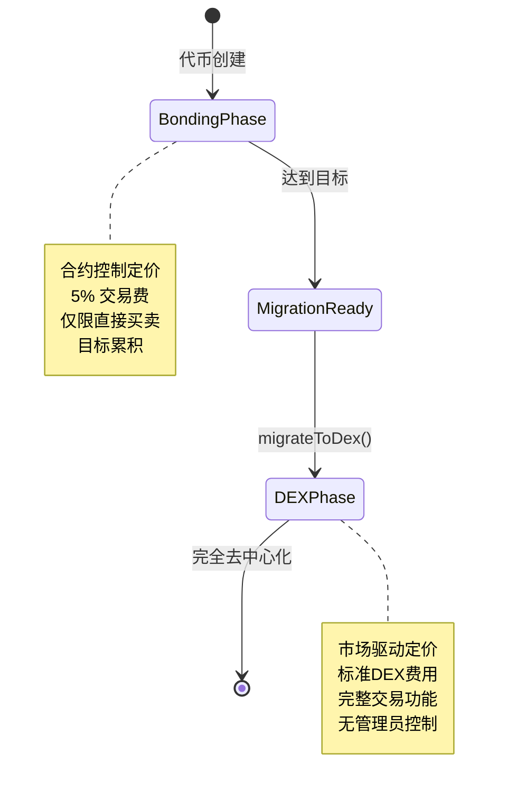

## 什么是DEX阶段？

DEX阶段是Bondkit代币生命周期的最后阶段，交易从自动化债券曲线过渡到完全去中心化的Uniswap v4池。此阶段在迁移后立即开始，代表了完全去中心化。



## 迁移工作原理

### 过渡过程

在达到目标后调用`migrateToDex()`时：

1. **合约状态**：代币状态变为`TokenStatus.Dex`
2. **Uniswap v4池**：用累积的流动性创建新池
3. **价格初始化**：从债券曲线退出价格计算初始池价格
4. **所有权放弃**：合约所有权转移到零地址
5. **交易启用**：完整DEX交易立即开始

### 池配置

**自动池设置：**
```typescript
// 池使用这些参数创建（来自迁移）
const poolConfig = {
  currency0: tradingToken < bondkitToken ? tradingToken : bondkitToken,
  currency1: tradingToken < bondkitToken ? bondkitToken : tradingToken,
  fee: 3000,        // 0.3% 标准费用
  tickSpacing: 60,  // 标准刻度间距
  hooks: customHook // Bondkit特定钩子
};
```

**初始流动性：**
- **交易代币**：债券阶段累积的所有资金
- **Bondkit代币**：计算金额以匹配退出价格
- **LP代币**：在费用接收者和被销毁/分配之间拆分

## DEX阶段交易

### 交易选项

**标准DEX交易：**
DEX阶段的Bondkit代币可以使用任何兼容Uniswap v4的界面、DEX聚合器或交易平台进行交易。

**SDK助手（可选）：**
如果需要，SDK提供`BondkitSwapService`以简化集成。

### 价格发现与流动性

**市场驱动定价：**
- 不再使用算法债券曲线
- 价格由供需决定
- 实时订单簿动态
- 受市场波动影响

**流动性来源：**
```typescript
// 迁移的初始流动性
const migrationData = {
  tradingTokenLiquidity: "10.0",    // 来自债券的ETH/B3
  bondkitTokenLiquidity: "500000",  // 计算的代币数量
  initialPrice: "0.00002",          // 每个代币的价格
  totalValueLocked: "20.0"          // 组合TVL
};

// 其他流动性来源：
// - 社区LPs
// - 激励计划  
// - 交易费累积
```

## 与债券阶段的主要区别

### 交易机制

| 方面 | 债券阶段 | DEX阶段 |
|--------|--------------|-----------|
| **定价** | 算法曲线 | 市场供需 |
| **流动性** | 无限（合约铸造） | 有限池流动性 |
| **费用** | 5% 到费用接收者 | 0.3% 到LPs + 协议 |
| **订单类型** | 仅买卖 | 完整DEX功能 |
| **价格影响** | 可预测曲线 | 取决于流动性深度 |
| **MEV** | 不适用 | 受MEV影响 |

### 智能合约变更

**状态转换：**
```typescript
// 检查当前阶段
const status = await token.getStatus();

if (status === TokenStatus.Dex) {
  // 使用DEX交易方法
  const swapService = new BondkitSwapService(tokenAddress);
  // ... DEX交易代码
} else if (status === TokenStatus.Bonding) {
  // 使用债券曲线方法
  await token.buy(amount, minTokensOut);
}
```

**方法可用性：**
- ✅ `token.buy()` / `token.sell()` - **禁用**（将回退）
- ✅ 通过`BondkitSwapService`进行DEX交易
- ✅ 标准ERC20功能继续
- ✅ DEX交易的事件监控

## 高级DEX功能

### 自定义钩子集成

Uniswap v4上的Bondkit代币包括自定义钩子以增强功能：

```typescript
// 钩子功能（自动应用）
const hookFeatures = {
  beforeSwap: "自定义费用计算",
  afterSwap: "分析跟踪", 
  beforeAddLiquidity: "LP奖励",
  afterRemoveLiquidity: "退出费用处理"
};
```

### 分析与监控

**实时数据：**
```typescript
import TradingView from "@b3dotfun/sdk/bondkit/components/TradingView";

// 带有DEX数据的专业图表
function DEXTradingInterface({ tokenAddress, tokenSymbol }) {
  return (
    <div className="space-y-6">
      {/* 带有DEX数据的价格图 */}
      <TradingView 
        tokenAddress={tokenAddress}
        tokenSymbol={tokenSymbol}
        className="h-96 w-full"
      />
      
      {/* 交易界面 */}
      <SwapInterface tokenAddress={tokenAddress} />
    </div>
  );
}
```

**可用指标：**
- 实时价格源
- 24小时成交量和变化  
- 流动性深度
- 历史OHLCV数据
- 交易历史
- 持有者分析

### 提供流动性

**成为LP：**
```typescript
// 向Bondkit代币池添加流动性
import { Pool, Position } from "@uniswap/v3-sdk";

const position = new Position({
  pool: bondkitPool,
  liquidity: targetLiquidity,
  tickLower: lowerTick,
  tickUpper: upperTick
});

// 赚取交易费用+潜在激励
```

**LP好处：**
- **交易费用**：赚取所有交换量的0.3%
- **激励计划**：潜在额外奖励
- **价格升值**：从代币增长中获益
- **无常损失**：标准AMM风险适用

## 迁移影响分析

### 对代币持有者

**即时效果：**
- ✅ 代币保持完全可转移
- ✅ 可在公开市场交易
- ✅ 无锁定期
- ⚠️ 价格现受市场波动影响
- ⚠️ 无保证流动性（取决于池深度）

**长期好处：**
- 🚀 访问更大的交易生态系统
- 🚀 与DeFi协议集成
- 🚀 与其他代币的可组合性
- 🚀 实现真正去中心化

### 对项目

**运营变化：**
```typescript
// 迁移前：直接控制
await token.buy(amount, minOut);    // ✅ 可行
await token.migrateToDex();         // 一次性操作

// 迁移后：基于市场
await token.buy(amount, minOut);    // ❌ 回退
await swapService.executeSwap(...); // ✅ 改用此方法
```

**新责任：**
- **社区建设**：推动有机交易量
- **流动性激励**：鼓励LP参与  
- **营销**：推广代币效用和采用
- **集成**：在DEX聚合器和平台上列出

## DEX阶段最佳实践

### 对交易者

<AccordionGroup>
  <Accordion title="最佳交易策略">
    **滑点管理：**
    - 对小额交易使用0.5-2%滑点
    - 大额交易使用更高滑点
    - 执行前检查价格影响
    
    **时间考虑：**
    - 活跃时间段流动性更高
    - 监控大型LP动向
    - 可用时使用限价单
    
    **示例：**
    ```typescript
    const quote = await swapService.getSwapQuote({
      // ... 参数
      slippageTolerance: parseFloat(quote.priceImpact) > 5 ? 0.02 : 0.005
    });
    ```
  </Accordion>
  
  <Accordion title="风险管理">
    **流动性分析：**
    - 大额交易前检查池TVL
    - 监控流动性提供者活动
    - 如果是LP，了解无常损失
    
    **价格监控：**
    - 设置价格提醒
    - 使用止损策略
    - 在多个代币间多样化
  </Accordion>
</AccordionGroup>

### 对开发者

<AccordionGroup>
  <Accordion title="集成模式">
    **状态检查：**
    ```typescript
    async function getOptimalTradingMethod(token: BondkitToken) {
      const status = await token.getStatus();
      
      if (status === TokenStatus.Bonding) {
        return {
          method: "bonding",
          interface: token
        };
      } else if (status === TokenStatus.Dex) {
        return {
          method: "dex", 
          interface: new BondkitSwapService(token.contractAddress)
        };
      }
    }
    ```
    
    **错误处理：**
    ```typescript
    try {
      // 总是先检查阶段
      const tradingMethod = await getOptimalTradingMethod(token);
      
      if (tradingMethod.method === "dex") {
        await tradingMethod.interface.executeSwap(params, wallet);
      }
    } catch (error) {
      if (error.message.includes("TradingDisabledDexPhaseActive")) {
        // 切换到DEX交易
        const swapService = new BondkitSwapService(tokenAddress);
        await swapService.executeSwap(params, wallet);
      }
    }
    ```
  </Accordion>
</AccordionGroup>

## 常见问题

<AccordionGroup>
  <Accordion title="代币能回到债券阶段吗？">
    **不可以** - 迁移是永久性且不可逆的。一旦进入DEX阶段，代币将始终在Uniswap v4上交易。
  </Accordion>
  
  <Accordion title="未使用的债券曲线流动性会怎样？">
    来自债券阶段的所有累积交易代币成为Uniswap v4池的初始流动性，与以退出价格计算的bondkit代币配对。
  </Accordion>
  
  <Accordion title="DEX阶段有限制吗？">
    没有限制 - 代币成为在Uniswap v4上交易的标准ERC20。完全启用DeFi可组合性。
  </Accordion>
  
  <Accordion title="交易费如何不同？">
    DEX阶段使用标准Uniswap v4费用（0.3%），这些费用归流动性提供者所有，而不是债券阶段的5%费用归费用接收者所有。
  </Accordion>
</AccordionGroup>

## 下一步

<CardGroup cols={2}>
  <Card title="开始DEX交易" icon="arrow-right" href="/bondkit/sdk/reference#bondkitswapservice">
    学习使用BondkitSwapService进行DEX交易
  </Card>
  <Card title="添加交易图表" icon="chart-line" href="/bondkit/sdk/reference#tradingview-component">  
    为您的DEX代币集成TradingView图表
  </Card>
  <Card title="成为LP" icon="coins" href="https://app.uniswap.org">
    提供流动性并赚取交易费
  </Card>
  <Card title="监控分析" icon="analytics" href="https://info.uniswap.org">
    跟踪您的代币DEX表现  
  </Card>
</CardGroup>
