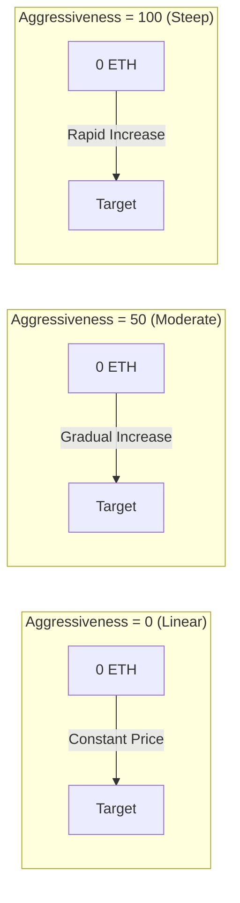

## 视觉价格曲线



## 债券曲线模型

### 数学公式

<Note>
  **核心公式**
  ```
  S = S_final × (R / R_target)^exponent
  ```
  其中：
  - `S` = 当前代币供应量
  - `S_final` = 最终代币供应量
  - `R` = 到目前为止筹集的金额
  - `R_target` = 目标金额
  - `exponent = 1 / (1 + aggressivenessFactor/100)`
</Note>

### 理解指数

侵略性因子控制指数如何影响价格进展：

| 侵略性 | 指数 | 公式变为 | 价格行为 |
|-------|------|---------|----------|
| 0 | 1.00 | S = S_final × (R/R_target) | 线性 - 每 ETH 常量代币 |
| 25 | 0.80 | S = S_final × (R/R_target)^0.80 | 稍微弯曲 |
| 50 | 0.67 | S = S_final × (R/R_target)^0.67 | 中等曲线 |
| 75 | 0.57 | S = S_final × (R/R_target)^0.57 | 陡峭曲线 |
| 100 | 0.50 | S = S_final × √(R/R_target) | 非常陡峭（平方根） |

### 价格影响示例

让我们看看不同阶段 1 ETH 能买多少代币，目标为 10 ETH：

<Tabs>
  <Tab title="Aggressiveness = 0">
    **线性定价（对所有人公平）**
    
    | ETH 筹集 | 每 ETH 代币 | 价格变化 |
    |----------|------------|----------|
    | 0 → 1 ETH | 100,000 | 基线 |
    | 4 → 5 ETH | 100,000 | 0% |
    | 9 → 10 ETH | 100,000 | 0% |
    
    *每个人都得到相同的交易*
  </Tab>
  
  <Tab title="Aggressiveness = 50">
    **中等曲线（平衡）**
    
    | ETH 筹集 | 每 ETH 代币 | 价格变化 |
    |----------|------------|----------|
    | 0 → 1 ETH | 146,000 | 基线 |
    | 4 → 5 ETH | 87,000 | -40% |
    | 9 → 10 ETH | 51,000 | -65% |
    
    *早期买家获得的是晚期买家的 3 倍*
  </Tab>
  
  <Tab title="Aggressiveness = 100">
    **陡峭曲线（奖励早期）**
    
    | ETH 筹集 | 每 ETH 代币 | 价格变化 |
    |----------|------------|----------|
    | 0 → 1 ETH | 316,000 | 基线 |
    | 4 → 5 ETH | 89,000 | -72% |
    | 9 → 10 ETH | 31,000 | -90% |
    
    *早期买家获得的是晚期买家的 10 倍*
  </Tab>
</Tabs>

## 交互式价格计算器

```typescript
// Calculate tokens received for a given ETH amount
function calculateTokensReceived(
  ethAmount: number,
  currentRaised: number,
  targetEth: number,
  totalSupply: number,
  aggressiveness: number
): number {
  const exponent = 1 / (1 + aggressiveness / 100);
  
  // Calculate supply at current raised
  const currentSupply = totalSupply * 
    Math.pow(currentRaised / targetEth, exponent);
  
  // Calculate supply after purchase
  const newRaised = currentRaised + ethAmount;
  const newSupply = totalSupply * 
    Math.pow(newRaised / targetEth, exponent);
  
  // Tokens received = difference in supply
  return newSupply - currentSupply;
}

// Example usage
const tokens = calculateTokensReceived(
  1,        // 1 ETH purchase
  5,        // 5 ETH already raised
  10,       // 10 ETH target
  1000000,  // 1M total supply
  50        // 50% aggressiveness
);
console.log(`You'll receive ${tokens.toFixed(0)} tokens`);
```

## 选择您的侵略性因子

### 决策框架

<CardGroup cols={3}>
  <Card title="Low (0-30)" icon="equals">
    **最适合：**
    - 公平启动
    - 社区代币
    - 稳定定价
    
    **优点：**
    - 平等机会
    - 可预测的成本
    - 较少的 FOMO
    
    **缺点：**
    - 没有早期激励
    - 动力较慢
  </Card>
  
  <Card title="Medium (30-70)" icon="chart-line">
    **最适合：**
    - 大多数项目
    - 平衡方法
    - 适度奖励
    
    **优点：**
    - 一些早期优势
    - 仍然可访问
    - 良好的动力
    
    **缺点：**
    - 中等复杂性
    - 一些价格变化
  </Card>
  
  <Card title="High (70-100)" icon="rocket">
    **最适合：**
    - 炒作启动
    - 奖励早期采用者
    - 快速筹资
    
    **优点：**
    - 强烈的早期激励
    - 创造紧迫感
    - 奖励信仰者
    
    **缺点：**
    - 可能看起来不公平
    - 高价格变化
    - FOMO 驱动
  </Card>
</CardGroup>

## 出售机制

当用户将代币卖回曲线时：

1. **价格计算**：使用购买公式的逆
2. **费用扣除**：对收益应用 5% 的费用
3. **曲线更新**：减少总筹集金额
4. **价格影响**：大量卖出显著影响价格

### 卖出价格公式

```typescript
// Calculate ETH received for selling tokens
function calculateEthReceived(
  tokenAmount: number,
  currentSupply: number,
  currentRaised: number,
  targetEth: number,
  totalSupply: number,
  aggressiveness: number
): number {
  const exponent = 1 / (1 + aggressiveness / 100);
  
  // Calculate new supply after sell
  const newSupply = currentSupply - tokenAmount;
  
  // Calculate corresponding raised amount
  const supplyRatio = newSupply / totalSupply;
  const newRaised = targetEth * 
    Math.pow(supplyRatio, 1 / exponent);
  
  // ETH received (before fees)
  const ethBeforeFees = currentRaised - newRaised;
  
  // Apply 5% fee
  return ethBeforeFees * 0.95;
}
```

## 边缘情况与限制

<Warning>
  **重要考虑因素：**
  
  1. **退款**：如果购买超过目标，多余的 ETH 将被退还
  2. **最小金额**：非常小的交易可能因四舍五入而回退
  3. **最大供应量**：不能超过 `finalTokenSupply`
  4. **价格限制**：极端侵略性可能导致价格飙升
  5. **滑点**：总是使用 `minTokensOut` 以获得保护
</Warning>

## 真实世界示例

### 案例研究：公平启动代币
- **侵略性**：10
- **目标**：50 ETH
- **结果**：几乎线性定价，社区赞赏公平性

### 案例研究：炒作代币
- **侵略性**：85
- **目标**：100 ETH
- **结果**：2 小时内达到目标，早期买家获得 8 倍收益

### 案例研究：平衡项目
- **侵略性**：45
- **目标**：25 ETH
- **结果**：3 天内稳定增长，早期买家获得 2.5 倍优势

## 下一步

<CardGroup cols={2}>
  <Card title="Set Aggressiveness" icon="sliders" href="/bondkit/guides/set-aggressiveness">
    学习选择正确的因子
  </Card>
  <Card title="Price Estimation" icon="calculator" href="/bondkit/guides/est-migration-price">
    估算您的迁移价格
  </Card>
</CardGroup>

