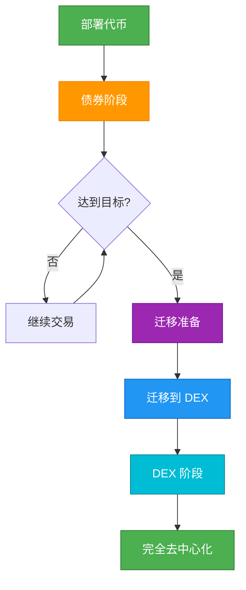

## 概览

本指南将引导您完成 Bondkit 代币的完整生命周期，从初始创建到完全去中心化。理解这一流程对于成功的代币发行和管理至关重要。



## 阶段 1：代币创建

### 预部署规划

<AccordionGroup>
  <Accordion title="选择您的参数">
    **关键决策:**
    
    | 参数 | 影响 | 建议 |
    |-----------|---------|----------------|
    | **finalTokenSupply** | 总共创建的代币数量 | 通常为 1M-100M 代币 |
    | **aggressivenessFactor** | 价格曲线陡度 | 30-60 适用于平衡发行 |
    | **targetAmount** | 迁移阈值 | 5-50 交易代币 |
    | **tradingToken** | 用户支付所用的代币 | 使用 B3 用于 Base 主网 |
    
    **示例配置:**
    ```typescript
    const tokenConfig = {
      name: "MyToken",
      symbol: "MTK",
      finalTokenSupply: parseEther("10000000"), // 10M 代币
      aggressivenessFactor: 45, // 中等曲线
      targetAmount: parseEther("20"), // 20 B3 代币
      tradingToken: "0xB3B32F9f8827D4634fE7d973Fa1034Ec9fdDB3B3"
    };
    ```
  </Accordion>
  
  <Accordion title="设置费用结构">
    **费用分配策略:**
    
    ```typescript
    const feeConfig = {
      feeRecipient: "0x...", // 您的财务/团队地址
      lpSplitRatioFeeRecipientBps: 2000n, // 20% 给费用接收者
      // 剩余 80% 在迁移后成为 LP 代币
    };
    ```
    
    **费用流程:**
    - **债券阶段**: 所有交易的 5% → `feeRecipient`
    - **迁移后**: 0.3% 交易费 → LP 提供者
  </Accordion>
</AccordionGroup>

### 部署执行

```typescript
import { BondkitTokenFactory } from "@b3dotfun/sdk/bondkit";
import { base } from "viem/chains";

// 1. 初始化工厂
const factory = new BondkitTokenFactory(
  base.id,
  process.env.WALLET_PRIVATE_KEY
);

// 2. 使用完整配置进行部署
const tokenAddress = await factory.deployBondkitToken({
  // 代币元数据
  name: "MyToken",
  symbol: "MTK",
  
  // 经济学
  finalTokenSupply: parseEther("10000000"),
  aggressivenessFactor: 45,
  targetAmount: parseEther("20"),
  
  // 费用结构  
  feeRecipient: process.env.TREASURY_ADDRESS,
  lpSplitRatioFeeRecipientBps: 2000n,
  
  // 管理员 & 迁移
  migrationAdminAddress: process.env.ADMIN_ADDRESS,
  
  // Uniswap V4 配置
  bondingPhaseSplitter: "0x2AB69e0d9D20D3700466153D84a6574128154Fd2",
  v4PoolManager: "0x498581fF718922c3f8e6A244956aF099B2652b2b",
  v4Hook: "0xB36f4A2FB18b745ef8eD31452781a463d2B3f0cC",
  v4PoolFee: 3000,
  v4TickSpacing: 60,
  tradingToken: "0xB3B32F9f8827D4634fE7d973Fa1034Ec9fdDB3B3"
});

console.log(`✅ 代币部署成功: ${tokenAddress}`);
```

## 阶段 2：债券阶段管理

### 发行策略

<Tabs>
  <Tab title="社区建设">
    **发行前清单:**
    - [ ] 在 Basescan 上验证代币合约
    - [ ] 建立社区渠道（Discord/Telegram）  
    - [ ] 准备营销材料
    - [ ] 规划初始购买策略
    - [ ] 准备价格跟踪仪表板
    
    **发行日:**
    ```typescript
    // 连接到您的代币
    const token = new BondkitToken(tokenAddress, privateKey);
    
    // 初始购买以确定价格
    await token.buy(parseEther("1"), 0n); // 1 B3 代币
    
    // 使用真实数据宣布发行
    const price = await token.getCurrentPrice();
    const progress = await token.getBondingProgress();
    
    console.log(`🚀 现已上线，每个代币价格 ${formatEther(price)} B3`);
    console.log(`🎯 达到迁移的 ${(progress.progress * 100).toFixed(1)}%`);
    ```
  </Tab>
  
  <Tab title="进度监控">
    **关键指标仪表板:**
    ```typescript
    async function getDashboardData(token) {
      const [
        tokenDetails,
        currentPrice, 
        progress,
        totalSupply,
        status
      ] = await Promise.all([
        token.getTokenDetails(),
        token.getCurrentPrice(),
        token.getBondingProgress(), 
        token.getTotalSupply(),
        token.currentStatus()
      ]);
      
      return {
        // 代币信息
        name: tokenDetails.name,
        symbol: tokenDetails.symbol,
        
        // 经济学
        currentPrice: formatEther(currentPrice),
        progress: (progress.progress * 100).toFixed(2) + '%',
        raised: formatEther(progress.raised),
        target: formatEther(progress.threshold),
        remaining: formatEther(progress.threshold - progress.raised),
        
        // 供应
        circulatingSupply: formatEther(totalSupply),
        
        // 状态
        phase: status === 1 ? '债券' : status === 2 ? 'DEX' : '其他'
      };
    }
    
    // 在您的仪表板中使用
    const data = await getDashboardData(token);
    ```
  </Tab>
  
  <Tab title="社区参与">
    **实时更新:**
    ```typescript
    // 设置事件监控以进行社区更新
    token.onBuy((event) => {
      const announcement = `
        🟢 新购买: ${formatEther(event.tokensOut)} ${symbol}
        💰 花费: ${formatEther(event.ethIn)} B3
        👤 买家: ${event.buyer}
      `;
      
      // 发布到 Discord/Telegram 机器人
      postToDiscord(announcement);
    });
    
    token.onSell((event) => {
      const announcement = `
        🔴 出售: ${formatEther(event.tokensIn)} ${symbol}
        💰 收到: ${formatEther(event.ethOut)} B3  
        👤 卖家: ${event.seller}
      `;
      
      postToDiscord(announcement);
    });
    
    // 进度里程碑
    const progress = await token.getBondingProgress();
    if (progress.progress >= 0.5 && progress.progress < 0.6) {
      postToDiscord("🎯 已筹资 50%！迁移还有一半！");
    } else if (progress.progress >= 0.9) {
      postToDiscord("🔥 已筹资 90%！迁移即将到来！");
    }
    ```
  </Tab>
</Tabs>

### 管理债券曲线

**健康债券阶段指标:**
- 稳定的交易量
- 不断增长的持有者基础  
- 活跃的社区参与
- 朝向目标进展（但不要太快）
- 最小化的大规模抛售

**警告信号:**
- 24 小时内无交易活动
- 单一鲸鱼控制大比例
- 社区没有快速达到目标
- 机器人导致的过度波动

## 阶段 3：迁移准备

### 迁移前清单

```typescript
async function checkMigrationReadiness(token) {
  const [canMigrate, progress, status] = await Promise.all([
    token.canMigrate(),
    token.getBondingProgress(),
    token.currentStatus()
  ]);
  
  const checks = {
    targetReached: canMigrate,
    progressComplete: progress.progress >= 1.0,
    stillBondingPhase: status === 1,
    communityReady: await checkCommunityConsensus(), // 您的逻辑
    liquidityPlan: await checkPostMigrationPlan()     // 您的逻辑
  };
  
  const allReady = Object.values(checks).every(Boolean);
  
  return {
    ready: allReady,
    checks,
    recommendation: allReady ? 
      "✅ 准备迁移！" : 
      "⏳ 在迁移前解决问题"
  };
}
```

### 迁移时机策略

<AccordionGroup>
  <Accordion title="最佳时机">
    **最佳实践:**
    - 提前 24-48 小时宣布迁移
    - 选择您的社区活跃时间
    - 确保有足够的社区共识
    - 准备迁移后的营销
    
    **迁移前公告:**
    ```typescript
    const migrationData = await token.getMigrationData();
    
    const announcement = `
      🚀 迁移已安排
      
      📊 最终债券统计:
      • 筹集: ${formatEther(progress.raised)} B3
      • 分发代币: ${formatEther(totalSupply)}
      
      🔄 迁移将创建:
      • 初始 LP: ${formatEther(migrationData.ethForLp)} B3 + 代币
      • 开盘价格: ~${calculateOpeningPrice(migrationData)} B3/代币
      
      ⏰ 24 小时后迁移！
    `;
    ```
  </Accordion>
  
  <Accordion title="迁移执行">
    **迁移过程:**
    ```typescript
    // 最终检查
    const readiness = await checkMigrationReadiness(token);
    if (!readiness.ready) {
      throw new Error(`未准备好: ${JSON.stringify(readiness.checks)}`);
    }
    
    // 执行迁移
    console.log("🔄 开始迁移到 Uniswap V4...");
    const migrationTx = await token.migrateToDex();
    
    // 等待确认
    const receipt = await token.waitForTransaction(migrationTx);
    
    if (receipt.status === 'success') {
      console.log("✅ 迁移成功！");
      
      // 验证新状态
      const newStatus = await token.currentStatus();
      console.log(`状态: ${newStatus === 2 ? 'DEX 阶段' : '未知'}`);
      
      // 向社区宣布
      const announcement = `
        🎉 迁移完成！
        
        📍 现在在 Uniswap V4 上交易
        🔗 交易: ${migrationTx}
        💫 代币现在完全去中心化！
      `;
      
      postToDiscord(announcement);
    }
    ```
  </Accordion>
</AccordionGroup>

## 阶段 4：DEX 阶段操作

### 迁移后立即（首 24 小时）

```typescript
// 初始化 DEX 交易工具
import { BondkitSwapService } from "@b3dotfun/sdk/bondkit";

const swapService = new BondkitSwapService(tokenAddress);

// 验证 DEX 功能
const isSwapAvailable = await token.isSwapAvailable();
if (isSwapAvailable) {
  console.log("✅ DEX 交易活跃");
  
  // 测试交换报价
  const quote = await swapService.getSwapQuote({
    tokenIn: "0xB3B32F9f8827D4634fE7d973Fa1034Ec9fdDB3B3",
    tokenOut: tokenAddress,
    amountIn: "1",
    tokenInDecimals: 18,
    tokenOutDecimals: 18,
    slippageTolerance: 0.005,
    recipient: testAddress
  });
  
  console.log(`DEX 价格: ${quote.executionPrice} B3 每代币`);
}
```

### 长期 DEX 策略

<Tabs>
  <Tab title="流动性管理">
    **初始流动性分析:**
    ```typescript
    async function analyzeLiquidity() {
      // 获取池信息（实现取决于您的设置）
      const poolData = await getUniswapV4PoolData(tokenAddress);
      
      return {
        totalValueLocked: poolData.tvl,
        tradingVolume24h: poolData.volume24h,
        priceImpactFor1k: await calculatePriceImpact(1000),
        liquidityUtilization: poolData.utilization,
        
        recommendations: {
          needsMoreLiquidity: poolData.tvl < minimumTVL,
          shouldIncentivize: poolData.utilization > 0.8,
          healthyTrading: poolData.volume24h > minimumVolume
        }
      };
    }
    ```
    
    **流动性激励计划:**
    ```typescript
    // 示例 LP 奖励结构
    const lpIncentives = {
      rewardToken: tokenAddress,
      dailyRewards: parseEther("1000"), // 每天 1000 代币
      minimumLPTime: 7 * 24 * 3600, // 最少 7 天
      bonusMultipliers: {
        week1: 2.0,  // 第一周 2x 奖励
        month1: 1.5, // 第一个月 1.5x 奖励
        longTerm: 1.0 // 之后标准奖励
      }
    };
    ```
  </Tab>
  
  <Tab title="社区过渡">
    **教育内容:**
    ```typescript
    const migrationGuideForUsers = {
      trading: {
        before: "使用 token.buy() 和 token.sell()",
        after: "使用 DEX 接口或 swapService.executeSwap()",
        walletSetup: "将代币添加到 MetaMask，使用 Uniswap 接口"
      },
      
      benefits: {
        moreFeatures: "限价单，高级交易工具",
        composability: "与其他 DeFi 协议一起使用", 
        decentralization: "没有剩余的管理员控制"
      },
      
      risks: {
        priceVolatility: "市场驱动定价，可能波动",
        liquidityRisk: "大额交易可能有价格影响",
        smartContractRisk: "标准 DeFi 风险适用"
      }
    };
    ```
    
    **社区资源:**
    - 更新的文档
    - 交易教程视频  
    - DEX 接口集成指南
    - 提供流动性教程
  </Tab>
  
  <Tab title="监控与分析">
    **DEX 阶段仪表板:**
    ```typescript
    async function getDEXPhaseMetrics(tokenAddress) {
      return {
        // 价格 & 交易量
        currentPrice: await getCurrentDEXPrice(tokenAddress),
        volume24h: await get24hVolume(tokenAddress),
        priceChange24h: await getPriceChange24h(tokenAddress),
        
        // 流动性
        totalLiquidity: await getTotalLiquidity(tokenAddress),
        lpTokenHolders: await getLPHolderCount(tokenAddress),
        
        // 交易
        transactions24h: await getTransactionCount24h(tokenAddress),
        uniqueTraders24h: await getUniqueTraders24h(tokenAddress),
        avgTradeSize: await getAvgTradeSize(tokenAddress),
        
        // 健康指标
        liquidityUtilization: await getLiquidity
