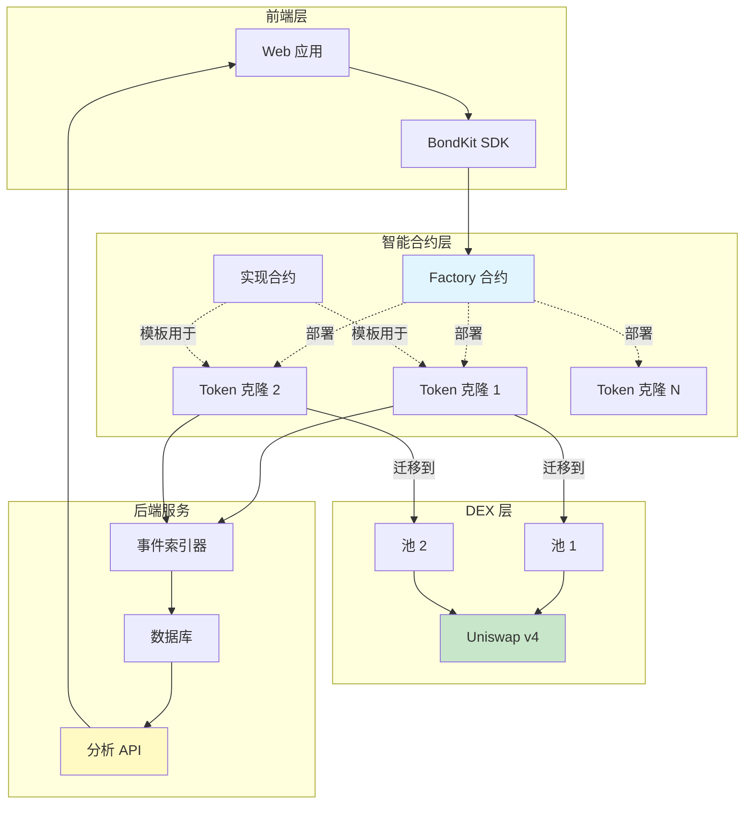

## 架构概览



## 产品流程详解

<Steps>
  <Step title="阶段 1: 代币创建">
    **发生了什么:**
    - 用户在 Factory 合约上调用 `deployBondkitToken()`
    - Factory 使用最小代理模式克隆实现合约
    - 新代币使用自定义参数进行初始化
    - 代币自动进入债券阶段
    
    **Gas 成本:** ~200,000 gas（比完全部署便宜 90%）
    **时间:** ~15 秒
  </Step>
  
  <Step title="阶段 2: 债券曲线交易">
    **发生了什么:**
    - 用户直接从合约买卖代币
    - 价格遵循算法债券曲线：`S = S_final × (R/R_target)^exponent`
    - 所有交易收取 5% 费用给费用接收者
    - 合约积累报价资产（ETH/B3）达到目标
    - 后端索引所有交易以进行分析
    
    **交易机制:**
    - 买入：发送 ETH/B3，按当前曲线价格接收代币
    - 卖出：发送代币，接收 ETH/B3 减去费用
    - 如果购买将超过目标则自动退款
    
    **持续时间:** 直到达到目标（几小时到几周）
  </Step>
  
  <Step title="阶段 3: DEX 迁移">
    **发生了什么:**
    - 目标达成时，管理员调用 `migrateToDex()`
    - 合约计算公平市场价格为 `sqrtPriceX96`
    - 创建并初始化 Uniswap v4 池
    - 将累积的流动性转移到池中
    - 放弃所有权到零地址
    - 代币成为标准 ERC20，具有 DEX 交易功能
    
    **迁移后:**
    - 债券曲线永久禁用
    - 所有交易通过 Uniswap v4 进行
    - 不再有管理员控制
    - 实现完全去中心化
    
    **Gas 成本:** ~500,000 gas
    **时间:** ~30 秒
  </Step>
</Steps>

## 系统组件

### 智能合约

<AccordionGroup>
  <Accordion title="🏭 Factory 合约">
    **目的:** 高效部署新的债券代币
    
    **关键功能:**
    - `deployBondkitToken()` - 创建新的代币克隆
    - `getImplementationAddress()` - 返回模板地址
    - `setAllowedQuoteAsset()` - 管理员功能，用于白名单资产
    
    **Gas 优化:**
    - 使用 EIP-1167 最小代理模式
    - 在所有代币间共享逻辑
    - 与个别部署相比节省约 90% 的 gas
  </Accordion>
  
  <Accordion title="📜 实现合约">
    **目的:** 所有债券代币的模板
    
    **核心特性:**
    - 遵循 ERC20 标准
    - 债券曲线数学
    - 迁移到 Uniswap v4 的逻辑
    - 费用分配系统
    
    **状态转换:**
    1. 未初始化 → 债券阶段
    2. 债券阶段 → 迁移就绪
    3. 迁移就绪 → DEX 阶段
  </Accordion>
  
  <Accordion title="🪙 代币克隆">
    **目的:** 各个代币实例
    
    **生命周期:**
    - 通过工厂创建
    - 使用唯一参数进行初始化
    - 管理自己的债券曲线
    - 自行迁移到 Uniswap v4
    
    **存储:**
    - 代币元数据（名称，符号）
    - 供应和分配
    - 债券曲线状态
    - 迁移参数
  </Accordion>
</AccordionGroup>

### 后端服务

<AccordionGroup>
  <Accordion title="🔍 事件索引器">
    **目的:** 捕获所有链上活动
    
    **监控:**
    - 代币创建
    - 买卖交易
    - 迁移事件
    - 转账活动
    
    **技术:**
    - 实时区块链扫描
    - 事件日志处理
    - 数据库同步
  </Accordion>
  
  <Accordion title="📊 分析引擎">
    **目的:** 将原始数据处理成洞察力
    
    **生成:**
    - OHLCV 蜡烛图数据
    - 交易量指标
    - 流动性跟踪
    - 价格历史
    - 用户统计
    
    **更新:** 每个区块（约 2 秒）
  </Accordion>
  
  <Accordion title="🌐 REST API">
    **目的:** 向前端提供数据
    
    **端点:**
    - `/tokens` - 列出所有代币
    - `/tokens/{address}` - 代币详情
    - `/tokens/{address}/transactions` - 交易历史
    - `/tokens/{address}/ohlcv` - 图表数据
    - `/users/{address}/portfolio` - 用户持有
    
    **格式:** 带分页的 JSON
  </Accordion>
</AccordionGroup>

### 用户角色

| 角色 | 责任 | 权限 |
|------|-----|------|
| **创建者** | 部署代币，设置参数，启动迁移 | 迁移前完全控制 |
| **交易者** | 在债券期间买卖，DEX 上交易 | 标准交易权利 |
| **费用接收者** | 接收交易费用 | 仅被动收入 |
| **迁移管理员** | 准备就绪时执行迁移 | 一次性迁移权利 |
| **LP 提供者** | （迁移后）向 Uniswap 添加流动性 | 标准 LP 权利 |

## 技术深入

### 债券曲线数学

债券曲线根据供应确定代币价格：

```
价格公式:
S = S_final × (R / R_target)^exponent

其中:
- S = 当前代币供应
- S_final = 最终代币供应
- R = 筹集金额 (ETH/B3)
- R_target = 目标金额
- exponent = 1 / (1 + aggressivenessFactor/100)
```

**示例计算:**

| 激进性 | 指数 | 价格行为 |
|-------|------|---------|
| 0 | 1.00 | 线性（恒定价格） |
| 25 | 0.80 | 温和曲线 |
| 50 | 0.67 | 中等曲线 |
| 75 | 0.57 | 陡峭曲线 |
| 100 | 0.50 | 非常陡峭（平方根） |

### 迁移价格计算

迁移到 Uniswap v4 时，合约：

1. **从债券曲线计算退出价格**
2. **转换为 sqrtPriceX96 格式:**
   ```
   sqrtPriceX96 = sqrt(price) × 2^96
   ```
3. **用此价格初始化池**
4. **使用累积资金添加流动性**

### Gas 优化技术

<Info>
  **最小代理模式 (EIP-1167)**
  
  代替为每个代币部署完整合约代码：
  - 部署一个实现合约 (600KB)
  - 部署微小的代理合约 (45 字节每个)
  - 代理将所有调用委托给实现
  - 结果：每次部署节省 90% 的 gas
</Info>

## 配置参数

### 代币创建参数

| 参数 | 类型 | 范围/格式 | 影响 |
|------|------|-----------|------|
| `name` | string | 1-50 字符 | 代币显示名称 |
| `symbol` | string | 2-10 字符 | 交易符号 |
| `finalTokenSupply` | uint256 | > 0 | 可铸造总代币 |
| `aggressivenessFactor` | uint8 | 0-100 | 曲线陡峭度 |
| `targetEth` | uint256 | > 0 | 迁移阈值 |
| `feeRecipient` | address | 有效地址 | 接收费用 |
| `lpSplitRatioFeeRecipientBps` | uint256 | 0-10000 | LP 费用份额（基点） |
| `migrationAdminAddress` | address | 有效地址 | 可触发迁移 |

### 运行时参数

| 操作 | 参数 | 验证 |
|------|------|------|
| 买入 | `minTokensOut`, `ethAmount` | 滑点保护 |
| 卖出 | `tokenAmount`, `minEthOut` | 余额检查，滑点 |
| 迁移 | 无 | 达到目标，仅管理员 |

### 系统常量

| 常量 | 值 | 描述 |
|------|----|------|
| 交易费 | 5% | 应用于所有交易 |
| 小数位 | 18 | 标准 ERC20 小数位 |
| 最小目标 | 0.1 ETH | 最小可行目标 |
| 最大激进性 | 100 | 最大曲线因子 |

## 安全考虑

<Warning>
  **重要安全特性:**
  
  1. **所有权放弃**: 迁移后自动进行
  2. **无铸币功能**: 创建时固定供应
  3. **不可变参数**: 部署后不能更改
  4. **审计合约**: 专业审查代码
  5. **无管理员后门**: 真正的去中心化
  6. **滑点保护**: 内置于买卖功能
  7. **溢出保护**: 整个过程安全数学
</Warning>

## 失败场景及处理

| 场景 | 系统响应 |
|------|---------|
| 购买超过目标 | 部分填充，退还多余 |
| 卖出流动性不足 | 交易回滚 |
| 目标前迁移 | 交易回滚 |
| 非管理员尝试迁移 | 交易回滚 |
| 重复迁移尝试 | 交易回滚 |
| 零地址操作 | 交易回滚 |

## 下一步

<CardGroup cols={2}>
  <Card title="定价机制" icon="chart-line" href="/bondkit/concepts/pricing">
    了解债券曲线数学
  </Card>
  <Card title="迁移指南" icon="rocket" href="/bondkit/guides/migration">
    学习迁移过程
  </Card>
</CardGroup>
