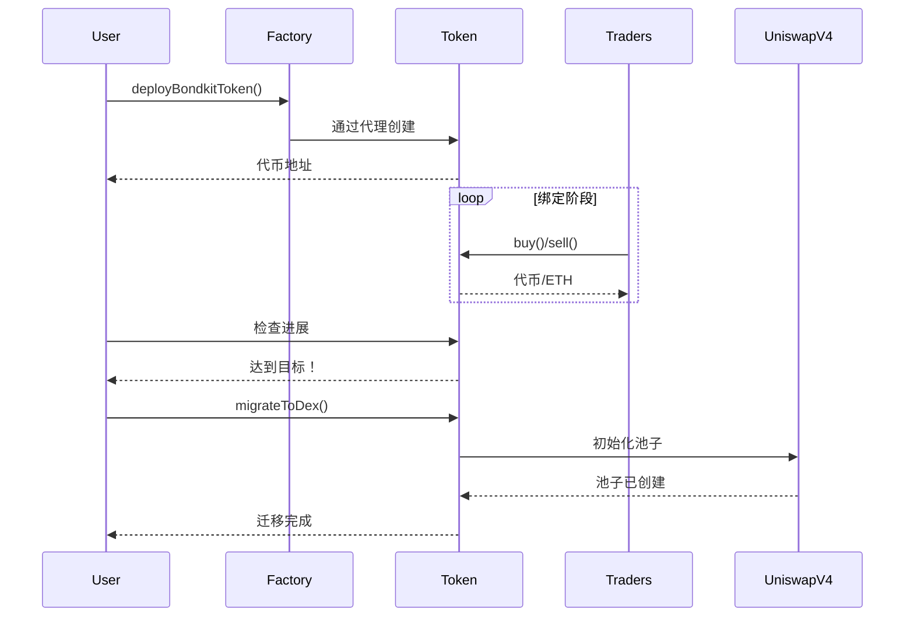

## 概览

这个快速入门指南将在不到5分钟的时间内引导您完成BondKit代币的完整生命周期。您将学习如何：

1. **部署**一个新的债券代币
2. **交易**在绑定阶段期间
3. **监控**向目标的进展
4. **迁移**至Uniswap v4

<Info>
  **先决条件**：确保您已完成[安装](/bondkit/installation)并在Base上拥有一个已资金注入的钱包。
</Info>

## 完整流程图



## 第1步：部署您的代币

### 基本部署

```typescript
import { BondkitTokenFactory } from "@b3dotfun/sdk/bondkit";
import { base } from "viem/chains";
import { parseEther } from "viem";

// 初始化工厂
const factory = new BondkitTokenFactory(
  base.id, 
  process.env.WALLET_PRIVATE_KEY
);

// 部署您的代币
const tokenAddress = await factory.deployBondkitToken({
  // 代币元数据
  name: "My Awesome Token",
  symbol: "MAT",
  
  // 供应配置（100万代币）
  finalTokenSupply: parseEther("1000000"),
  
  // 绑定曲线设置
  aggressivenessFactor: 35,  // 0-100，更高 = 更陡峭的曲线
  targetEth: parseEther("10"), // 10 ETH目标迁移
  
  // 费用配置
  feeRecipient: "0x742d35Cc6634C0532925a3b844Bc9e7595f0bEb1", // 您的地址
  lpSplitRatioFeeRecipientBps: 1000n, // 10%给费用接收者
  
  // 迁移设置
  migrationAdminAddress: "0x742d35Cc6634C0532925a3b844Bc9e7595f0bEb1",
  uniswapV2RouterAddress: "0x4752ba5DBc23f44D87826276BF6Fd6b1C372aD24" // V4路由器
});

console.log("✅ 代币部署于:", tokenAddress);
```

### 理解参数

<ParamField path="finalTokenSupply" type="bigint" required>
  代币的总供应量（带18个小数）。例如：`parseEther("1000000")`表示100万代币。
</ParamField>

<ParamField path="aggressivenessFactor" type="number" required>
  控制绑定曲线的陡峭程度（0-100）：
  - **0-30**：线性定价，对所有买家公平
  - **30-60**：中等曲线，平衡方法
  - **60-100**：激进，奖励早期买家
</ParamField>

<ParamField path="targetEth" type="bigint" required>
  需要的ETH量以启用迁移。使用`parseEther("10")`表示10 ETH。
</ParamField>

<ParamField path="feeRecipient" type="address" required>
  接收交易费用的地址（所有交易的5%）。
</ParamField>

<ParamField path="lpSplitRatioFeeRecipientBps" type="bigint" required>
  LP费用分割的基点（1/100的1%）。1000 = 10%。
</ParamField>

## 第2步：绑定阶段期间的交易

### 初始化代币实例

```typescript
import { BondkitToken } from "@b3dotfun/sdk/bondkit";
import { parseEther, formatEther } from "viem";

// 连接到您部署的代币
const token = new BondkitToken(
  tokenAddress, 
  process.env.WALLET_PRIVATE_KEY
);
```

### 购买代币

```typescript
// 首先获取价格报价
const ethAmount = parseEther("1"); // 1 ETH
const expectedTokens = await token.getAmountOfTokensToBuy(ethAmount);

console.log(`1 ETH 将购买: ${formatEther(expectedTokens)} 代币`);

// 执行购买
const buyTx = await token.buy(
  0n,    // minTokensOut（0 = 接受任何数量，用于防止滑点）
  "1"    // ETH数量为字符串
);

console.log("购买完成！Tx:", buyTx);
```

### 出售代币

```typescript
// 检查您的代币余额
const balance = await token.getBalance(userAddress);
console.log(`您的余额: ${formatEther(balance)} 代币`);

// 获取卖出报价
const tokensToSell = parseEther("1000");
const expectedEth = await token.getAmountOfEthToReceive(tokensToSell);

console.log(`出售1000代币将返回: ${formatEther(expectedEth)} ETH`);

// 执行出售
const sellTx = await token.sell(
  tokensToSell,  // 出售的代币数量
  0n             // 最小ETH输出（用于防止滑点）
);

console.log("出售完成！Tx:", sellTx);
```

### 监控进展

```typescript
// 检查绑定进展
const progress = await token.getBondingProgress();

console.log(`
  进展: ${(progress.progress * 100).toFixed(2)}%
  筹集: ${formatEther(progress.raised)} ETH
  目标: ${formatEther(progress.threshold)} ETH
  剩余: ${formatEther(progress.threshold - progress.raised)} ETH
`);

// 获取当前代币价格
const currentPrice = await token.getCurrentPrice();
console.log(`当前价格: ${formatEther(currentPrice)} ETH 每代币`);

// 检查是否可以迁移
const canMigrate = await token.canMigrate();
console.log(`准备迁移: ${canMigrate}`);
```

### 事件监控

```typescript
// 监听购买事件
token.onBuy((event) => {
  console.log("新购买:", {
    buyer: event.buyer,
    ethIn: formatEther(event.ethIn),
    tokensOut: formatEther(event.tokensOut)
  });
});

// 监听出售事件
token.onSell((event) => {
  console.log("新出售:", {
    seller: event.seller,
    tokensIn: formatEther(event.tokensIn),
    ethOut: formatEther(event.ethOut)
  });
});
```

## 第3步：迁移到Uniswap v4

### 检查迁移准备情况

```typescript
// 验证目标是否已达到
const progress = await token.getBondingProgress();

if (progress.progress >= 1.0) {
  console.log("✅ 目标已达成！准备迁移。");
  
  // 获取迁移细节
  const migrationData = await token.getMigrationData();
  console.log("迁移将创建池子，包含:", {
    ethLiquidity: formatEther(migrationData.ethForLp),
    tokenLiquidity: formatEther(migrationData.tokensForLp),
    initialPrice: formatEther(migrationData.sqrtPriceX96)
  });
} else {
  console.log(`⏳ 需要更多${formatEther(progress.threshold - progress.raised)} ETH`);
}
```

### 执行迁移

```typescript
// 只有迁移管理员可以调用此操作
if (await token.isMigrationAdmin(userAddress)) {
  console.log("🚀 启动迁移到Uniswap v4...");
  
  const migrationTx = await token.migrateToDex();
  console.log("迁移交易:", migrationTx);
  
  // 等待确认
  const receipt = await token.waitForTransaction(migrationTx);
  
  if (receipt.status === "success") {
    console.log("✅ 迁移完成！");
    console.log("Uniswap v4池子地址:", await token.getPoolAddress());
  }
} else {
  console.log("❌ 只有迁移管理员可以执行迁移");
}
```

<Warning>
  **重要**：迁移后：
  - 合约所有权自动放弃
  - 绑定曲线交易永久禁用
  - 所有交易转移到Uniswap v4
  - 无法进行进一步的管理员操作
</Warning>

## 完整示例

这里是一个完整的工作示例，演示了整个生命周期：

```typescript
import { 
  BondkitTokenFactory, 
  BondkitToken 
} from "@b3dotfun/sdk/bondkit";
import { base } from "viem/chains";
import { parseEther, formatEther } from "viem";

async function launchToken() {
  // 1. 部署代币
  const factory = new BondkitTokenFactory(
    base.id,
    process.env.WALLET_PRIVATE_KEY
  );
  
  const tokenAddress = await factory.deployBondkitToken({
    name: "Demo Token",
    symbol: "DEMO",
    finalTokenSupply: parseEther("1000000"),
    aggressivenessFactor: 50,
    targetEth: parseEther("5"),
    feeRecipient: process.env.WALLET_ADDRESS,
    lpSplitRatioFeeRecipientBps: 1000n,
    migrationAdminAddress: process.env.WALLET_ADDRESS,
    uniswapV2RouterAddress: "0x4752ba5DBc23f44D87826276BF6Fd6b1C372aD24"
  });
  
  console.log("代币部署:", tokenAddress);
  
  // 2. 绑定期间交易
  const token = new BondkitToken(
    tokenAddress,
    process.env.WALLET_PRIVATE_KEY
  );
  
  // 购买一些代币
  await token.buy(0n, "0.5");
  console.log("用0.5 ETH购买了代币");
  
  // 检查进展
  const progress = await token.getBondingProgress();
  console.log(`进展: ${(progress.progress * 100).toFixed(2)}%`);
  
  // 3. 继续交易直到达到目标...
  //（在生产中，其他用户将进行交易）
  
  // 4. 准备好时迁移
  if (progress.progress >= 1.0) {
    await token.migrateToDex();
    console.log("迁移完成！代币现在在Uniswap v4上");
  }
}

launchToken().catch(console.error);
```

## 下一步

<CardGroup cols={2}>
  <Card title="概念" icon="book" href="/bondkit/concepts/bonding-phase">
    深入了解绑定曲线和定价
  </Card>
  <Card title="SDK参考" icon="code" href="/bondkit/sdk/reference">
    探索所有可用方法
  </Card>
  <Card title="指南" icon="compass" href="/bondkit/guides/choose-quote-asset">
    学习高级策略
  </Card>
  <Card title="演示应用" icon="desktop" href="https://github.com/b3dotfun/b3-monorepo/tree/main/apps/bondkit-demo">
    查看完整实现
  </Card>
</CardGroup>
