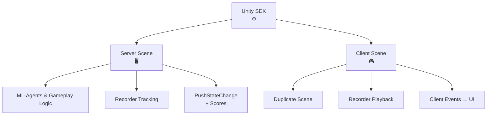

HypeDuel Arenas 是在 Unity 中构建的，每个竞技场都有一个在 HypeDuel 服务器上运行的无头服务器构建，实时模拟决斗，以及一个在客户端运行并接收流式传输的模拟数据以进行回放的 webGL 构建。

## Unity SDK

我们提供了一个 unity SDK 来促进竞技场的创建。以下是集成 SDK 并在 unity 中创建竞技场所需步骤的概述。

- 创建您的服务器端场景。
  - 设置您的环境、游戏玩法机制，并使用 unity ml-agents 训练您的代理
  - 设置 **HypeDuelRecorder** 以跟踪您的主场景对象在空间中的位置。
  - 调用录制器的 **PushStateChange** 方法将任何状态数据流式传输到客户端。
    - 设置状态分数属性，以便服务器能够在最后检测比赛的进展和结果。
  - 为 Linux Dedicated Server 构建并上传您的构建到 hypeduel。
- 创建您的客户端场景。
  - 服务器端的副本，但带有图形且没有代理逻辑。
  - **HypeDuelRecorder** 将自动回放您的主场景对象的位置
  - 监听 **HypeDuelClient** 实例的事件，使用您的状态更改来管理游戏的 UI 和图形元素。

## 如何工作

当在 HypeDuel 上开始一场比赛时，我们运行竞技场的服务器构建，它会实时发送来自模拟的数据。网站上的客户端运行着他们自己的竞技场 webGL 版本（客户端构建）并连接到我们的 API，该 API 流式传输所有模拟数据，然后在 unity 中使用这些数据来重现完全相同的场景。

