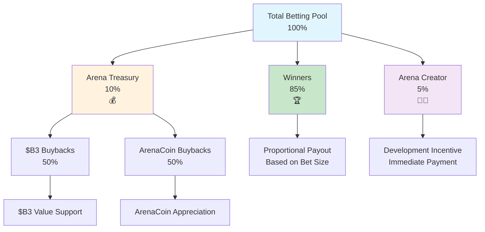

HypeDuel 采用透明、可持续的费用结构，公平地在玩家、创作者和生态系统之间分配价值。了解这些费用有助于您优化策略，并欣赏该平台如何保持长期可行性。

## 概览

与传统游戏平台最大化利润不同，HypeDuel 的费用结构旨在：

- **奖励获胜者**：85% 的投注池直接分给获胜玩家
- **支持创作者**：竞技场和 AI 开发者赚取可持续收入
- **发展生态系统**：库存回购惠及所有代币持有者
- **维护平台**：运营和开发资金



## 投注费用

### 主要收入来源

**每个投注池遵循此分配：**

```
Total Betting Pool: 100%
├── 85% → Winners (shared proportionally)
├── 10% → Arena Treasury (token buybacks)
└── 5% → Arena Creator (development incentive)
```

### 详细分解

<Tabs>
  <Tab title="Winner Payouts (85%)">
    **最大份额归玩家** **分配方法**：- 获胜者根据投注大小按比例分享 - 没有庄家优势或隐藏费用 - 战斗结束后立即支付 - 对所有玩家透明的计算 **示例计算**：``` Total Pool: 10,000 HYPES Winner Pool: 8,500 HYPES (85%) Your Bet: 500 HYPES on
    winning AI Total Winning Bets: 2,000 HYPES Your Share: 500/2,000 = 25% Your Payout: 500 + (6,500 × 0.25) = 2,125
    HYPES ```
  </Tab>

<Tab title="Arena Treasury (10%)">
  **代币回购机制** **库存功能**：- 累积所有竞技场活动的费用 - 执行自动化代币回购 - 支持 ArenaCoin 和 $B3 价值 - 创造可持续的升值压力 **回购策略**：- 50% 用于 $B3 代币购买 - 50% 用于 ArenaCoin 购买 - 市场时机优化 - 透明的执行记录 **对玩家的影响**：- 提升持有代币的价值 - 提供长期升值 - 奖励平台忠诚度 - 创造增长激励
</Tab>

  <Tab title="Arena Creator (5%)">
    **开发激励** **创作者好处**：- 竞技场成功的直接收入 - 每场战斗后立即支付 - 随社区增长而扩大 - 可持续的长期收入 **收入用途**：- 持续的竞技场开发 - AI 模型改进 - 社区建设活动 - 营销和增长举措 **创作者动机**：- 与玩家满意度一致 - 激励优质内容 - 奖励社区建设 - 鼓励创新
  </Tab>
</Tabs>

## 提升费用

### 交互式收入模型

**提升购买产生额外收入：**

```
Boost Purchase: 100%
├── 50% → Arena Treasury (ArenaCoin buybacks)
└── 50% → Arena Creator (immediate revenue)
```

### 提升经济学

<AccordionGroup>
  <Accordion title="Revenue Distribution">
    **平等分割模型** **库存部分 (50%)**：- 专门用于 ArenaCoin 回购 - 为竞技场投资者创造直接价值 - 随时间增加代币稀缺性 - 奖励竞技场社区忠诚度 **创作者部分
    (50%)**：- 竞技场开发者的即时收入 - 激励提升系统开发 - 奖励互动功能创造 - 资助持续的平衡改进
  </Accordion>

<Accordion title="Dynamic Pricing">
  **市场响应成本** **基础定价**：- 竞技场创作者设定的标准提升成本 - 平衡游戏影响 - 根据效果定期调整 - 社区反馈整合 **激增定价**：- 高需求期间增加 - 战斗后期的溢价 - 多次购买惩罚 - 基于稀缺性的成本上升 **示例价格演变**：``` Shield Boost Base Price: 50 HYPES After 3 purchases: 60 HYPES (+20%)
  Final 30 seconds: 90 HYPES (+50% urgency) Total with both factors: 108 HYPES ```
</Accordion>

  <Accordion title="ROI Considerations">
    **战略投资分析** **成本效益计算**：- 提升成本与潜在投注收益的对比 - 概率改善估计 - 预期价值计算 - 风险调整后的回报评估 **优化策略**：- 早期部署以降低成本 - 与其他玩家协调 - 定时以实现最大影响 - 跨战斗的投资组合方法
  </Accordion>
</AccordionGroup>

## 交易费用

### 毕业后收入

**ArenaCoin DEX 交易产生持续费用：**

<Tabs>
  <Tab title="Bonding Phase Fees">
    **初始启动期间** ``` Bonding Transaction: 100% ├── 97% → User (ArenaCoins received) ├── 2% → B3 Treasury
    (ecosystem support) └── 1% → Arena Creator (launch incentive) ``` **特点**：- 低费用鼓励早期采用 - 支持整个生态系统的发展 - 提供创作者启动激励 - 构建初期社区
  </Tab>

<Tab title="DEX Trading Fees">
  **竞技场毕业后** ``` DEX Trading Fee: 3% total ├── 2% → Arena Treasury (66.7% of total) └── 1% → Arena
  Creator (33.3% of total) ``` **长期好处**：- 代币成功的持续收入 - 成功竞技场的被动收入 - 可持续的创作者补偿 - 社区价值升值 **费用比较**：- 低于典型 DEX 费用 (0.3-1%) - 通过增值服务合理化 - 与高端平台竞争 - 透明的费用结构
</Tab>

  <Tab title="Fee Optimization">
    **智能费用管理** **玩家策略**：- 批量交易以最小化费用 - 在低 Gas 时段进行购买 - 使用限价订单以获得更好的执行 - 考虑持有期以提高费用效率 **平台优化**：- Gas 高效的智能合约设计 - 为多个用户批量处理 - 与高量交易者共享费用 - 针对频繁用户的忠诚度计划
  </Tab>
</Tabs>

## 比较分析

### 行业比较

<AccordionGroup>
  <Accordion title="Traditional Gaming">
    **与传统平台对比** **传统模型**：- 所有投注的庄家优势：5-15% - 与玩家零收入分享 - 不透明的费用结构 - 集中化的利润提取 **HypeDuel 优势**：- 透明的总费用 15% - 直接给予获胜者 85% - 通过代币实现社区所有权 - 创作者经济参与
  </Accordion>

<Accordion title="DeFi Platforms">
  **与去中心化金融对比** **典型 DeFi 费用**：- 交易：每笔交易 0.3-1% - 收益农场：年费 2-20% - 无娱乐价值 - 用户体验复杂 **HypeDuel 好处**：- 娱乐 + 财务机会 - 简化用户体验 - 集成生态系统奖励 - 社区驱动的发展
</Accordion>

  <Accordion title="Creator Platforms">
    **与内容创建网站对比** **平台创作者分成**：- YouTube：约 45% 的广告收入 - Twitch：订阅收入的 50% - OnlyFans：创作者收入的 20% - 应用商店：销售的 30% **竞技场创作者好处**：- 投注的 5% + 提升的 50% - 直接与社区连接 - 代币升值潜力 - 完全的创意控制
  </Accordion>
</AccordionGroup>

## 费用透明度

### 实时跟踪

<Card title="Public Dashboards" icon="dashboard">
  **完全透明** - 实时费用收集跟踪 - 库存余额和回购历史 - 竞技场创作者收入 - 平台宽收入分析
</Card>

<Card title="Player Tools" icon="calculator">
  **个人分析** - 个人费用支付历史 - 每次投注的有效成本计算 - 包括费用的 ROI 分析 - 优化建议
</Card>

<Card title="Community Oversight" icon="users">
  **治理整合** - 社区对费用调整的投票 - 性能指标监控 - 创作者问责措施 - 平台改进提案
</Card>
