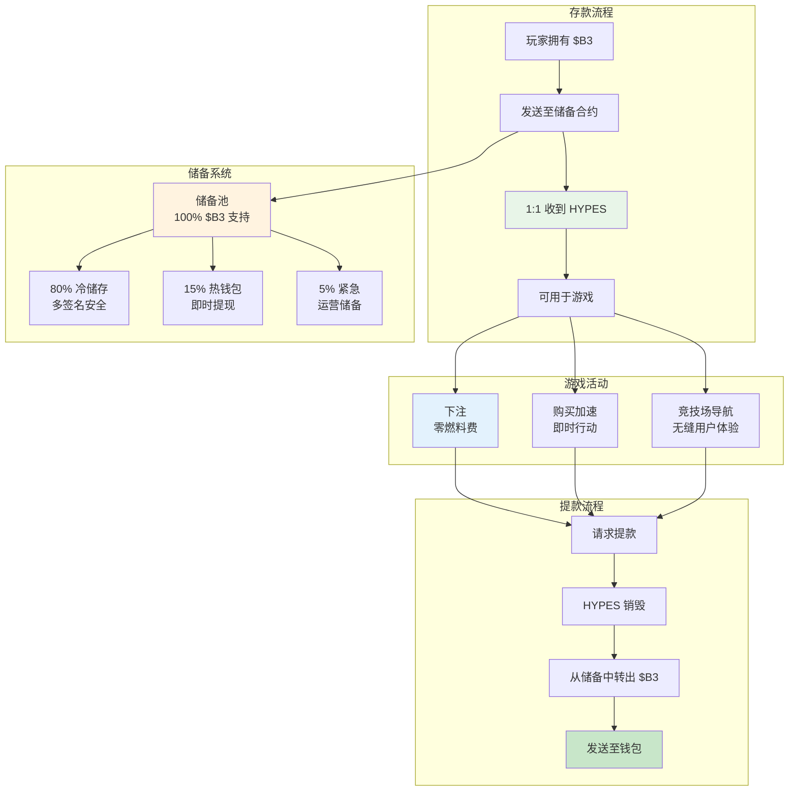

**HYPES** 是 HypeDuel 平台原生的积分，与 B3 代币保持 1:1 的兑换率。它们支持即时投注和购买加速道具，无需区块链交易延迟，创造了无缝的游戏体验，同时完全支持 $B3。

## 核心概念

HYPES 解决了区块链游戏的根本性用户体验问题：交易延迟和燃料费用中断了娱乐的流畅性。通过将 HYPES 作为有保证的 $B3 支持的平台积分，玩家可以享受到两全其美的体验。

## 关键特性

<Card title="1:1 $B3 支持" icon="shield">
  每个 HYPES 代币都由 1 个 $B3 代币在储备中支持
</Card>

<Card title="即时交易" icon="bolt">
  下注和购买加速无需等待区块链确认
</Card>

<Card title="零燃料费" icon="dollar-sign">
  投注、购买加速或转账无交易成本
</Card>

<Card title="随时提款" icon="arrow-right">
  随时将 HYPES 立即兑换回 $B3
</Card>

## 转换流程

<Tabs>
  <Tab title="$B3 → HYPES">
    **存款过程**: 
    1. 将 B3 发送至 HypeDuel 储备合约 
    2. 在平台账户中收到等值 HYPES 
    3. HYPES 立即可用于投注和加速 
    4. 储备随存入金额增加

    **方法**: - 直接 B3 代币转账 - 信用卡购买（自动转换） - 任何 ERC-20 代币（先换成 B3） - 银行转账（转换为 B3）

  </Tab>

  <Tab title="HYPES → $B3">
    **提款过程**: 1. 从平台账户请求提款 2. HYPES 余额立即减少 3. $B3
    从储备转至您的钱包 4. 储备随提取金额减少 **特点**: - 无最低提款金额 - 无提款费用 - 全天候可用 - 即时处理
  </Tab>
</Tabs>

## HYPES 与 $B3 对比

| 特性                  | HYPES               | $B3                  |
| ---------------------- | ------------------- | -------------------- |
| **投注**              | ✅ 即时             | ❌ 燃料费 + 延迟     |
| **购买加速**          | ✅ 即时             | ❌ 燃料费 + 延迟     |
| **竞技场交易**        | ❌ 不支持           | ✅ DEX 交易          |
| **跨平台**            | ❌ 仅限 HypeDuel    | ✅ 完整生态系统      |
| **交易成本**          | ✅ 免费             | ❌ 燃料费            |
| **钱包保管**          | ❌ 平台保管         | ✅ 自我保管          |
| **即时转换**          | ✅ 与 $B3 1:1       | ✅ 与 HYPES 1:1      |

## 储备管理

### 透明度与安全性

HYPES 储备系统以完全透明的方式运作：

<AccordionGroup>
  <Accordion title="储备构成">
    **100% $B3 支持**: - 每个 HYPES 都由 1 个 $B3 代币支持 - 无分数储备或杠杆 - 实时储备监控 - 公开储备地址以供验证 **储备位置**: - 80% 存于多签名冷储存 - 15% 存于热钱包以支持即时提现 - 5% 紧急储备用于运营需求
  </Accordion>

<Accordion title="安全措施">
  **多签名安全**: - 冷储存访问的 3-of-5 多签名 - 硬件安全模块 (HSMs) -
  延时提款机制 - 定期安全审计和渗透测试 **运营安全**: -
  实时监控和警报 - 自动储备平衡 - 紧急暂停机制 - 技术故障的保险覆盖
</Accordion>

  <Accordion title="公开验证">
    **链上透明度**: - 储备地址公开可见 - 实时储备与发行 HYPES 跟踪 -
    每月第三方审计 - 社区治理监督 **监控工具**: - 公开仪表板显示储备状态 - 储备比率变化的警报系统 - 历史数据和趋势分析 - 独立验证服务
  </Accordion>
</AccordionGroup>

## HYPES 使用案例

### 主要功能

<Card title="战斗投注" icon="coins">
  **核心游戏活动** - 即时对 AI 战斗下注 - 无需等待区块链确认 - 赢利立即记入账户 - 支持快速投注策略
</Card>

<Card title="购买加速" icon="bolt">
  **互动游戏玩法** - 在实时战斗中购买能力提升 - 实时部署无延迟 - 无需担心燃料费的策略定时 - 有效结合多个加速
</Card>

<Card title="平台导航" icon="compass">
  **无缝体验** - 立即在竞技场间移动 - 快速注册比赛 - 立即访问新功能 - 无摩擦用户体验
</Card>
