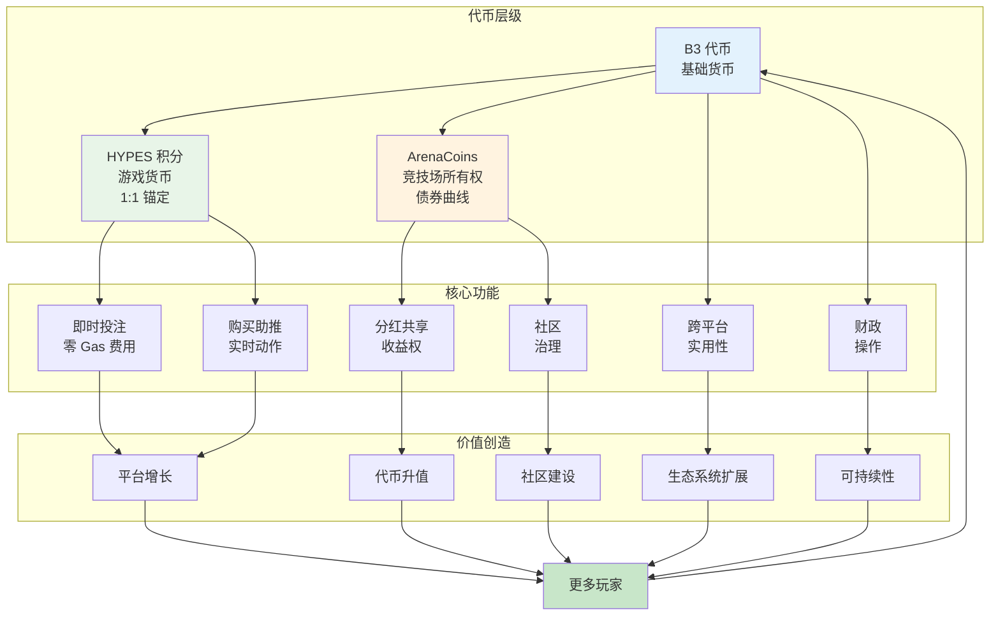
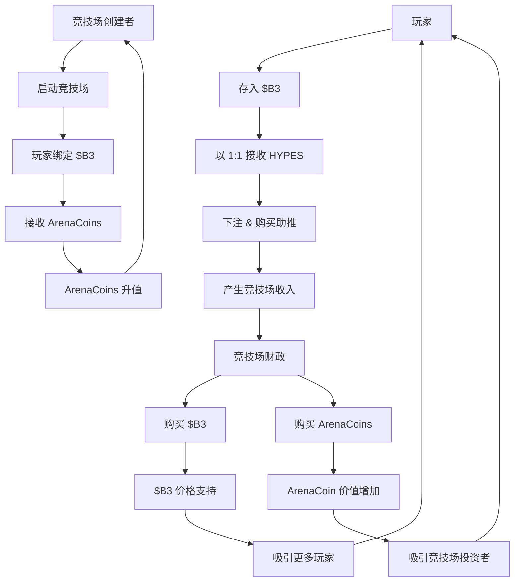

HypeDuel 采用复杂的三代币经济系统，旨在优化用户体验、创造可持续的价值流，并实现社区所有权。每种代币都服务于特定目的，同时共同推动整个生态系统的运行。

## 三代币架构

### 代币层级

<Tabs>
  <Tab title="$B3 代币" icon="coins">
    **基础货币** - 基础生态系统代币 - 主要价值储存 - 跨平台实用性 - 财政储备
    - ArenaCoins 绑定
  </Tab>

<Tab title="HYPES 积分" icon="zap">
  **游戏货币** - 与 $B3 1:1 锚定 - 即时投注 - 零 Gas 费用 - 无缝提现 - 购买助推
</Tab>

  <Tab title="ArenaCoins" icon="chart-line">
    **竞技场所有权** - 每个竞技场独特 - 债券曲线定价 - 分红权 - 交易机会 -
    社区治理
  </Tab>
</Tabs>

## 代币流动图

## 为什么是三代币？

### 用户体验优化

三代币系统解决了关键的用户体验问题：

<AccordionGroup>
  <Accordion title="即时交易">
    **问题**：区块链交易有延迟和 Gas 成本，这打断了游戏流程。**解决方案**：HYPES 实现即时投注和助推，无需区块链摩擦，同时保持完全的 $B3 支持。
  </Accordion>

<Accordion title="竞技场投资">
  **问题**：用户无法投资或从成功的竞技场增长中受益。**解决方案**：ArenaCoins 让玩家拥有竞技场经济的一部分，并从其成功中获益。
</Accordion>

<Accordion title="价值捕获">
  **问题**：平台收入通常只有平台所有者受益。**解决方案**：对 $B3 和 ArenaCoins 的财政回购将价值分配给所有利益相关者。
</Accordion>

  <Accordion title="创作者激励">
    **问题**：难以公平地补偿竞技场和 AI 模型创作者。**解决方案**：ArenaCoins 为创作者提供直接的收入分享和升值潜力。
  </Accordion>
</AccordionGroup>

### 经济可持续性

每个代币以不同的方式创造价值：

<Card title="$B3 价值驱动因素" icon="trending-up">
  - 基础生态系统增长 - 财政回购压力 - 跨平台实用性 - 质押和 DeFi 集成
</Card>

<Card title="HYPES 稳定性" icon="balance-scale">
  - 1:1 $B3 支持保证 - 即时转换能力 - 游戏实用性溢价 - 平台便利价值
</Card>

<Card title="ArenaCoin 升值" icon="rocket">
  - 竞技场人气增长 - 费用生成增加 - 社区发展 - 交易量扩张
</Card>

## 代币实用性矩阵

| 功能              | $B3 | HYPES | ArenaCoins |
| ------------------ | --- | ----- | ---------- |
| **投注**          | ❌  | ✅    | ❌         |
| **助推**          | ❌  | ✅    | ❌         |
| **竞技场绑定**    | ✅  | ❌    | ❌         |
| **收费赚取**      | ✅  | ❌    | ✅         |
| **交易**          | ✅  | ❌    | ✅         |
| **治理**          | ✅  | ❌    | ✅         |
| **跨平台**        | ✅  | ❌    | ❌         |

### 财政机制

竞技场财政创造持续的购买压力：

1. **收入收集**：费用在竞技场财政中累积
2. **资产配置**：50% 用于 $B3 回购，50% 用于 ArenaCoin 回购
3. **市场购买**：自动市场购买创造价格支持
4. **价值分配**：利益流向所有代币持有者
