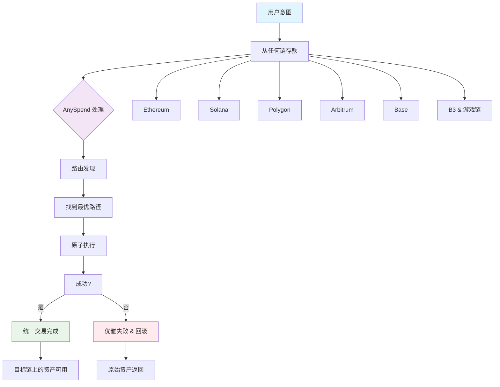

<iframe
   className="w-full aspect-video rounded-xl"
    src="https://customer-gg6qs7nm5ue94t64.cloudflarestream.com/4453d7f20bb58fb822f0e114e4887ab5/iframe?muted=true&loop=true&autoplay=true&poster=https%3A%2F%2Fcustomer-gg6qs7nm5ue94t64.cloudflarestream.com%2F4453d7f20bb58fb822f0e114e4887ab5%2Fthumbnails%2Fthumbnail.jpg%3Ftime%3D%26height%3D600"
    title="流动性碎片化"
    frameBorder="0"
  allow="accelerometer; autoplay; clipboard-write; encrypted-media; gyroscope; picture-in-picture"
  allowFullScreen
  ></iframe>

<Note>
[在 explorer.b3.fun 上探索 B3 的多链生态系统](https://explorer.b3.fun/chains)
</Note>

## 问题

Appchains、L2s 和 L3s 拥有孤立的流动性，这使得在不跨链桥接资产的情况下构建体验变得令人烦恼。

<CardGroup cols={2}>

<Card title="碎片化的流动性" icon="puzzle-piece">
  每个链都维护着孤立的资金池，限制了深度并增加了滑点。
</Card>

<Card title="复杂的集成" icon="gears">
  构建者必须分别与数十个链进行集成。
</Card>

<Card title="糟糕的用户体验" icon="face-frown">
  用户手动桥接资产并管理多个钱包。
</Card>

<Card title="资本效率低" icon="chart-line-down">
  锁定在特定链上的资产无法访问其他机会。
</Card>

</CardGroup>

## 跨链访问流动性

由我们的产品 AnySpend 提供支持，它操作在客户端执行层，位于用户意图与区块链执行之间：

### 如何工作

1. **从任何链存款**：接受大多数链上的代币
2. **基于意图**：用户表达他们想要什么，而不是如何实现
3. **路由发现**：在所有支持的链上找到最优路径
4. **原子执行**：交易原子执行或优雅失败
5. **统一体验**：复杂操作呈现为单一交易

### 支持的链

AnySpend 提供全链支持：

- **EVM 链**：大多数 EVM 链，包括 Ethereum、Polygon、Arbitrum、Base、BSC、Avalanche
- **Solana**：与 Solana 生态系统的全面集成
- **B3 生态系统**：与 B3 和游戏链的原生集成

## 下一步

<CardGroup cols={2}>

<Card title="尝试 AnySpend" icon="rocket" href="/anyspend/introduction">
  开始使用 AnySpend SDK。
</Card>

<Card title="集成指南" icon="book" href="/anyspend/installation">
  学习如何集成 AnySpend。
</Card>

<Card title="API 参考" icon="code" href="/anyspend/api-reference/introduction">
  探索完整的 API 文档。
</Card>

<Card title="加入 Discord" icon="discord" href="https://discord.gg/b3dotfun">
  与其他构建者连接。
</Card>

</CardGroup>
