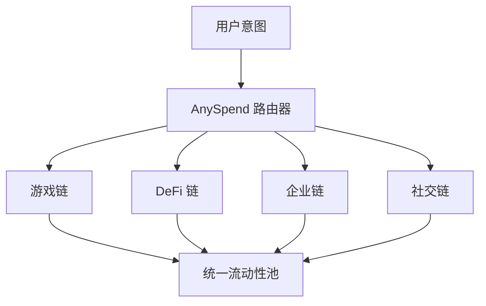

```html


<Note>
  [探索 B3 的多链生态系统 explorer.b3.fun](https://explorer.b3.fun/chains)
</Note>

## 扩容革命

传统的区块链扩容专注于让单一链更快。B3 采取不同的方法：通过专为应用程序构建的 appchains 实现**水平扩容**，这些 appchains 作为统一的生态系统协同工作。

<CardGroup cols={2}>
  <Card title="垂直扩容" icon="arrow-up">
    使一个链每秒处理更多交易
  </Card>
  <Card title="水平扩容" icon="arrow-right">
    为特定应用创建专门的链
  </Card>
</CardGroup>

## 为什么水平扩容很重要

水平扩容允许每个应用程序、游戏或企业拥有自己的优化执行环境，而不是强迫所有应用程序竞争相同的区块链资源。


### 多链优势

<CardGroup cols={2}>
  <Card title="特定应用优化" icon="gear">
    每个 appchain 都可以为其特定用例定制 - 游戏链为零费用游戏，DeFi 链为高吞吐量交易。
  </Card>
  <Card title="无限吞吐量" icon="bolt">
    不再为区块空间竞争。每个应用程序获得专用资源，并可以独立扩展。
  </Card>
  <Card title="隔离风险" icon="shield">
    一个 appchain 上的问题不会影响其他 appchain，为整个生态系统提供更好的安全性和可靠性。
  </Card>
  <Card title="统一体验" icon="link">
    尽管是独立的链，用户在整个 B3 生态系统中体验无缝交互。
  </Card>
</CardGroup>

## B3 如何实现水平扩容

### 1. 专为应用构建的 Appchains

B3 上的每个应用程序都可以部署自己的专用链，针对特定要求进行优化：

- **游戏链**：零费用交易，即时确定性，游戏特定预编译
- **DeFi 链**：高吞吐量交易，MEV 保护，金融原语
- **企业链**：隐私特性，合规工具，自定义治理
- **社交链**：内容存储，声誉系统，社交图谱

### 2. 统一流动性层

虽然链在水平方向上扩展，流动性通过 [AnySpend](/protocol/liquidity) 保持统一：



### 3. 无缝跨链操作

<Steps>
  <Step title="表达意图">
    用户只需表达他们想做什么 - 购买 NFT，交换代币，或进行支付。
  </Step>
  <Step title="自动路由">
    B3 的基础设施自动找到所有 appchains 中的最佳路径。
  </Step>
  <Step title="原子执行">
    复杂的多链操作从用户的角度作为单一交易执行。
  </Step>
</Steps>

## 现实世界的好处

### 对于开发者

<CardGroup cols={2}>
  <Card title="不再拥堵" icon="traffic-light">
    部署您自己的链，永远不必担心网络拥堵影响您的用户。
  </Card>
  <Card title="自定义经济" icon="coins">
    为您的应用设计代币经济学、费用结构和激励。
  </Card>
  <Card title="更快的创新" icon="rocket">
    在不影响其他应用程序或等待网络升级的情况下，尝试新功能。
  </Card>
  <Card title="更好的 UX" icon="sparkles">
    为您的特定用例优化交易成本、确认时间和用户流程。
  </Card>
</CardGroup>

### 对于用户

<CardGroup cols={2}>
  <Card title="一致的体验" icon="user-check">
    使用同一个钱包和账户访问整个生态系统中的所有应用程序。
  </Card>
  <Card title="更低的成本" icon="coins">
    从每个专门链上的优化费用结构中受益。
  </Card>
  <Card title="更快的交易" icon="clock">
    在为您的用例优化的链上体验近乎即时的确认。
  </Card>
  <Card title="增强的安全性" icon="lock">
    在享受专门链功能的同时享受以太坊结算的安全性。
  </Card>
</CardGroup>

## 实践中的扩容

<Note>
  [通过我们的免费 API 访问 B3 多链的合并数据](/data/api-reference/introduction).
</Note>

### 规模化游戏

B3 上的游戏链可以处理：

- **免费游玩机制**，零交易成本
- **实时互动**，亚秒级最终确定性
- **大型多人事件**，无网络拥堵
- **跨游戏资产转移**，通过统一流动性

### 企业应用

企业链支持：

- **私有交易**，用于敏感业务操作
- **内置协议层的合规特性**
- **自定义治理** 模型，满足组织需求
- **与现有业务系统的集成能力**

### DeFi 创新

DeFi 链支持：

- **高频交易**，优化吞吐量
- **复杂金融工具**，专门的预编译
- **MEV 保护**，通过自定义排序机制
- **通过统一流动性访问的跨链套利**

## 网络效应

随着越来越多的应用程序部署自己的 appchains，整个 B3 生态系统变得更加有价值：

1. **增加的流动性**：更多的链意味着更多的交易机会和更深的流动性池
2. **增强的可组合性**：应用程序可以无缝地跨链互动
3. **降低成本**：随着生态系统的增长，共享基础设施成本减少
4. **创新加速**：一个链上的新功能可以被其他链采用

## 开始使用水平扩容

<Card title="部署您的 Appchain" icon="rocket" horizontal href="https://b3builders.typeform.com/bsmntdevelopers">
  准备好水平扩容了吗？联系我们的团队，讨论在 B3 上部署您自己的专用 appchain。
</Card>

<Note>
  [通过我们的免费 API 访问 B3 多链的合并数据](/data/api-reference/introduction).
</Note>

<Note>
  [使用我们的开发者工具在 B3 上构建](/ecosystem/introduction).
</Note>

### 选择您的扩容策略

<CardGroup cols={3}>
  <Card title="共享 B3 链" icon="users">
    在扩展到您自己的 appchain 之前，开始在主 B3 链上构建。
  </Card>
  <Card title="专用 Appchain" icon="server">
    为您的特定应用需求部署一个定制链。
  </Card>
  <Card title="混合方法" icon="block">
    使用主链进行核心功能，appchains 用于专门功能。
  </Card>
</CardGroup>

## 扩容的未来

水平扩容代表了区块链基础设施的下一个进化阶段。通过实现无限的并行执行，同时保持统一的用户体验和流动性，B3 为真正大规模的链上采用创造了基础。

互联网没有通过让单个服务器更快来扩容——它通过连接数百万个专门的服务器来扩容。类似地，区块链将通过连接数千个为特定应用优化的专用链来扩容，这些链在作为统一生态系统的同时协同工作。
```
