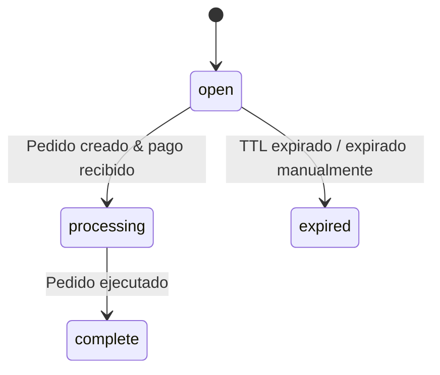

Las sesiones de pago permiten crear un objeto de seguimiento en tu servidor antes de que el usuario elija un método de pago. La sesión es un registro de base de datos ligero -- sin llamadas a API externas, sin creación de pedidos. El pedido se realiza más tarde, cuando el usuario se compromete a pagar.

<Info>
  ¿Buscas el componente de pago de React? Consulta [Checkout](/anyspend/checkout). Esta página cubre la **API REST** para flujos impulsados por el servidor.
</Info>

## URL base

Todos los puntos finales de sesión de pago se encuentran en el servicio AnySpend:

```
https://api.anyspend.com
```

## Flujo

<Steps>
  <Step title="Crear una sesión en tu servidor">
    `POST https://api.anyspend.com/checkout-sessions` devuelve `{ id, status: "open" }`
  </Step>
  <Step title="El usuario elige un método de pago">
    `POST https://api.anyspend.com/orders` con `checkoutSessionId` devuelve `{ id, globalAddress, oneClickBuyUrl }`
  </Step>
  <Step title="El usuario paga">
    **Cripto:** enviar a `globalAddress` | **Rampa de entrada fiat:** redirigir a `oneClickBuyUrl`
  </Step>
  <Step title="Consulta hasta la finalización">
    `GET https://api.anyspend.com/checkout-sessions/:id` devuelve `{ status: "complete", order_id }`
  </Step>
</Steps>

### ¿Por qué desacoplar las sesiones de los pedidos?

- El método de pago no necesita ser conocido en la creación de la sesión.
- Una página de pago alojada puede permitir a los usuarios elegir cómo pagar.
- La creación de la sesión es una escritura en la DB local, por lo que nunca falla debido a errores de API de terceros.

## Ciclo de vida del estado de la sesión



| Estado | Significado |
|--------|-------------|
| `open` | Creado, esperando pedido/pago |
| `processing` | Pago recibido, pedido en ejecución |
| `complete` | Pedido ejecutado con éxito |
| `expired` | TTL expirado, pago fallido o expirado manualmente |

## Referencia de la API

### Crear sesión

```
POST https://api.anyspend.com/checkout-sessions
```

Crea una sesión ligera. Sin pedido, sin llamadas a API externas.

```json
{
  "success_url": "https://merchant.com/success?session_id={SESSION_ID}",
  "cancel_url": "https://merchant.com/cancel",
  "metadata": { "sku": "widget-1" },
  "client_reference_id": "merchant-order-456",
  "expires_in": 1800
}
```

Todos los campos son opcionales. La configuración de pago (cantidad, tokens, cadenas) reside en el pedido, no en la sesión.

### Crear pedido vinculado a una sesión

```
POST https://api.anyspend.com/orders
```

Pasa `checkoutSessionId` en el cuerpo estándar del pedido para vincular el pedido a una sesión.

```json
{
  "recipientAddress": "0x...",
  "srcChain": 8453,
  "dstChain": 8453,
  "srcTokenAddress": "0x...",
  "dstTokenAddress": "0x...",
  "srcAmount": "1000000",
  "type": "swap",
  "payload": { "expectedDstAmount": "1000000" },
  "checkoutSessionId": "550e8400-..."
}
```

**Reglas de validación:**
- La sesión debe existir (`400` si no se encuentra)
- La sesión debe estar `open` (`400` si está expirada/procesando/completa)
- La sesión no debe tener ya un pedido (`409 Conflict`)

### Recuperar sesión

```
GET https://api.anyspend.com/checkout-sessions/:id
```

Devuelve el estado actual de la sesión. El estado se sincroniza con el pedido subyacente en cada recuperación.

| Parámetro de consulta | Descripción |
|-------------|-------------|
| `include=order` | Incorpora el objeto de pedido completo con transacciones |

### Expirar una sesión

```
POST https://api.anyspend.com/checkout-sessions/:id/expire
```

Solo funciona en sesiones con estado `open`.

## Plantillas de URL de redirección

Usa variables de plantilla en `success_url` y `cancel_url`:

| Variable | Sustituido con |
|----------|--------------|
| `{SESSION_ID}` | El UUID de la sesión de pago |
| `{ORDER_ID}` | El mismo valor (alias) |

Si no hay una variable de plantilla presente, `?sessionId=<uuid>` se añade automáticamente.

## Integración SDK

### Métodos del servicio

```typescript
import { anyspend } from "@b3dotfun/sdk/anyspend";

// Crear una sesión de pago
const session = await anyspend.createCheckoutSession({
  success_url: "https://mysite.com/success/{SESSION_ID}",
  metadata: { sku: "widget-1" },
});

// Recuperar el estado de la sesión
const session = await anyspend.getCheckoutSession(sessionId);
```

### Hooks de React

#### `useCreateCheckoutSession`

Hook de mutación para crear sesiones.

```tsx
import { useCreateCheckoutSession } from "@b3dotfun/sdk/anyspend";

const { mutate: createSession, data, isPending } = useCreateCheckoutSession();
```

#### `useCheckoutSession`

Hook de consulta con auto-consulta. Detiene la consulta cuando el estado alcanza `complete` o `expired`.

```tsx
import { useCheckoutSession } from "@b3dotfun/sdk/anyspend";

const { data: session, isLoading } = useCheckoutSession(sessionId);
```

### Propiedad del componente

Los componentes `<AnySpend>`, `<AnySpendCustom>`, y `<AnySpendCustomExactIn>` aceptan una propiedad opcional `checkoutSession`:

```tsx
<AnySpend
  defaultActiveTab="fiat"
  destinationTokenAddress="0x833589fCD6eDb6E08f4c7C32D4f71b54bdA02913"
  destinationTokenChainId={8453}
  recipientAddress="0x..."
  checkoutSession={{
    success_url: "https://myshop.com/success?session={SESSION_ID}",
    cancel_url: "https://myshop.com/cancel",
    metadata: { sku: "widget-1" },
  }}
/>
```

Cuando se establece `checkoutSession`, el componente crea una sesión antes del pedido y utiliza el `success_url` de la sesión para las redirecciones. Sin la propiedad, los flujos existentes funcionan igual que antes.

## Ejemplos

### Pago en cripto

```typescript
const BASE_URL = "https://api.anyspend.com";

// 1. Crear sesión
const session = await fetch(`${BASE_URL}/checkout-sessions`, {
  method: "POST",
  headers: { "Content-Type": "application/json" },
  body: JSON.stringify({
    success_url: "https://mysite.com/success/{SESSION_ID}",
    metadata: { sku: "widget-1" },
  }),
}).then(r => r.json());

// 2. Crear pedido vinculado a la sesión
const order = await fetch(`${BASE_URL}/orders`, {
  method: "POST",
  headers: { "Content-Type": "application/json" },
  body: JSON.stringify({
    recipientAddress: "0x...",
    srcChain: 8453,
    dstChain: 8453,
    srcTokenAddress: "0x833589fcd6edb6e08f4c7c32d4f71b54bda02913",
    dstTokenAddress: "0x833589fcd6edb6e08f4c7c32d4f71b54bda02913",
    srcAmount: "1000000",
    type: "swap",
    payload: { expectedDstAmount: "1000000" },
    checkoutSessionId: session.data.id,
  }),
}).then(r => r.json());

// 3. El usuario envía cripto a order.data.globalAddress

// 4. Consulta la sesión hasta completar
const poll = setInterval(async () => {
  const s = await fetch(`${BASE_URL}/checkout-sessions/${session.data.id}`).then(r => r.json());
  if (s.data.status === "complete") {
    clearInterval(poll);
    // redirigir a success_url o mostrar confirmación
  }
}, 3000);
```

### Rampa de entrada fiat (Coinbase/Stripe)

```typescript
const BASE_URL = "https://api.anyspend.com";

// Pasos 1-2 iguales que arriba, pero incluye configuración de rampa de entrada en la creación del pedido:
const order = await fetch(`${BASE_URL}/orders`, {
  method: "POST",
  headers: { "Content-Type": "application/json" },
  body: JSON.stringify({
    // ... mismos campos del pedido ...
    checkoutSessionId: session.data.id,
    onramp: {
      vendor: "coinbase",
      payment_method: "card",
      country: "US",
    },
  }),
}).then(r => r.json());

// Redirige al usuario a la página de pago del proveedor
window.location.href = order.data.oneClickBuyUrl;

// Después de que el proveedor redirija de vuelta, consulta GET /checkout-sessions/:id para la finalización
