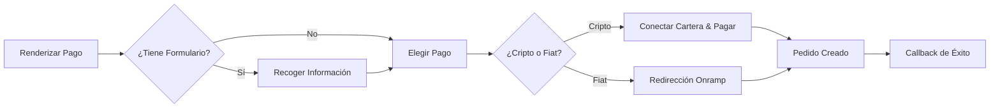

Los componentes de pago muestran un diseño de dos paneles: resumen del pedido en un lado, pago en el otro. Soportan cripto y fiat, campos de formulario personalizados, opciones de envío, códigos de descuento y disparadores de flujo de trabajo B3 opcionales. [Ver en vivo](https://sdk-demo.anyspend.com/).

<Info>
  Para la **API REST de sesiones de pago** (flujos basados en sesiones y dirigidos por el backend), consulta [Sesiones de Pago](/anyspend/checkout-sessions). Esta página cubre los **componentes de pago React**.
</Info>

## Cómo funciona



## Inicio rápido

<Steps>
  <Step title="Instalar el SDK">
    ```bash
    npm install @b3dotfun/sdk
    ```
  </Step>
  <Step title="Importar el componente">
    ```tsx
    import { AnySpendCheckout } from "@b3dotfun/sdk/anyspend/react";
    ```
  </Step>
  <Step title="Renderizar el pago">
    ```tsx title="Pago Básico" icon="cart-shopping"
    <AnySpendCheckout
      recipientAddress="0xMerchantAddress..."
      destinationTokenAddress="0x833589fCD6eDb6E08f4c7C32D4f71b54bdA02913"
      destinationTokenChainId={8453}
      items={[
        {
          name: "Plan Pro - Mensual",
          description: "Acceso ilimitado a todas las características",
          amount: "10000000", // 10 USDC (6 decimales)
          quantity: 1,
        },
      ]}
      organizationName="Acme Inc"
      organizationLogo="/acme-logo.svg"
      themeColor="#4f46e5"
      onSuccess={(result) => {
        console.log("Pago completado:", result.orderId);
      }}
    />;
    ```
  </Step>
</Steps>

---

## Componentes

### `<AnySpendCheckout>`

El componente principal de pago muestra un diseño de dos paneles con un panel de resumen del pedido/carrito y un panel de pago que soporta opciones de cripto y fiat. Opcionalmente incluye un panel de formulario para recopilar información del cliente, selección de envío y códigos de descuento.

#### Propiedades principales

<ParamField path="recipientAddress" type="string" required>
  Dirección de la cartera del comerciante para recibir el pago
</ParamField>

<ParamField path="destinationTokenAddress" type="string" required>
  Dirección del contrato del token para el asentamiento (p. ej., USDC)
</ParamField>

<ParamField path="destinationTokenChainId" type="number" required>
  ID de la cadena para el asentamiento (p. ej., `8453` para Base)
</ParamField>

<ParamField path="items" type="CheckoutItem[]" required>
  Artículos de línea mostrados en el panel del carrito
</ParamField>

#### Branding

<ParamField path="organizationName" type="string">
  Nombre del comerciante mostrado en el encabezado del pago
</ParamField>

<ParamField path="organizationLogo" type="string">
  URL para el logo del comerciante
</ParamField>

<ParamField path="themeColor" type="string">
  Color hexadecimal para el tema (p. ej., `"#4f46e5"`)
</ParamField>

<ParamField path="buttonText" type="string">
  Texto personalizado para el botón de pago
</ParamField>

#### Resumen del pedido

<ParamField path="totalAmount" type="string">
  Sobrescribe el total calculado en wei. Usar cuando el total difiere de la suma de los montos de los artículos (p. ej., después de descuentos o tarifas).
</ParamField>

<ParamField path="shipping" type="string | { amount: string; label?: string }">
  Costo de envío. Pasar un string para el monto en wei, o un objeto con una etiqueta personalizada.
</ParamField>

<ParamField path="tax" type="string | { amount: string; label?: string; rate?: string }">
  Monto del impuesto. Pasar un string para el monto en wei, o un objeto con etiqueta y tasa opcional de visualización (p. ej., `"8.5%"`).
</ParamField>

<ParamField path="discount" type="string | { amount: string; label?: string; code?: string }">
  Monto del descuento (mostrado como una deducción). Pasar un string para el monto en wei, o un objeto con etiqueta y código opcional.
</ParamField>

<ParamField path="summaryLines" type="CheckoutSummaryLine[]">
  Líneas de resumen adicionales como tarifas de plataforma, propinas o cargos por servicio
</ParamField>

#### Pago

<ParamField path="defaultPaymentMethod" type="PaymentMethod">
  Qué método de pago expandir inicialmente. Opciones: `"crypto"`, `"coinbase"`, `"stripe"`.
</ParamField>

<ParamField path="senderAddress" type="string">
  Prellenar la dirección del remitente para mostrar saldos de tokens antes de la conexión de la cartera
</ParamField>

<ParamField path="checkoutSessionId" type="string">
  Vincular este pago a una sesión de pago en el backend para seguimiento
</ParamField>

#### Callbacks

<ParamField path="onSuccess" type="(result: { txHash?: string; orderId?: string }) => void">
  Llamado al completar el pago con éxito
</ParamField>

<ParamField path="onError" type="(error: Error) => void">
  Llamado en caso de error de pago
</ParamField>

<ParamField path="returnUrl" type="string">
  URL a la que redirigir después de completar el pago
</ParamField>

<ParamField path="returnLabel" type="string">
  Etiqueta para el botón de retorno/redirección
</ParamField>

#### Opciones de visualización

<ParamField path="mode" type="'page' | 'embedded'" default="'page'">
  `page` para independiente, `embedded` para en línea dentro de tu diseño
</ParamField>

<ParamField path="showPoints" type="boolean" default="false">
  Mostrar puntos ganados en el resumen del estado del pedido
</ParamField>

<ParamField path="showOrderId" type="boolean" default="false">
  Mostrar el ID del pedido en el resumen del estado del pedido
</ParamField>

<ParamField path="footer" type="ReactNode | null">
  Pie de página personalizado para el resumen del pedido. Pasar `null` para ocultar el pie de página "Powered by" predeterminado.
</ParamField>

#### Personalización

<ParamField path="slots" type="AnySpendSlots">
  Reemplazar secciones de la UI. Ver [Personalización](/anyspend/customization#slots).
</ParamField>

<ParamField path="content" type="AnySpendContent">
  Sobrescribir textos/mensajes. Ver [Personalización](/anyspend/customization#content).
</ParamField>

<ParamField path="theme" type="AnySpendTheme">
  Configurar colores. Ver [Personalización](/anyspend/customization#theme).
</ParamField>

<ParamField path="classes" type="AnySpendCheckoutClasses">
  Sobrescrituras de clases CSS. Ver [Personalización](/anyspend/customization#css-class-overrides).
</ParamField>

#### Formularios personalizados

Recoger información del cliente durante el pago usando un esquema JSON o un componente React personalizado.

<ParamField path="formSchema" type="CheckoutFormSchema">
  Esquema JSON que define campos para recoger del cliente (correo electrónico, nombre, dirección, etc.). Ver [CheckoutFormSchema](#checkoutformschema) abajo.
</ParamField>

<ParamField path="formComponent" type="React.ComponentType<CheckoutFormComponentProps>">
  Componente React personalizado para renderizar como el formulario de pago. Usar esto cuando `formSchema` no sea lo suficientemente flexible.
</ParamField>

<ParamField path="onFormSubmit" type="(data: Record<string, unknown>) => void">
  Llamado cuando cambian los datos del formulario. Los datos del formulario también se incluyen automáticamente en el `callbackMetadata` del pedido.
</ParamField>

#### Opciones de envío

<ParamField path="shippingOptions" type="ShippingOption[]">
  Array de opciones de envío para mostrar como un selector de botón de radio. El monto de la opción seleccionada se añade automáticamente al total del pedido.
</ParamField>

<ParamField path="collectShippingAddress" type="boolean">
  Cuando es `true`, muestra un formulario de dirección de envío (calle, ciudad, estado, código postal, país). La dirección se incluye en el `callbackMetadata` del pedido.
</ParamField>

<ParamField path="onShippingChange" type="(option: ShippingOption) => void">
  Llamado cuando el usuario selecciona una opción de envío
</ParamField>

#### Códigos de descuento

<ParamField path="enableDiscountCode" type="boolean">
  Mostrar un campo de entrada de código de descuento. Requiere que `validateDiscount` esté configurado.
</ParamField>

<ParamField path="validateDiscount" type="(code: string) => Promise<DiscountResult>">
  Función asíncrona para validar un código de descuento contra tu backend. Devuelve un `DiscountResult` con el monto del descuento. El descuento validado se aplica automáticamente al total del pedido.
</ParamField>

<ParamField path="onDiscountApplied" type="(result: DiscountResult) => void">
  Llamado cuando se aplica un código de descuento válido
</ParamField>

---

### `<AnySpendCheckoutTrigger>`

Extiende `AnySpendCheckout` con integración de flujo de trabajo B3. Cuando un usuario completa el pago, un flujo de trabajo B3 se dispara automáticamente con los datos del pago y cualquier metadato personalizado.

```tsx title="Pago con Flujo de Trabajo" icon="bolt"
import { AnySpendCheckoutTrigger } from "@b3dotfun/sdk/anyspend/react";

<AnySpendCheckoutTrigger
  recipientAddress="0xMerchantAddress..."
  destinationTokenAddress="0x833589fCD6eDb6E08f4c7C32D4f71b54bdA02913"
  destinationTokenChainId={8453}
  items={[
    { name: "Plan Pro", amount: "10000000", quantity: 1 },
  ]}
  workflowId="wf_provision_subscription"
  orgId="org_acme"
  callbackMetadata={{
    inputs: {
      plan: "pro",
      userId: "user_123",
      email: "user@example.com",
    },
  }}
  onSuccess={(result) => console.log("Flujo de trabajo disparado:", result)}
/>;
```

#### Propiedades del flujo de trabajo

Todas las propiedades de `<AnySpendCheckout>` son compatibles, más:

<ParamField path="workflowId" type="string">
  ID del flujo de trabajo B3 a disparar al completar el pago con éxito
</ParamField>

<ParamField path="orgId" type="string">
  ID de la organización que posee el flujo de trabajo
</ParamField>

<ParamField path="callbackMetadata" type="object">
  Metadatos fusionados en el pedido. El campo `inputs` es accesible en flujos de trabajo a través de `{{root.result.inputs.*}}`.
</ParamField>

<ParamField path="items" type="CheckoutItem[]">
  Opcional para `AnySpendCheckoutTrigger` — si se omite, solo se muestra el panel de pago (sin carrito).
</ParamField>

<ParamField path="totalAmount" type="string">
  Requerido cuando `items` no se proporciona (ya que no hay nada de lo que calcular un total).
</ParamField>

---

## Tipos

### CheckoutItem

Cada artículo en el carrito de pago:

```typescript title="CheckoutItem" icon="code"
interface CheckoutItem {
  /** Identificador único para el artículo */
  id?: string;
  /** Nombre del artículo */
  name: string;
  /** Descripción corta */
  description?: string;
  /** URL de la imagen del artículo */
  imageUrl?: string;
  /** Precio en wei (unidad más pequeña del token de destino) */
  amount: string;
  /** Cantidad */
  quantity: number;
  /** Metadatos personalizados mostrados como pares etiqueta: valor (p. ej., { "Tamaño": "Grande" }) */
  metadata?: Record<string, string>;
}
```

### CheckoutSummaryLine

Líneas adicionales en el resumen del pedido:

```typescript title="CheckoutSummaryLine" icon="code"
interface CheckoutSummaryLine {
  /** Etiqueta de visualización (p. ej., "Tarifa de Plataforma", "Propina") */
  label: string;
  /** Monto en wei. Los valores negativos se muestran como deducciones. */
  amount: string;
  /** Descripción o nota opcional */
  description?: string;
}
```

### CheckoutFormSchema

Define campos de formulario personalizados usando un esquema JSON:

```typescript title="CheckoutFormSchema" icon="code"
interface CheckoutFormSchema {
  fields: CheckoutFormField[];
}

interface CheckoutFormField {
  /** Identificador único del campo */
  id: string;
  /** Tipo de campo */
  type: "text" | "email" | "phone" | "textarea" | "select" | "number" | "checkbox" | "address";
  /** Etiqueta de visualización */
  label: string;
  /** Texto del marcador de posición */
  placeholder?: string;
  /** Si el campo es requerido */
  required?: boolean;
  /** Valor predeterminado */
  defaultValue?: string;
  /** Opciones para campos de tipo "select" */
  options?: { label: string; value: string }[];
  /** Reglas de validación */
  validation?: {
    pattern?: string;
    minLength?: number;
    maxLength?: number;
    min?: number;
    max?: number;
  };
}
```

<Tip>
  El tipo de campo `"address"` renderiza un formulario de dirección completo (calle, ciudad, estado, código postal, país) automáticamente — no es necesario definir cada subcampo.
</Tip>

### ShippingOption

```typescript title="ShippingOption" icon="code"
interface ShippingOption {
  /** Identificador único de la opción */
  id: string;
  /** Nombre de visualización (p. ej., "Envío Estándar") */
  name: string;
  /** Descripción opcional */
  description?: string;
  /** Costo en wei */
  amount: string;
  /** Tiempo estimado de entrega (p. ej., "5-7 días hábiles") */
  estimated_days?: string;
}
```

### DiscountResult

Devuelto por tu función `validateDiscount`:

```typescript title="DiscountResult" icon="code"
interface DiscountResult {
  /** Si el código es válido */
  valid: boolean;
  /** Tipo de descuento */
  discount_type?: "percentage" | "fixed";
  /** El valor del descuento (p. ej., "10" para 10%) */
  discount_value?: string;
  /** Monto del descuento calculado en wei */
  discount_amount?: string;
  /** Monto final después del descuento en wei */
  final_amount?: string;
  /** Mensaje de error si es inválido */
  error?: string;
}
```

### AddressData

Estructura para direcciones de envío recopiladas:

```typescript title="AddressData" icon="code"
interface AddressData {
  calle: string;
  ciudad: string;
  estado: string;
  código postal: string;
  país: string;
}
```

### CheckoutFormComponentProps

Propiedades pasadas a componentes de formulario personalizados (a través de `formComponent` o el slot `checkoutForm`):

```typescript title="CheckoutFormComponentProps" icon="code"
interface CheckoutFormComponentProps {
  /** Llamar cuando cambian los valores del formulario */
  onSubmit: (data: Record<string, unknown>) => void;
  /** Señalar si el formulario es válido */
  onValidationChange: (isValid: boolean) => void;
  /** Datos actuales del formulario */
  formData: Record<string, unknown>;
  /** Actualizar datos del formulario */
  setFormData: (data: Record<string, unknown>) => void;
}
```

---

## Ejemplos

### Tienda de comercio electrónico

```tsx title="Pago Completo de Comercio Electrónico" icon="store"
function CheckoutPage({ cart, shippingAddress }) {
  const subtotal = cart.reduce(
    (sum, item) => sum + BigInt(item.amount) * BigInt(item.quantity),
    0n
  );

  return (
    <AnySpendCheckout
      mode="page"
      recipientAddress="0xMerchantWallet..."
      destinationTokenAddress="0x833589fCD6eDb6E08f4c7C32D4f71b54bdA02913"
      destinationTokenChainId={8453}

      // Artículos del carrito
      items={cart.map((item) => ({
        name: item.name,
        description: item.variant,
        imageUrl: item.imageUrl,
        amount: item.amount,
        quantity: item.quantity,
        metadata: {
          "Tamaño": item.size,
          "Color": item.color,
        },
      }))}

      // Resumen del pedido
      shipping={{ amount: "2000000", label: "Envío Estándar" }}
      tax={{ amount: "850000", label: "Impuesto de Ventas", rate: "8.5%" }}
      discount={{ amount: "5000000", label
