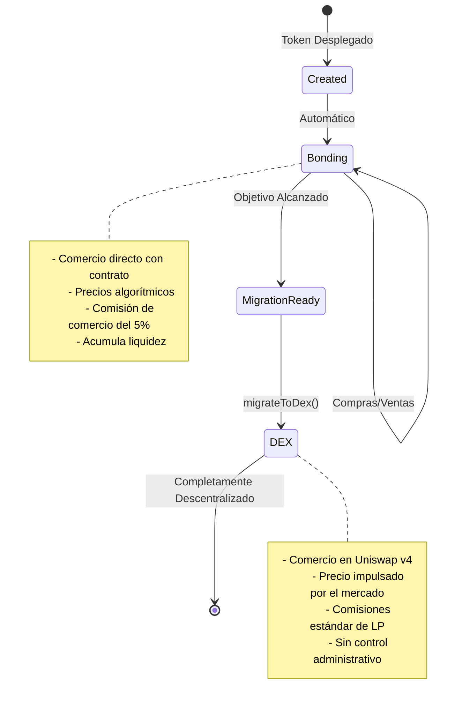
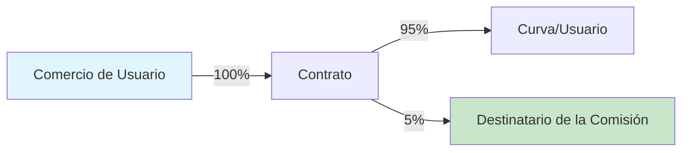

## ¿Qué es la Fase de Vinculación?

La fase de vinculación es el período inicial de comercio donde los tokens se compran y venden directamente desde un contrato inteligente utilizando una curva de precios algorítmica. Piénsalo como una preventa descentralizada con creación de mercado automática.



## Cómo Funciona la Vinculación

### El Mecanismo de la Curva de Vinculación

Durante la vinculación, el contrato actúa como el único creador de mercado:

1. **Sin Libro de Órdenes**: Precios determinados algorítmicamente
2. **Liquidez Instantánea**: Siempre es posible comprar o vender
3. **Independencia de Camino**: El precio depende solo de la oferta, no de la historia
4. **Precios Automáticos**: No es necesario establecer precios manualmente

## Operaciones de Comercio

### Comprar Tokens

<Tabs>
  <Tab title="Cómo Funciona">
    **Flujo del Proceso:**
    1. El usuario envía ETH/B3 al contrato
    2. El contrato calcula los tokens basado en la curva
    3. Se deduce una comisión del 5% y se envía al destinatario
    4. Se acuñan los tokens y se envían al comprador
    5. Se actualiza el estado de la curva
    
    **Ejemplo de Código:**
    ```typescript
    // Obtener una cotización primero
    const quote = await token.getAmountOfTokensToBuy(
      parseEther("1") // 1 ETH
    );
    console.log(`Recibirá: ${formatEther(quote)} tokens`);
    
    // Ejecutar compra con protección contra deslizamiento
    const minTokens = quote * 0.95n; // 5% de deslizamiento
    await token.buy(minTokens, "1");
    ```
  </Tab>
  
  <Tab title="Parámetros">
    | Parámetro | Tipo | Descripción |
    |-----------|------|-------------|
    | `minTokensOut` | uint256 | Tokens mínimos a recibir (protección contra deslizamiento) |
    | `ethAmount` | string/uint256 | Cantidad de ETH a gastar |
    
    **Notas Importantes:**
    - Establecer `minTokensOut` para protegerse contra el front-running
    - Usar 0 para `minTokensOut` solo en períodos de baja actividad
    - La transacción se revierte si el deslizamiento supera la tolerancia
  </Tab>
  
  <Tab title="Casos Límite">
    **Desbordamiento del Objetivo:**
    - Si la compra superara el objetivo, se reembolsa el exceso
    - Ejemplo: El objetivo es 10 ETH, se han recaudado 9.5 ETH
    - El usuario envía 1 ETH → Se usan 0.5 ETH, se reembolsan 0.5 ETH
    
    **Gas Insuficiente:**
    - Límite de gas recomendado: 200,000
    - Los cálculos complejos pueden requerir más
    
    **Cantidad Cero:**
    - Las transacciones con 0 ETH se revertirán
  </Tab>
</Tabs>

### Vender Tokens

<Tabs>
  <Tab title="Cómo Funciona">
    **Flujo del Proceso:**
    1. El usuario aprueba el gasto de tokens
    2. El usuario llama a vender con la cantidad de tokens
    3. El contrato calcula el ETH basado en la curva
    4. Se deduce una comisión del 5% de los ingresos
    5. Se envía el ETH al vendedor, los tokens se queman
    6. Se actualiza el estado de la curva (el precio disminuye)
    
    **Ejemplo de Código:**
    ```typescript
    // Verificar saldo y obtener cotización
    const balance = await token.balanceOf(userAddress);
    const sellAmount = balance / 2n; // Vender la mitad
    
    const quote = await token.getAmountOfEthToReceive(
      sellAmount
    );
    console.log(`Recibirá: ${formatEther(quote)} ETH`);
    
    // Ejecutar venta con protección contra deslizamiento
    const minEth = quote * 0.95n; // 5% de deslizamiento
    await token.sell(sellAmount, minEth);
    ```
  </Tab>
  
  <Tab title="Parámetros">
    | Parámetro | Tipo | Descripción |
    |-----------|------|-------------|
    | `tokenAmount` | uint256 | Cantidad de tokens a vender |
    | `minEthOut` | uint256 | ETH mínimo a recibir (protección contra deslizamiento) |
    
    **Notas Importantes:**
    - Requiere aprobación del token antes de vender
    - El impacto en el precio puede ser significativo para ventas grandes
    - No se pueden vender más tokens que el suministro circulante
  </Tab>
  
  <Tab title="Impacto del Precio">
    **Entendiendo el Impacto de la Venta:**
    
    Vender reduce la cantidad recaudada de la curva, causando que el precio baje:
    
    | Tamaño de Venta | Impacto en el Precio | Recuperación Necesaria |
    |-----------|--------------|-----------------|
    | 1% del suministro | ~1-2% | Pequeña |
    | 5% del suministro | ~5-10% | Moderada |
    | 10% del suministro | ~15-25% | Significativa |
    | 20% del suministro | ~30-50% | Mayor |
    
    *El impacto real depende del factor de agresividad*
  </Tab>
</Tabs>

## Estructura de Comisiones

### Cómo Funcionan las Comisiones



<AccordionGroup>
  <Accordion title="Comisiones de Compra">
    **En una compra de 1 ETH:**
    - 0.95 ETH va a la curva de vinculación
    - 0.05 ETH va al destinatario de la comisión
    - Los tokens se calculan sobre el valor de 0.95 ETH
    
    **Ejemplo:**
    ```typescript
    // El usuario envía 1 ETH
    // Comisión: 0.05 ETH
    // La curva recibe: 0.95 ETH
    // Tokens acuñados basados en 0.95 ETH
    ```
  </Accordion>
  
  <Accordion title="Comisiones de Venta">
    **Al vender por un valor de 1 ETH:**
    - El usuario recibe 0.95 ETH
    - 0.05 ETH va al destinatario de la comisión
    - La curva se reduce por el 1 ETH completo
    
    **Ejemplo:**
    ```typescript
    // Tokens valorados en 1 ETH en la curva
    // Comisión: 0.05 ETH
    // El usuario recibe: 0.95 ETH
    // La curva baja por 1 ETH
    ```
  </Accordion>
  
  <Accordion title="Distribución de Comisiones">
    **A dónde van las comisiones:**
    - 100% a la dirección `feeRecipient` designada
    - Puede ser el tesoro del proyecto, desarrollador, o DAO
    - Establecido en la creación del token, no se puede cambiar
    
    **Reclamación de comisiones:**
    - Automática - no se necesita reclamar
    - Enviadas directamente en cada comercio
    - Sin acumulación en el contrato
  </Accordion>
</AccordionGroup>

### Economía de las Comisiones

| Volumen Diario | Ingresos por Comisiones | Ingresos Mensuales |
|-------------|------------|----------------|
| 10 ETH | 0.5 ETH | ~15 ETH |
| 50 ETH | 2.5 ETH | ~75 ETH |
| 100 ETH | 5 ETH | ~150 ETH |
| 500 ETH | 25 ETH | ~750 ETH |

## Mecánica del Objetivo

### Entendiendo el Objetivo

El objetivo es la cantidad de ETH/B3 que debe acumularse antes de la migración:

<Info>
  **Propósito del Objetivo:**
  - Asegura suficiente liquidez para Uniswap v4
  - Crea un objetivo claro para la comunidad
  - Previene la migración prematura
  - Construye impulso durante la vinculación
</Info>

### Acercándose al Objetivo

```typescript
// Monitorear el progreso hacia el objetivo
async function trackProgress(token: BondkitToken) {
  const progress = await token.getBondingProgress();
  
  if (progress.progress < 0.5) {
    console.log("🌱 Etapa inicial - mejores precios disponibles");
  } else if (progress.progress < 0.8) {
    console.log("🚀 Construyendo impulso - considere comprar");
  } else if (progress.progress < 1.0) {
    console.log("🔥 Casi allí - migración inminente");
  } else {
    console.log("✅ Objetivo alcanzado - listo para migrar!");
  }
  
  la remaining = progress.threshold - progress.raised;
  console.log(`Necesita ${formatEther(remaining)} ETH más`);
}
```

### Manejo de Excedentes

Cuando una compra superaría el objetivo:

1. **Relleno Parcial**: Solo se acepta la cantidad necesaria
2. **Reembolso Automático**: El exceso se devuelve en la misma transacción
3. **Finalización Justa**: Nadie puede pagar de más al final

**Escenario de Ejemplo:**
```
Objetivo: 100 ETH
Actual: 99.5 ETH
Usuario envía: 2 ETH

Resultado:
- 0.5 ETH aceptados (alcanza exactamente 100 ETH)
- 1.5 ETH reembolsados
- Usuario obtiene tokens por 0.5 ETH
- Migración ahora disponible
```

## Eventos y Monitoreo

### Eventos del Contrato

<Tabs>
  <Tab title="Evento de Compra">
    ```solidity
    event BondingCurveBuy(
        address indexed payer,
        address indexed recipient,
        uint256 tradingTokenIn,
        uint256 tokensOut,
        uint256 fee,
        uint256 totalRaisedBonding
    );
    ```
    
    **Escuchando en SDK:**
    ```typescript
    token.onBuy((event) => {
      console.log({
        comprador: event.payer,
        ethGastado: formatEther(event.tradingTokenIn),
        tokensRecibidos: formatEther(event.tokensOut),
        comisiónPagada: formatEther(event.fee),
        totalRecaudado: formatEther(event.totalRaisedBonding)
      });
    });
    ```
  </Tab>
  
  <Tab title="Evento de Venta">
    ```solidity
    event BondingCurveSell(
        address indexed vendedor,
        uint256 tokensIn,
        uint256 tradingTokenOut,
        uint256 fee,
        uint256 totalRaisedBonding
    );
    ```
    
    **Escuchando en SDK:**
    ```typescript
    token.onSell((event) => {
      console.log({
        vendedor: event.seller,
        tokensVendidos: formatEther(event.tokensIn),
        ethRecibido: formatEther(event.tradingTokenOut),
        comisiónPagada: formatEther(event.fee),
        totalRecaudado: formatEther(event.totalRaisedBonding)
      });
    });
    ```
  </Tab>
</Tabs>

### Monitoreo en Tiempo Real

```typescript
// Configuración completa de monitoreo
class BondingMonitor {
  constructor(private token: BondkitToken) {}
  
  async start() {
    // Estado inicial
    const progress = await this.token.getBondingProgress();
    console.log(`Comenzando en ${(progress.progress * 100).toFixed(2)}%`);
    
    // Monitorear compras
    this.token.onBuy(async (event) => {
      const newProgress = await this.token.getBondingProgress();
      console.log(`COMPRA: ${formatEther(event.tokensOut)} tokens`);
      console.log(`Progreso: ${(newProgress.progress * 100).toFixed(2)}%`);
      
      if (newProgress.progress >= 1.0) {
        console.log("🎆 ¡OBJETIVO ALCANZADO! Migración disponible.");
      }
    });
    
    // Monitorear ventas
    this.token.onSell(async (event) => {
      const newProgress = await this.token.getBondingProgress();
      console.log(`VENTA: ${formatEther(event.tokensIn)} tokens`);
      console.log(`Progreso: ${(newProgress.progress * 100).toFixed(2)}%`);
    });
  }
}

// Uso
const monitor = new BondingMonitor(token);
await monitor.start();
```

## Estrategias de la Fase de Vinculación

### Para Creadores de Tokens

<CardGroup cols={2}>
  <Card title="Construir Impulso" icon="chart-line">
    - Comenzar con menor agresividad (30-50)
    - Establecer objetivos alcanzables
    - Involucrar a la comunidad desde el principio
    - Proporcionar una hoja de ruta clara
  </Card>
  
  <Card title="Maximizar el Éxito" icon="trophy">
    - Sembrar liquidez inicial usted mismo
    - Crear incentivos de compra
    - Temporizar anuncios adecuadamente
    - Planificar para después de la migración
  </Card>
</CardGroup>

### Para Comerciantes

<CardGroup cols={2}>
  <Card title="Estrategia de Entrada" icon="door-open">
    - Comprar temprano para obtener los mejores precios
    - Usar DCA para grandes cantidades
    - Monitorear el factor de agresividad
    - Verificar el progreso del objetivo
  </Card>
  
  <Card title="Gestión de Riesgos" icon="shield">
    - Siempre usar protección contra deslizamiento
    - Entender el impacto en el precio
    - No dejarse llevar por el FOMO cerca del objetivo
    - Planificar estrategia de salida
  </Card>
</CardGroup>

## Transición Post-Vinculación

<Warning>
  **Crítico: Después de la Migración**
  
  Una vez se llama a `migrateToDex()`:
  - ❌ Comercio en la curva de vinculación permanentemente deshabilitado
  - ❌ No más funciones de buy() o sell()
  - ✅ Todo el comercio se traslada a Uniswap v4
  - ✅ Se aplican mecánicas estándar de AMM
  - ✅ Cualquiera puede proporcionar liquidez
  - ✅ Comercio completamente descentralizado
</Warning>

## Próximos Pasos

<CardGroup cols={3}>
  <Card title="Guía de Precios" icon="tags" href="/bondkit/concepts/pricing">
    Entender la mecánica de precios
  </Card>
  <Card title="Establecimiento de Objetivos" icon="bullseye" href="/bondkit/concepts/targets">
    Elegir el objetivo correcto
  </Card>
  <Card title="Proceso de Migración" icon="rocket" href="/bondkit/guides/migration">
    Aprender sobre la transición a DEX
  </Card>
</CardGroup>
