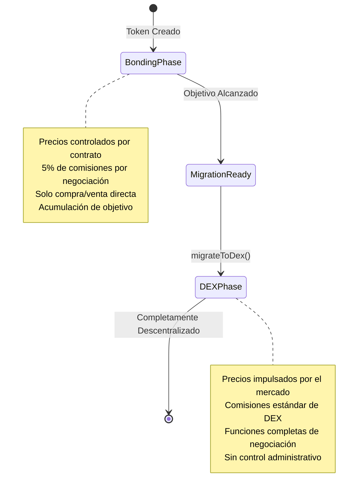

## ¿Qué es la Fase DEX?

La fase DEX es la etapa final del ciclo de vida de un token de Bondkit, donde la negociación transita de la curva de bonificación automatizada a un pool completamente descentralizado de Uniswap v4. Esta fase comienza inmediatamente después de la migración y representa la descentralización completa.



## Cómo Funciona la Migración

### El Proceso de Transición

Cuando se llama a `migrateToDex()` después de alcanzar el objetivo:

1. **Estado del Contrato**: El estado del token cambia a `TokenStatus.Dex`
2. **Pool de Uniswap v4**: Se crea un nuevo pool con la liquidez acumulada
3. **Inicialización del Precio**: El precio inicial del pool se calcula a partir del precio de salida de la curva de bonificación
4. **Renuncia de Propiedad**: La propiedad del contrato se transfiere a la dirección cero
5. **Habilitación de Negociación**: La negociación completa de DEX comienza inmediatamente

### Configuración del Pool

**Configuración Automática del Pool:**
```typescript
// El pool se crea con estos parámetros (desde la migración)
const poolConfig = {
  currency0: tradingToken < bondkitToken ? tradingToken : bondkitToken,
  currency1: tradingToken < bondkitToken ? bondkitToken : tradingToken,
  fee: 3000,        // Comisión estándar de 0.3%
  tickSpacing: 60,  // Espaciado estándar de ticks
  hooks: customHook // Hooks específicos de Bondkit
};
```

**Liquidez Inicial:**
- **Token de Negociación**: Todos los fondos acumulados de la fase de bonificación
- **Tokens de Bondkit**: Cantidad calculada para igualar el precio de salida
- **Tokens LP**: Divididos entre el receptor de comisiones y quemados/distribuidos

## Negociación en la Fase DEX

### Opciones de Negociación

**Negociación Estándar de DEX:**
Los tokens de Bondkit en la fase DEX pueden ser negociados usando cualquier interfaz compatible con Uniswap v4, agregador de DEX o plataforma de negociación.

**SDK Helper (Opcional):**
El SDK proporciona `BondkitSwapService` para una integración simplificada si es necesario.

### Descubrimiento de Precios & Liquidez

**Precios Impulsados por el Mercado:**
- No más curva de bonificación algorítmica
- Precio determinado por la oferta/demanda
- Dinámicas de libro de órdenes en tiempo real
- Sujeto a la volatilidad del mercado

**Fuentes de Liquidez:**
```typescript
// Liquidez inicial de la migración
const migrationData = {
  tradingTokenLiquidity: "10.0",    // ETH/B3 de la bonificación
  bondkitTokenLiquidity: "500000",  // Cantidad de tokens calculada
  initialPrice: "0.00002",          // Precio por token
  totalValueLocked: "20.0"          // TVL combinado
};

// Liquidez adicional de:
// - LPs de la comunidad
// - Programas de incentivos  
// - Acumulación de comisiones de negociación
```

## Diferencias Clave de la Fase de Bonificación

### Mecánicas de Negociación

| Aspecto | Fase de Bonificación | Fase DEX |
|--------|--------------|-----------|
| **Precios** | Curva algorítmica | Oferta/demanda del mercado |
| **Liquidez** | Ilimitada (el contrato acuña) | Liquidez limitada del pool |
| **Comisiones** | 5% al receptor de comisiones | 0.3% a los LPs + protocolo |
| **Tipos de Órdenes** | Solo compra/venta | Funciones completas de DEX |
| **Impacto en el Precio** | Curva predecible | Depende de la profundidad de liquidez |
| **MEV** | No aplicable | Sujeto a MEV |

### Cambios en el Contrato Inteligente

**Transición de Estado:**
```typescript
// Verificar fase actual
const status = await token.getStatus();

if (status === TokenStatus.Dex) {
  // Usar métodos de negociación de DEX
  const swapService = new BondkitSwapService(tokenAddress);
  // ... código de negociación de DEX
} else if (status === TokenStatus.Bonding) {
  // Usar métodos de curva de bonificación
  await token.buy(amount, minTokensOut);
}
```

**Disponibilidad de Métodos:**
- ✅ `token.buy()` / `token.sell()` - **Deshabilitado** (se revertirá)
- ✅ Negociación de DEX vía `BondkitSwapService`
- ✅ La funcionalidad estándar ERC20 continúa
- ✅ Monitoreo de eventos para negociaciones de DEX

## Funciones Avanzadas de DEX

### Integración de Hooks Personalizados

Los tokens de Bondkit en Uniswap v4 incluyen hooks personalizados para funcionalidades mejoradas:

```typescript
// Características de los hooks (aplicadas automáticamente)
const hookFeatures = {
  beforeSwap: "Cálculos de comisiones personalizadas",
  afterSwap: "Seguimiento de análisis", 
  beforeAddLiquidity: "Recompensas LP",
  afterRemoveLiquidity: "Manejo de comisiones de salida"
};
```

### Análisis y Monitoreo

**Datos en Tiempo Real:**
```typescript
import TradingView from "@b3dotfun/sdk/bondkit/components/TradingView";

// Gráficos profesionales con datos de DEX
function DEXTradingInterface({ tokenAddress, tokenSymbol }) {
  return (
    <div className="space-y-6">
      {/* Gráfico de precios con datos de DEX */}
      <TradingView 
        tokenAddress={tokenAddress}
        tokenSymbol={tokenSymbol}
        className="h-96 w-full"
      />
      
      {/* Interfaz de negociación */}
      <SwapInterface tokenAddress={tokenAddress} />
    </div>
  );
}
```

**Métricas Disponibles:**
- Feeds de precios en tiempo real
- Volumen y cambio de 24h  
- Profundidad de liquidez
- Datos históricos OHLCV
- Historial de transacciones
- Análisis de poseedores

### Provisión de Liquidez

**Convertirse en LP:**
```typescript
// Añadir liquidez al pool de tokens de Bondkit
import { Pool, Position } from "@uniswap/v3-sdk";

const position = new Position({
  pool: bondkitPool,
  liquidity: targetLiquidity,
  tickLower: lowerTick,
  tickUpper: upperTick
});

// Ganar comisiones de negociación + incentivos potenciales
```

**Beneficios LP:**
- **Comisiones de Negociación**: Ganar el 0.3% de todo el volumen de intercambio
- **Programas de Incentivos**: Recompensas adicionales potenciales
- **Apreciación del Precio**: Beneficiarse del crecimiento del token
- **Pérdida Impermanente**: Los riesgos estándar de AMM aplican

## Análisis del Impacto de la Migración

### Para los Poseedores de Tokens

**Efectos Inmediatos:**
- ✅ Los tokens siguen siendo completamente transferibles
- ✅ Pueden negociarse en el mercado abierto
- ✅ Sin períodos de bloqueo
- ⚠️ El precio ahora está sujeto a la volatilidad del mercado
- ⚠️ No hay liquidez garantizada (depende de la profundidad del pool)

**Beneficios a Largo Plazo:**
- 🚀 Acceso a un ecosistema de negociación más amplio
- 🚀 Integración con protocolos DeFi
- 🚀 Composabilidad con otros tokens
- 🚀 Se logra la verdadera descentralización

### Para Proyectos

**Cambios Operativos:**
```typescript
// Pre-migración: Control directo
await token.buy(amount, minOut);    // ✅ Funciona
await token.migrateToDex();         // Acción única

// Post-migración: Basado en el mercado
await token.buy(amount, minOut);    // ❌ Se revierte
await swapService.executeSwap(...); // ✅ Usar esto en su lugar
```

**Nuevas Responsabilidades:**
- **Construcción de Comunidad**: Impulsar el volumen de negociación orgánico
- **Incentivos de Liquidez**: Fomentar la participación de LP  
- **Marketing**: Promover la utilidad y adopción del token
- **Integración**: Listar en agregadores de DEX y plataformas

## Mejores Prácticas para la Fase DEX

### Para Traders

<AccordionGroup>
  <Accordion title="Estrategias de Negociación Óptimas">
    **Gestión del Deslizamiento:**
    - Usar un deslizamiento del 0.5-2% para pequeñas operaciones
    - Deslizamiento mayor para cantidades grandes
    - Verificar el impacto en el precio antes de ejecutar
    
    **Consideraciones de Tiempo:**
    - Mayor liquidez durante horas activas
    - Monitorear movimientos grandes de LP
    - Usar órdenes limitadas cuando estén disponibles
    
    **Ejemplo:**
    ```typescript
    const quote = await swapService.getSwapQuote({
      // ... parámetros
      slippageTolerance: parseFloat(quote.priceImpact) > 5 ? 0.02 : 0.005
    });
    ```
  </Accordion>
  
  <Accordion title="Gestión de Riesgos">
    **Análisis de Liquidez:**
    - Verificar el TVL del pool antes de operaciones grandes
    - Monitorear la actividad del proveedor de liquidez
    - Entender la pérdida impermanente si es LP
    
    **Monitoreo de Precios:**
    - Configurar alertas de precios
    - Usar estrategias de stop-loss
    - Diversificar entre múltiples tokens
  </Accordion>
</AccordionGroup>

### Para Desarrolladores

<AccordionGroup>
  <Accordion title="Patrones de Integración">
    **Verificación de Estado:**
    ```typescript
    async function getOptimalTradingMethod(token: BondkitToken) {
      const status = await token.getStatus();
      
      if (status === TokenStatus.Bonding) {
        return {
          method: "bonding",
          interface: token
        };
      } else if (status === TokenStatus.Dex) {
        return {
          method: "dex", 
          interface: new BondkitSwapService(token.contractAddress)
        };
      }
    }
    ```
    
    **Manejo de Errores:**
    ```typescript
    try {
      // Siempre verificar la fase primero
      const tradingMethod = await getOptimalTradingMethod(token);
      
      if (tradingMethod.method === "dex") {
        await tradingMethod.interface.executeSwap(params, wallet);
      }
    } catch (error) {
      if (error.message.includes("TradingDisabledDexPhaseActive")) {
        // Cambiar a negociación de DEX
        const swapService = new BondkitSwapService(tokenAddress);
        await swapService.executeSwap(params, wallet);
      }
    }
    ```
  </Accordion>
</AccordionGroup>

## Preguntas Comunes

<AccordionGroup>
  <Accordion title="¿Pueden los tokens volver a la fase de bonificación?">
    **No** - La migración es permanente e irreversible. Una vez en la fase DEX, el token siempre se negociará en Uniswap v4.
  </Accordion>
  
  <Accordion title="¿Qué pasa con la liquidez de la curva de bonificación no utilizada?">
    Todos los tokens de negociación acumulados de la fase de bonificación se convierten en la liquidez inicial en el pool de Uniswap v4, emparejados con tokens de Bondkit calculados al precio de salida.
  </Accordion>
  
  <Accordion title="¿Hay alguna restricción en la fase DEX?">
    Sin restricciones - los tokens se convierten en ERC20s estándar que negocian en Uniswap v4. Se habilita la composabilidad completa de DeFi.
  </Accordion>
  
  <Accordion title="¿Cómo son diferentes las comisiones de negociación?">
    La fase DEX utiliza comisiones estándar de Uniswap v4 (0.3%) que van a los proveedores de liquidez en lugar de la comisión de la fase de bonificación del 5% al receptor de comisiones.
  </Accordion>
</AccordionGroup>

## Próximos Pasos

<CardGroup cols={2}>
  <Card title="Comenzar la Negociación DEX" icon="arrow-right" href="/bondkit/sdk/reference#bondkitswapservice">
    Aprende a usar BondkitSwapService para la negociación DEX
  </Card>
  <Card title="Agregar Gráficos de Negociación" icon="chart-line" href="/bondkit/sdk/reference#tradingview-component">  
    Integra gráficos de TradingView para tus tokens DEX
  </Card>
  <Card title="Convertirse en LP" icon="coins" href="https://app.uniswap.org">
    Proporciona liquidez y gana comisiones de negociación
  </Card>
  <Card title="Monitorear Análisis" icon="analytics" href="https://info.uniswap.org">
    Rastrea el rendimiento DEX de tu token  
  </Card>
</CardGroup>
