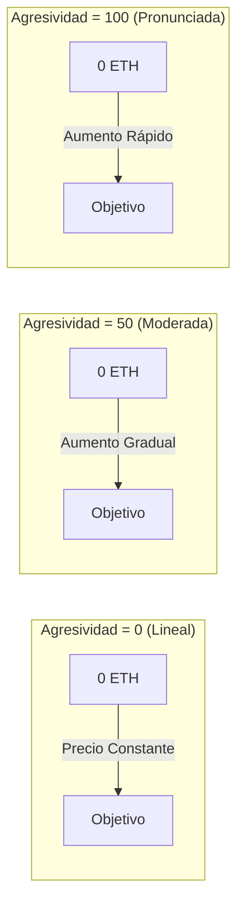

## Curvas de Precios Visuales



## Modelo de Curva de Bonos

### Fórmula Matemática

<Note>
  **Fórmula Central**
  ```
  S = S_final × (R / R_objetivo)^exponente
  ```
  Donde:
  - `S` = Suministro actual de tokens
  - `S_final` = Suministro final de tokens
  - `R` = Monto recaudado hasta ahora
  - `R_objetivo` = Monto objetivo
  - `exponente = 1 / (1 + factorDeAgresividad/100)`
</Note>

### Entendiendo el Exponente

El factor de agresividad controla cómo el exponente afecta la progresión del precio:

| Agresividad | Exponente | La Fórmula Se Convierte | Comportamiento del Precio |
|---------------|----------|-----------------|----------------|
| 0 | 1.00 | S = S_final × (R/R_objetivo) | Lineal - tokens constantes por ETH |
| 25 | 0.80 | S = S_final × (R/R_objetivo)^0.80 | Ligeramente curvada |
| 50 | 0.67 | S = S_final × (R/R_objetivo)^0.67 | Curva moderada |
| 75 | 0.57 | S = S_final × (R/R_objetivo)^0.57 | Curva pronunciada |
| 100 | 0.50 | S = S_final × √(R/R_objetivo) | Muy pronunciada (raíz cuadrada) |

### Ejemplos de Impacto en el Precio

Veamos cuántos tokens compra 1 ETH en diferentes etapas con un objetivo de 10 ETH:

<Tabs>
  <Tab title="Agresividad = 0">
    **Precios Lineales (Justo para todos)**
    
    | ETH Recaudado | Tokens por ETH | Cambio de Precio |
    |------------|---------------|---------------|
    | 0 → 1 ETH | 100,000 | Base |
    | 4 → 5 ETH | 100,000 | 0% |
    | 9 → 10 ETH | 100,000 | 0% |
    
    *Todos obtienen el mismo trato*
  </Tab>
  
  <Tab title="Agresividad = 50">
    **Curva Moderada (Equilibrada)**
    
    | ETH Recaudado | Tokens por ETH | Cambio de Precio |
    |------------|---------------|---------------|
    | 0 → 1 ETH | 146,000 | Base |
    | 4 → 5 ETH | 87,000 | -40% |
    | 9 → 10 ETH | 51,000 | -65% |
    
    *Los compradores tempranos obtienen 3 veces más que los tardíos*
  </Tab>
  
  <Tab title="Agresividad = 100">
    **Curva Pronunciada (Premia a los primeros)**
    
    | ETH Recaudado | Tokens por ETH | Cambio de Precio |
    |------------|---------------|---------------|
    | 0 → 1 ETH | 316,000 | Base |
    | 4 → 5 ETH | 89,000 | -72% |
    | 9 → 10 ETH | 31,000 | -90% |
    
    *Los compradores tempranos obtienen 10 veces más que los tardíos*
  </Tab>
</Tabs>

## Calculadora de Precios Interactiva

```typescript
// Calcula los tokens recibidos por una cantidad dada de ETH
function calculateTokensReceived(
  ethAmount: number,
  currentRaised: number,
  targetEth: number,
  totalSupply: number,
  aggressiveness: number
): number {
  const exponent = 1 / (1 + aggressiveness / 100);
  
  // Calcula el suministro al monto recaudado actual
  const currentSupply = totalSupply * 
    Math.pow(currentRaised / targetEth, exponent);
  
  // Calcula el suministro después de la compra
  const newRaised = currentRaised + ethAmount;
  const newSupply = totalSupply * 
    Math.pow(newRaised / targetEth, exponent);
  
  // Tokens recibidos = diferencia en el suministro
  return newSupply - currentSupply;
}

// Ejemplo de uso
const tokens = calculateTokensReceived(
  1,        // Compra de 1 ETH
  5,        // Ya se han recaudado 5 ETH
  10,       // Objetivo de 10 ETH
  1000000,  // Suministro total de 1M
  50        // 50% de agresividad
);
console.log(`Recibirás ${tokens.toFixed(0)} tokens`);
```

## Elegir Tu Factor de Agresividad

### Marco de Decisión

<CardGroup cols={3}>
  <Card title="Bajo (0-30)" icon="equals">
    **Mejor para:**
    - Lanzamientos justos
    - Tokens comunitarios
    - Precios estables
    
    **Pros:**
    - Igualdad de oportunidades
    - Costos predecibles
    - Menos FOMO
    
    **Contras:**
    - Sin incentivo temprano
    - Impulso más lento
  </Card>
  
  <Card title="Medio (30-70)" icon="chart-line">
    **Mejor para:**
    - La mayoría de los proyectos
    - Enfoque equilibrado
    - Recompensas moderadas
    
    **Pros:**
    - Alguna ventaja temprana
    - Aún accesible
    - Buen impulso
    
    **Contras:**
    - Complejidad moderada
    - Alguna variación de precios
  </Card>
  
  <Card title="Alto (70-100)" icon="rocket">
    **Mejor para:**
    - Lanzamientos con hype
    - Premiar a los primeros adoptantes
    - Recaudación de fondos rápida
    
    **Pros:**
    - Fuerte incentivo temprano
    - Crea urgencia
    - Recompensa a los creyentes
    
    **Contras:**
    - Puede parecer injusto
    - Alta variación de precios
    - Impulsado por FOMO
  </Card>
</CardGroup>

## Mecánicas de Venta

Cuando los usuarios venden tokens de vuelta a la curva:

1. **Cálculo de Precio**: Usa el inverso de la fórmula de compra
2. **Deducción de Tarifa**: Se aplica una tarifa del 5% a los ingresos
3. **Actualización de la Curva**: Reduce el monto total recaudado
4. **Impacto en el Precio**: Las ventas grandes impactan significativamente el precio

### Fórmula del Precio de Venta

```typescript
// Calcula el ETH recibido por vender tokens
function calculateEthReceived(
  tokenAmount: number,
  currentSupply: number,
  currentRaised: number,
  targetEth: number,
  totalSupply: number,
  aggressiveness: number
): number {
  const exponent = 1 / (1 + aggressiveness / 100);
  
  // Calcula el nuevo suministro después de la venta
  const newSupply = currentSupply - tokenAmount;
  
  // Calcula el monto recaudado correspondiente
  const supplyRatio = newSupply / totalSupply;
  const newRaised = targetEth * 
    Math.pow(supplyRatio, 1 / exponent);
  
  // ETH recibido (antes de tarifas)
  const ethBeforeFees = currentRaised - newRaised;
  
  // Aplicar tarifa del 5%
  return ethBeforeFees * 0.95;
}
```

## Casos Límite y Límites

<Warning>
  **Consideraciones Importantes:**
  
  1. **Reembolsos**: Si una compra excediera el objetivo, el exceso de ETH se reembolsa
  2. **Cantidades Mínimas**: Las transacciones muy pequeñas pueden revertirse debido al redondeo
  3. **Suministro Máximo**: No puede exceder `finalTokenSupply`
  4. **Límites de Precio**: Una agresividad extrema puede causar picos de precio
  5. **Deslizamiento**: Siempre use `minTokensOut` para protección
</Warning>

## Ejemplos del Mundo Real

### Estudio de Caso: Token de Lanzamiento Justo
- **Agresividad**: 10
- **Objetivo**: 50 ETH
- **Resultado**: Precios casi lineales, la comunidad valoró la justicia

### Estudio de Caso: Token con Hype
- **Agresividad**: 85
- **Objetivo**: 100 ETH
- **Resultado**: Alcanzó el objetivo en 2 horas, los compradores tempranos ganaron 8x

### Estudio de Caso: Proyecto Equilibrado
- **Agresividad**: 45
- **Objetivo**: 25 ETH
- **Resultado**: Crecimiento constante durante 3 días, ventaja de 2.5x para los compradores tempranos

## Próximos Pasos

<CardGroup cols={2}>
  <Card title="Establecer Agresividad" icon="sliders" href="/bondkit/guides/set-aggressiveness">
    Aprende a elegir el factor correcto
  </Card>
  <Card title="Estimación de Precios" icon="calculator" href="/bondkit/guides/est-migration-price">
    Estima tu precio de migración
  </Card>
</CardGroup>

