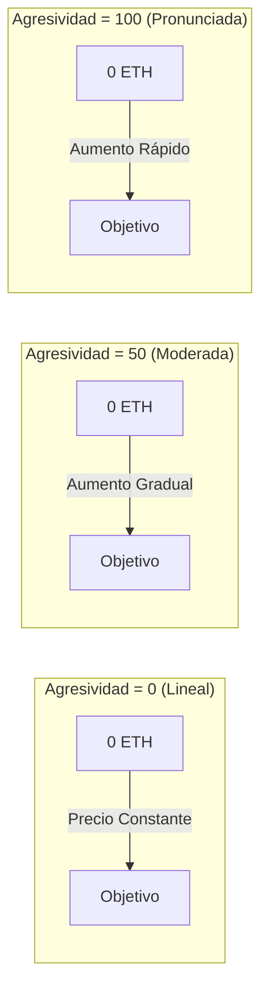

## Curvas de Precios Visuales



## Modelo de Curva de Bonos

### Fórmula Matemática

<Note>
  **Fórmula Central**
  ```
  S = S_final × (R / R_objetivo)^exponente
  ```
  Donde:
  - `S` = Suministro actual de tokens
  - `S_final` = Suministro final de tokens
  - `R` = Monto recaudado hasta ahora
  - `R_objetivo` = Monto objetivo
  - `exponente = 1 / (1 + factorDeAgresividad/100)`
</Note>

### Entendiendo el Exponente

El factor de agresividad controla cómo el exponente afecta la progresión del precio:

| Agresividad | Exponente | La Fórmula Se Convierte | Comportamiento del Precio |
|---------------|----------|-----------------|----------------|
| 0 | 1.00 | S = S_final × (R/R_objetivo) | Lineal - tokens constantes por ETH |
| 25 | 0.80 | S = S_final × (R/R_objetivo)^0.80 | Ligeramente curvada |
| 50 | 0.67 | S = S_final × (R/R_objetivo)^0.67 | Curva moderada |
| 75 | 0.57 | S = S_final × (R/R_objetivo)^0.57 | Curva pronunciada |
| 100 | 0.50 | S = S_final × √(R/R_objetivo) | Muy pronunciada (raíz cuadrada) |

### Impacto del Factor de Agresividad

#### Distribución Acumulativa de Tokens

Vea cómo se distribuyen los tokens a lo largo del proceso de bonificación con diferentes factores de agresividad.

**Ejemplo:** Objetivo de 10M B3, suministro total de tokens de 1.25M (1M disponible para bonificación, 250K reservados para LP)

| Progreso | Agresividad = 0 | 25 | 50 | 75 | 100 |
|----------|-------------------|----------------------|----------------------|----------------------|----------------------|
| 10% | 100,000 | 158,489 | 215,443 | 268,270 | 316,228 |
| 20% | 200,000 | 275,946 | 341,995 | 398,647 | 447,214 |
| 30% | 300,000 | 381,678 | 448,140 | 502,588 | 547,723 |
| 40% | 400,000 | 480,450 | 542,884 | 592,387 | 632,456 |
| 50% | 500,000 | 574,349 | 629,961 | 672,950 | 707,107 |
| 60% | 600,000 | 664,540 | 711,379 | 746,843 | 774,597 |
| 70% | 700,000 | 751,759 | 788,374 | 815,614 | 836,660 |
| 80% | 800,000 | 836,512 | 861,774 | 880,284 | 894,427 |
| 90% | 900,000 | 919,166 | 932,170 | 941,571 | 948,683 |
| 100% | 1,000,000 | 1,000,000 | 1,000,000 | 1,000,000 | 1,000,000 |

<Note>
**Percepción Clave:** Una mayor agresividad adelanta la distribución de tokens a los primeros compradores. Al 10% de progreso:
- **Agresividad 0**: 100,000 (lineal)
- **Agresividad 100**: 316,228 (ventaja de 3.16x!)

Los primeros compradores con curvas agresivas obtienen significativamente más tokens por su B3, mientras que los compradores tardíos enfrentan precios mucho más altos.
</Note>

#### Ejemplo del Mundo Real: La Compra de Alice

Sigamos a Alice, quien quiere comprar tokens de un nuevo proyecto en su lanzamiento:

**Configuración del Proyecto:**
- **Suministro Total**: 1.25M de tokens (1M para bonificación + 250K para LP)
- **Objetivo**: 10M B3 para alcanzar la migración  
- **Agresividad**: 100 (máxima recompensa para compradores tempranos)
- **Progreso Actual**: 0% (el proyecto acaba de lanzarse)

**Compra de Alice:**
Alice decide comprar tokens por valor de 1M B3 justo en el lanzamiento (0% de progreso).

1. **Alice envía**: 1M de tokens B3
2. **Tarifa de transacción (3%)**: 30K B3 van a los destinatarios de la tarifa  
3. **Monto para la curva**: 970K B3 avanzan el proyecto a ~9.7% de progreso
4. **Tokens recibidos**: ~306,000 tokens (calculados desde la curva de bonificación)

**Comparando Diferentes Puntos de Entrada:**
Si Alice esperara y comprara el mismo valor de 1M B3 en diferentes etapas del proyecto:

| Progreso del Proyecto | 1M B3 de Alice Le Consiguen | Precio por Token |
|-----------------|------------------------|-----------------|
| 0% (lanzamiento) | ~306,000 tokens | ~3.3 B3/token |
| 50% de progreso | ~114,000 tokens | ~8.8 B3/token |  
| 90% de progreso | ~49,000 tokens | ~20.4 B3/token |

**Ventaja de Comprador Temprano:** ¡Alice obtiene 6.2x más tokens comprando en el lanzamiento en comparación con esperar hasta el 90% de progreso!

<Note>
**Conclusión Clave**: Con la máxima agresividad (100), comprar 1M B3 en el lanzamiento le consigue a Alice 6.2x más tokens que esperar hasta el 90% de progreso. ¡La curva de bonificación recompensa enormemente la participación temprana!
</Note>

## Calculadora de Precios Interactiva

```typescript
// Calcular tokens recibidos por una cantidad dada de tokens de comercio
function calculateTokensReceived(
  tradingTokenAmount: number,
  currentRaised: number,
  targetAmount: number,
  totalSupply: number,
  aggressiveness: number
): number {
  const exponent = 1 / (1 + aggressiveness / 100);
  
  // Calcular suministro en el monto recaudado actual
  const currentSupply = totalSupply * 
    Math.pow(currentRaised / targetAmount, exponent);
  
  // Calcular suministro después de la compra
  const newRaised = currentRaised + tradingTokenAmount;
  const newSupply = totalSupply * 
    Math.pow(newRaised / targetAmount, exponent);
  
  // Tokens recibidos = diferencia en suministro
  return newSupply - currentSupply;
}

// Ejemplo de uso
const tokens = calculateTokensReceived(
  1,        // Compra de 1 ETH
  5,        // Ya se han recaudado 5 ETH
  10,       // Objetivo de 10 ETH
  1000000,  // Suministro total de 1M
  50        // 50% de agresividad
);
console.log(`Recibirás ${tokens.toFixed(0)} tokens`);
```

## Elegir Tu Factor de Agresividad

### Marco de Decisión

<CardGroup cols={3}>
  <Card title="Bajo (0-30)" icon="equals">
    **Ideal para:**
    - Lanzamientos justos
    - Tokens comunitarios
    - Precios estables
    
    **Pros:**
    - Igualdad de oportunidades
    - Costos predecibles
    - Menos FOMO
    
    **Contras:**
    - Sin incentivo temprano
    - Impulso más lento
  </Card>
  
  <Card title="Medio (30-70)" icon="chart-line">
    **Ideal para:**
    - La mayoría de los proyectos
    - Enfoque equilibrado
    - Recompensas moderadas
    
    **Pros:**
    - Alguna ventaja temprana
    - Todavía accesible
    - Buen impulso
    
    **Contras:**
    - Complejidad moderada
    - Alguna variación de precios
  </Card>
  
  <Card title="Alto (70-100)" icon="rocket">
    **Ideal para:**
    - Lanzamientos con hype
    - Recompensar a los adoptantes tempranos
    - Recaudación de fondos rápida
    
    **Pros:**
    - Fuerte incentivo temprano
    - Crea urgencia
    - Recompensa a los creyentes
    
    **Contras:**
    - Puede parecer injusto
    - Alta variación de precios
    - Impulsado por FOMO
  </Card>
</CardGroup>

## Mecánicas de Venta

Cuando los usuarios venden tokens de vuelta a la curva:

1. **Cálculo del Precio**: Usa el inverso de la fórmula de compra
2. **Deducción de Tarifa**: Se aplica una tarifa del 5% a los ingresos
3. **Actualización de la Curva**: Reduce el monto total recaudado
4. **Impacto en el Precio**: Las ventas grandes impactan significativamente el precio

### Fórmula del Precio de Venta

```typescript
// Calcular tokens de comercio recibidos por vender tokens
function calculateTradingTokenReceived(
  tokenAmount: number,
  currentSupply: number,
  currentRaised: number,
  targetAmount: number,
  totalSupply: number,
  aggressiveness: number
): number {
  const exponent = 1 / (1 + aggressiveness / 100);
  
  // Calcular nuevo suministro después de la venta
  const newSupply = currentSupply - tokenAmount;
  
  // Calcular monto recaudado correspondiente
  const supplyRatio = newSupply / totalSupply;
  const newRaised = targetEth * 
    Math.pow(supplyRatio, 1 / exponent);
  
  // ETH recibidos (antes de tarifas)
  const ethBeforeFees = currentRaised - newRaised;
  
  // Aplicar tarifa del 5%
  return ethBeforeFees * 0.95;
}
```

## Casos Límite y Límites

<Warning>
  **Consideraciones Importantes:**
  
  1. **Reembolsos**: Si una compra excediera el objetivo, el exceso de ETH se reembolsa
  2. **Cantidades Mínimas**: Las transacciones muy pequeñas pueden revertirse debido al redondeo
  3. **Suministro Máximo**: No puede exceder `finalTokenSupply`
  4. **Límites de Precio**: La agresividad extrema puede causar picos de precio
  5. **Deslizamiento**: Siempre use `minTokensOut` para protección
</Warning>

## Ejemplos del Mundo Real

### Estudio de Caso: Token de Lanzamiento Justo
- **Agresividad**: 10
- **Objetivo**: 50 ETH
- **Resultado**: Precios casi lineales, la comunidad apreció la justicia

### Estudio de Caso: Token con Hype
- **Agresividad**: 85
- **Objetivo**: 100 ETH
- **Resultado**: Alcanzó el objetivo en 2 horas, los compradores tempranos ganaron 8x

### Estudio de Caso: Proyecto Equilibrado
- **Agresividad**: 45
- **Objetivo**: 25 ETH
- **Resultado**: Crecimiento constante durante 3 días, ventaja de 2.5x para compradores tempranos

## Próximos Pasos

<CardGroup cols={2}>
  <Card title="Establecer Agresividad" icon="sliders" href="/bondkit/guides/set-aggressiveness">
    Aprende a elegir el factor correcto
  </Card>
  <Card title="Estimación de Precios" icon="calculator" href="/bondkit/guides/est-migration-price">
    Estima tu precio de migración
  </Card>
</CardGroup>

