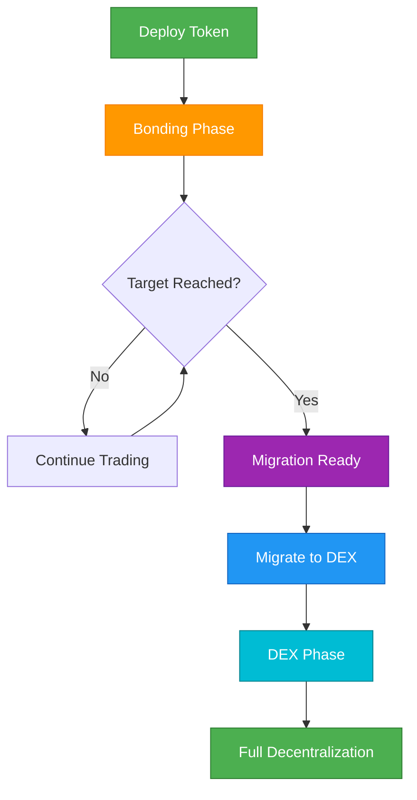

## Visión general

Esta guía te lleva a través del ciclo de vida completo de un token Bondkit, desde la creación inicial hasta la descentralización total. Entender este flujo es esencial para lanzamientos y gestión exitosos de tokens.



## Fase 1: Creación del Token

### Planificación Pre-Despliegue

<AccordionGroup>
  <Accordion title="Elige Tus Parámetros">
    **Decisiones Críticas:**
    
    | Parámetro | Impacto | Recomendación |
    |-----------|---------|----------------|
    | **finalTokenSupply** | Total de tokens creados | 1M-100M tokens típicos |
    | **aggressivenessFactor** | Pendiente de la curva de precios | 30-60 para lanzamientos equilibrados |
    | **targetAmount** | Umbral de migración | 5-50 tokens de trading |
    | **tradingToken** | Con qué pagan los usuarios | Usa B3 para la mainnet Base |
    
    **Configuración de Ejemplo:**
    ```typescript
    const tokenConfig = {
      name: "MyToken",
      symbol: "MTK",
      finalTokenSupply: parseEther("10000000"), // 10M tokens
      aggressivenessFactor: 45, // Curva moderada
      targetAmount: parseEther("20"), // 20 tokens B3
      tradingToken: "0xB3B32F9f8827D4634fE7d973Fa1034Ec9fdDB3B3"
    };
    ```
  </Accordion>
  
  <Accordion title="Establecer Estructura de Tarifas">
    **Estrategia de Distribución de Tarifas:**
    
    ```typescript
    const feeConfig = {
      feeRecipient: "0x...", // Tu dirección de tesorería/equipo
      lpSplitRatioFeeRecipientBps: 2000n, // 20% al receptor de la tarifa
      // El 80% restante se convierte en tokens LP después de la migración
    };
    ```
    
    **Flujo de Tarifas:**
    - **Fase de Bonding**: 5% de todas las transacciones → `feeRecipient`
    - **Post-Migración**: 0.3% tarifas de trading → proveedores de LP
  </Accordion>
</AccordionGroup>

### Ejecución del Despliegue

```typescript
import { BondkitTokenFactory } from "@b3dotfun/sdk/bondkit";
import { base } from "viem/chains";

// 1. Inicializar fábrica
const factory = new BondkitTokenFactory(
  base.id,
  process.env.WALLET_PRIVATE_KEY
);

// 2. Desplegar con configuración completa
const tokenAddress = await factory.deployBondkitToken({
  // Metadatos del token
  name: "MyToken",
  symbol: "MTK",
  
  // Economía
  finalTokenSupply: parseEther("10000000"),
  aggressivenessFactor: 45,
  targetAmount: parseEther("20"),
  
  // Estructura de tarifas  
  feeRecipient: process.env.TREASURY_ADDRESS,
  lpSplitRatioFeeRecipientBps: 2000n,
  
  // Administración y migración
  migrationAdminAddress: process.env.ADMIN_ADDRESS,
  
  // Configuración Uniswap V4
  bondingPhaseSplitter: "0x2AB69e0d9D20D3700466153D84a6574128154Fd2",
  v4PoolManager: "0x498581fF718922c3f8e6A244956aF099B2652b2b",
  v4Hook: "0xB36f4A2FB18b745ef8eD31452781a463d2B3f0cC",
  v4PoolFee: 3000,
  v4TickSpacing: 60,
  tradingToken: "0xB3B32F9f8827D4634fE7d973Fa1034Ec9fdDB3B3"
});

console.log(`✅ Token desplegado: ${tokenAddress}`);
```

## Fase 2: Gestión de la Fase de Bonding

### Estrategia de Lanzamiento

<Tabs>
  <Tab title="Construcción de la Comunidad">
    **Lista de Verificación Pre-Lanzamiento:**
    - [ ] Contrato de token verificado en Basescan
    - [ ] Canales de comunidad establecidos (Discord/Telegram)  
    - [ ] Materiales de marketing preparados
    - [ ] Estrategia de compra inicial planificada
    - [ ] Panel de seguimiento de precios listo
    
    **Día del Lanzamiento:**
    ```typescript
    // Conectar con tu token
    const token = new BondkitToken(tokenAddress, privateKey);
    
    // Compra inicial para establecer precio
    await token.buy(parseEther("1"), 0n); // 1 token B3
    
    // Anunciar lanzamiento con datos reales
    const price = await token.getCurrentPrice();
    const progress = await token.getBondingProgress();
    
    console.log(`🚀 En vivo a ${formatEther(price)} B3 por token`);
    console.log(`🎯 ${(progress.progress * 100).toFixed(1)}% para la migración`);
    ```
  </Tab>
  
  <Tab title="Monitoreo del Progreso">
    **Panel de Métricas Clave:**
    ```typescript
    async function getDashboardData(token) {
      const [
        tokenDetails,
        currentPrice, 
        progress,
        totalSupply,
        status
      ] = await Promise.all([
        token.getTokenDetails(),
        token.getCurrentPrice(),
        token.getBondingProgress(), 
        token.getTotalSupply(),
        token.currentStatus()
      ]);
      
      return {
        // Información del Token
        name: tokenDetails.name,
        symbol: tokenDetails.symbol,
        
        // Economía
        currentPrice: formatEther(currentPrice),
        progress: (progress.progress * 100).toFixed(2) + '%',
        raised: formatEther(progress.raised),
        target: formatEther(progress.threshold),
        remaining: formatEther(progress.threshold - progress.raised),
        
        // Suministro
        circulatingSupply: formatEther(totalSupply),
        
        // Estado
        phase: status === 1 ? 'Bonding' : status === 2 ? 'DEX' : 'Otro'
      };
    }
    
    // Usar en tu panel
    const data = await getDashboardData(token);
    ```
  </Tab>
  
  <Tab title="Compromiso de la Comunidad">
    **Actualizaciones en Tiempo Real:**
    ```typescript
    // Configurar monitoreo de eventos para actualizaciones de la comunidad
    token.onBuy((event) => {
      const announcement = `
        🟢 NUEVA COMPRA: ${formatEther(event.tokensOut)} ${symbol}
        💰 Gastado: ${formatEther(event.ethIn)} B3
        👤 Comprador: ${event.buyer}
      `;
      
      // Publicar en bot de Discord/Telegram
      postToDiscord(announcement);
    });
    
    token.onSell((event) => {
      const announcement = `
        🔴 VENTA: ${formatEther(event.tokensIn)} ${symbol}
        💰 Recibido: ${formatEther(event.ethOut)} B3  
        👤 Vendedor: ${event.seller}
      `;
      
      postToDiscord(announcement);
    });
    
    // Hitos de progreso
    const progress = await token.getBondingProgress();
    if (progress.progress >= 0.5 && progress.progress < 0.6) {
      postToDiscord("🎯 ¡50% financiado! ¡Mitad del camino para la migración!");
    } else if (progress.progress >= 0.9) {
      postToDiscord("🔥 ¡90% financiado! Migración inminente!");
    }
    ```
  </Tab>
</Tabs>

### Gestión de la Curva de Bonding

**Indicadores de una Fase de Bonding Saludable:**
- Volumen de trading constante
- Base de holders en crecimiento  
- Compromiso activo de la comunidad
- Progreso hacia el objetivo (pero no demasiado rápido)
- Mínimas grandes ventas

**Señales de Advertencia:**
- Sin actividad de trading durante más de 24 horas
- Un solo whale controlando un gran porcentaje
- Logro rápido del objetivo sin comunidad
- Volatilidad excesiva por bots

## Fase 3: Preparación para la Migración

### Lista de Verificación Pre-Migración

```typescript
async function checkMigrationReadiness(token) {
  const [canMigrate, progress, status] = await Promise.all([
    token.canMigrate(),
    token.getBondingProgress(),
    token.currentStatus()
  ]);
  
  const checks = {
    targetReached: canMigrate,
    progressComplete: progress.progress >= 1.0,
    stillBondingPhase: status === 1,
    communityReady: await checkCommunityConsensus(), // Tu lógica
    liquidityPlan: await checkPostMigrationPlan()     // Tu lógica
  };
  
  const allReady = Object.values(checks).every(Boolean);
  
  return {
    ready: allReady,
    checks,
    recommendation: allReady ? 
      "✅ ¡Listo para migrar!" : 
      "⏳ Soluciona problemas antes de la migración"
  };
}
```

### Estrategia de Tiempo de Migración

<AccordionGroup>
  <Accordion title="Momento Óptimo">
    **Mejores Prácticas:**
    - Anunciar la migración con 24-48 horas de antelación
    - Elegir un momento de alta actividad para tu comunidad
    - Asegurar suficiente consenso comunitario
    - Tener listo el marketing post-migración
    
    **Anuncio Pre-Migración:**
    ```typescript
    const migrationData = await token.getMigrationData();
    
    const announcement = `
      🚀 MIGRACIÓN PROGRAMADA
      
      📊 Estadísticas Finales de Bonding:
      • Recaudado: ${formatEther(progress.raised)} B3
      • Tokens Distribuidos: ${formatEther(totalSupply)}
      
      🔄 La Migración Creará:
      • LP Inicial: ${formatEther(migrationData.ethForLp)} B3 + tokens
      • Precio de Apertura: ~${calculateOpeningPrice(migrationData)} B3/token
      
      ⏰ Migración en 24 horas!
    `;
    ```
  </Accordion>
  
  <Accordion title="Ejecución de la Migración">
    **El Proceso de Migración:**
    ```typescript
    // Verificaciones finales
    const readiness = await checkMigrationReadiness(token);
    if (!readiness.ready) {
      throw new Error(`No está listo: ${JSON.stringify(readiness.checks)}`);
    }
    
    // Ejecutar migración
    console.log("🔄 Iniciando migración a Uniswap V4...");
    const migrationTx = await token.migrateToDex();
    
    // Esperar confirmación
    const receipt = await token.waitForTransaction(migrationTx);
    
    if (receipt.status === 'success') {
      console.log("✅ ¡Migración exitosa!");
      
      // Verificar nuevo estado
      const newStatus = await token.currentStatus();
      console.log(`Estado: ${newStatus === 2 ? 'Fase DEX' : 'Desconocido'}`);
      
      // Anunciar a la comunidad
      const announcement = `
        🎉 ¡MIGRACIÓN COMPLETA!
        
        📍 Ahora trading en Uniswap V4
        🔗 Transacción: ${migrationTx}
        💫 Token ahora completamente descentralizado!
      `;
      
      postToDiscord(announcement);
    }
    ```
  </Accordion>
</AccordionGroup>

## Fase 4: Operaciones en la Fase DEX

### Inmediatamente Post-Migración (Primeras 24 Horas)

```typescript
// Inicializar herramientas de trading DEX
import { BondkitSwapService } from "@b3dotfun/sdk/bondkit";

const swapService = new BondkitSwapService(tokenAddress);

// Verificar funcionalidad DEX
const isSwapAvailable = await token.isSwapAvailable();
if (isSwapAvailable) {
  console.log("✅ Trading DEX activo");
  
  // Probar cotización de swap
  const quote = await swapService.getSwapQuote({
    tokenIn: "0xB3B32F9f8827D4634fE7d973Fa1034Ec9fdDB3B3",
    tokenOut: tokenAddress,
    amountIn: "1",
    tokenInDecimals: 18,
    tokenOutDecimals: 18,
    slippageTolerance: 0.005,
    recipient: testAddress
  });
  
  console.log(`Precio DEX: ${quote.executionPrice} B3 por token`);
}
```

### Estrategia DEX a Largo Plazo

<Tabs>
  <Tab title="Gestión de Liquidez">
    **Análisis de Liquidez Inicial:**
    ```typescript
    async function analyzeLiquidity() {
      // Obtener información del pool (la implementación depende de tu configuración)
      const poolData = await getUniswapV4PoolData(tokenAddress);
      
      return {
        totalValueLocked: poolData.tvl,
        tradingVolume24h: poolData.volume24h,
        priceImpactFor1k: await calculatePriceImpact(1000),
        liquidityUtilization: poolData.utilization,
        
        recommendations: {
          needsMoreLiquidity: poolData.tvl < minimumTVL,
          shouldIncentivize: poolData.utilization > 0.8,
          healthyTrading: poolData.volume24h > minimumVolume
        }
      };
    }
    ```
    
    **Programa de Incentivos de Liquidez:**
    ```typescript
    // Estructura de recompensas LP de ejemplo
    const lpIncentives = {
      rewardToken: tokenAddress,
      dailyRewards: parseEther("1000"), // 1000 tokens por día
      minimumLPTime: 7 * 24 * 3600, // 7 días mínimo
      bonusMultipliers: {
        week1: 2.0,  // 2x recompensas primera semana
        month1: 1.5, // 1.5x recompensas primer mes
        longTerm: 1.0 // Recompensas estándar después
      }
    };
    ```
  </Tab>
  
  <Tab title="Transición de la Comunidad">
    **Contenido Educativo:**
    ```typescript
    const migrationGuideForUsers = {
      trading: {
        before: "Usar token.buy() y token.sell()",
        after: "Usar interfaces DEX o swapService.executeSwap()",
        walletSetup: "Agregar token a MetaMask, usar interfaz Uniswap"
      },
      
      benefits: {
        moreFeatures: "Órdenes límite, herramientas de trading avanzadas",
        composability: "Usar con otros protocolos DeFi", 
        decentralization: "Sin controles de admin restantes"
      },
      
      risks: {
        priceVolatility: "Precios impulsados por el mercado, pueden ser volátiles",
        liquidityRisk: "Grandes trades pueden impactar el precio",
        smartContractRisk: "Riesgos DeFi estándar aplican"
      }
    };
    ```
    
    **Recursos de la Comunidad:**
    - Documentación actualizada
    - Videos tutoriales de trading  
    - Guías de integración de interfaces DEX
    - Tutoriales de provisión de liquidez
  </Tab>
  
  <Tab title="Monitoreo y Análisis">
    **Panel de la Fase DEX:**
    ```typescript
    async function getDEXPhaseMetrics(tokenAddress) {
      return {
        // Precio y Volumen
        currentPrice: await getCurrentDEXPrice(tokenAddress),
        volume24h: await get24hVolume(tokenAddress),
        priceChange24h: await getPriceChange24h(tokenAddress),
        
        // Liquidez
        totalLiquidity: await getTotalLiquidity(tokenAddress),
        lpTokenHolders: await getLPHolderCount(tokenAddress),
        
        // Trading
        transactions24h: await getTransactionCount24h(tokenAddress),
        uniqueTraders24h: await getUniqueTraders24h(tokenAddress),
        avgTradeSize: await getAvgTradeSize(tokenAddress),
        
        // Métricas de Salud
        liquidityUtilization: await getLiquidityUtilization(tokenAddress),
        priceImpact1k: await getPriceImpact(tokenAddress, 1000),
        holderDistribution: await getHolderDistribution(tokenAddress)
      };
    }
    ```
    
    **Monitoreo Automatizado:**
    ```typescript
    // Configurar alertas para eventos importantes
    const monitoringConfig = {
      priceAlerts: {
        change24h: 20, // Alerta si el cambio de precio >20%
        volume: 10000, // Alerta si el volumen supera el umbral
        liquidity: 5000 // Alerta si el TVL cae por debajo del umbral
      },
      
      actions: {
        onLowLiquidity: () => announceIncentiveProgram(),
        onHighVolatility: () => checkForManipulation(),
        onTradingHalt: () => investigateIssues()
      }
    };
    ```
  </Tab>
</Tabs>
