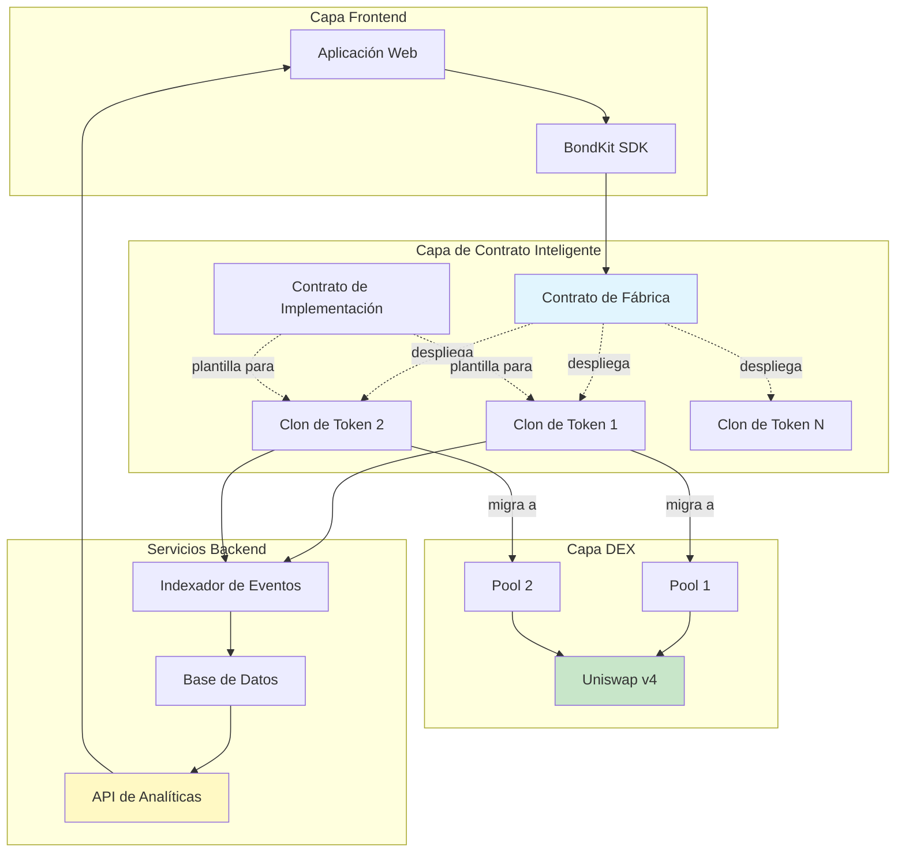

## Visión General de la Arquitectura



## Flujo del Producto en Detalle

<Steps>
  <Step title="Fase 1: Creación de Token">
    **Qué sucede:**
    - El usuario llama a `deployBondkitToken()` en el contrato de Fábrica
    - La Fábrica clona el contrato de Implementación usando el patrón de proxy mínimo
    - El nuevo token se inicializa con parámetros personalizados
    - El token entra automáticamente en la fase de bonding
    
    **Costo de Gas:** ~200,000 gas (90% más barato que el despliegue completo)
    **Tiempo:** ~15 segundos
  </Step>
  
  <Step title="Fase 2: Trading en la Curva de Bonding">
    **Qué sucede:**
    - Los usuarios compran/venden tokens directamente del contrato
    - El precio sigue una curva de bonding algorítmica: `S = S_final × (R/R_objetivo)^exponente`
    - Comisión del 5% en todos los trades va al destinatario de la comisión
    - El contrato acumula activos de cotización (ETH/B3) hacia el objetivo
    - El backend indexa todas las transacciones para análisis
    
    **Mecánica de Trading:**
    - Comprar: Enviar ETH/B3, recibir tokens al precio actual de la curva
    - Vender: Enviar tokens, recibir ETH/B3 menos comisiones
    - Reembolsos automáticos si la compra excediera el objetivo
    
    **Duración:** Hasta que se alcance el objetivo (horas a semanas)
  </Step>
  
  <Step title="Fase 3: Migración a DEX">
    **Qué sucede:**
    - El administrador llama a `migrateToDex()` cuando se alcanza el objetivo
    - El contrato calcula el precio justo de mercado como `sqrtPriceX96`
    - Crea e inicializa el pool de Uniswap v4
    - Transfiere la liquidez acumulada al pool
    - Renuncia a la propiedad a la dirección cero
    - El token se convierte en un ERC20 estándar con trading en DEX
    
    **Post-migración:**
    - Curva de bonding permanentemente deshabilitada
    - Todo el trading a través de Uniswap v4
    - No quedan controles de administrador
    - Se logra la descentralización completa
    
    **Costo de Gas:** ~500,000 gas
    **Tiempo:** ~30 segundos
  </Step>
</Steps>

## Componentes del Sistema

### Contratos Inteligentes

<AccordionGroup>
  <Accordion title="🏭 Contrato de Fábrica">
    **Propósito:** Despliega nuevos tokens de bono de manera eficiente
    
    **Funciones Clave:**
    - `deployBondkitToken()` - Crea un nuevo clon de token
    - `getImplementationAddress()` - Devuelve la dirección de la plantilla
    - `setAllowedQuoteAsset()` - Función de administrador para listar activos
    
    **Optimización de Gas:**
    - Utiliza el patrón de proxy mínimo EIP-1167
    - Comparte lógica a través de todos los tokens
    - ~90% de ahorro de gas vs despliegues individuales
  </Accordion>
  
  <Accordion title="📜 Contrato de Implementación">
    **Propósito:** Plantilla para todos los tokens de bono
    
    **Características Principales:**
    - Cumplimiento del estándar ERC20
    - Matemáticas de la curva de bonding
    - Lógica de migración a Uniswap v4
    - Sistema de distribución de comisiones
    
    **Transiciones de Estado:**
    1. No inicializado → Fase de Bonding
    2. Fase de Bonding → Listo para Migración
    3. Listo para Migración → Fase DEX
  </Accordion>
  
  <Accordion title="🪙 Clones de Token">
    **Propósito:** Instancias individuales de token
    
    **Ciclo de Vida:**
    - Creado vía fábrica
    - Inicializado con parámetros únicos
    - Gestiona su propia curva de bonding
    - Se auto-migra a Uniswap v4
    
    **Almacenamiento:**
    - Metadatos del token (nombre, símbolo)
    - Suministro y distribución
    - Estado de la curva de bonding
    - Parámetros de migración
  </Accordion>
</AccordionGroup>

### Servicios Backend

<AccordionGroup>
  <Accordion title="🔍 Indexador de Eventos">
    **Propósito:** Captura toda la actividad en cadena
    
    **Monitorea:**
    - Creaciones de token
    - Transacciones de compra/venta
    - Eventos de migración
    - Actividades de transferencia
    
    **Tecnología:**
    - Escaneo de blockchain en tiempo real
    - Procesamiento de logs de eventos
    - Sincronización con la base de datos
  </Accordion>
  
  <Accordion title="📊 Motor de Analíticas">
    **Propósito:** Procesa datos crudos en insights
    
    **Genera:**
    - Datos de velas OHLCV
    - Métricas de volumen
    - Seguimiento de liquidez
    - Historial de precios
    - Estadísticas de usuarios
    
    **Actualizaciones:** Cada bloque (~2 segundos)
  </Accordion>
  
  <Accordion title="🌐 API REST">
    **Propósito:** Sirve datos a los frontends
    
    **Endpoints:**
    - `/tokens` - Lista todos los tokens
    - `/tokens/{address}` - Detalles del token
    - `/tokens/{address}/transactions` - Historial de trades
    - `/tokens/{address}/ohlcv` - Datos para gráficos
    - `/users/{address}/portfolio` - Tenencias del usuario
    
    **Formato:** JSON con paginación
  </Accordion>
</AccordionGroup>

### Roles de Usuario

| Rol | Responsabilidades | Permisos |
|------|-----------------|-------------|
| **Creador** | Desplegar token, establecer parámetros, iniciar migración | Control total hasta la migración |
| **Traders** | Comprar/vender durante el bonding, comerciar en DEX | Derechos de trading estándar |
| **Destinatario de Comisiones** | Recibir comisiones de trading | Solo ingresos pasivos |
| **Admin de Migración** | Ejecutar migración cuando esté listo | Derecho de migración única |
| **Proveedores de LP** | (Post-migración) Agregar liquidez a Uniswap | Derechos estándar de LP |

## Inmersión Técnica

### Matemáticas de la Curva de Bonding

La curva de bonding determina el precio del token basado en la oferta:

```
Fórmula de Precio:
S = S_final × (R / R_objetivo)^exponente

Donde:
- S = Oferta actual de token
- S_final = Oferta final de token
- R = Monto recaudado (ETH/B3)
- R_objetivo = Monto objetivo
- exponente = 1 / (1 + factorDeAgresividad/100)
```

**Cálculos de Ejemplo:**

| Agresividad | Exponente | Comportamiento del Precio |
|---------------|----------|----------------|
| 0 | 1.00 | Lineal (precio constante) |
| 25 | 0.80 | Curva suave |
| 50 | 0.67 | Curva moderada |
| 75 | 0.57 | Curva pronunciada |
| 100 | 0.50 | Muy pronunciada (raíz cuadrada) |

### Cálculo del Precio de Migración

Al migrar a Uniswap v4, el contrato:

1. **Calcula el precio de salida** de la curva de bonding
2. **Convierte a formato sqrtPriceX96**:
   ```
   sqrtPriceX96 = sqrt(precio) × 2^96
   ```
3. **Inicializa el pool** con este precio
4. **Agrega liquidez** usando los fondos acumulados

### Técnicas de Optimización de Gas

<Info>
  **Patrón de Proxy Mínimo (EIP-1167)**
  
  En lugar de desplegar el código completo del contrato para cada token:
  - Desplegar un contrato de implementación (600KB)
  - Desplegar contratos proxy diminutos (45 bytes cada uno)
  - Los proxies delegan todas las llamadas a la implementación
  - Resultado: 90% de ahorro de gas por despliegue
</Info>

## Parámetros de Configuración

### Parámetros de Creación de Token

| Parámetro | Tipo | Rango/Formato | Impacto |
|-----------|------|--------------|--------|
| `name` | string | 1-50 caracteres | Nombre de visualización del token |
| `symbol` | string | 2-10 caracteres | Símbolo de trading |
| `finalTokenSupply` | uint256 | > 0 | Total de tokens acuñables |
| `aggressivenessFactor` | uint8 | 0-100 | Inclinación de la curva |
| `targetEth` | uint256 | > 0 | Umbral de migración |
| `feeRecipient` | address | Dirección válida | Recibe comisiones |
| `lpSplitRatioFeeRecipientBps` | uint256 | 0-10000 | Participación de comisión de LP (puntos básicos) |
| `migrationAdminAddress` | address | Dirección válida | Puede activar la migración |

### Parámetros de Ejecución

| Acción | Parámetros | Validación |
|--------|------------|------------|
| Comprar | `minTokensOut`, `ethAmount` | Protección contra deslizamiento |
| Vender | `tokenAmount`, `minEthOut` | Verificación de saldo, deslizamiento |
| Migrar | Ninguno | Objetivo alcanzado, solo admin |

### Constantes del Sistema

| Constante | Valor | Descripción |
|----------|-------|-------------|
| Comisión de Trading | 5% | Aplicada a todos los trades |
| Decimales | 18 | Decimales estándar ERC20 |
| Mínimo Objetivo | 0.1 ETH | Objetivo viable mínimo |
| Máxima Agresividad | 100 | Factor máximo de la curva |

## Consideraciones de Seguridad

<Warning>
  **Características de Seguridad Importantes:**
  
  1. **Renuncia de Propiedad**: Automática después de la migración
  2. **Sin Función de Acuñación**: Suministro fijo en la creación
  3. **Parámetros Inmutables**: No se pueden cambiar después del despliegue
  4. **Contratos Auditados**: Código revisado profesionalmente
  5. **Sin Puertas Traseras de Admin**: Verdadera descentralización
  6. **Protección contra Deslizamiento**: Incorporada en funciones de compra/venta
  7. **Protección contra Desbordamiento**: Matemáticas seguras en todo
</Warning>

## Escenarios de Fallo y Manejo

| Escenario | Respuesta del Sistema |
|----------|----------------|
| Compra excede el objetivo | Relleno parcial, reembolso del exceso |
| Liquidez insuficiente para vender | Transacción revertida |
| Migración antes del objetivo | Transacción revertida |
| Intento de migración por no-admin | Transacción revertida |
| Intento de doble migración | Transacción revertida |
| Operaciones con dirección cero | Transacción revertida |

## Próximos Pasos

<CardGroup cols={2}>
  <Card title="Mecánica de Precios" icon="chart-line" href="/bondkit/concepts/pricing">
    Entender la matemática de la curva de bonding
  </Card>
  <Card title="Guía de Migración" icon="rocket" href="/bondkit/guides/migration">
    Aprender el proceso de migración
  </Card>
</CardGroup>
