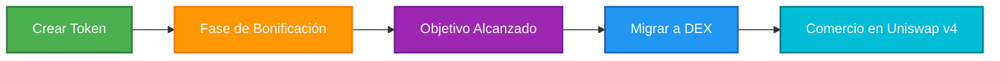

## ¿Qué es BondKit?

BondKit es una plataforma completa de lanzamiento de tokens para crear "tokens de bono" ERC20 en la red principal de Base. Proporciona una solución de principio a fin que maneja todo, desde la creación inicial del token hasta el comercio con curva de bonificación y finalmente la migración a Uniswap v4 para un comercio descentralizado completo.

### Componentes Clave

<Tabs>
  <Tab title="Contratos Inteligentes">
    **Infraestructura en Cadena Auditada**
    - Contrato de fábrica para desplegar nuevos tokens
    - Implementación de ERC20 con lógica de curva de bonificación
    - Inicialización automática del pool de Uniswap v4
    - Patrón de proxy mínimo optimizado para gas
  </Tab>
  <Tab title="SDK de TypeScript">
    **Herramientas Amigables para Desarrolladores**
    - API simple para todas las interacciones con contratos
    - Interfaces seguras de tipo con soporte completo de TypeScript
    - Gestión de transacciones integrada
    - Suscripciones a eventos y monitoreo
  </Tab>
  <Tab title="Backend de Analítica">
    **Servicios de Datos en Tiempo Real**
    - Seguimiento del historial de transacciones
    - Generación de datos de gráficos OHLCV
    - Almacenamiento de metadatos de tokens
    - API REST para integración de frontend
  </Tab>
</Tabs>

## Cómo Funciona BondKit



### El Ciclo de Vida de Tres Fases

1. **Fase de Creación**: Despliega tu token con parámetros personalizados
2. **Fase de Bonificación**: Creación de mercado automatizada vía curva de bonificación
3. **Fase DEX**: Comercio descentralizado completo en Uniswap v4

## Características Principales

<AccordionGroup>
  <Accordion title="🏭 Despliegue de Patrón de Fábrica">
    - **Clones Eficientes en Gas**: Usa el patrón de proxy mínimo para reducir los costos de despliegue en ~90%
    - **Implementación Estandarizada**: Todos los tokens comparten la misma lógica probada en batalla
    - **Despliegue con Un Clic**: Llamada de función simple para crear un nuevo token
  </Accordion>
  
  <Accordion title="📈 Curva de Bonificación Dinámica">
    - **Agresividad Configurable**: Factor de 0-100 controla la progresión del precio
    - **Descubrimiento Automático de Precios**: Precios impulsados por el mercado durante la fase de bonificación
    - **Soporte de Compra y Venta**: Comercio bidireccional completo durante la bonificación
    - **Tarifa de Comercio del 5%**: Aplicada a compras y ventas, distribuida al receptor de tarifas
  </Accordion>
  
  <Accordion title="🎯 Migración Basada en Objetivos">
    - **Objetivos Personalizables**: Establece tu meta de financiación en ETH o ERC20 permitidos
    - **Detección Automática del Umbral**: El contrato rastrea el progreso hacia el objetivo
    - **Migración con Un Clic**: Llamada simple a `migrateToDex()` cuando estés listo
    - **Cálculo de Precios**: `sqrtPriceX96` calculado en cadena para una fijación de precios justa inicial
  </Accordion>
  
  <Accordion title="🔄 Integración con Uniswap v4">
    - **Creación Automática del Pool**: Pool inicializado con el precio de salida de la curva de bonificación
    - **Provisión de Liquidez**: Los fondos acumulados se convierten en liquidez inicial
    - **Renuncia de Propiedad**: El contrato se vuelve completamente descentralizado después de la migración
    - **Transición Sin Problemas**: No se requiere intervención manual
  </Accordion>
  
  <Accordion title="📊 Analítica y Monitoreo">
    - **Indexación en Tiempo Real**: Todas las transacciones grabadas y procesadas
    - **Datos OHLCV**: Gráficos de comercio profesional disponibles vía API
    - **Historial de Transacciones**: Rastro de auditoría completo para cada token
    - **Seguimiento de Portafolio**: Monitorea múltiples tokens y posiciones
  </Accordion>
</AccordionGroup>

## Casos de Uso

<CardGroup cols={3}>
  <Card title="🚀 Lanzamientos de Tokens" icon="rocket">
    **Para Proyectos y Creadores**
    - Mecanismos de lanzamiento justo
    - Descubrimiento de precios impulsado por la comunidad
    - No se requiere liquidez inicial
    - Protección integrada contra bots
  </Card>
  
  <Card title="🎮 Juegos y NFTs" icon="gamepad">
    **Para Proyectos de GameFi**
    - Lanzamientos de moneda en juegos
    - Tokens de proyectos NFT
    - Distribución de tokens de recompensa
    - Economías propiedad de los jugadores
  </Card>
  
  <Card title="🏢 Integración de DApp" icon="building">
    **Para Desarrolladores**
    - Creación programática de tokens
    - Soluciones de marca blanca
    - Integración de frontend personalizado
    - Automatización impulsada por API
  </Card>
</CardGroup>

## Capacidades Técnicas

### Características de Contratos Inteligentes
- ✅ Tokens de bono compatibles con ERC20 con funcionalidad extendida
- ✅ Patrón de fábrica para despliegues eficientes en gas
- ✅ Parámetros configurables (suministro, objetivo, agresividad)
- ✅ Mecanismo de distribución de tarifas integrado
- ✅ Migración automática a Uniswap v4

### Características del SDK
- ✅ Soporte completo de TypeScript con definiciones de tipo
- ✅ Operaciones asíncronas basadas en promesas
- ✅ Oyentes de eventos y suscripciones
- ✅ Manejo de recibos de transacciones
- ✅ Manejo de errores y lógica de reintento

### Características de Analítica
- ✅ Seguimiento de precios en tiempo real
- ✅ Métricas de volumen y liquidez
- ✅ Datos históricos de transacciones
- ✅ Datos de velas OHLCV
- ✅ Seguimiento de portafolio de usuarios

## Comenzar

<CardGroup cols={2}>
  <Card title="Solicitar Acceso" icon="rocket" href="https://b3builders.typeform.com/bsmntdevelopers">
    Lanza con BondKit en Base
  </Card>
  <Card title="Charla con el Equipo" icon="discord" href="https://discord.gg/b3dotfun">
    ¿Preguntas o comentarios? Habla con nosotros en Discord
  </Card>
  
</CardGroup>

## Terminología Clave

<Tabs>
  <Tab title="Conceptos Básicos">
    | Término | Definición |
    |------|------------|
    | **Fase de Bonificación** | Período inicial de comercio con precios algorítmicos vía curva de bonificación |
    | **Token de Bono** | Token ERC20 con mecánicas de curva de bonificación integradas |
    | **Cantidad Objetivo** | Meta de financiación que activa la elegibilidad para migración |
    | **Migración** | Transición de la curva de bonificación a Uniswap v4 |
    | **Activo de Cotización** | La moneda utilizada para comprar tokens (ETH o ERC20 permitidos) |
  </Tab>
  
  <Tab title="Términos Técnicos">
    | Término | Definición |
    |------|------------|
    | **Proxy Mínimo** | Patrón de clonación de contratos eficiente en gas |
    | **Factor de Agresividad** | Parámetro (0-100) que controla la inclinación de la curva de precios |
    | **sqrtPriceX96** | Formato de precio de Uniswap v4 para la inicialización del pool |
    | **Receptor de Tarifas** | Dirección que recibe las tarifas de comercio durante la bonificación |
    | **Proporción de División de LP** | Porcentaje de tarifa de proveedor de liquidez en puntos básicos |
  </Tab>
  
  <Tab title="Términos del SDK">
    | Término | Definición |
    |------|------------|
    | **Contrato de Fábrica** | Contrato principal para desplegar nuevos tokens de bono |
    | **Implementación** | Contrato plantilla clonado para cada token |
    | **Cliente Público** | Conexión de blockchain solo lectura |
    | **Cliente de Cartera** | Conexión de blockchain habilitada para escritura |
    | **Proveedor** | Interfaz de conexión Web3 (p. ej., MetaMask) |
  </Tab>
</Tabs>

## Parámetros Importantes

<Note>
  **Red Actual**: Solo Base Mainnet
  
  **Tokens de Comercio Soportados**: 
  - Token B3 (primario en Base mainnet)
  - ETH (cuando se configura como dirección cero)
  - Se pueden incluir en la lista blanca tokens ERC20 adicionales
  
  **Estructura de Tarifas**:
  - 5% en todas las operaciones de la fase de bonificación
  - Proporción de división de LP personalizable para la migración
  
  **Seguridad**:
  - Contratos inteligentes auditados
  - Renuncia automática de propiedad después de la migración
  - Sin llaves de administrador después de que comienza la fase DEX
</Note>

## Próximos Pasos

<Steps>
  <Step title="Instalar SDK">
    Configura el SDK de BondKit en tu proyecto
    ```bash
    pnpm add @b3dotfun/sdk
    ```
  </Step>
  <Step title="Leer la Guía Rápida">
    Aprende los conceptos básicos con nuestra guía paso a paso
  </Step>
  <Step title="Explorar Ejemplos">
    Revisa implementaciones y demos funcionales
  </Step>
  <Step title="Unirse a la Comunidad">
    Obtén ayuda y comparte comentarios en Discord
  </Step>
</Steps>
