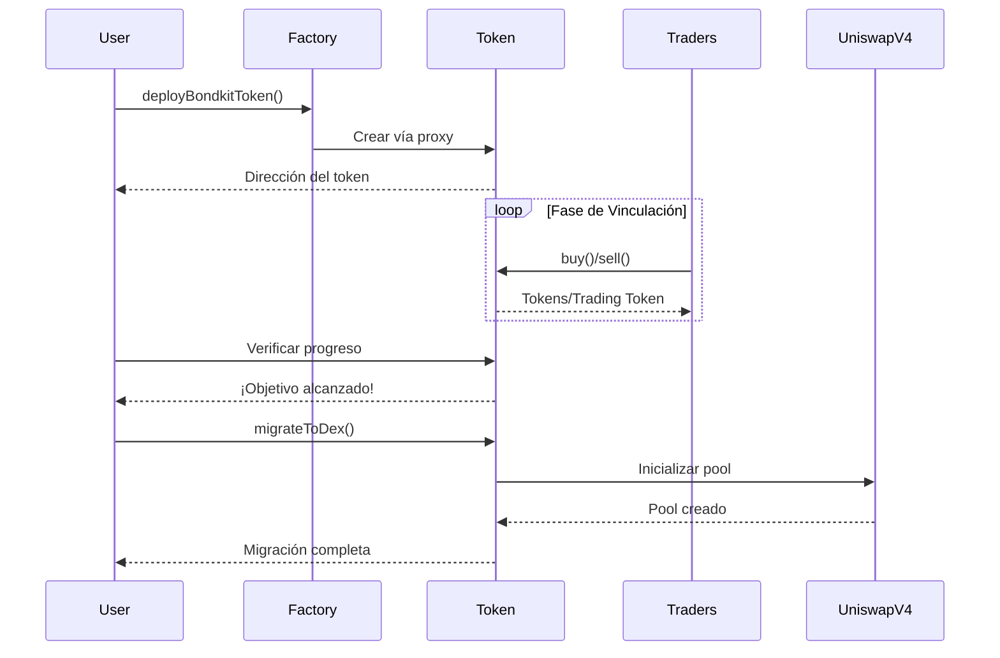

## Resumen

Esta guía rápida te guiará a través del ciclo de vida completo de un token BondKit en menos de 5 minutos. Aprenderás cómo:

1. **Desplegar** un nuevo token de bono
2. **Comerciar** durante la fase de vinculación
3. **Monitorear** el progreso hacia el objetivo
4. **Migrar** a Uniswap v4

<Info>
  **Prerrequisitos**: Asegúrate de haber completado la [instalación](/bondkit/installation) y tener una cartera financiada en Base.
</Info>

## Diagrama de Flujo Completo



## Paso 1: Desplegar Tu Token

### Despliegue Básico

```typescript
import { BondkitTokenFactory } from "@b3dotfun/sdk/bondkit";
import { base } from "viem/chains";
import { parseEther } from "viem";

// Inicializar la fábrica
const factory = new BondkitTokenFactory(
  base.id, 
  process.env.WALLET_PRIVATE_KEY
);

// Desplegar tu token
const tokenAddress = await factory.deployBondkitToken({
  // Metadatos del token
  name: "My Awesome Token",
  symbol: "MAT",
  
  // Configuración de suministro (1 millón de tokens)
  finalTokenSupply: parseEther("1000000"),
  
  // Configuración de la curva de vinculación
  aggressivenessFactor: 35,  // 0-100, más alto = curva más empinada
  targetAmount: parseEther("10"), // 10 unidades del token de comercio objetivo para la migración
  
  // Configuración de tarifas
  feeRecipient: "0x742d35Cc6634C0532925a3b844Bc9e7595f0bEb1", // Tu dirección
  lpSplitRatioFeeRecipientBps: 1000n, // 10% al receptor de la tarifa
  
  // Configuración de migración  
  migrationAdminAddress: "0x742d35Cc6634C0532925a3b844Bc9e7595f0bEb1",
  
  // Configuración de Uniswap V4
  bondingPhaseSplitter: "0x2AB69e0d9D20D3700466153D84a6574128154Fd2",
  v4PoolManager: "0x498581fF718922c3f8e6A244956aF099B2652b2b",
  v4Hook: "0xB36f4A2FB18b745ef8eD31452781a463d2B3f0cC",
  v4PoolFee: 3000, // Nivel de tarifa del 0.3%
  v4TickSpacing: 60,
  
  // Token de comercio (dirección del token B3 para la red principal de Base)  
  tradingToken: "0xB3B32F9f8827D4634fE7d973Fa1034Ec9fdDB3B3"
});

console.log("✅ Token desplegado en:", tokenAddress);
```

### Entendiendo los Parámetros

<ParamField path="finalTokenSupply" type="bigint" required>
  Suministro total de tokens (con 18 decimales). Ejemplo: `parseEther("1000000")` para 1M de tokens.
</ParamField>

<ParamField path="aggressivenessFactor" type="number" required>
  Controla la empinación de la curva de vinculación (0-100):
  - **0-30**: Precios lineales, justos para todos los compradores
  - **30-60**: Curva moderada, enfoque equilibrado
  - **60-100**: Agresivo, recompensa a los primeros compradores
</ParamField>

<ParamField path="targetAmount" type="bigint" required>
  Cantidad del token de comercio necesaria para habilitar la migración. Usa `parseEther("10")` para 10 tokens (18 decimales).
</ParamField>

<ParamField path="feeRecipient" type="address" required>
  Dirección que recibe las tarifas de comercio (5% de todas las transacciones).
</ParamField>

<ParamField path="lpSplitRatioFeeRecipientBps" type="bigint" required>
  Puntos básicos (1/100 de 1%) para la división de tarifas de LP. 1000 = 10%.
</ParamField>

## Paso 2: Comerciar Durante la Fase de Vinculación

### Inicializar Instancia del Token

```typescript
import { BondkitToken } from "@b3dotfun/sdk/bondkit";
import { parseEther, formatEther } from "viem";

// Conectar con tu token desplegado
const token = new BondkitToken(
  tokenAddress, 
  process.env.WALLET_PRIVATE_KEY
);
```

### Entendiendo los Tokens de Comercio

Los tokens BondKit usan un sistema de **token de comercio configurable**. Verifica qué token se usa para el comercio:

```typescript
// Obtener los detalles del token de comercio
const tradingTokenAddress = await token.getTradingTokenAddress();
const tradingTokenSymbol = await token.getTradingTokenSymbol();

console.log(`Comerciando con: ${tradingTokenSymbol} (${tradingTokenAddress})`);
// Para la red principal de Base, típicamente es el token B3

// Verificar si es ETH (dirección cero) o un token ERC20
const isETH = tradingTokenAddress === "0x0000000000000000000000000000000000000000";
```

### Comprar Tokens

```typescript
// Obtener una cotización primero
const tradingTokenAmount = parseEther("100"); // 100 unidades del token de comercio
const expectedTokens = await token.getAmountOfTokensToBuy(tradingTokenAmount);

console.log(`${formatEther(tradingTokenAmount)} ${tradingTokenSymbol} comprará: ${formatEther(expectedTokens)} tokens`);

// Ejecutar la compra (parámetros: minTokensOut, cantidad)
const buyTx = await token.buy(
  tradingTokenAmount, // Cantidad del token de comercio a gastar  
  0n                  // minTokensOut (0 = aceptar cualquier cantidad, usar para protección contra deslizamiento)
);

console.log("Compra completa! Tx:", buyTx);
```

### Vender Tokens

```typescript
// Verificar tu saldo de tokens
const balance = await token.getBalance(userAddress);
console.log(`Tu saldo: ${formatEther(balance)} tokens`);

// Obtener cotización de venta
const tokensToSell = parseEther("1000");
const expectedTradingToken = await token.getAmountOfTradingTokensToSell(tokensToSell);

console.log(`Vender 1000 tokens retornará: ${formatEther(expectedTradingToken)} ${tradingTokenSymbol}`);

// Ejecutar la venta
const sellTx = await token.sell(
  tokensToSell,         // Cantidad de tokens a vender
  0n                    // Min trading token out (para protección contra deslizamiento)
);

console.log("Venta completa! Tx:", sellTx);
```

### Monitorear el Progreso

```typescript
// Verificar el progreso de vinculación
const progress = await token.getBondingProgress();

console.log(`
  Progreso: ${(progress.progress * 100).toFixed(2)}%
  Recaudado: ${formatEther(progress.raised)} ${tradingTokenSymbol}
  Objetivo: ${formatEther(progress.threshold)} ${tradingTokenSymbol}
  Restante: ${formatEther(progress.threshold - progress.raised)} ${tradingTokenSymbol}
`);

// Obtener el precio actual del token
const currentPrice = await token.getCurrentPrice();
console.log(`Precio actual: ${formatEther(currentPrice)} ${tradingTokenSymbol} por token`);

// Verificar si la migración está disponible
const canMigrate = await token.canMigrate();
console.log(`Listo para migrar: ${canMigrate}`);
```

### Monitoreo de Eventos

```typescript
// Escuchar eventos de compra
token.onBuy((event) => {
  console.log("Nueva compra:", {
    comprador: event.buyer,
    tradingTokenIn: formatEther(event.ethIn), // Nota: el nombre del campo es 'ethIn' pero representa el token de comercio
    tokensOut: formatEther(event.tokensOut)
  });
});

// Escuchar eventos de venta
token.onSell((event) => {
  console.log("Nueva venta:", {
    vendedor: event.seller,
    tokensIn: formatEther(event.tokensIn),
    tradingTokenOut: formatEther(event.ethOut) // Nota: el nombre del campo es 'ethOut' pero representa el token de comercio
  });
});
```

## Paso 3: Migración a Uniswap v4

### Verificar Preparación para la Migración

```typescript
// Verificar que el objetivo está alcanzado
const progress = await token.getBondingProgress();

if (progress.progress >= 1.0) {
  console.log("✅ Objetivo alcanzado! Listo para migrar.");
  
  // Obtener detalles de la migración
  const migrationData = await token.getMigrationData();
  console.log("La migración creará pool con:", {
    tradingTokenLiquidity: formatEther(migrationData.ethForLp), // Nota: nombre del campo 'ethForLp'
    tokenLiquidity: formatEther(migrationData.tokensForLp),
    initialPrice: formatEther(migrationData.sqrtPriceX96)
  });
} else {
  console.log(`⏳ Necesita ${formatEther(progress.threshold - progress.raised)} más ${tradingTokenSymbol}`);
}
```

### Ejecutar Migración

```typescript
// Solo el administrador de migración puede llamar a esto
if (await token.isMigrationAdmin(userAddress)) {
  console.log("🚀 Iniciando migración a Uniswap v4...");
  
  const migrationTx = await token.migrateToDex();
  console.log("Transacción de migración:", migrationTx);
  
  // Esperar por confirmación
  const receipt = await token.waitForTransaction(migrationTx);
  
  if (receipt.status === "success") {
    console.log("✅ Migración completa!");
    console.log("Dirección del pool de Uniswap v4:", await token.getPoolAddress());
  }
} else {
  console.log("❌ Solo el administrador de migración puede ejecutar la migración");
}
```

<Warning>
  **Importante**: Después de la migración:
  - La propiedad del contrato se renuncia automáticamente
  - El comercio de la curva de vinculación se deshabilita permanentemente
  - Todo el comercio se traslada a Uniswap v4
  - No son posibles más acciones de administración
</Warning>

## Ejemplo Completo

Aquí tienes un ejemplo completo que demuestra todo el ciclo de vida:

```typescript
import { 
  BondkitTokenFactory, 
  BondkitToken 
} from "@b3dotfun/sdk/bondkit";
import { base } from "viem/chains";
import { parseEther, formatEther } from "viem";

async function launchToken() {
  // 1. Desplegar token
  const factory = new BondkitTokenFactory(
    base.id,
    process.env.WALLET_PRIVATE_KEY
  );
  
  const tokenAddress = await factory.deployBondkitToken({
    name: "Demo Token",
    symbol: "DEMO",
    finalTokenSupply: parseEther("1000000"),
    aggressivenessFactor: 50,
    targetAmount: parseEther("5"),
    feeRecipient: process.env.WALLET_ADDRESS,
    lpSplitRatioFeeRecipientBps: 1000n,
    migrationAdminAddress: process.env.WALLET_ADDRESS,
    
    // Configuración de Uniswap V4
    bondingPhaseSplitter: "0x2AB69e0d9D20D3700466153D84a6574128154Fd2",
    v4PoolManager: "0x498581fF718922c3f8e6A244956aF099B2652b2b", 
    v4Hook: "0xB36f4A2FB18b745ef8eD31452781a463d2B3f0cC",
    v4PoolFee: 3000,
    v4TickSpacing: 60,
    tradingToken: "0xB3B32F9f8827D4634fE7d973Fa1034Ec9fdDB3B3"
  });
  
  console.log("Token desplegado:", tokenAddress);
  
  // 2. Comerciar durante la vinculación
  const token = new BondkitToken(
    tokenAddress,
    process.env.WALLET_PRIVATE_KEY
  );
  
  // Comprar algunos tokens
  await token.buy(parseEther("50"), 0n); // 50 tokens de comercio, 0 min out
  console.log("Tokens comprados con 50 tokens de comercio");
  
  // Verificar progreso
  const progress = await token.getBondingProgress();
  console.log(`Progreso: ${(progress.progress * 100).toFixed(2)}%`);
  
  // 3. Continuar comerciando hasta alcanzar el objetivo...
  // (En producción, otros usuarios estarían comerciando)
  
  // 4. Migrar cuando esté listo
  if (progress.progress >= 1.0) {
    await token.migrateToDex();
    console.log("Migración completa! El token ahora está en Uniswap v4");
  }
}

launchToken().catch(console.error);
```

## Próximos Pasos

<CardGroup cols={2}>
  <Card title="Conceptos" icon="book" href="/bondkit/concepts/bonding-phase">
    Profundizar en curvas de vinculación y precios
  </Card>
  <Card title="Referencia SDK" icon="code" href="/bondkit/sdk/reference">
    Explorar todos los métodos disponibles
  </Card>
  <Card title="Ciclo de Vida Completo" icon="compass" href="/bondkit/guides/token-lifecycle">
    Guía de gestión de tokens de principio a fin
  </Card>
  <Card title="Aplicación Demo" icon="desktop" href="https://github.com/b3dotfun/b3-monorepo/tree/main/apps/bondkit-demo">
    Ver una implementación completa
  </Card>
</CardGroup>
