## Visión general

Esta guía rápida te llevará a través del ciclo de vida completo de un token BondKit en menos de 5 minutos. Aprenderás cómo:

1. **Desplegar** un nuevo token de bono
2. **Comerciar** durante la fase de vinculación
3. **Monitorear** el progreso hacia el objetivo
4. **Migrar** a Uniswap v4

<Info>
  **Prerrequisitos**: Asegúrate de haber completado la [instalación](/bondkit/installation) y tener una cartera financiada en Base.
</Info>

## Diagrama de Flujo Completo

```mermaid
sequenceDiagram
    participant User
    participant Factory
    participant Token
    participant Traders
    participant UniswapV4
    
    User->>Factory: deployBondkitToken()
    Factory->>Token: Crear vía proxy
    Token-->>User: Dirección del token
    
    loop Fase de Vinculación
        Traders->>Token: buy()/sell()
        Token-->>Traders: Tokens/ETH
    end
    
    User->>Token: Verificar progreso
    Token-->>User: ¡Objetivo alcanzado!
    
    User->>Token: migrateToDex()
    Token->>UniswapV4: Inicializar pool
    UniswapV4-->>Token: Pool creado
    Token-->>User: Migración completa
```



## Paso 1: Desplegar Tu Token

### Despliegue Básico

```typescript
import { BondkitTokenFactory } from "@b3dotfun/sdk/bondkit";
import { base } from "viem/chains";
import { parseEther } from "viem";

// Inicializar la fábrica
const factory = new BondkitTokenFactory(
  base.id, 
  process.env.WALLET_PRIVATE_KEY
);

// Desplegar tu token
const tokenAddress = await factory.deployBondkitToken({
  // Metadatos del token
  name: "My Awesome Token",
  symbol: "MAT",
  
  // Configuración de suministro (1 millón de tokens)
  finalTokenSupply: parseEther("1000000"),
  
  // Configuración de la curva de vinculación
  aggressivenessFactor: 35,  // 0-100, más alto = curva más empinada
  targetEth: parseEther("10"), // Objetivo de 10 ETH para la migración
  
  // Configuración de tarifas
  feeRecipient: "0x742d35Cc6634C0532925a3b844Bc9e7595f0bEb1", // Tu dirección
  lpSplitRatioFeeRecipientBps: 1000n, // 10% al receptor de la tarifa
  
  // Configuración de migración
  migrationAdminAddress: "0x742d35Cc6634C0532925a3b844Bc9e7595f0bEb1",
  uniswapV2RouterAddress: "0x4752ba5DBc23f44D87826276BF6Fd6b1C372aD24" // Router V4
});

console.log("✅ Token desplegado en:", tokenAddress);
```

### Entendiendo los Parámetros

<ParamField path="finalTokenSupply" type="bigint" required>
  Suministro total de tokens (con 18 decimales). Ejemplo: `parseEther("1000000")` para 1M de tokens.
</ParamField>

<ParamField path="aggressivenessFactor" type="number" required>
  Controla la empinadura de la curva de vinculación (0-100):
  - **0-30**: Precios lineales, justo para todos los compradores
  - **30-60**: Curva moderada, enfoque equilibrado
  - **60-100**: Agresivo, recompensa a los compradores tempranos
</ParamField>

<ParamField path="targetEth" type="bigint" required>
  Cantidad de ETH necesaria para habilitar la migración. Usa `parseEther("10")` para 10 ETH.
</ParamField>

<ParamField path="feeRecipient" type="address" required>
  Dirección que recibe las tarifas de comercio (5% de todas las transacciones).
</ParamField>

<ParamField path="lpSplitRatioFeeRecipientBps" type="bigint" required>
  Puntos básicos (1/100 de 1%) para la división de tarifas de LP. 1000 = 10%.
</ParamField>

## Paso 2: Comerciar Durante la Fase de Vinculación

### Inicializar Instancia del Token

```typescript
import { BondkitToken } from "@b3dotfun/sdk/bondkit";
import { parseEther, formatEther } from "viem";

// Conectar a tu token desplegado
const token = new BondkitToken(
  tokenAddress, 
  process.env.WALLET_PRIVATE_KEY
);
```

### Comprar Tokens

```typescript
// Obtener una cotización primero
const ethAmount = parseEther("1"); // 1 ETH
const expectedTokens = await token.getAmountOfTokensToBuy(ethAmount);

console.log(`1 ETH comprará: ${formatEther(expectedTokens)} tokens`);

// Ejecutar la compra
const buyTx = await token.buy(
  0n,    // minTokensOut (0 = aceptar cualquier cantidad, usar para protección de deslizamiento)
  "1"    // Cantidad de ETH como cadena
);

console.log("Compra completada! Tx:", buyTx);
```

### Vender Tokens

```typescript
// Verificar tu saldo de tokens
const balance = await token.getBalance(userAddress);
console.log(`Tu saldo: ${formatEther(balance)} tokens`);

// Obtener cotización de venta
const tokensToSell = parseEther("1000");
const expectedEth = await token.getAmountOfEthToReceive(tokensToSell);

console.log(`Vender 1000 tokens retornará: ${formatEther(expectedEth)} ETH`);

// Ejecutar la venta
const sellTx = await token.sell(
  tokensToSell,  // Cantidad de tokens a vender
  0n             // Min ETH out (para protección de deslizamiento)
);

console.log("Venta completada! Tx:", sellTx);
```

### Monitoreando el Progreso

```typescript
// Verificar el progreso de vinculación
const progress = await token.getBondingProgress();

console.log(`
  Progreso: ${(progress.progress * 100).toFixed(2)}%
  Recaudado: ${formatEther(progress.raised)} ETH
  Objetivo: ${formatEther(progress.threshold)} ETH
  Restante: ${formatEther(progress.threshold - progress.raised)} ETH
`);

// Obtener precio actual del token
const currentPrice = await token.getCurrentPrice();
console.log(`Precio actual: ${formatEther(currentPrice)} ETH por token`);

// Verificar si la migración está disponible
const canMigrate = await token.canMigrate();
console.log(`Listo para migrar: ${canMigrate}`);
```

### Monitoreo de Eventos

```typescript
// Escuchar eventos de compra
token.onBuy((event) => {
  console.log("Nueva compra:", {
    comprador: event.buyer,
    ethIn: formatEther(event.ethIn),
    tokensOut: formatEther(event.tokensOut)
  });
});

// Escuchar eventos de venta
token.onSell((event) => {
  console.log("Nueva venta:", {
    vendedor: event.seller,
    tokensIn: formatEther(event.tokensIn),
    ethOut: formatEther(event.ethOut)
  });
});
```

## Paso 3: Migración a Uniswap v4

### Verificar Preparación para la Migración

```typescript
// Verificar que el objetivo se haya alcanzado
const progress = await token.getBondingProgress();

if (progress.progress >= 1.0) {
  console.log("✅ ¡Objetivo alcanzado! Listo para migrar.");
  
  // Obtener detalles de la migración
  const migrationData = await token.getMigrationData();
  console.log("La migración creará pool con:", {
    ethLiquidity: formatEther(migrationData.ethForLp),
    tokenLiquidity: formatEther(migrationData.tokensForLp),
    initialPrice: formatEther(migrationData.sqrtPriceX96)
  });
} else {
  console.log(`⏳ Necesita ${formatEther(progress.threshold - progress.raised)} más ETH`);
}
```

### Ejecutar Migración

```typescript
// Solo el administrador de migración puede llamar a esto
if (await token.isMigrationAdmin(userAddress)) {
  console.log("🚀 Iniciando migración a Uniswap v4...");
  
  const migrationTx = await token.migrateToDex();
  console.log("Transacción de migración:", migrationTx);
  
  // Esperar por confirmación
  const receipt = await token.waitForTransaction(migrationTx);
  
  if (receipt.status === "success") {
    console.log("✅ Migración completa!");
    console.log("Dirección del pool en Uniswap v4:", await token.getPoolAddress());
  }
} else {
  console.log("❌ Solo el administrador de migración puede ejecutar la migración");
}
```

<Warning>
  **Importante**: Después de la migración:
  - La propiedad del contrato se renuncia automáticamente
  - El comercio de la curva de vinculación se deshabilita permanentemente
  - Todo el comercio se traslada a Uniswap v4
  - No son posibles más acciones de administrador
</Warning>

## Ejemplo Completo

Aquí tienes un ejemplo completo que demuestra todo el ciclo de vida:

```typescript
import { 
  BondkitTokenFactory, 
  BondkitToken 
} from "@b3dotfun/sdk/bondkit";
import { base } from "viem/chains";
import { parseEther, formatEther } from "viem";

async function launchToken() {
  // 1. Desplegar token
  const factory = new BondkitTokenFactory(
    base.id,
    process.env.WALLET_PRIVATE_KEY
  );
  
  const tokenAddress = await factory.deployBondkitToken({
    name: "Demo Token",
    symbol: "DEMO",
    finalTokenSupply: parseEther("1000000"),
    aggressivenessFactor: 50,
    targetEth: parseEther("5"),
    feeRecipient: process.env.WALLET_ADDRESS,
    lpSplitRatioFeeRecipientBps: 1000n,
    migrationAdminAddress: process.env.WALLET_ADDRESS,
    uniswapV2RouterAddress: "0x4752ba5DBc23f44D87826276BF6Fd6b1C372aD24"
  });
  
  console.log("Token desplegado:", tokenAddress);
  
  // 2. Comerciar durante la vinculación
  const token = new BondkitToken(
    tokenAddress,
    process.env.WALLET_PRIVATE_KEY
  );
  
  // Comprar algunos tokens
  await token.buy(0n, "0.5");
  console.log("Comprados tokens con 0.5 ETH");
  
  // Verificar progreso
  const progress = await token.getBondingProgress();
  console.log(`Progreso: ${(progress.progress * 100).toFixed(2)}%`);
  
  // 3. Continuar comerciando hasta alcanzar el objetivo...
  // (En producción, otros usuarios estarían comerciando)
  
  // 4. Migrar cuando esté listo
  if (progress.progress >= 1.0) {
    await token.migrateToDex();
    console.log("¡Migración completa! El token ahora está en Uniswap v4");
  }
}

launchToken().catch(console.error);
```

## Próximos Pasos

<CardGroup cols={2}>
  <Card title="Conceptos" icon="book" href="/bondkit/concepts/bonding-phase">
    Profundizar en curvas de vinculación y precios
  </Card>
  <Card title="Referencia del SDK" icon="code" href="/bondkit/sdk/reference">
    Explorar todos los métodos disponibles
  </Card>
  <Card title="Guías" icon="compass" href="/bondkit/guides/choose-quote-asset">
    Aprender estrategias avanzadas
  </Card>
  <Card title="Aplicación Demo" icon="desktop" href="https://github.com/b3dotfun/b3-monorepo/tree/main/apps/bondkit-demo">
    Ver una implementación completa
  </Card>
</CardGroup>
