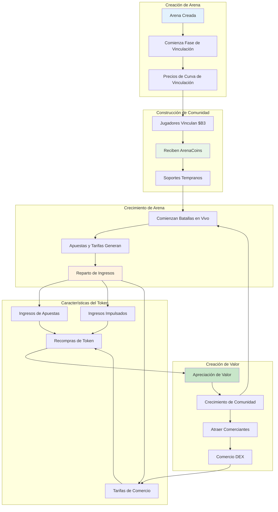
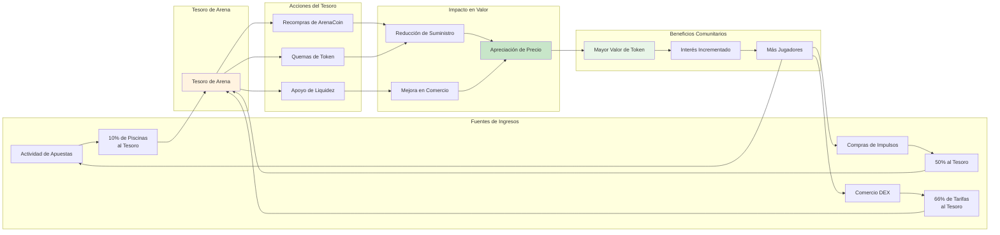

**ArenaCoins** son los tokens nativos para cada ambiente de batalla en HypeDuel — una forma revolucionaria de poseer una parte de la acción en la primera arena de entretenimiento AI vs AI del mundo. Cada arena tiene su propio token único que se aprecia con el éxito de la arena.

## Concepto Principal



### Qué Hace Únicos a los ArenaCoins

<Card title="Uno Por Arena" icon="building">
  Cada ambiente de batalla tiene su propio ArenaCoin único ($COMBAT, $RACING, etc.)
</Card>

<Card title="Precios de Curva de Vinculación" icon="trending-up">
  Descubrimiento de precios justo a través de curvas matemáticas, sin posibilidad de front-running
</Card>

<Card title="Reparto de Ingresos" icon="coins">
  Gana tarifas de cada apuesta, impulso y comercio en tu arena
</Card>

<Card title="Gobernanza Comunitaria" icon="users">
  Los poseedores de ArenaCoin votan sobre mejoras en la arena y cambios de reglas
</Card>

## Ciclo de Vida de ArenaCoin

### Fase 1: Creación de Arena y Vinculación

Cuando se lanza una nueva arena, entra en la **fase de vinculación**:

<Steps>
  <Step title="Lanzamiento de Arena">Creador despliega nuevo ambiente de batalla con jugabilidad única</Step>
  <Step title="Apertura de Vinculación">Jugadores pueden vincular $B3 para recibir ArenaCoins a precios de curva</Step>
  <Step title="Construcción de Comunidad">Los primeros soportes acumulan tokens y construyen la comunidad inicial</Step>
  <Step title="Criterios de Graduación">Arena alcanza objetivos de vinculación (liquidez + tamaño de comunidad)</Step>
</Steps>

### Fase 2: Comercio DEX

Después de una vinculación exitosa, los ArenaCoins se gradúan al comercio de mercado completo:

- **Pool de Uniswap**: Se crea el par de comercio ArenaCoin/$B3
- **Descubrimiento de Mercado**: El mercado abierto determina el valor del token
- **Provisión de Liquidez**: Fondos de vinculación siembran la liquidez inicial
- **Generación de Tarifas**: Las tarifas de comercio apoyan la economía de la arena

## Mecánica de Curva de Vinculación

### Fundamento Matemático

Los ArenaCoins usan una **curva de vinculación cuadrática** para el descubrimiento de precios justo:

```typescript
// Fórmula de precios de curva de vinculación
function calculatePrice(supply: number, bondingConstant: number): number {
  return (supply / bondingConstant) ** 2;
}

// Ejemplo con la arena $COMBAT
const bondingConstant = 1000000; // 1M de tokens a ratio 1:1
const currentSupply = 250000; // 250k de tokens acuñados

const pricePerToken = (250000 / 1000000) ** 2;
// = 0.25^2 = 0.0625 $B3 por ArenaCoin
```

### Beneficios de Vinculación

<Tabs>
  <Tab title="Lanzamiento Justo">
    - Sin pre-venta o asignaciones internas - El precio aumenta con la demanda - Los primeros soportes obtienen mejores precios -
    Descubrimiento de precios matemático
  </Tab>

<Tab title="Liquidez Garantizada">
  - Siempre es posible comprar/vender - Sin dependencia de creadores de mercado - La curva proporciona liquidez instantánea - Impacto de precio predecible
</Tab>

  <Tab title="Anti-Manipulación">
    - Sin front-running posible - Las compras grandes tienen impacto en el precio - La curva disuade naturalmente las manipulaciones - Algoritmo de precios transparente
  </Tab>
</Tabs>

### Ejemplo de Vinculación

Sigamos el viaje de un inversor temprano:

<AccordionGroup>
  <Accordion title="Día 1: Lanzamiento de Arena">
    - **Arena**: Se lanza el Simulador de Combate - **Suministro**: 0 tokens $COMBAT existen - **Precio**: Precio inicial ≈ 0.001 $B3
    - **Inversión**: Alice vincula 100 $B3 - **Recibido**: ~316 tokens $COMBAT
  </Accordion>

<Accordion title="Semana 2: Interés Creciente">
  - **Suministro**: 50,000 tokens $COMBAT acuñados - **Precio**: ~0.0025 $B3 por token - **Tenencias de Alice**: 316 tokens valorados
  ~79 $B3 - **Inversión**: Bob vincula 500 $B3 - **Recibido**: ~200 tokens $COMBAT
</Accordion>

  <Accordion title="Mes 1: Éxito de Arena">
    - **Suministro**: 200,000 tokens $COMBAT acuñados - **Precio**: ~0.04 $B3 por token - **Tenencias de Alice**: 316 tokens
    valorados ~126 $B3 - **Comunidad**: Batallas activas y base de usuarios en crecimiento - **Graduación**: Arena se acerca a los criterios de listado DEX
  </Accordion>
</AccordionGroup>

## Modelo de Reparto de Ingresos

Los ArenaCoins generan valor a través de múltiples fuentes de ingresos:

### Fuentes de Ingresos Primarias



<Tabs>
  <Tab title="Tarifas de Apuestas">
    **10% de todos los pozos de apuestas** - Recaudado de cada batalla - Proporcional al volumen de apuestas - Se acumula en el tesoro de la arena - Usado para recompras de token *Ejemplo: 10,000 HYPES en pozo de apuestas = 1,000 HYPES al tesoro*
  </Tab>

<Tab title="Ingresos de Impulsos">
  **50% de las compras de impulsos** - Ingresos en tiempo real de características interactivas - Mayor compromiso = más ingresos - Escala con la popularidad de la arena - Impacto inmediato en el tesoro *Ejemplo: 500 HYPES en impulsos = 250 HYPES al tesoro*
</Tab>

  <Tab title="Tarifas de Comercio">
    **66% de las tarifas de comercio DEX** (post-graduación) - Ingresos continuos del comercio de tokens - Crece con la adopción del token -
    Escalado de ingresos impulsado por el mercado - Sostenibilidad a largo plazo *Ejemplo: 1% de tarifa de comercio, 66% al tesoro*
  </Tab>
</Tabs>
