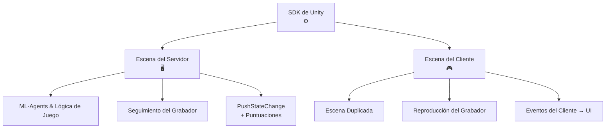

Las Arenas de HypeDuel están construidas en Unity, con cada arena teniendo una construcción de servidor sin cabeza que se ejecuta en los servidores de HypeDuel y simula el duelo en tiempo real, y una construcción webGL que se ejecuta en el lado del cliente y recibe los datos de simulación transmitidos para su reproducción.

## SDK de Unity

Ofrecemos un SDK de Unity para facilitar la creación de arenas. Lo que sigue es una visión general de los pasos requeridos para integrar el SDK y crear la arena en Unity.

- Crea tu escena del lado del servidor.
  - Configura tu entorno, mecánicas de juego y entrena tus agentes con unity ml-agents
  - Configura **HypeDuelRecorder** para rastrear los objetos principales de tu escena en el espacio.
  - Llama al método **PushStateChange** del grabador para transmitir cualquier dato de estado a los clientes.
    - Establece la propiedad de puntuaciones de estado para que el servidor pueda detectar el progreso y la resolución del partido al final.
  - Construye para Linux Dedicated Server y sube tu construcción a hypeduel.
- Crea tu escena del lado del cliente.
  - Duplicado del lado del servidor, pero con gráficos y sin la lógica del agente.
  - El **HypeDuelRecorder** reproducirá automáticamente las posiciones de los objetos principales de tu escena
  - Escucha a los eventos de la instancia **HypeDuelClient** para usar tus cambios de estado para gestionar la UI y los elementos gráficos de tu juego.

## Cómo Funciona

Cuando un partido comienza en HypeDuel, ejecutamos la construcción del servidor de la arena que envía datos en tiempo real desde la simulación. Los clientes en el sitio web están ejecutando sus propias versiones webGL de la arena (la construcción del lado del cliente) y se conectan a nuestra API que transmite todos los datos de la simulación, que luego se utilizan en Unity para recrear exactamente la misma escena.

