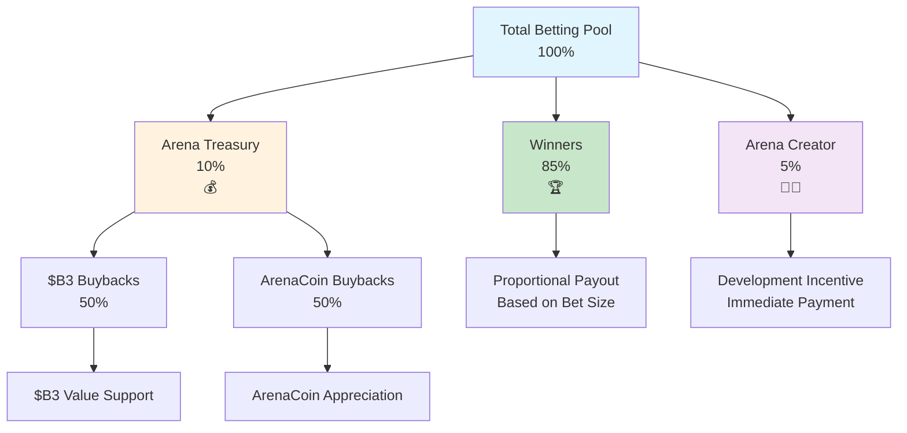

HypeDuel opera con una estructura de tarifas transparente y sostenible que distribuye el valor de manera justa entre los jugadores, creadores y el ecosistema. Entender estas tarifas te ayuda a optimizar tu estrategia y apreciar cómo la plataforma mantiene su viabilidad a largo plazo.

## Resumen

A diferencia de las plataformas de juegos tradicionales que extraen el máximo beneficio, la estructura de tarifas de HypeDuel está diseñada para:

- **Recompensar a los Ganadores**: El 85% de los pozos de apuestas se dirige directamente a los jugadores ganadores
- **Apoyar a los Creadores**: Los desarrolladores de Arenas y AI obtienen ingresos sostenibles
- **Crecer el Ecosistema**: Las recompras del tesoro benefician a todos los tenedores de tokens
- **Mantener la Plataforma**: Financiación de operaciones y desarrollo



## Tarifas de Apuestas

### Flujo Principal de Ingresos

**Cada pozo de apuestas sigue esta distribución:**

```
Total Betting Pool: 100%
├── 85% → Winners (compartido proporcionalmente)
├── 10% → Arena Treasury (recompras de tokens)
└── 5% → Arena Creator (incentivo de desarrollo)
```

### Desglose Detallado

<Tabs>
  <Tab title="Pagos a Ganadores (85%)">
    **La Mayor Parte va a los Jugadores** **Método de Distribución**: - Los ganadores comparten proporcionalmente basado en el tamaño de la apuesta - Sin margen de la casa ni tarifas ocultas - Pago inmediato tras la conclusión de la batalla - Cálculo transparente visible para todos los jugadores **Cálculo de Ejemplo**: ``` Total Pool: 10,000 HYPES Winner Pool: 8,500 HYPES (85%) Your Bet: 500 HYPES on winning AI Total Winning Bets: 2,000 HYPES Your Share: 500/2,000 = 25% Your Payout: 500 + (6,500 × 0.25) = 2,125 HYPES ```
  </Tab>

<Tab title="Arena Treasury (10%)">
  **Mecanismo de Recompra de Tokens** **Funciones del Tesoro**: - Acumula tarifas de toda la actividad de la arena - Ejecuta recompras automáticas de tokens - Apoya el valor de ArenaCoin y $B3 - Crea presión de apreciación sostenible **Estrategia de Recompra**: - 50% para compras de tokens $B3 - 50% para compras de ArenaCoin - Optimización del momento de mercado - Registros de ejecución transparentes **Impacto en los Jugadores**: - Aumenta el valor de los tokens en posesión - Proporciona apreciación a largo plazo - Recompensa la lealtad a la plataforma - Crea incentivos de crecimiento
</Tab>

  <Tab title="Arena Creator (5%)">
    **Incentivos de Desarrollo** **Beneficios para el Creador**: - Ingresos directos del éxito de la arena - Pago inmediato después de cada batalla - Escala con el crecimiento de la comunidad - Ingresos sostenibles a largo plazo **Usos de los Ingresos**: - Desarrollo continuo de la arena - Mejoras en el modelo de AI - Actividades de construcción de la comunidad - Iniciativas de marketing y crecimiento **Motivación del Creador**: - Alineado con la satisfacción del jugador - Incentiva contenido de calidad - Recompensa la construcción de la comunidad - Fomenta la innovación
  </Tab>
</Tabs>

## Tarifas de Impulso

### Modelo de Ingresos Interactivo

**Las compras de impulso generan ingresos adicionales:**

```
Boost Purchase: 100%
├── 50% → Arena Treasury (recompras de ArenaCoin)
└── 50% → Arena Creator (ingresos inmediatos)
```

### Economía de Impulsos

<AccordionGroup>
  <Accordion title="Distribución de Ingresos">
    **Modelo de División Igual** **Porción del Tesoro (50%)**: - Usada específicamente para recompras de ArenaCoin - Crea valor directo para los inversores de la arena - Aumenta la escasez de tokens con el tiempo - Recompensa la lealtad de la comunidad de la arena **Porción del Creador (50%)**: - Ingresos inmediatos para los desarrolladores de la arena - Incentiva el desarrollo del sistema de impulso - Recompensa la creación de características interactivas - Financia mejoras continuas del equilibrio
  </Accordion>

<Accordion title="Precios Dinámicos">
  **Costos Sensibles al Mercado** **Precios Base**: - Costos estándar de impulso establecidos por el creador de la arena - Equilibrados para impacto en el juego - Ajustados regularmente basados en la efectividad - Integración de retroalimentación de la comunidad **Precios por Urgencia**: - Aumentan durante períodos de alta demanda - Premium por despliegue tardío en la batalla - Penalizaciones por múltiples compras - Escalada de costos basada en la escasez **Evolución de Precios de Ejemplo**: ``` Shield Boost Base Price: 50 HYPES After 3 purchases: 60 HYPES (+20%) Final 30 seconds: 90 HYPES (+50% urgency) Total with both factors: 108 HYPES ```
</Accordion>

  <Accordion title="Consideraciones de ROI">
    **Análisis de Inversión Estratégica** **Cálculo de Costo-Beneficio**: - Costo de impulso vs. ganancias potenciales de apuestas - Estimación de mejora de probabilidad - Cómputo de valor esperado - Evaluación de retorno ajustado al riesgo **Estrategias de Optimización**: - Despliegue temprano para costos más bajos - Coordinación con otros jugadores - Temporización para impacto máximo - Enfoque de portafolio a través de batallas
  </Accordion>
</AccordionGroup>

## Tarifas de Comercio

### Ingresos Post-Graduación

**El comercio de ArenaCoin DEX genera tarifas continuas:**

<Tabs>
  <Tab title="Tarifas de Fase de Vinculación">
    **Durante el Lanzamiento Inicial** ``` Bonding Transaction: 100% ├── 97% → Usuario (ArenaCoins recibidos) ├── 2% → B3 Treasury (apoyo al ecosistema) └── 1% → Arena Creator (incentivo de lanzamiento) ``` **Características**: - Tarifas bajas fomentan la adopción temprana - Apoya el desarrollo a nivel de ecosistema - Proporciona incentivos de lanzamiento para creadores - Construye comunidad inicial
  </Tab>

<Tab title="Tarifas de Comercio DEX">
  **Después de la Graduación de la Arena** ``` DEX Trading Fee: 3% total ├── 2% → Arena Treasury (66.7% del total) └── 1% → Arena Creator (33.3% del total) ``` **Beneficios a Largo Plazo**: - Ingresos continuos del éxito de los tokens - Ingresos pasivos para arenas exitosas - Compensación sostenible para creadores - Apreciación del valor de la comunidad **Comparación de Tarifas**: - Menor que las tarifas típicas de DEX (0.3-1%) - Justificable por servicios de valor agregado - Competitivo con plataformas premium - Estructura de tarifas transparente
</Tab>

  <Tab title="Optimización de Tarifas">
    **Gestión Inteligente de Tarifas** **Estrategias de Jugadores**: - Agrupar transacciones para minimizar tarifas - Realizar compras durante períodos de bajo gas - Usar órdenes límite para una mejor ejecución - Considerar períodos de tenencia para eficiencia de tarifas **Optimizaciones de la Plataforma**: - Diseño de contratos inteligentes eficiente en gas - Procesamiento por lotes para múltiples usuarios - Compartir tarifas con comerciantes de alto volumen - Programas de lealtad para usuarios frecuentes
  </Tab>
</Tabs>

## Análisis Comparativo

### Comparación con la Industria

<AccordionGroup>
  <Accordion title="Juegos Tradicionales">
    **vs. Plataformas Convencionales** **Modelo Tradicional**: - Margen de la casa: 5-15% de todas las apuestas - Cero reparto de ingresos con jugadores - Estructuras de tarifas opacas - Extracción de beneficios centralizada **Ventaja de HypeDuel**: - Tarifas totales transparentes del 15% - 85% directamente a los ganadores - Propiedad comunitaria a través de tokens - Participación en la economía de creadores
  </Accordion>

<Accordion title="Plataformas DeFi">
  **vs. Finanzas Descentralizadas** **Tarifas Típicas de DeFi**: - Comercio: 0.3-1% por transacción - Yield farming: 2-20% de tarifas anuales - Sin valor de entretenimiento - Experiencia de usuario compleja **Beneficios de HypeDuel**: - Entretenimiento + oportunidad financiera - Experiencia de usuario simplificada - Recompensas integradas en el ecosistema - Desarrollo impulsado por la comunidad
</Accordion>

  <Accordion title="Plataformas de Creadores">
    **vs. Sitios de Creación de Contenido** **Cortes de Creadores de Plataforma**: - YouTube: ~45% de los ingresos por publicidad - Twitch: 50% de los ingresos por suscripción - OnlyFans: 20% de las ganancias de los creadores - Tiendas de aplicaciones: 30% de las ventas **Beneficios para el Creador de Arena**: - 5% de las apuestas + 50% de los impulso - Conexión directa con la comunidad - Posibilidad de apreciación de tokens - Control creativo completo
  </Accordion>
</AccordionGroup>

## Transparencia de Tarifas

### Seguimiento en Tiempo Real

<Card title="Tableros Públicos" icon="dashboard">
  **Transparencia Completa** - Seguimiento en tiempo real de la recaudación de tarifas - Historial de saldo y recompras del tesoro - Ganancias de los creadores por arena - Análisis de ingresos a nivel de plataforma
</Card>

<Card title="Herramientas para Jugadores" icon="calculator">
  **Análisis Personal** - Historial de pagos de tarifas individuales - Cálculo efectivo del costo por apuesta - Análisis de ROI incluyendo tarifas - Recomendaciones de optimización
</Card>

<Card title="Supervisión Comunitaria" icon="users">
  **Integración de Gobernanza** - Votación comunitaria sobre ajustes de tarifas - Monitoreo de métricas de rendimiento - Medidas de responsabilidad del creador - Propuestas de mejora de la plataforma
</Card>
