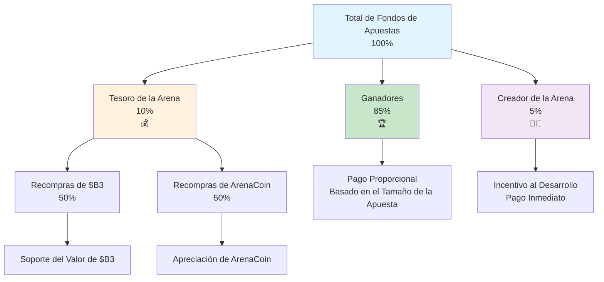

HypeDuel opera con una estructura de tarifas transparente y sostenible que distribuye el valor de manera justa entre jugadores, creadores y el ecosistema. Entender estas tarifas te ayuda a optimizar tu estrategia y apreciar cómo la plataforma mantiene su viabilidad a largo plazo.

## Resumen

A diferencia de las plataformas de juegos tradicionales que buscan el máximo beneficio, la estructura de tarifas de HypeDuel está diseñada para:

- **Recompensar a los Ganadores**: El 85% de los fondos de apuestas va directamente a los jugadores ganadores
- **Apoyar a los Creadores**: Los desarrolladores de Arenas y AI obtienen ingresos sostenibles
- **Crecer el Ecosistema**: Las recompras del tesoro benefician a todos los poseedores de tokens
- **Mantener la Plataforma**: Financiación de operaciones y desarrollo


```mermaid
graph TD
    A["Total de Fondos de Apuestas<br/>100%"] --> B["Ganadores<br/>85%<br/>🏆"]
    A --> C["Tesoro de la Arena<br/>10%<br/>💰"]
    A --> D["Creador de la Arena<br/>5%<br/>👨‍💻"]

    C --> E["Recompras de $B3<br/>50%"]
    C --> F["Recompras de ArenaCoin<br/>50%"]

    B --> G["Pago Proporcional<br/>Basado en el Tamaño de la Apuesta"]
    D --> H["Incentivo al Desarrollo<br/>Pago Inmediato"]
    E --> I["Soporte del Valor de $B3"]
    F --> J["Apreciación de ArenaCoin"]

    style A fill:#e1f5fe
    style B fill:#c8e6c9
    style C fill:#fff3e0
    style D fill:#f3e5f5
```

## Tarifas de Apuestas

### Flujo Principal de Ingresos

**Cada fondo de apuestas sigue esta distribución:**

```
Total de Fondos de Apuestas: 100%
├── 85% → Ganadores (compartido proporcionalmente)
├── 10% → Tesoro de la Arena (recompras de tokens)
└── 5% → Creador de la Arena (incentivo al desarrollo)
```

### Desglose Detallado

<Tabs>
  <Tab title="Pagos a Ganadores (85%)">
    **La Mayor Parte va a los Jugadores** **Método de Distribución**: - Los ganadores comparten proporcionalmente basado en el tamaño de la apuesta - Sin margen de la casa ni tarifas ocultas - Pago inmediato después de la conclusión de la batalla - Cálculo transparente visible para todos los jugadores **Cálculo de Ejemplo**: ``` Total del Fondo: 10,000 HYPES Fondo del Ganador: 8,500 HYPES (85%) Tu Apuesta: 500 HYPES en IA ganadora Total de Apuestas Ganadoras: 2,000 HYPES Tu Parte: 500/2,000 = 25% Tu Pago: 500 + (6,500 × 0.25) = 2,125 HYPES ```
  </Tab>

<Tab title="Tesoro de la Arena (10%)">
  **Mecanismo de Recompra de Tokens** **Funciones del Tesoro**: - Acumula tarifas de toda la actividad de la arena - Ejecuta recompras automáticas de tokens - Soporta el valor de ArenaCoin y $B3 - Crea presión sostenible de apreciación **Estrategia de Recompra**: - 50% para compras de tokens $B3 - 50% para compras de ArenaCoin - Optimización del momento del mercado - Registros de ejecución transparentes **Impacto en los Jugadores**: - Aumenta el valor de los tokens poseídos - Proporciona apreciación a largo plazo - Recompensa la lealtad a la plataforma - Crea incentivos de crecimiento
</Tab>

  <Tab title="Creador de la Arena (5%)">
    **Incentivos al Desarrollo** **Beneficios para el Creador**: - Ingresos directos del éxito de la arena - Pago inmediato después de cada batalla - Escala con el crecimiento de la comunidad - Ingresos sostenibles a largo plazo **Usos de los Ingresos**: - Desarrollo continuo de la arena - Mejoras en el modelo de AI - Actividades de construcción de la comunidad - Iniciativas de marketing y crecimiento **Motivación del Creador**: - Alineado con la satisfacción del jugador - Incentiva contenido de calidad - Recompensa la construcción de la comunidad - Fomenta la innovación
  </Tab>
</Tabs>

## Tarifas de Impulso

### Modelo de Ingresos Interactivo

**Las compras de impulso generan ingresos adicionales:**

```
Compra de Impulso: 100%
├── 50% → Tesoro de la Arena (recompras de ArenaCoin)
└── 50% → Creador de la Arena (ingresos inmediatos)
```

### Economía de Impulsos

<AccordionGroup>
  <Accordion title="Distribución de Ingresos">
    **Modelo de División Igual** **Porción del Tesoro (50%)**: - Usada específicamente para recompras de ArenaCoin - Crea valor directo para los inversores de la arena - Aumenta la escasez de tokens con el tiempo - Recompensa la lealtad de la comunidad de la arena **Porción del Creador (50%)**: - Ingresos inmediatos para los desarrolladores de la arena - Incentiva el desarrollo del sistema de impulso - Recompensa la creación de características interactivas - Financia mejoras continuas del equilibrio
  </Accordion>

<Accordion title="Precios Dinámicos">
  **Costos Sensibles al Mercado** **Precios Base**: - Costos estándar de impulso establecidos por el creador de la arena - Equilibrados para el impacto en el juego - Ajustados regularmente basados en la efectividad - Integración de retroalimentación de la comunidad **Precios por Demanda**: - Aumentan durante períodos de alta demanda - Premium por despliegue tardío en la batalla - Penalizaciones por múltiples compras - Escalada de costos basada en la escasez **Evolución del Precio de Ejemplo**: ``` Precio Base de Impulso de Escudo: 50 HYPES Después de 3 compras: 60 HYPES (+20%) Últimos 30 segundos: 90 HYPES (+50% de urgencia) Total con ambos factores: 108 HYPES ```
</Accordion>

  <Accordion title="Consideraciones de ROI">
    **Análisis de Inversión Estratégica** **Cálculo de Costo-Beneficio**: - Costo de impulso vs. posibles ganancias de apuestas - Estimación de mejora de probabilidad - Cómputo de valor esperado - Evaluación de retorno ajustado al riesgo **Estrategias de Optimización**: - Despliegue temprano para costos más bajos - Coordinación con otros jugadores - Momento para impacto máximo - Enfoque de cartera a través de batallas
  </Accordion>
</AccordionGroup>

## Tarifas de Comercio

### Ingresos Post-Graduación

**El comercio de ArenaCoin DEX genera tarifas continuas:**

<Tabs>
  <Tab title="Tarifas de Fase de Vinculación">
    **Durante el Lanzamiento Inicial** 
    ``` 
    Transacción de Vinculación: 100% 
    ├── 97% → Usuario (ArenaCoins recibidos) 
    ├── 2% → Tesoro de B3
    (soporte al ecosistema) 
    └── 1% → Creador de la Arena (incentivo de lanzamiento) 
    ``` 
    **Características**: 
    - Tarifas bajas fomentan la adopción temprana 
    - Apoya el desarrollo en todo el ecosistema 
    - Proporciona incentivos de lanzamiento para creadores 
    - Construye la comunidad inicial
  </Tab>

<Tab title="Tarifas de Comercio DEX">
  **Después de la Graduación de la Arena** 
  ``` 
  Tarifa de Comercio DEX: 3% total 
  ├── 2% → Tesoro de la Arena (66.7% del total) 
  └── 1% → Creador de la
  Arena (33.3% del total) 
  ``` 

 **Beneficios a Largo Plazo**: 
  - Ingresos continuos del éxito del token 
  - Ingresos pasivos para arenas exitosas 
  - Compensación sostenible para creadores 
  - Apreciación del valor comunitario 
</Tab>

  <Tab title="Optimización de Tarifas">
    **Gestión Inteligente de Tarifas** 
    **Estrategias de Jugadores**: 
    - Agrupar transacciones para minimizar tarifas 
    - Realizar compras durante períodos de bajo gas 
    - Usar órdenes limitadas para una mejor ejecución 
    - Considerar períodos de tenencia para eficiencia de tarifas 

   **Optimizaciones de la Plataforma**: 
    - Diseño de contratos inteligentes eficiente en gas 
    - Procesamiento por lotes para múltiples usuarios 
    - Compartir tarifas con comerciantes de alto volumen 
    - Programas de lealtad para usuarios frecuentes
  </Tab>
</Tabs>
