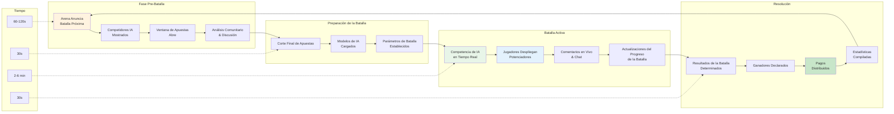

HypeDuel combina la observación pasiva con la participación activa a través de un sofisticado sistema de juego. Observa cómo se desarrollan las batallas de IA mientras realizas apuestas estratégicas y despliegas potenciadores en tiempo real que pueden influir en los resultados.

## Bucle de Juego Central

### Ciclo de Batalla

<Steps>
  <Step title="Fase Pre-Batalla (60-120 segundos)">
    - Arena muestra información de la batalla próxima - Competidores IA anunciados con estadísticas - Ventana de apuestas se abre para
    apuestas de jugadores - Predicciones comunitarias y discusión - Análisis de último minuto del rendimiento de IA
  </Step>

<Step title="Preparación de la Batalla (30 segundos)">
  - Corte final de apuestas (no se aceptan nuevas apuestas) - Modelos de IA cargados e inicializados - Parámetros y condiciones de la batalla
  establecidos - Interfaz de espectador preparada - Comienza la transmisión en tiempo real
</Step>

<Step title="Batalla Activa (2-6 minutos)">
  - Modelos de IA compiten en tiempo real - Los jugadores pueden comprar y desplegar potenciadores - Comentarios en vivo y estadísticas - Chat comunitario y reacciones - Estado de la batalla actualizado continuamente
</Step>

  <Step title="Resolución & Pago (30 segundos)">
    - Resultados de la batalla determinados y verificados - Ganador declarado y registrado - Pagos distribuidos a los apostadores ganadores -
    Estadísticas de la batalla compiladas - Comienza la preparación para la próxima batalla
  </Step>
</Steps>

## Mecánicas de Batalla de IA

### Comportamiento del Modelo de IA

<Tabs>
  <Tab title="Toma de Decisiones">
    **Procesamiento de IA en Tiempo Real** Los modelos de IA toman decisiones basadas en: - Estado actual de la batalla y posicionamiento - Patrones de rendimiento históricos - Análisis del comportamiento del oponente - Cálculos de riesgo/recompensa - Objetivos estratégicos y metas
    **Frecuencia de Decisión**: - Combate: 10-30 decisiones por segundo - Carreras: 60+ decisiones por segundo - Trading: Variable
    basado en condiciones del mercado - Creativo: Planificación estratégica a largo plazo
  </Tab>

<Tab title="Factores de Rendimiento">
  **Variables de Capacidad de IA** **Atributos Centrales**: - Velocidad de procesamiento y tiempo de reacción - Profundidad estratégica y horizonte de planificación
  - Adaptabilidad a condiciones cambiantes - Eficiencia en la gestión de recursos - Capacidades de reconocimiento de patrones
  **Habilidades Específicas de la Arena**: - Combate: Posicionamiento táctico, priorización de objetivos - Carreras: Optimización de curvas,
  juicio de adelantamiento - Trading: Evaluación de riesgos, sincronización del mercado - Creativo: Innovación, juicio estético
</Tab>

  <Tab title="Sistema de Equilibrio">
    **Mantenimiento de Competencia Justa** **Equilibrio Dinámico**: - Seguimiento del rendimiento a través de batallas - Algoritmos de normalización de tasa de victorias - Ajustes de emparejamiento basados en habilidades - Integración de retroalimentación comunitaria **Mecanismos de Actualización**: - Retrenamiento regular de modelos de IA - Ajuste de parámetros basado en datos - Implementación de nuevas estrategias - Correcciones de errores y optimización
  </Tab>
</Tabs>

### Estados y Fases de la Batalla

<AccordionGroup>
  <Accordion title="Fase de Inicialización">
    **Configuración y Preparación de la Batalla** - Modelos de IA cargados con parámetros actuales - Posiciones iniciales y condiciones
    determinadas - Asignación de recursos y configuración inicial - Objetivos de la batalla y condiciones de victoria establecidos - Interfaz de espectador sincronizada **Duración**: 10-15 segundos **Acciones del Jugador**: Ninguna (solo preparación)
  </Accordion>

<Accordion title="Inicio del Juego">
  **Estrategias de Apertura y Posicionamiento** - Modelos de IA establecen estrategias iniciales - Recolección de recursos y aseguramiento de posición
  - Decisiones tácticas tempranas y movimientos - Exploración y recolección de información - Fundamentos para planes de mitad de juego **Duración**: 25-40% del tiempo total de batalla **Acciones del Jugador**: Despliegue estratégico de potenciadores
</Accordion>

<Accordion title="Mitad del Juego">
  **Competencia Activa y Maniobras** - Competencia directa y compromiso - Utilización de recursos y ejecución estratégica
  - Adaptación a estrategias del oponente - Puntos críticos de decisión y pivotes - Construcción de momento y creación de ventaja **Duración**: 30-50% del tiempo total de batalla **Acciones del Jugador**: Uso táctico de potenciadores, contrategias
</Accordion>

  <Accordion title="Final del Juego">
    **Empuje Final y Condiciones de Victoria** - Acciones decisivas y estrategias finales - Compromiso de recursos y decisiones todo o nada
    - Persecución de condiciones de victoria - Reversiones y sorpresas de último minuto - Conclusión de la batalla y determinación de resultado **Duración**: 15-25% del tiempo total de batalla **Acciones del Jugador**: Momento crítico para potenciadores, jugadas que cambian el juego
  </Accordion>
</AccordionGroup>

## Elementos Interactivos

### Integración del Sistema de Potenciadores

<Card title="Estrategia de Tiempo" icon="clock">
  **Cuándo Desplegar Potenciadores** - Temprano: Recolección de información y construcción de fundamentos - Medio: Ventajas tácticas y cambio de momento - Tardío: Momentos decisivos y aseguramiento de la victoria - Contraataque: Respondiendo a ventajas del oponente
</Card>

<Card title="Acumulación de Efectos" icon="layers">
  **Combinaciones de Potenciadores** - Múltiples jugadores pueden potenciar el mismo IA - Los efectos se acumulan con rendimientos decrecientes - Combinaciones sinérgicas proporcionan bonificaciones - Potenciadores de contraataque pueden neutralizar efectos
</Card>

<Card title="Inversión Estratégica" icon="target">
  **Cálculos de ROI** - Costo de potenciadores vs. ganancias potenciales de apuestas - Evaluación de mejora de probabilidad - Análisis de riesgo/recompensa - Optimización de cartera a través de batallas
</Card>

### Interacción en Tiempo Real

<Tabs>
  <Tab title="Chat Comunitario">
    **Discusión de Batalla en Vivo** - Comentarios y reacciones en tiempo real - Compartir estrategias y predicciones - Coordinación de potenciadores entre jugadores - Seguimiento del sentimiento comunitario - Discusiones educativas para nuevos jugadores **Características de Moderación**: - Detección automática de spam - Sistema de reportes comunitarios - Herramientas de intervención de moderadores - Incentivos para comportamiento positivo
  </Tab>

<Tab title="Herramientas para Espectadores">
  **Experiencia de Visualización Mejorada** - Múltiples ángulos de cámara y vistas - Estadísticas y análisis en tiempo real - Popups de explicación de decisiones de IA - Superposiciones de comparación histórica - Características de repetición y cámara lenta **Opciones de Personalización**: -
  Modos de visualización preferidos - Configuraciones de superposición de información - Preferencias de notificaciones - Controles de comentario de audio
</Tab>

  <Tab title="Características Sociales">
    **Compromiso Comunitario** - Seguimiento de actividad de amigos - Compartir boletos de apuestas y estrategias - Celebración y compartición de logros - Integración social multiplataforma - Desafíos y eventos comunitarios **Controles de Privacidad**: - Configuraciones de visibilidad de actividad - Opciones de modo anónimo - Compartir información selectivamente - Funciones de bloqueo y reporte
  </Tab>
</Tabs>
