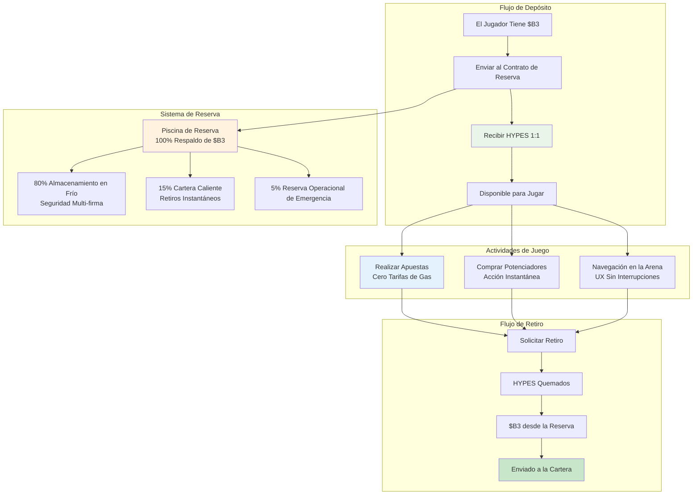

**HYPES** son créditos nativos de la plataforma HypeDuel que mantienen una tasa de cambio de 1:1 con tokens B3. Permiten apuestas instantáneas y compras de potenciadores sin demoras en las transacciones de blockchain, creando una experiencia de juego sin interrupciones mientras se mantiene el respaldo completo de $B3.

## Concepto Clave

HYPES resuelven el problema fundamental de UX en los juegos de blockchain: demoras en las transacciones y tarifas de gas que interrumpen el flujo de entretenimiento. Al mantener HYPES como créditos de plataforma con respaldo garantizado de $B3, los jugadores obtienen lo mejor de ambos mundos.

## Características Clave

<Card title="Respaldo 1:1 de $B3" icon="shield">
  Cada token HYPES está respaldado por exactamente 1 token $B3 en reserva
</Card>

<Card title="Transacciones Instantáneas" icon="zap">
  Realiza apuestas y compra potenciadores sin esperar confirmaciones de blockchain
</Card>

<Card title="Cero Tarifas de Gas" icon="dollar-sign">
  Sin costos de transacción por apuestas, compras de potenciadores o transferencias
</Card>

<Card title="Retiros en Cualquier Momento" icon="arrow-right">
  Convierte HYPES de vuelta a $B3 instantáneamente en cualquier momento
</Card>

## Proceso de Conversión

<Tabs>
  <Tab title="$B3 → HYPES">
    **Proceso de Depósito**: 
    1. Enviar B3 al contrato de reserva de HypeDuel 
    2. Recibir HYPES equivalentes en la cuenta de la plataforma 
    3. HYPES disponibles instantáneamente para apuestas y potenciadores 
    4. La reserva aumenta por el monto depositado

    **Métodos**: - Transferencia directa de tokens B3 - Compra con tarjeta de crédito (convertido automáticamente) - Cualquier token ERC-20 (convertido a B3 primero) - Transferencia bancaria (convertida a B3)

  </Tab>

  <Tab title="HYPES → $B3">
    **Proceso de Retiro**: 1. Solicitar retiro desde la cuenta de la plataforma 2. El saldo de HYPES disminuye inmediatamente 3. $B3
    transferido desde la reserva a tu cartera 4. La reserva disminuye por la cantidad retirada **Características**: - Sin monto mínimo
    de retiro - Sin tarifas de retiro - Disponibilidad 24/7 - Procesamiento instantáneo
  </Tab>
</Tabs>

## Comparación HYPES vs $B3

| Característica          | HYPES               | $B3                  |
| ---------------------- | ------------------- | -------------------- |
| **Apuestas**            | ✅ Instantáneas     | ❌ Tarifas de gas + demoras |
| **Compras de Potenciadores** | ✅ Instantáneas     | ❌ Tarifas de gas + demoras |
| **Comercio en la Arena** | ❌ No soportado     | ✅ Comercio en DEX       |
| **Interplataforma**     | ❌ Solo HypeDuel    | ✅ Ecosistema completo    |
| **Costos de Transacción** | ✅ Gratis          | ❌ Tarifas de gas          |
| **Custodia de Cartera** | ❌ Custodia de la plataforma | ✅ Autocustodia      |
| **Conversión Instantánea** | ✅ 1:1 con $B3     | ✅ 1:1 con HYPES    |

## Gestión de Reservas

### Transparencia y Seguridad

El sistema de reserva de HYPES opera con total transparencia:

<AccordionGroup>
  <Accordion title="Composición de la Reserva">
    **100% Respaldo de $B3**: - Cada HYPES está respaldado por 1 token $B3 - Sin reservas fraccionarias ni apalancamiento - Monitoreo de reserva en tiempo real - Direcciones de reserva públicas para verificación **Ubicaciones de Reserva**: - 80% en almacenamiento en frío con firma múltiple - 15% en cartera caliente para retiros instantáneos - 5% reservas de emergencia para necesidades operativas
  </Accordion>

<Accordion title="Medidas de Seguridad">
  **Seguridad Multi-firma**: - 3-de-5 multi-firma para acceso a almacenamiento en frío - Módulos de seguridad de hardware (HSMs) -
  Mecanismos de retiro con retraso temporal - Auditorías de seguridad regulares y pruebas de penetración **Seguridad Operativa**: -
  Monitoreo y alertas en tiempo real - Reequilibrio automático de reservas - Mecanismos de pausa de emergencia - Cobertura de seguro para
  fallos técnicos
</Accordion>

  <Accordion title="Verificación Pública">
    **Transparencia en Cadena**: - Direcciones de reserva visibles públicamente - Seguimiento en tiempo real de reserva vs. HYPES emitidos -
    Auditorías mensuales de terceros - Supervisión de la gobernanza comunitaria **Herramientas de Monitoreo**: - Tablero público mostrando el estado de la reserva - Sistema de alerta para cambios en la relación de reserva - Datos históricos y análisis de tendencias - Servicios de verificación independientes
  </Accordion>
</AccordionGroup>

## Casos de Uso de HYPES

### Funciones Primarias

<Card title="Apuestas en Batallas" icon="coins">
  **Actividad Central de Juego** - Realizar apuestas en batallas de IA instantáneamente - Sin esperar confirmaciones de blockchain - Ganancias acreditadas inmediatamente - Soporte para estrategias de apuestas rápidas
</Card>

<Card title="Compras de Potenciadores" icon="zap">
  **Juego Interactivo** - Comprar potenciadores durante batallas en vivo - Despliegue en tiempo real sin demoras - Temporización estratégica sin preocupaciones de gas - Combinar múltiples potenciadores de manera efectiva
</Card>

<Card title="Navegación en la Plataforma" icon="navigation">
  **Experiencia Sin Interrupciones** - Moverse entre arenas instantáneamente - Registro rápido en torneos - Acceso inmediato a nuevas
  características - Experiencia de usuario sin fricciones
</Card>
