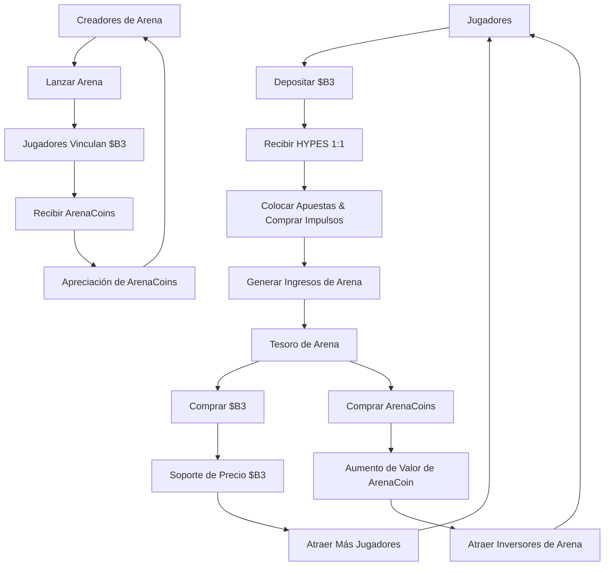

### Jerarquía de Tokens

<Tabs>
  <Tab title="$B3 Token" icon="coins">
    **Moneda Fundacional** - Token base del ecosistema - Principal reserva de valor - Utilidad entre plataformas - Reservas del tesoro
    - Vinculación con ArenaCoins
  </Tab>

<Tab title="Créditos HYPES" icon="bolt">
  **Moneda para Juegos** - Paridad 1:1 con $B3 - Colocación de apuestas instantáneas - Cero comisiones de gas - Retiros sin demoras - Compras de impulso
</Tab>

  <Tab title="ArenaCoins" icon="chart-line">
    **Propiedad de Arena** - Único por arena - Precios con curva de vinculación - Derechos de participación en comisiones - Oportunidades de comercio -
    Gobernanza comunitaria
  </Tab>
</Tabs>

## Diagrama de Flujo de Tokens

## ¿Por Qué Tres Tokens?

### Optimización de la Experiencia del Usuario

El sistema de tres tokens resuelve problemas críticos de UX:

<AccordionGroup>
  <Accordion title="Transacciones Instantáneas">
    **Problema**: Las transacciones en blockchain tienen retrasos y costos de gas que interrumpen el flujo de juego. **Solución**: HYPES
    permiten apuestas e impulsos instantáneos sin la fricción de blockchain mientras mantienen respaldo completo de $B3.
  </Accordion>

<Accordion title="Inversión en Arenas">
  **Problema**: No hay forma de que los usuarios inviertan o se beneficien del crecimiento exitoso de una arena. **Solución**: ArenaCoins permiten
  a los jugadores poseer una parte de las economías de las arenas y ganar a partir de su éxito.
</Accordion>

<Accordion title="Captura de Valor">
  **Problema**: Los ingresos de la plataforma generalmente solo benefician al propietario de la plataforma. **Solución**: Las recompras del tesoro de tanto $B3
  como ArenaCoins distribuyen valor a todos los interesados.
</Accordion>

  <Accordion title="Incentivos para Creadores">
    **Problema**: Es difícil compensar de manera justa a los creadores de arenas y modelos de IA. **Solución**: ArenaCoins proporcionan
    participación directa en los ingresos y potencial de apreciación para los creadores.
  </Accordion>
</AccordionGroup>

### Sostenibilidad Económica

Cada token crea valor de diferentes maneras:

<Card title="Impulsores de Valor de $B3" icon="arrow-right">
  - Crecimiento del ecosistema base 
  - Presión de recompra del tesoro 
  - Utilidad entre plataformas 
  - Integración con Staking y DeFi
</Card>

<Card title="Estabilidad de HYPES" icon="shield">
  - Garantía de respaldo 1:1 con $B3
  - Capacidad de conversión instantánea 
  - Prima de utilidad de juego 
  - Valor de conveniencia de plataforma
</Card>

<Card title="Apreciación de ArenaCoin" icon="rocket">
  - Crecimiento de popularidad de la arena 
  - Aumento de generación de comisiones 
  - Desarrollo comunitario 
  - Expansión del volumen de comercio
</Card>

## Matriz de Utilidad de Tokens

| Característica      | $B3 | HYPES | ArenaCoins |
| ------------------- | --- | ----- | ---------- |
| **Apuestas**        | ❌  | ✅    | ❌         |
| **Impulsos**        | ❌  | ✅    | ❌         |
| **Vinculación de Arena**  | ✅  | ❌    | ❌         |
| **Ganancia de Comisiones**    | ✅  | ❌    | ✅         |
| **Comercio**        | ✅  | ❌    | ✅         |
| **Gobernanza**     | ✅  | ❌    | ✅         |
| **Interplataforma** | ✅  | ❌    | ❌         |

### Mecánicas del Tesoro

Los tesoros de arena crean una presión de compra sostenida:

1. **Recolección de Ingresos**: Las comisiones se acumulan en los tesoros de las arenas
2. **Asignación de Activos**: 50% para recompras de $B3, 50% para recompras de ArenaCoin
3. **Compras en el Mercado**: Las compras automáticas en el mercado crean soporte de precio
4. **Distribución de Valor**: Los beneficios fluyen a todos los tenedores de tokens
