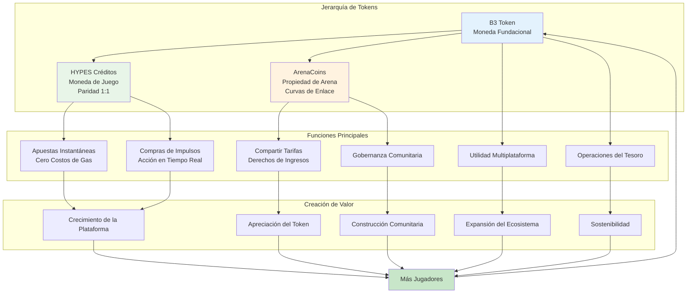
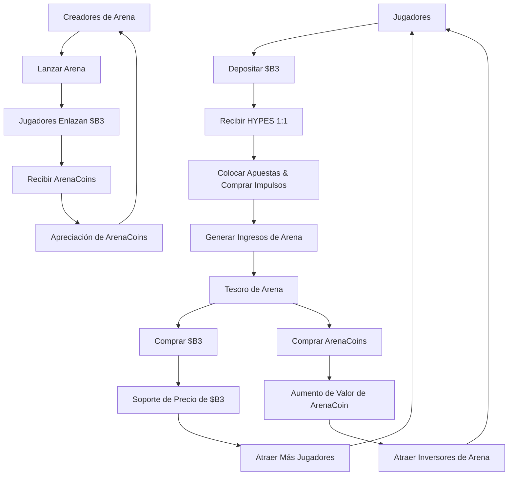

HypeDuel opera en un sofisticado sistema económico de tres tokens diseñado para optimizar la experiencia del usuario, crear flujos de valor sostenibles y habilitar la propiedad comunitaria. Cada token sirve a un propósito específico mientras trabajan juntos para potenciar todo el ecosistema.

## La Arquitectura de Tres Tokens

### Jerarquía de Tokens

<Tabs>
  <Tab title="$B3 Token" icon="coins">
    **Moneda Fundacional** - Token base del ecosistema - Principal reserva de valor - Utilidad multiplataforma - Reservas del tesoro
    - Enlace de ArenaCoins
  </Tab>

<Tab title="HYPES Créditos" icon="bolt">
  **Moneda de Juego** - Paridad 1:1 con $B3 - Colocación instantánea de apuestas - Cero costos de gas - Retiros sin interrupciones - Compras de impulsos
</Tab>

  <Tab title="ArenaCoins" icon="chart-line">
    **Propiedad de Arena** - Único por arena - Precios de curva de enlace - Derechos de compartir tarifas - Oportunidades de comercio -
    Gobernanza comunitaria
  </Tab>
</Tabs>

## Diagrama de Flujo de Tokens

## ¿Por Qué Tres Tokens?

### Optimización de la Experiencia del Usuario

El sistema de tres tokens resuelve problemas críticos de UX:

<AccordionGroup>
  <Accordion title="Transacciones Instantáneas">
    **Problema**: Las transacciones en blockchain tienen demoras y costos de gas que interrumpen el flujo de juego. **Solución**: HYPES
    habilita apuestas y compras de impulsos instantáneas sin la fricción de blockchain mientras mantiene el respaldo completo de $B3.
  </Accordion>

<Accordion title="Inversión en Arenas">
  **Problema**: No hay manera de que los usuarios inviertan o se beneficien del crecimiento exitoso de una arena. **Solución**: ArenaCoins permite
  a los jugadores poseer una parte de las economías de las arenas y ganar de su éxito.
</Accordion>

<Accordion title="Captura de Valor">
  **Problema**: Los ingresos de la plataforma generalmente solo benefician al propietario de la plataforma. **Solución**: Las recompras del tesoro de tanto $B3
  como ArenaCoins distribuyen valor a todos los interesados.
</Accordion>

  <Accordion title="Incentivos para Creadores">
    **Problema**: Difícil compensar de manera justa a los creadores de arenas y modelos de IA. **Solución**: ArenaCoins proporciona
    compartir ingresos directamente y potencial de apreciación para los creadores.
  </Accordion>
</AccordionGroup>

### Sostenibilidad Económica

Cada token crea valor de diferentes maneras:

<Card title="Impulsores de Valor de $B3" icon="trending-up">
  - Crecimiento del ecosistema base - Presión de recompra del tesoro - Utilidad multiplataforma - Integración con Staking y DeFi
</Card>

<Card title="Estabilidad de HYPES" icon="balance-scale">
  - Garantía de respaldo 1:1 con $B3 - Capacidad de conversión instantánea - Prima de utilidad de juego - Valor de conveniencia de la plataforma
</Card>

<Card title="Apreciación de ArenaCoin" icon="rocket">
  - Crecimiento de la popularidad de la arena - Aumento de la generación de tarifas - Desarrollo comunitario - Expansión del volumen de comercio
</Card>

## Matriz de Utilidad de Tokens

| Característica      | $B3 | HYPES | ArenaCoins |
| ------------------ | --- | ----- | ---------- |
| **Apuestas**        | ❌  | ✅    | ❌         |
| **Impulsos**         | ❌  | ✅    | ❌         |
| **Enlace de Arena**  | ✅  | ❌    | ❌         |
| **Ganancia de Tarifas**    | ✅  | ❌    | ✅         |
| **Comercio**        | ✅  | ❌    | ✅         |
| **Gobernanza**     | ✅  | ❌    | ✅         |
| **Multiplataforma** | ✅  | ❌    | ❌         |

### Mecánicas del Tesoro

Los tesoros de las arenas crean una presión de compra sostenida:

1. **Recolección de Ingresos**: Las tarifas se acumulan en los tesoros de las arenas
2. **Asignación de Activos**: 50% para recompras de $B3, 50% para recompras de ArenaCoin
3. **Compras en el Mercado**: Las compras automáticas en el mercado crean soporte de precio
4. **Distribución de Valor**: Los beneficios fluyen a todos los tenedores de tokens
