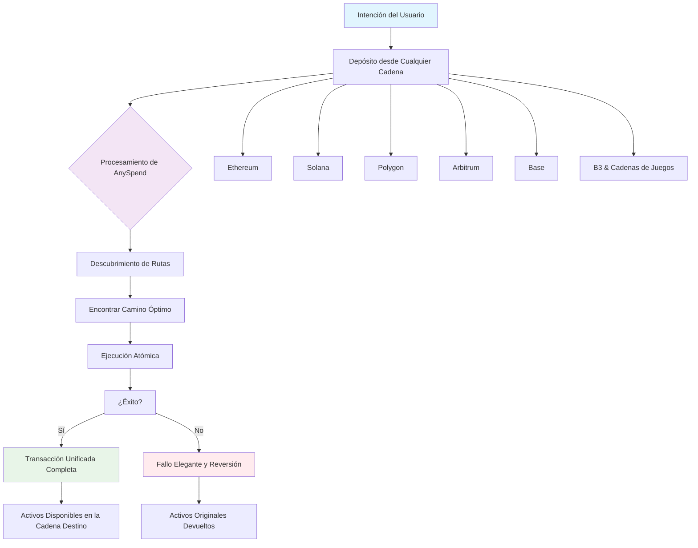

```html
<iframe
  className="w-full aspect-video rounded-xl"
  src="https://customer-gg6qs7nm5ue94t64.cloudflarestream.com/03160a1a61ac99b9003e44a2059c7dae/iframe?muted=true&loop=true&autoplay=true&poster=https%3A%2F%2Fcustomer-gg6qs7nm5ue94t64.cloudflarestream.com%2F03160a1a61ac99b9003e44a2059c7dae%2Fthumbnails%2Fthumbnail.jpg%3Ftime%3D%26height%3D600"
  title="Fragmentación de Liquidez"
  frameBorder="0"
  allow="accelerometer; autoplay; clipboard-write; encrypted-media; gyroscope; picture-in-picture"
  allowFullScreen
></iframe>

<Note>
[Explora el ecosistema multichain de B3 en explorer.b3.fun](https://explorer.b3.fun/chains)
</Note>

## El Problema

Appchains, L2s y L3s tienen liquidez aislada, lo que hace molesto construir experiencias sin tener que transferir activos a través de cadenas.


<CardGroup cols={2}>

<Card title="Liquidez Fragmentada" icon="puzzle-piece">
  Cada cadena mantiene piscinas aisladas, limitando la profundidad y aumentando el deslizamiento.
</Card>

<Card title="Integración Compleja" icon="gears">
  Los constructores deben integrarse con docenas de cadenas individualmente.
</Card>

<Card title="Mala UX" icon="face-frown">
  Los usuarios deben transferir manualmente activos y gestionar múltiples carteras.
</Card>

<Card title="Ineficiencia de Capital" icon="chart-line-down">
  Los activos bloqueados en cadenas específicas no pueden acceder a otras oportunidades.
</Card>

</CardGroup>

## Acceso a Liquidez a Través de Cadenas

Potenciado por nuestro producto, AnySpend, opera en la capa de ejecución del cliente, situándose entre la intención del usuario y la ejecución de la blockchain:

### Cómo Funciona

1. **Depósito desde cualquier cadena**: Acepta tokens de la mayoría de las cadenas
2. **Basado en Intenciones**: Los usuarios expresan lo que quieren, no cómo lograrlo
3. **Descubrimiento de Rutas**: Encuentra caminos óptimos a través de todas las cadenas soportadas
4. **Ejecución Atómica**: Las transacciones se ejecutan de manera atómica o fallan de manera elegante
5. **Experiencia Unificada**: Operaciones complejas aparecen como transacciones únicas



### Cadenas Soportadas

AnySpend proporciona soporte universal de cadenas:

- **Cadenas EVM**: La mayoría de las cadenas EVM, incluyendo Ethereum, Polygon, Arbitrum, Base, BSC, Avalanche
- **Solana**: Integración completa con el ecosistema de Solana
- **Ecosistema B3**: Integración nativa con B3 y cadenas de juegos

## Próximos Pasos

<CardGroup cols={2}>

<Card title="Prueba AnySpend" icon="rocket" href="/anyspend/introduction">
  Comienza con el SDK de AnySpend.
</Card>

<Card title="Guía de Integración" icon="book" href="/anyspend/installation">
  Aprende cómo integrar AnySpend.
</Card>

<Card title="Referencia de la API" icon="code" href="/anyspend/api-reference/introduction">
  Explora la documentación completa de la API.
</Card>

<Card title="Únete a Discord" icon="discord" href="https://discord.gg/b3dotfun">
  Conéctate con otros constructores.
</Card>

</CardGroup>
```
