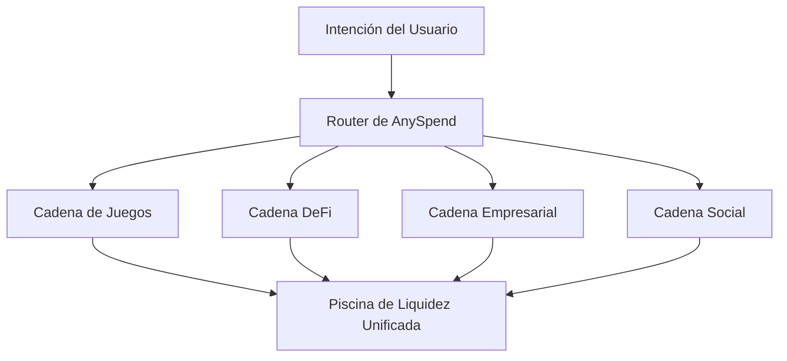

<Note>
  [Explora el ecosistema multichain de B3 en explorer.b3.fun](https://explorer.b3.fun/chains)
</Note>

## La Revolución del Escalamiento

El escalamiento tradicional de blockchain se ha centrado en hacer que cadenas individuales sean más rápidas. B3 adopta un enfoque diferente: **escalamiento horizontal** a través de appchains construidas con un propósito específico que trabajan juntas como un ecosistema unificado.

<CardGroup cols={2}>
  <Card title="Escalamiento Vertical" icon="arrow-up">
    Hacer que una cadena maneje más transacciones por segundo
  </Card>
  <Card title="Escalamiento Horizontal" icon="arrow-right">
    Crear cadenas especializadas para aplicaciones específicas
  </Card>
</CardGroup>

## Por Qué el Escalamiento Horizontal es Importante

En lugar de forzar a todas las aplicaciones a competir por los mismos recursos de blockchain, el escalamiento horizontal permite que cada aplicación, juego o empresa tenga su propio entorno de ejecución optimizado.

### La Ventaja Multi-Cadena

<CardGroup cols={2}>
  <Card title="Optimización Específica para Aplicaciones" icon="gear">
    Cada appchain puede ser personalizada para su caso de uso específico - cadenas de juegos para jugabilidad sin tarifas, cadenas DeFi para trading de alto rendimiento.
  </Card>
  <Card title="Rendimiento Ilimitado" icon="bolt">
    Se acabó la competencia por el espacio en el bloque. Cada aplicación obtiene recursos dedicados y puede escalar de manera independiente.
  </Card>
  <Card title="Riesgo Aislado" icon="shield">
    Los problemas en una appchain no afectan a las demás, proporcionando mejor seguridad y fiabilidad para todo el ecosistema.
  </Card>
  <Card title="Experiencia Unificada" icon="link">
    A pesar de ser cadenas separadas, los usuarios experimentan interacciones sin fisuras a través de todo el ecosistema de B3.
  </Card>
</CardGroup>

## Cómo B3 Habilita el Escalamiento Horizontal

### 1. Appchains Construidas con un Propósito

Cada aplicación en B3 puede desplegar su propia cadena dedicada, optimizada para requisitos específicos:

- **Cadenas de Juegos**: Transacciones sin tarifas, finalidad instantánea, precompilados específicos para juegos
- **Cadenas DeFi**: Trading de alto rendimiento, protección contra MEV, primitivas financieras
- **Cadenas Empresariales**: Características de privacidad, herramientas de cumplimiento, gobernanza personalizada
- **Cadenas Sociales**: Almacenamiento de contenido, sistemas de reputación, gráficos sociales

### 2. Capa de Liquidez Unificada

Mientras las cadenas escalan horizontalmente, la liquidez permanece unificada a través de [AnySpend](/protocol/liquidity):

### 3. Operaciones Cross-Chain Sin Fisuras

<Steps>
  <Step title="Expresar la Intención">
    Los usuarios simplemente expresan lo que quieren hacer - comprar un NFT, intercambiar tokens o realizar un pago.
  </Step>
  <Step title="Enrutamiento Automático">
    La infraestructura de B3 encuentra automáticamente el camino óptimo a través de todas las appchains.
  </Step>
  <Step title="Ejecución Atómica">
    Operaciones complejas multi-cadena se ejecutan como una única transacción desde la perspectiva del usuario.
  </Step>
</Steps>

## Beneficios en el Mundo Real

### Para Desarrolladores

<CardGroup cols={2}>
  <Card title="Se Acabaron las Congestiones" icon="traffic-light">
    Despliega tu propia cadena y nunca te preocupes por la congestión de la red que afecte a tus usuarios.
  </Card>
  <Card title="Economía Personalizada" icon="coins">
    Diseña la economía de tokens, estructuras de tarifas e incentivos específicos para tu aplicación.
  </Card>
  <Card title="Innovación Más Rápida" icon="rocket">
    Experimenta con nuevas características sin afectar otras aplicaciones o esperar por actualizaciones de la red.
  </Card>
  <Card title="Mejor UX" icon="sparkles">
    Optimiza los costos de transacción, tiempos de confirmación y flujos de usuario para tu caso de uso específico.
  </Card>
</CardGroup>

### Para Usuarios

<CardGroup cols={2}>
  <Card title="Experiencia Consistente" icon="user-check">
    Accede a todas las aplicaciones con la misma cartera y cuenta a través de todo el ecosistema.
  </Card>
  <Card title="Costos Menores" icon="coins">
    Benefíciate de estructuras de tarifas optimizadas en cada cadena especializada.
  </Card>
  <Card title="Transacciones Más Rápidas" icon="clock">
    Experimenta confirmaciones casi instantáneas en cadenas optimizadas para tu caso de uso.
  </Card>
  <Card title="Seguridad Mejorada" icon="lock">
    Disfruta de la seguridad del asentamiento de Ethereum mientras te beneficias de las características de las cadenas especializadas.
  </Card>
</CardGroup>

## Escalamiento en la Práctica

<Note>
  [Accede a datos fusionados a través de las multi-cadenas de B3 con nuestra API gratuita](/data/api-reference/introduction).
</Note>

### Juegos a Escala

Las cadenas de juegos en B3 pueden manejar:

- **Mecánicas de juego gratuitas** sin costos de transacción
- **Interacciones en tiempo real** con finalidad de sub-segundo
- **Eventos multijugador masivos** sin congestión de la red
- **Transferencias de activos entre juegos** a través de la liquidez unificada

### Aplicaciones Empresariales

Las cadenas empresariales permiten:

- **Transacciones privadas** para operaciones comerciales sensibles
- **Características de cumplimiento** integradas en la capa de protocolo
- **Modelos de gobernanza personalizados** para necesidades organizacionales
- **Capacidades de integración** con sistemas empresariales existentes

### Innovación en DeFi

Las cadenas DeFi soportan:

- **Trading de alta frecuencia** con rendimiento optimizado
- **Instrumentos financieros complejos** con precompilados especializados
- **Protección contra MEV** a través de mecanismos de ordenación personalizados
- **Arbitraje cross-chain** a través del acceso a liquidez unificada

## El Efecto de Red

A medida que más aplicaciones despliegan sus propias appchains, todo el ecosistema de B3 se vuelve más valioso:

1. **Liquidez Incrementada**: Más cadenas significan más oportunidades de trading y piscinas de liquidez más profundas
2. **Composabilidad Mejorada**: Las aplicaciones pueden interactuar a través de cadenas sin fisuras
3. **Costos Reducidos**: Los costos de infraestructura compartida disminuyen a medida que el ecosistema crece
4. **Aceleración de la Innovación**: Las nuevas características en una cadena pueden ser adoptadas por otras

## Comenzando con el Escalamiento Horizontal

<Card title="Despliega Tu Appchain" icon="rocket" horizontal href="https://b3builders.typeform.com/bsmntdevelopers">
  ¿Listo para escalar horizontalmente? Contacta a nuestro equipo para discutir el despliegue de tu propia appchain construida con un propósito en B3.
</Card>

<Note>
  [Accede a datos fusionados a través de las multi-cadenas de B3 con nuestra API gratuita](/data/api-reference/introduction).
</Note>

<Note>
  [Construye en B3 con nuestras herramientas para desarrolladores](/ecosystem/introduction).
</Note>

### Elige Tu Estrategia de Escalamiento

<CardGroup cols={3}>
  <Card title="Cadena B3 Compartida" icon="users">
    Comienza a construir en la cadena principal de B3 antes de escalar a tu propia appchain.
  </Card>
  <Card title="Appchain Dedicada" icon="server">
    Despliega una cadena personalizada optimizada para las necesidades específicas de tu aplicación.
  </Card>
  <Card title="Enfoque Híbrido" icon="block">
    Usa la cadena principal para funciones centrales y appchains para características especializadas.
  </Card>
</CardGroup>

## El Futuro del Escalamiento

El escalamiento horizontal representa la próxima evolución de la infraestructura de blockchain. Al permitir una ejecución paralela ilimitada mientras se mantiene una experiencia de usuario y liquidez unificadas, B3 crea la base para una adopción masiva en cadena.

Internet no escaló haciendo servidores individuales más rápidos—escaló conectando millones de servidores especializados. De manera similar, blockchain escalará conectando miles de cadenas construidas con un propósito específico, cada una optimizada para aplicaciones específicas mientras trabajan juntas como un ecosistema unificado.
