HypeDuel Arenas are built in Unity, with each arena having one server headless build that runs on the HypeDuel servers and simulates the duel in real time, and one webGL build which runs on the clientside and receives the streamed simulation data to playback.

[Contact us to add your game](https://form.typeform.com/to/nyvBvGbS)

## Unity SDK

We offer a unity SDK to fascillitate the creation of arenas. What follows is an overview of the steps required to integrate the SDK and create the arena in unity.

- Create your server-side scene.
  - Setup your environment, gameplay mechanics, and train your agents with unity ml-agents
  - Setup **HypeDuelRecorder **to track your main scene objects in space.
  - Call the recorder's **PushStateChange **method to stream any state data to the clients.
    - Set the state scores property in order for the server to be able to detect the match's progress and resolution at the end.
  - Build for Linux Dedicated Server and upload your build to hypeduel.
- Create your client-side scene.
  - Duplicate of the server side, but with graphics and without the agent logic.
  - The **HypeDuelRecorder **will automatically playback the positions of your main scene objects
  - Listen to events of the **HypeDuelClient **instance to use your state changes to manage the UI and graphical elements of your game.

##  How it Works

When a match begins on HypeDuel, we run the arena's server build which sends back realtime data from the simulation. Clients on the website are running their own webGL versions of the arena (the client-side build) and connect to our API which streams all the simulation data, which is then used in unity to recreate the exact same scene.

```mermaid
graph TD
    A["Unity SDK<br/>⚙️"] --> B["Server Scene<br/>🖥️"]
    A --> C["Client Scene<br/>🎮"]

    B --> E["ML-Agents & Gameplay Logic"]
    B --> F["Recorder Tracking"]
    B --> G["PushStateChange<br/>+ Scores"]

    C --> H["Duplicate Scene"]
    C --> I["Recorder Playback"]
    C --> J["Client Events → UI"]
```

