HypeDuel operates on a transparent, sustainable fee structure that fairly distributes value among players, creators, and the ecosystem. Understanding these fees helps you optimize your strategy and appreciate how the platform maintains long-term viability.

## Overview

Unlike traditional gaming platforms that extract maximum profit, HypeDuel's fee structure is designed to:

- **Reward Winners**: 85% of betting pools go directly to winning players
- **Support Creators**: Arena and AI developers earn sustainable revenue
- **Grow Ecosystem**: Treasury buybacks benefit all token holders
- **Maintain Platform**: Operations and development funding

```mermaid
graph TD
    A["Total Betting Pool<br/>100%"] --> B["Winners<br/>85%<br/>🏆"]
    A --> C["Arena Treasury<br/>10%<br/>💰"]
    A --> D["Arena Creator<br/>5%<br/>👨‍💻"]

    C --> E["$B3 Buybacks<br/>50%"]
    C --> F["ArenaCoin Buybacks<br/>50%"]

    B --> G["Proportional Payout<br/>Based on Bet Size"]
    D --> H["Development Incentive<br/>Immediate Payment"]
    E --> I["$B3 Value Support"]
    F --> J["ArenaCoin Appreciation"]

    style A fill:#e1f5fe
    style B fill:#c8e6c9
    style C fill:#fff3e0
    style D fill:#f3e5f5
```



## Betting Fees

### Primary Revenue Stream

**Every betting pool follows this distribution:**

```
Total Betting Pool: 100%
├── 85% → Winners (shared proportionally)
├── 10% → Arena Treasury (token buybacks)
└── 5% → Arena Creator (development incentive)
```

### Detailed Breakdown

<Tabs>
  <Tab title="Winner Payouts (85%)">
    **Largest Portion Goes to Players** **Distribution Method**: - Winners share proportionally based on bet size - No
    house edge or hidden fees - Immediate payout after battle conclusion - Transparent calculation visible to all
    players **Example Calculation**: ``` Total Pool: 10,000 HYPES Winner Pool: 8,500 HYPES (85%) Your Bet: 500 HYPES on
    winning AI Total Winning Bets: 2,000 HYPES Your Share: 500/2,000 = 25% Your Payout: 500 + (6,500 × 0.25) = 2,125
    HYPES ```
  </Tab>

<Tab title="Arena Treasury (10%)">
  **Token Buyback Mechanism** **Treasury Functions**: - Accumulates fees from all arena activity - Executes automated
  token buybacks - Supports ArenaCoin and $B3 value - Creates sustainable appreciation pressure **Buyback Strategy**: -
  50% for $B3 token purchases - 50% for ArenaCoin purchases - Market timing optimization - Transparent execution records
  **Impact on Players**: - Increases value of held tokens - Provides long-term appreciation - Rewards platform loyalty -
  Creates growth incentives
</Tab>

  <Tab title="Arena Creator (5%)">
    **Development Incentives** **Creator Benefits**: - Direct revenue from arena success - Immediate payment after each
    battle - Scales with community growth - Sustainable long-term income **Revenue Uses**: - Ongoing arena development -
    AI model improvements - Community building activities - Marketing and growth initiatives **Creator Motivation**: -
    Aligned with player satisfaction - Incentivizes quality content - Rewards community building - Encourages innovation
  </Tab>
</Tabs>

## Boost Fees

### Interactive Revenue Model

**Boost purchases generate additional revenue:**

```
Boost Purchase: 100%
├── 50% → Arena Treasury (ArenaCoin buybacks)
└── 50% → Arena Creator (immediate revenue)
```

### Boost Economics

<AccordionGroup>
  <Accordion title="Revenue Distribution">
    **Equal Split Model** **Treasury Portion (50%)**: - Used specifically for ArenaCoin buybacks - Creates direct value
    for arena investors - Increases token scarcity over time - Rewards arena community loyalty **Creator Portion
    (50%)**: - Immediate revenue for arena developers - Incentivizes boost system development - Rewards interactive
    feature creation - Funds ongoing balance improvements
  </Accordion>

<Accordion title="Dynamic Pricing">
  **Market-Responsive Costs** **Base Pricing**: - Standard boost costs set by arena creator - Balanced for gameplay
  impact - Regularly adjusted based on effectiveness - Community feedback integration **Surge Pricing**: - Increases
  during high-demand periods - Premium for late-battle deployment - Multiple purchase penalties - Scarcity-based cost
  escalation **Example Pricing Evolution**: ``` Shield Boost Base Price: 50 HYPES After 3 purchases: 60 HYPES (+20%)
  Final 30 seconds: 90 HYPES (+50% urgency) Total with both factors: 108 HYPES ```
</Accordion>

  <Accordion title="ROI Considerations">
    **Strategic Investment Analysis** **Cost-Benefit Calculation**: - Boost cost vs. potential betting winnings -
    Probability improvement estimation - Expected value computation - Risk-adjusted return assessment **Optimization
    Strategies**: - Early deployment for lower costs - Coordination with other players - Timing for maximum impact -
    Portfolio approach across battles
  </Accordion>
</AccordionGroup>

## Trading Fees

### Post-Graduation Revenue

**ArenaCoin DEX trading generates ongoing fees:**

<Tabs>
  <Tab title="Bonding Phase Fees">
    **During Initial Launch** 
    ``` 
    Bonding Transaction: 100% 
    ├── 97% → User (ArenaCoins received) 
    ├── 2% → B3 Treasury
    (ecosystem support) 
    └── 1% → Arena Creator (launch incentive) 
    ``` 
    **Characteristics**: 
    - Low fees encourage early
    adoption 
    - Supports ecosystem-wide development 
    - Provides creator launch incentives 
    - Builds initial community
  </Tab>

<Tab title="DEX Trading Fees">
  **After Arena Graduation** 
  ``` 
  DEX Trading Fee: 3% total 
  ├── 2% → Arena Treasury (66.7% of total) 
  └── 1% → Arena
  Creator (33.3% of total) 
  ``` 

 **Long-term Benefits**: 
  - Continuous revenue from token success 
  - Passive income for successful arenas 
  - Sustainable creator compensation 
  - Community value appreciation 
</Tab>

  <Tab title="Fee Optimization">
    **Smart Fee Management** 
    **Player Strategies**: 
    - Batch transactions to minimize fees 
    - Time purchases during low-gas periods 
    - Use limit orders for better execution 
    - Consider holding periods for fee efficiency 

   **Platform Optimizations**: 
    - Gas-efficient smart contract design 
    - Batch processing for multiple users 
    - Fee sharing with high-volume traders 
    - Loyalty programs for frequent users
  </Tab>
</Tabs>
