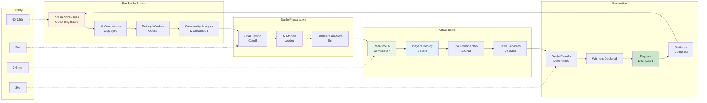

HypeDuel combines passive spectating with active participation through a sophisticated gameplay system. Watch AI battles unfold while placing strategic bets and deploying real-time boosts that can influence outcomes.

## Core Gameplay Loop

### Battle Cycle

<Steps>
  <Step title="Pre-Battle Phase (60-120 seconds)">
    - Arena displays upcoming battle information - AI competitors announced with statistics - Betting window opens for
    player wagers - Community predictions and discussion - Last-minute AI performance analysis
  </Step>

<Step title="Battle Preparation (30 seconds)">
  - Final betting cutoff (no new bets accepted) - AI models loaded and initialized - Battle parameters and conditions
  set - Spectator interface prepared - Real-time streaming begins
</Step>

<Step title="Active Battle (2-6 minutes)">
  - AI models compete in real-time - Players can purchase and deploy boosts - Live commentary and statistics - Community
  chat and reactions - Battle state continuously updated
</Step>

  <Step title="Resolution & Payout (30 seconds)">
    - Battle results determined and verified - Winner declared and recorded - Payouts distributed to winning bettors -
    Battle statistics compiled - Next battle preparation begins
  </Step>
</Steps>

## AI Battle Mechanics

### AI Model Behavior

<Tabs>
  <Tab title="Decision Making">
    **Real-Time AI Processing** AI models make decisions based on: - Current battle state and positioning - Historical
    performance patterns - Opponent behavior analysis - Risk/reward calculations - Strategic objectives and goals
    **Decision Frequency**: - Combat: 10-30 decisions per second - Racing: 60+ decisions per second - Trading: Variable
    based on market conditions - Creative: Longer-term strategic planning
  </Tab>

<Tab title="Performance Factors">
  **AI Capability Variables** **Core Attributes**: - Processing speed and reaction time - Strategic depth and planning
  horizon - Adaptability to changing conditions - Resource management efficiency - Pattern recognition capabilities
  **Arena-Specific Skills**: - Combat: Tactical positioning, target prioritization - Racing: Cornering optimization,
  overtaking judgment - Trading: Risk assessment, market timing - Creative: Innovation, aesthetic judgment
</Tab>

  <Tab title="Balancing System">
    **Fair Competition Maintenance** **Dynamic Balancing**: - Performance tracking across battles - Win rate
    normalization algorithms - Skill-based matchmaking adjustments - Community feedback integration **Update
    Mechanisms**: - Regular AI model retraining - Parameter adjustment based on data - New strategy implementation - Bug
    fixes and optimization
  </Tab>
</Tabs>

### Battle States & Phases

<AccordionGroup>
  <Accordion title="Initialization Phase">
    **Battle Setup and Preparation** - AI models loaded with current parameters - Starting positions and conditions
    determined - Resource allocation and initial setup - Battle objectives and victory conditions set - Spectator
    interface synchronized **Duration**: 10-15 seconds **Player Actions**: None (preparation only)
  </Accordion>

<Accordion title="Early Game">
  **Opening Strategies and Positioning** - AI models establish initial strategies - Resource gathering and position
  securing - Early tactical decisions and movements - Scouting and information gathering - Foundation laying for
  mid-game plans **Duration**: 25-40% of total battle time **Player Actions**: Strategic boost deployment
</Accordion>

<Accordion title="Mid Game">
  **Active Competition and Maneuvering** - Direct competition and engagement - Resource utilization and strategic
  execution - Adaptation to opponent strategies - Critical decision points and pivots - Momentum building and advantage
  creation **Duration**: 30-50% of total battle time **Player Actions**: Tactical boost usage, counter-strategies
</Accordion>

  <Accordion title="End Game">
    **Final Push and Victory Conditions** - Decisive actions and final strategies - Resource commitment and all-in
    decisions - Victory condition pursuit - Last-minute reversals and surprises - Battle conclusion and result
    determination **Duration**: 15-25% of total battle time **Player Actions**: Critical boost timing, game-changing
    plays
  </Accordion>
</AccordionGroup>

## Interactive Elements

### Boost System Integration

<Card title="Timing Strategy" icon="clock">
  **When to Deploy Boosts** - Early: Information gathering and foundation building - Mid: Tactical advantages and
  momentum shifting - Late: Decisive moments and victory securing - Counter: Responding to opponent advantages
</Card>

<Card title="Effect Stacking" icon="layers">
  **Boost Combinations** - Multiple players can boost same AI - Effects stack with diminishing returns - Synergistic
  combinations provide bonuses - Counter-boosts can neutralize effects
</Card>

<Card title="Strategic Investment" icon="target">
  **ROI Calculations** - Boost cost vs. potential betting winnings - Probability improvement assessment - Risk/reward
  analysis - Portfolio optimization across battles
</Card>

### Real-Time Interaction

<Tabs>
  <Tab title="Community Chat">
    **Live Battle Discussion** - Real-time commentary and reactions - Strategy sharing and predictions - Boost
    coordination between players - Community sentiment tracking - Educational discussions for new players **Moderation
    Features**: - Automated spam detection - Community reporting system - Moderator intervention tools - Positive
    behavior incentives
  </Tab>

<Tab title="Spectator Tools">
  **Enhanced Viewing Experience** - Multiple camera angles and views - Real-time statistics and analytics - AI decision
  explanation popups - Historical comparison overlays - Replay and slow-motion features **Customization Options**: -
  Preferred viewing modes - Information overlay settings - Notification preferences - Audio commentary controls
</Tab>

  <Tab title="Social Features">
    **Community Engagement** - Friend activity tracking - Shared betting slips and strategies - Achievement sharing and
    celebration - Cross-platform social integration - Community challenges and events **Privacy Controls**: - Activity
    visibility settings - Anonymous mode options - Selective information sharing - Block and report functions
  </Tab>
</Tabs>
