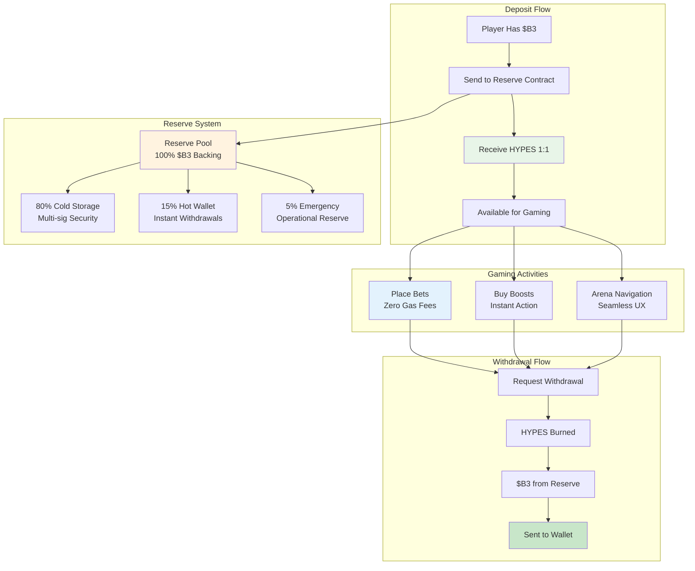

**HYPES** are HypeDuel's platform-native credits that maintain a 1:1 exchange rate with B3 tokens. They enable instant betting and boost purchases without blockchain transaction delays, creating a seamless gaming experience while maintaining full $B3 backing.

## Core Concept

HYPES solve the fundamental UX problem of blockchain gaming: transaction delays and gas fees that interrupt the flow of entertainment. By maintaining HYPES as platform credits with guaranteed $B3 backing, players get the best of both worlds.

## Key Features

<Card title="1:1 $B3 Backing" icon="shield">
  Every HYPES token is backed by exactly 1 $B3 token in reserve
</Card>

<Card title="Instant Transactions" icon="zap">
  Place bets and buy boosts without waiting for blockchain confirmations
</Card>

<Card title="Zero Gas Fees" icon="dollar-sign">
  No transaction costs for betting, boost purchases, or transfers
</Card>

<Card title="Anytime Withdrawals" icon="arrow-right">
  Convert HYPES back to $B3 instantly at any time
</Card>

## Conversion Process

<Tabs>
  <Tab title="$B3 → HYPES">
    **Depositing Process**: 
    1. Send B3 to HypeDuel reserve contract 
    2. Receive equivalent HYPES in platform account 
    3. HYPES available instantly for betting and boosts 
    4. Reserve increases by deposited amount

    **Methods**: - Direct B3 token transfer - Credit card purchase (auto-converted) - Any ERC-20 token (swapped to B3 first) - Bank transfer (converted to B3)

  </Tab>

  <Tab title="HYPES → $B3">
    **Withdrawal Process**: 1. Request withdrawal from platform account 2. HYPES balance decreases immediately 3. $B3
    transferred from reserve to your wallet 4. Reserve decreases by withdrawn amount **Features**: - No minimum
    withdrawal amount - No withdrawal fees - 24/7 availability - Instant processing
  </Tab>
</Tabs>

## HYPES vs $B3 Comparison

| Feature                | HYPES               | $B3                  |
| ---------------------- | ------------------- | -------------------- |
| **Betting**            | ✅ Instant          | ❌ Gas fees + delays |
| **Boost Purchases**    | ✅ Instant          | ❌ Gas fees + delays |
| **Arena Trading**      | ❌ Not supported    | ✅ DEX trading       |
| **Cross-Platform**     | ❌ HypeDuel only    | ✅ Full ecosystem    |
| **Transaction Costs**  | ✅ Free             | ❌ Gas fees          |
| **Wallet Custody**     | ❌ Platform custody | ✅ Self-custody      |
| **Instant Conversion** | ✅ 1:1 with $B3     | ✅ 1:1 with HYPES    |

## Reserve Management

### Transparency & Security

The HYPES reserve system operates with full transparency:

<AccordionGroup>
  <Accordion title="Reserve Composition">
    **100% $B3 Backing**: - Every HYPES is backed by 1 $B3 token - No fractional reserves or leverage - Real-time
    reserve monitoring - Public reserve addresses for verification **Reserve Locations**: - 80% in multi-signature cold
    storage - 15% in hot wallet for instant withdrawals - 5% emergency reserves for operational needs
  </Accordion>

<Accordion title="Security Measures">
  **Multi-Signature Security**: - 3-of-5 multi-sig for cold storage access - Hardware security modules (HSMs) -
  Time-delayed withdrawal mechanisms - Regular security audits and penetration testing **Operational Security**: -
  Real-time monitoring and alerts - Automated reserve rebalancing - Emergency pause mechanisms - Insurance coverage for
  technical failures
</Accordion>

  <Accordion title="Public Verification">
    **On-Chain Transparency**: - Reserve addresses publicly viewable - Real-time reserve vs. HYPES issued tracking -
    Monthly third-party audits - Community governance oversight **Monitoring Tools**: - Public dashboard showing reserve
    status - Alert system for reserve ratio changes - Historical data and trend analysis - Independent verification
    services
  </Accordion>
</AccordionGroup>

## HYPES Use Cases

### Primary Functions

<Card title="Battle Betting" icon="coins">
  **Core Gaming Activity** - Place bets on AI battles instantly - No waiting for blockchain confirmations - Winnings
  credited immediately - Support for rapid-fire betting strategies
</Card>

<Card title="Boost Purchases" icon="zap">
  **Interactive Gameplay** - Buy power-ups during live battles - Real-time deployment without delays - Strategic timing
  without gas concerns - Combine multiple boosts effectively
</Card>

<Card title="Platform Navigation" icon="navigation">
  **Seamless Experience** - Move between arenas instantly - Quick tournament registration - Immediate access to new
  features - Frictionless user experience
</Card>
