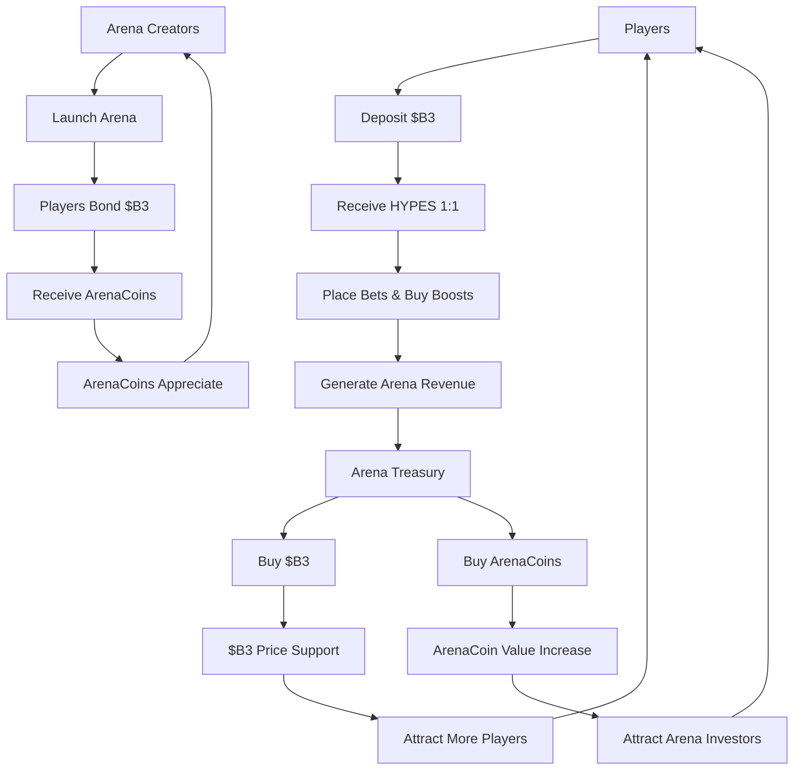

### Token Hierarchy

<Tabs>
  <Tab title="$B3 Token" icon="coins">
    **Foundation Currency** - Base ecosystem token - Primary store of value - Cross-platform utility - Treasury reserves
    - ArenaCoins bonding
  </Tab>

<Tab title="HYPES Credits" icon="bolt">
  **Gaming Currency** - 1:1 peg with $B3 - Instant bet placement - Zero gas fees - Seamless withdrawals - Boost
  purchases
</Tab>

  <Tab title="ArenaCoins" icon="chart-line">
    **Arena Ownership** - Unique per arena - Bonding curve pricing - Fee sharing rights - Trading opportunities -
    Community governance
  </Tab>
</Tabs>

## Token Flow Diagram

## Why Three Tokens?

### User Experience Optimization

The three-token system solves critical UX problems:

<AccordionGroup>
  <Accordion title="Instant Transactions">
    **Problem**: Blockchain transactions have delays and gas costs that interrupt gaming flow. **Solution**: HYPES
    enable instant betting and boosts without blockchain friction while maintaining full $B3 backing.
  </Accordion>

<Accordion title="Arena Investment">
  **Problem**: No way for users to invest in or benefit from successful arena growth. **Solution**: ArenaCoins let
  players own a piece of arena economies and earn from their success.
</Accordion>

<Accordion title="Value Capture">
  **Problem**: Platform revenue typically benefits only the platform owner. **Solution**: Treasury buybacks of both $B3
  and ArenaCoins distribute value to all stakeholders.
</Accordion>

  <Accordion title="Creator Incentives">
    **Problem**: Difficult to fairly compensate arena and AI model creators. **Solution**: ArenaCoins provide direct
    revenue sharing and appreciation potential for creators.
  </Accordion>
</AccordionGroup>

### Economic Sustainability

Each token creates value in different ways:

<Card title="$B3 Value Drivers" icon="trending-up">
  - Base ecosystem growth - Treasury buyback pressure - Cross-platform utility - Staking and DeFi integration
</Card>

<Card title="HYPES Stability" icon="balance-scale">
  - 1:1 $B3 backing guarantee - Instant conversion ability - Gaming utility premium - Platform convenience value
</Card>

<Card title="ArenaCoin Appreciation" icon="rocket">
  - Arena popularity growth - Fee generation increase - Community development - Trading volume expansion
</Card>

## Token Utility Matrix

| Feature            | $B3 | HYPES | ArenaCoins |
| ------------------ | --- | ----- | ---------- |
| **Betting**        | ❌  | ✅    | ❌         |
| **Boosts**         | ❌  | ✅    | ❌         |
| **Arena Bonding**  | ✅  | ❌    | ❌         |
| **Fee Earning**    | ✅  | ❌    | ✅         |
| **Trading**        | ✅  | ❌    | ✅         |
| **Governance**     | ✅  | ❌    | ✅         |
| **Cross-Platform** | ✅  | ❌    | ❌         |

### Treasury Mechanics

Arena treasuries create sustained buying pressure:

1. **Revenue Collection**: Fees accumulate in arena treasuries
2. **Asset Allocation**: 50% for $B3 buybacks, 50% for ArenaCoin buybacks
3. **Market Purchasing**: Automated market buys create price support
4. **Value Distribution**: Benefits flow to all token holders
